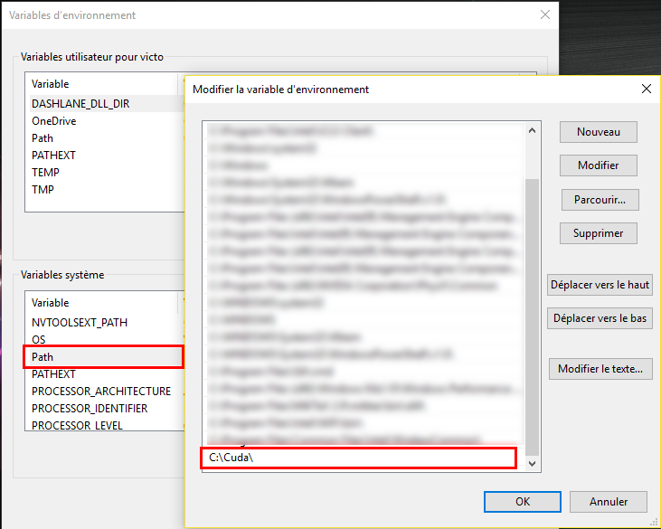

TensorFlow is an open-source software library for machine learning developed by researchers and engineers working on the Google Brain Team. The first publicly available version was released in Novembre 2015. TensorFlow quickly became popular in the deep learning community for several reasons. The main reason might be that TensorFlow is maintained by a professional developer team (whereas Caffe, Theano, ... are developed by academic researchers). I won't discuss the pros and the cons of the different machine learning frameworks here. It is not the point! A good rule of thumb is to check how many stars/fork TensorFlow got on [Github](https://github.com/tensorflow/tensorflow "TensorFlow repo"). According to the number of Stars/Forks of GitHub we can guess that TensorFlow has the biggest community!

## Installing Tensor on Windows
When Google decided to release its library under the Apache 2.0 open source license, TensorFlow was primarily available on Mac and Linux. After several months, TensorFlow was finally available on Windows. However, it is much easier to use TensorFlow on Linux Operating System then on Windows. That is why I will only focus on how to install TensorFlow on Windows Operating System.
Firstly, We should notice that, at the time I'm writing this article, TensorFlow is only available for Python 3.5 on Windows (while on Linux and Mac You can use TensorFlow with Python 2.7 for example).

### Installing the CPU version
To install TensorFlow on Windows the easiest way is to install Anaconda. The steps are:
1. Download [Anaconda](https://www.continuum.io/downloads "Anaconda Website") for Windows. Install Python 3.X version (at the time I'm writing the tutorial the version is Python 3.6)
2. Launch the installer and install Anaconda
3. Once the installation is finished go to Windows and type **Anaconda**. Finally, click on **Anaconda Prompt**.
    <div class="centered-img">
    
    <div class="legend">Anaconda Prompt under Windows 10</div>
    </div>
4. Once the Prompt is open we will need to create an environment for Python 3.5 (because TensorFlow is not available on Python 3.6 yet). To create an environment, simply type:
```shell
conda create --name tensorflow python=3.5 anaconda
```
This command will create a Python 3.5 environment named **tensorflow**.
5. We then activate the environment we've just created using:
```shell
activate tensorflow
```
On Linux, Mac, and Git for Windows we need to write `source activate tensorflow`.
6. We then install common package like jupyter and scipy (scipy will install numpy) and tensorflow using:
```shell
conda install jupyter
conda install scipy
pip install tensorflow
```

So now we can use TensorFlow on Windows. Yet if you have a good Nvidia GPU, you might want to use it with TensorFlow. Indeed TensorFlow supports CUDA Drivers and using TensorFlow on GPU might increase the speed of your training phase by 10 or more.

### Installing the GPU version
To install the GPU version of Windows you will firstly need to install:
+ [CUDA Drivers](http://docs.nvidia.com/cuda/cuda-installation-guide-microsoft-windows/#axzz4g2dyu59Q, "Nvidia CUDA Website")
+ [cuDNN](https://developer.nvidia.com/cudnn "Download cuDNN")

The steps are:
1. Download [CUDA](https://developer.nvidia.com/cuda-downloads "Download CUDA") for your operating system
2. Launch the installer and install CUDA
3. Then download [cuDNN](https://developer.nvidia.com/cudnn "Download cuDNN")[^1]. You might need to create an nvidia account before downloading cuDNN.
4. Unzip the archive. You should get a folder containing 3 other folders:
    + bin
    + include
    + lib
5. Go to `C:\` and create a folder named `Cuda`, then copy and paste the folders `bin`, `include`, `lib` inside your `Cuda` folder. You should have something like this:
    <div class="centered-img">
    
    <div class="legend">folders bin, include, lib are under C:\Cuda</div>
    </div>
6. Now add `C:\Cuda` to your `Path` environment variable. To do so:
    + Right Clikc on `Windows` -> `System` -> `Advanced system settings` (on the left) -> `Environment Variables`
    + Click on `Path` Variable under `System Variables` and then click `Edit...` and Add `;C:\Cuda` at the end of the `Path` variable. (On windows 10 you will just have to add `C:\Cuda` on a new line). here is a screenshot:
    <div class="centered-img">
    
    <div class="legend">Adding C:\Cuda to Path variable</div>
    </div>
7. Launch Anaconda Prompt: `Windows` -> type **Anaconda** -> Click on `Anaconda Prompt`
8. create a GPU TensorFlow environment, using:
```shell
conda create --name tensorflow-gpu python=3.5 anaconda
```
9. activate the environment named **tensorflow-gpu**
```shell
activate tensorflow-gpu
```
10. Install jupyter and scipy and other package if you want
11. Install tensorflow for GPU using:
```shell
pip install --ignore-installed --upgrade https://storage.googleapis.com/tensorflow/windows/gpu/tensorflow_gpu-1.1.0-cp35-cp35m-win_amd64.whl
```

**Note**: if you tried to install TensorFlow using `pip install tensorflow-gpu` you might encounter an error. To solve this issue you need to download _Microsoft Visual C++ 2015 Redistributable_

### Should I use my CPU or my GPU?
Now that we sucessfully installed both the CPU and GPU versions of TensorFlow, we might wonder which version you should use. The easy answer is: *use the GPU version*

To understand why you should use your GPU over your CPU, you should first understand what is the difference between a *GPU* and a *CPU*.

+ **CPU** stands for _Central Processing Unit_ and **CPU**s are optimized for Serial Tasks. We will prefer to use **CPU**s over **GPU**s for any sequence of task that are not easily parallelisable. For example we will prefer to use a *CPU* when we are dealing with *non trivial* recusive tasks. Hence, we will prefer to use *CPU*s for RNN because RNN are made of Recursive Task: We cannot compute the next term before having computed the previous term (see figure below).

<div class="centered-img">
<iframe frameborder="0" style="width:100%;height:450px;" src="https://www.draw.io/?lightbox=1&highlight=0000ff&layers=1&nav=1&title=RNN.xml#R5Vxbk6I4FP41Ps4UJNx8bJ3LvkzVVPkws09baYhCDRIXYqv76zdIIhBiyzjhVnQ%2FaE7CIX7n8%2BTLId0LuN6fv6boEH4jAY4XwAjOC%2FhpAYBpAYe95JZLYXEtuzDs0ijgg0rDJvoPc6PBrccowFltICUkptGhbvRJkmCf1mwoTcmpPmxL4vpdD2iHG4aNj%2BKm9UcU0LCweoZR2v%2FC0S7kd7Zs3vGK%2FF%2B7lBwTfrsFgNvrT9G9R8IVv0EWooCcCtPVBfy8gOuUEFq825%2FXOM6hFagV9%2Flyp%2Fc27RQntM0FoLjgDcVHLGZ8nRe9CChOYUTx5oD8vH1i4V7AVUj3MWuZ7O02iuM1iUl6HQ23dv7L7BlNyS9c6XGuP6ynOUc%2B7TecUnyumPicv2KyxzS9sCFnEYjiCs4uIOJyKmO15KawEiaH2xBnx%2B7muISIveEoqRGD00Ts9tkHgMyaJmQWHA4ye5qQOe5wkDmPIWMXsAWENVa%2FB15gYy%2BwVOB54BVqS2p2DTsIm9h5Cuw8Ddi5U8cOOMOB500dPAsOB95y6uA57nDgCbX8LnpJ8JILYtbyY5RlkV8HrQBHiFzILAyL9PKTNYyPtmj%2BzUfjc0QrXayV9xjvQZmRY%2BrjWo6mKN1hWlOgOKgJ8ibcFThtBZzCluIY0eitLuNVGPM7fCcRm%2B89YWmbUpSKD8MvqupqyY8paQdLXuEKCBqOrhG%2Ffep2JBCUnQoJ3CYJ4KhIYMqLifssCyRHQHakkQUtdnKjYoHXZIE1KhZYZv0rDOWM3ZYFsqNG6tfIgha701GxYNlkgT0qFjhSIn86F8iOuswFLTbcf8KCKgfKuP%2BsMKLsacUCOPZcAJeSLpCX87YskB11qQta1BD6YkGAshAHvKsVJayxJwbbkhKD8WxiAA8caaREmxrJmBIDaLJg3FKxsba3ZQGwHjjSyII21R6tLLgb65FEUV6a4ZNBlB9LyH40xrDDotN2ix3fV9VNAnf5aryr7Z6udopI9lE16bDm1A92crWzR%2FDEYjVd8ORqZ5%2FgtSnVjBo8udrZJ3ig22VL%2B95WIV5E2h7Jund7PHcRmfFZ9SI7Ap2tfG0ewI%2BKBorNrViBRkIDU8qI4Pmqd92RaXVHg45rHNppoNjQii%2FJSGgATU00kB11SYOOixzaaWAraDCuzZDlaaKB7KhLGqgKG05Mc5lErnPaIh4B599jfrhutSZ7RgRgbFCSsZdvm7KrRh9hzP18yK4HFV%2FYAGgczrUr%2FJvgKo23s3%2BlydkVrywdWOd%2FFu7KXLifiqaYMfuwxaTFWInPTKpRFYOF5EtIgiV9yE0ojnZJ%2FjVgDMXMvsqFX%2BSj%2BIV37KMgiO9pzyBKsU8jkg9kHMipqENSLu2P8hN0ICwVxjsKxgsx%2BkeyUrWTngZ1wGSoo4EmwPHqLLGaWw%2FBB91Hy5SnVKbBETgnjlhwOI5AVWFkGhxJ5sQRxx2QI6r6T68cqcY%2BnJb80BD7If9sQFW9Gjb0M5MPA8ZeVbIaNvYzkwUDxl5Vpxo29jNb7geMvao4NXpJeJmfLKgrQqdHQTjJutVlhuphOIqoTutMgyIzExnDUWSSJczLDLXIYBSxe69gAue%2BDP2Rh%2F4czin2ptgEyuc7HzzisDUE3%2Bm9NAne2YNcgx%2FOK%2FjSqanbk%2F8%2Bgt97zfHhNz%2B8zCr49w7F6A8%2Ba5b%2FOqZ4jF7%2Bex74%2BX8%3D"></iframe>
<div class="legend">Figure 1: Architecture of a RNN. We can see that to compute $h_{n+1}$ we need to have computed $h_{n}$. Hence this task is somehow recursive</div>
</div>

+ **GPU** stands for _Graphics Processing Unit_ and **GPU**s are optimized for Parallel Tasks. We will prefer to use **GPU**s over **CPU**s when we can divide the main task into several tasks that we can compute in parallel. We will therefore prefer to use *GPU*s for CNN because CNN are made of several subtasks that we can compute independaly from each others (see figure below).

<div class="centered-img">
<iframe frameborder="0" style="width:100%;height:850px;" src="https://www.draw.io/?lightbox=1&highlight=0000ff&layers=1&nav=1&title=CNN#RjPzHkuXAjgQKfs3dU4sltdaaO2qtDjW%2Ffsis26%2Bn7dmYTS0ymZRBBOBwB4L1H5gZLuGXzLU25UX%2FHwjIr%2F%2FA7H8gCAJg%2FP317bn%2F7QEBDPm3p%2Fo1%2BX%2F3%2Fe8Op3mK%2Fznxv3v3Ji%2FW%2F3PiNk391sz%2Fd2c2jWORbf9nX%2FL7Tef%2FPa2c%2Bv%2F71Dmpiv%2FXDidL%2Bv%2F33qDJt%2FrfXhwA%2Fne%2FWDRV%2Fd8nE%2Bh%2FD6RJ1lW%2FaR%2F%2F%2B7j%2FQHD59%2B%2Ff4SH5n1v99%2Fy1TvLp%2FP%2FaBXP%2FgZnfNG3%2FtoaLKfrPtv9jtX%2FX8f8%2Fjv4%2Fw%2F4V4%2Fb%2FzwXQvwuOpN%2BL%2Fxnx37i2%2B39M8Q5x%2Fjab4c9m9FH8tua1lJqkRW9Oa7M10%2FgeT6dtm4b3hP47QP8%2FhmCmfvr93ep%2FTPG%2F96D6pvqu3ab53Zus87%2B5LJureAdI%2Fz2S%2Bp%2B9wP%2FsebfzZEv%2BA1P%2F%2FoT4eaz%2BAzGNTxv2CShCNVHvP93xas6r3i2De39IEkNF728mipEufjcqius5y7eRcL9JJrzyPIbh92bP%2BAtjIy3z%2F0C0O3dwMnPHBG9Svve0QiVcIzGQJlVKY3Uc5PkukNk9JXr%2BGVMxSNN5p%2Bas0zco4MTHHpDL4MYbub833iDweH%2F93vs%2Bmxy%2Fm%2Bf3OOQJ0btrMnpuomPHUfLBj%2FQ98I2lwEvxLPH2BujglMqlcpDXkHy4kyu4MXnlVBRUH1a%2FMuEjcT%2Bqfg%2FKbEmZB7RV9soYABlxR2WhCcUWgvgepdJow7M%2B4vQJP%2Fn0u4K%2BaeGUzHfDgk8VI1WLS61xNSFaRTrGr6z3sqo%2BThHCA0CGaDYpCOYdTrZS9sF84%2Bn0Vfic7D3PGyv6pG7zx7zvyRNEKFbsaSk%2FeGt4zfdVaJ%2FeB3k0ZdOCLoNmabKFrvDTObewU%2BBmMhYQEp2%2BN8bYg9zcUpV%2BmQJLmez7ZfPfxUXGNiyxPQ8a2tv79%2FscXa5Mtd6xUhHfUOM92OQQZqVEao61wO1UtZ4TD%2FJmFMk%2Fs8fG3W%2Ffe9E6NWqj20PV8p6U7wkLG1i6sc97SD7eSKANbntIcFi05KGI0RqOXn3BjQdTSTwZ08A46nNADXWN6%2F2dhpuSEzAaeeXQu5tAro7Dc4wGFYbj6y20s5XHPQtWg5wpi8Rws9nrErQ5Xqm0izEHnG4x2ds7aNgel5o1qIMenrJKiNyhPQxVffBW1OS9bTxsPV0MCpXjg%2FPOCbAynx388Dnq58Yx98YysM0KQc2ASKA%2Bp3NtqviwQFQz9DH67B2GTBXBo39es%2BdulVM8YobAaLqzTpLvzvW9ah2%2FLYAjMCypAfBzzNm6g7v7fFmluuQ7HPYdtXC%2FugES67fDE%2FuDXAQ42O6%2F8yNWsw9PInF2rMIV5D9f6S8SNfIipCODXULeckVYh9T%2B503iqXucxzcw8XDq5f07HVAKAQrS%2FBvt%2BkMhs72v2Y2dsa%2BVSTlBsnLeh7FUl%2BnvcICdXcsmzhhrNsXfC3COxwsmDfqkImRKbqDfqxEiUwC4tBMV6taLsnSUj7pZ%2BOfMSFJLK32w9TevnTv%2BvjAolHHLxOUudnsJwxCI4WN0jXt4%2BlJlWMBAyPaNy8RqqjhUBwDfIZIsNPgQCuV%2B35rGzRdwAvX3A8L3btYXcwc2ySHcjmH3%2FsHvT%2BOoUM44yWJJHgfJatUXHly03Hs%2BqVutGctxj27w9XOPTE%2F0haLByAxWsO%2FvhzY%2Bb9oZtN96uRik6cTZ4HUvvOCGKgrgZUzsN4L4seV7ascQ0vmdHEWzlyb%2F8E4sT50u65IBcxxDj7Yic0gYOik%2BpSo1KFHhWZMiyIekb0pD2IUmrhT4Xcx%2B7Kg65jaGzbsBQWkZcyZG6ghPHidpUuu%2Bp%2FgJ6AO9stTD1QbxjuB9zJ3BsOVbWoMSJtHH%2FyZ5uV48oQklTNNrKMNy%2BDE9QReSLrocSHlU2DUsPs2%2FZIjM9HNGFBg%2BVFMoEY11VTQzgtDxL7AfIKSSah4m7Vz346iv4%2B8J9PjGjZ%2Fd1evbvMmLaY5HPSF%2BmFSxDKYUOnBwxPTZ8YAwnF3XerRAytbcyKXiQCzu%2FjtmwzoAfgjn%2BT2Ua%2F%2B8PHo0%2BcoWDhewZdCs5mlFS5I%2FyOK6%2FnLXovnGehlcbLEQgwTM32U0fsAFEOnwlImSxDquJycas61fqPLTsgZRCZUgVmr%2BOql4BP65OVU6lqr%2B0PEDIxNhn5jMNUHD8B%2F8rDfFdFN3yqwmzvtIncP2pZ%2BAYDUYSj%2FHU987JEGLl215LAKyLpJsEo0yXDJv6bxViSfXVwPVrEPqEO3x7%2B0uBqOCB5zFQ4h7LMTStoXazRp6TaHOlCFciqir4odijwAzxxAd5m8A9UF5rw7%2B4rc%2BKhPMzK1zAvW8SXwpyO0pMS%2Bx%2FtkBbXNMwH70I8e0cxE0k3lNB%2FhZ4PhhSW7wyITfzJJku7WXqRyjBwMTMxx8Ox9S3bxp633KpNCZAtBcbgkkkmmw88UyBq%2B%2F8LBWN1%2BvVM9mN%2FfWuOzGVW7Gi2%2BM7WKlQOwkb%2F3x2Cls2j4gSf497NKGBPJ4GLthOMXBN7nQrSOw9X246zim4C5366OO9fXrI2MnnV2w4vVNmWtGWbHKeY1nMQr4JR0%2B0t%2BL%2FVbFePggui5fegT7qeLRvsP4aU7DezIZt0sTWxw5MbzMWGxMGHS529lWYeiM43C7H9CPcU6RgPvx96gtCW9H3y2TM7Oj2xmibLGVbY%2FvgyoRHqUTA9V0DSMj0C9UBVolNXxilT%2FsZcs31LEypXotRJsHDdgHMG4UwMoKH7dw0uqQ7rgXHTpDohPNMiyFe1NUVsKjiHyGFkxAZeS9UJxvbregXPWB8cx%2FqXNs1JFpYZ6hq1oUluM8YqediL3WxJpczlcM8Hetf6n6bt1clLSTJyS84oi4f4gzmF%2FWSr%2B2SGfXaZ8%2BE%2BtMo0oC0z%2Fo%2F3wRjVt0D2EOV5o4RITngeIvE4z19277tn3IQJqIxKELMe0K%2BU0c%2Fx2rovdHA%2FZhOI18IXnp6ErRYtfsgXnRGmusd0Q1V%2F3aftyJVpC%2B8KIjCzbbf%2FgEukK97v6B6xhdovN31EtMxQtk48pYu6rGByXFKpZ4dzfOo9BOaNtw8Hke7oxqrZSyN%2FZ4oxRScjk4U%2Fdnoby5ckZ6aVV6hAMToUmxykQy7tR%2BllaaAfbDFGK1n40mNzdujr4uCSlFVFJkMZT7tT%2FEWX9fciGIMnXxUP745SS77KZEciK3oz2YtXfYFxwygIwykhEL0tVynqBR5IcGhG7NHzWsTeaPd4ouXGqk632xBpgTxLZBaRUQ4K138QbcldiBhHkjMJ4jJcBZ3XdthegdxEopk7w3wPslz6SzD4iTJWNz6Qj03H7HzRLFsR%2BdXZoWfNUim%2FswYr90J0%2FGMzUeQtCGsCX6Nbe1FGHijxxHw8G4O%2Fhh9byQxDWfl1hAn39P6%2B9al2kxC9o5aVc9%2FKo0AYc1KvJm77QCa89qrLsxzZF6r26HFiSFgm4Z%2F2M29I%2BJxZts4N%2B%2FpOCRWNAOCCXVCDVWfa8KPRP6EeLIdobEt2T7G1cSi4FH56s5EhRFquz4VcUpY2unfD4HqSQwiLVlTD9oFGOs%2BhBNEDQFKzMXTgApdfBelSx7pB2aNssdlUHuXs%2BkJ2dQDjLmj0%2FJzXvV9hHJD6KrWkIM5PiEAMvUvxyGswqnrgaHqC3melZ6M%2BcsEGomWLuti1Odk1bNt5zdWv55tAZ3oR%2F4mbnB2SCK3a7YYeQL1Vz4gWLJns5Zn1FYo%2Fojeer7siYTeSBGKwrgFp9Vbu58xBe3PwZ5MRpx%2F44DfodxYqqrb1e0pP7TgkYN4M8OUDLDmp31YR0sfUmmBzFDXzgdgQ%2FxvPhToi0Z8fIPQ2lhEZYfBlUYiCbZEtQH4zN%2B%2F83GZskiC8PBdg%2FoAZNiComFKYQgRm386a7N1ZZ70GNGPdtAYDfynXGKG0mrJYZStVClZbAGU%2F%2BLVq%2BpFi56hn%2BTjOdG3kXCm27dSibZ1uht2wYwgQXLztUK7OhhSSnj2uW6eJ6hrb44GKDx2frQxGvJvITTYNvTHgR2G%2B1QuE1rXEw%2FwCNFr%2BukaL2x5lgky%2BJoVWIwDV%2BuPWzQrJ2fjiOErGxHeM22WP8V4J4G5%2BbwcaVHyeKsW0nCTnief7yEYF%2FAMIjmQpDSzgwmNxzTeT1u0OpzASuM3EyLg7ns5Y98tijTL1MYCONm0RWiaimri6dHsUS%2BBCaYF%2FtJtONj0RecGX8gmFffLFk0DQgppkwavZXLrxNUFE9qBU4s797FSEtJL%2Fhyc%2BNkzHyJ44VTLI6D%2F%2BhAM%2B0%2F0XDAOD8HIIIpukADTqJb2369A7OT9gILFq0Iou3rkUXdIJyw5WGmPqI%2BCvr5V9MuKBnCog4CG0v7Vd5ZczPNBQmXoSWZPxX8kfg34GLA7lFB22cMfZahaU8Wwi4KezLPKhUHLAGcP%2BoffaSNjXx0RYWfC%2Fim%2B6wNYX00i9SaQ3Mt74yXkd95qryObK60xUZn6ySfmyjrlQwkrre%2BCIRN2R3kkLLwDpaW7KCIEv9TTkI%2Fw9GRgvoIu2CscM%2FvMuyAshwZEMe8pAyxz%2BBQAq9Ppprn8%2BPhlYPTuhf4CWej1W5ovPrGUx5m6Lk7vi05mGCrjuQkeZEVfCiVUxgMbWBk%2FMmkKP3CpTJzSMX6sLNG1jluizqGpFVVIiWGOZReucd0sZlm7I9Qqt8NgOISSiiVXpesR2n6Act8CK%2Fg1Eyj1qIqdsIK5R%2Fb%2BMQ%2F22RByLv85ZvVNqtvdMHHCTwTvFiIXjTZzn0JnnVSEmfBARI9Nn%2BkXXKRq9FYSYILq8koTgMQU0EzztzYpNV%2BgG0uVPZR01J2M9nL%2BK5SEQpEiRz%2BHcihLHGYx3CSK97sS2o0uLzvkL%2FlvWI4rU9Rb2kOhhuMtxD0uQq5LwFfaNZPLZL6rBapmf8EE0jn3nR%2FsW78ZHIvKXPMDKH6F%2FDC3U6Vg06qaVVIJ%2FH%2B%2BPGH76WnghlMAdRyWhcdvKCcvON1e4iwflSWyGs9IbmRsBS%2FGtALAh4UjbYvZDHoF1RowlN%2ByKeRXZz47IxlUUqjeOoQp1Wm7m6IBkad3oKyIovt0e%2FU7sWDfer8uGC3zAWbe%2FUCz7C8S1Qjzvy2dAANPqAhmxmUpsfhnOSpiSDJuUE%2BBR7kFLnD%2BpaFbRg3n%2BLK6JcCCqPFWmj4LDC9KGfylRHqixLrKant7bCyqtD67pE4u8E%2B5gNIYYof1yhzkjK358nsAyMAr%2B7djtHWDMZZzjNuePNeLIBmNhsiG5KFtOWb%2FZfwgigDoR2NMi8VaU%2BY7TT4lHjW%2BCiQsQl8Edr4LbxmGcIotnmMi5oJ0UdKw8MJvzf1ZY9fABGZqZZTgymhn19wVK63SLzihD6%2F2L2jMLSUn%2F8JRBydko2%2B0C%2BSqhNQs0aU1F%2FVdaGHbl7D076lAyjbO5kZiqcm8oiZMxp9FTenhEqFBBMH2N%2FYju%2B5unuhjLa8qXPLEo%2FnnYqXSB7AxNZoEFr%2BMVvcdr%2FJZ7mR64DoKw6YE%2FUlXhgYwYGcqoDUzPYOC5kCuoudmiu3fB%2FhY7KSF%2B9kfAKtXSOLUCEd1zoZNHKKFUX6EhEtUzU50OPfWxlear54h0bHqxx6h4%2Bg%2F818ByWX7FTBpV4aRw7iWWHCUDHgGCGyA8%2FOzdAovrv2YhdStNHJokWtLbQLVLfu%2FPmhSruYEsPldRTvqUHvUlJur6C%2BpLY9kszQziY0dYdzrsK4CDtiLUesGLSldN%2Fh4lMWEgT4kB23NisYoef4Kh%2BtLnJied88llEkLluP7xEGY4fzbRil%2F3RyLFX3MjVs3yo6r0zytOxVgWe%2BRTZTor25A6A1FH12wWT%2BRaW09L0vBnAKdbP7v%2FkvJydaRvAlFNf%2BT%2BYBMA5%2F5SPyCB6gp2Sv%2FYJhsGzPawjRCaJAGi9CDEKW6j8v4TlZtwOeYrzYehmQa2UlojHTlGZpC9M8gu4nlKQD%2B%2BuAwmqV5n2WGAssBLGC3vI%2BpbO5SNCmYjfFb5U6FzQ4FMp3eTThk7fOLn86r7iN7vb5Fw9riFEcBlbpArQa4P7Y0sOhdKU9HS1H1nDD%2FLBm5nEOmRF1LEHj5%2FcuLYpn4u%2BGSRbwnvu3Y%2FoTJJ6JVAUS%2FVPB0hsD8psezIUnUaIgd73qSp5k9kVwKaeQm%2BpQKHa1KbMldxZwfWoOV8c5tJ%2BU9QX9AjAjpWxHn005pk3suK2yyxj3V7WAIvVcqmK0bJv39yQIYkmI8URTcGWYXiBhtCFqlg%2F0yKogVkgrmSYPT%2Fsaz9bW5s1DAFI21bXjw52Pm1W2UYCZA%2BmHVeP06YVqsomptMoESVEv7CH9M4zg5XeL0WjsakvcJ5mJH6QqhtUHHa4ITm%2FSf0dOcrwSaQDJQeQO2S6yoWhlQtG%2BIB78%2BhAD3kyqc4QMUKct79L0MCA%2FNLs8JOHjxXZIyTx86kR5aj2iPjJCpQS6U8KyuJyko7wp8MKFCnto6bxPH2YEVDNiMmgWulP6CfMhhlS7N19%2Bg6pEG0NSvw55L12nLEFdNxWVQnN65fmeLe2yMJqeMe9FHwEqTfPu4DsqOyDi6dF1EwoOtY0OGMn5w%2BNpedAQqEGHuUHosTkiIbGFXhaQKiNCitdQCZLQsskIARrAT%2Fyghx0O%2FsXrk9N5iI2kX%2BVSmuxOPgUQJwXS%2FhgR2KSgTNmdoYGIQoXcFheuGv7R%2FeiFtosGYa9jqVfetg8lqc9dJYM0jBx0c4NVaPc2IHR%2F5Ua10Ms32%2B91H1hGRoF2YPsABhxl46TmfPBXXOOn5uX%2FGKBTEfqzsdBs7in6eTHtvpDl1umnsFi1ZNmw5NoQ%2BhwIp8jVBlKcvKV960EUQTfTT4plttdXxC6zcYE8SDDyr51v5Fea%2BJcTTQU67wmYe%2BRzm7kyknFyBtkRIm5gEkeXONnTRINCdT574%2F8HcEU%2BxAI1vXlFvfTnQ5iM%2FqRTKVpproGVdO5tUKmHqY4mMFmmznGXLieGw1bej8ZgmoPQLWzv%2BMN66kZ3KCIV8HNlocC6hFBO1NXAnqrXyxYGXsKsQQeuNiLVPU4LJcjS7A35wpULorUuATHo4u4iKMhuAOHYm%2Br%2FClaD%2B%2FtB3zsROWY1fiTGnBItSnjkdlxSW5iBpXKgeJqIzGgqWhgXcmWJLACPkVHLizoJgE1XA315MsU9TIS5mgoN7KwtKuAHdfVVN8qRypkWjh0u8kSjwh%2FXiad4l7CqXwvho9wVzH5V1lizddTUXNnPpBaB8WoGROMQifsf%2FtQvEtZAGZiSWm4HEiS99LWseG5VOK3K2p9ItZoy4zRAF54MfLPmrsnHv%2Fn0RMOhSerqEunDpl9mxdYuvBUk5eKa8CQoyeORmpBbDAcQIH2VkMVYHRLxnOAkm0JtNhz7Ci3wqH8VWUwT0EEepQUgW8FvvWKeBW7e15f3DMLi6TXHTJZB9Q9WT9cxngNb%2BUmWNJ83ukUYSsnYHogdzBKlM%2BxCHRdGf9VnerMJuRrZLWacSqPqvkWq3wqlzeWThy3sK%2F9kH4GndsepVXFHSNazPUHsQVazHWmvWlZXKKNEOfTVexeSRZdOKDbuUffY2WV5kUIBRA%2BbLnDqENqVUeZxTGyvAT8D3nYAHxWf8oeEkD05CI4dqxzhK3uTmH5%2FnWQe6kEQIbmvJqp0ZT%2FtA8%2F4FhTVg8d0NTkCryiiGfZVgVIoDepMINTpxVvZgncYILNgfTfhJk4mD0PC%2Bh9CAYYnCRaXGbgLrpb6%2B%2Boq80sgdVAQumFTM2ATU3gyGMXbLgSM4GgVCBZAJG7EuFijbjbxNGEWhHMagCTx6jJw%2FTjgA5DZkFWFbf4iuId%2BU2D0qITjfp2z0a2EkTTE6yuiAYYqD%2FEM5FCLdhZc2zlykWu0LpV%2F7EHpjC%2FhiTdXGqWzDOFWCo6cm%2FIX%2F9JDtXLbwOaVtfK4SdwBqSiEqnJ201WBTCr766KIP6v7HqpCwO4j8%2BGBDNUVw8DTn1uv2ZefsA8ek%2Bums0OMnPzFRWOXc6e0VxLQig7hroVIKnUBjMcpUiFivPaxQQKRBp23oZNp1Y9jLcLTItLcxtoVO46StdIt0W5eyBZ2814MOq2aNwK%2BmfnNPeplmLBJ4WXMk%2FjK9tOAaWGelxGPbxN3tAMAHcNhMur2pIJ0fU7%2F8e0yayhxkzVZ5qOTPRFnp%2FCpiB%2F6VumYpUTVcm2fFyxpebN1K9E954bIZawaa%2BgoyXa9HtuMjTaSzr%2FEFmKZlXH%2Bqfb0Vvl8Y1NzcqCfC0vKOoqym5vXctlf5YHGsM9eZ1RFj3y%2FCot3vrL1Mv%2FkSTFX%2FBksWozeGZHrSAvelD1NS2eMsi3moX5RbEkhJXmUm41LbVM6QC4%2B%2BEKSArw6xAp%2F60Lo4dKLN7G9eaJu7oQOLgy%2F8gFLy9JqHHMM2WIdJgFj%2FA4BXIDy3ZyywcNFp5wu69eF2gk5b%2BcW%2BFOIsa%2B7sFP3bVzkq2zTy8%2F9D2cB6kEOrqOQCJD8bRy0EwhLEmgwT8bRlZMTsT7Nn9sZLC876yDhxDwSgGqGz6RRBxNIX6OoeCVFT0otzbhoLdr63QoK5ih7mlYBFIWv%2FEd%2B1yYUE9HoqKdadHFi23kwHcWEEOKN4Et61tQUxha68ajSES9MjTLh1WniFnZvtuBIwQo6cBQLgi%2Ft096XiHGljfLShmtBHhy6de8LqPsuT1qUnWg7RGrnfN2%2FqetU7Nib09Ub1tq6chIXxajJFLWacU9FbJnBfwXlamNz1fkqP6a1YabPIFYuferZNV3Jyk0gn%2FrRas5sRlmCcHtUKlTojVK3wbRf5cGkiCk0QqbYxXD92DglFXqEJKPxAratgLTWR9zvSPKV83OAvx2zNaCdrIDtkmNwgjbQ6ZW2wjXZ%2BMv5HxIQzm7oPx%2F7CjubgJsHOlHHkVLxSwdimK1SmnCYeah4sa6dr3sWl5glD17SyerYD4mwzzRv1JeW%2FCBdwe2GyASJlDr94ruzDhGk%2BKGrwBCoVQxmDsBrXNNG4H8W7vAB9fSXO7bKNpxyOVaoNUfZX%2FE7pxxhOl7Ae7SR9b4i7OdJC1VVBNm%2F0vYrzypEy4xphWDMc9jgFxncSsfC4gtKlVVU0GHQSotI1bjV8NedlOtl1ONXe5hGxRZflR1AsEuEL1tOWYiwN0EvCAQel2q3gzB0PTknL4xNowKSMNr7soLDDF1J5zT6zuMMeWjC0E4eM%2BykaOtmw6hARdtZVEumfpV%2FBAWsL12r3FmhFKMiKr0%2BFifnvVzh8JdkBJyTzvlefk9luFlQihGtTdPtsc7CKFD%2BK9oZiwRbl1mva%2B7Kuhlj%2BAoInX8pnEsf98sG26XL6%2BTwvVGb0DqJJ%2B5UbEpZEGV0MQMWT5TjPIP6Ubf94W%2B5laEW4l%2BwqhG7n6Q33zMXXMa%2FesfnaD4t4uf5g4q02CCc%2FFAo%2B5oTZK0MbVZ82PRETkO4bQxE%2FFlSteJN%2Bb5I1Kz1%2FpR4zs1icJMm5XrpzW2sDLD0xdDamOomJTS5GlDxFNHMTRJT7CWv%2FJp4KmZYch1MnJhhWFkj88UXrGPE7tgrZv%2Fmf6HrtJOrkiaoX6z3v4oTon7lVMdmncMePJ6G%2B9x1ff3ddTs2p2Gq5BRWJVBY4y0Xl4DEL%2Fgug6f1cukV6pFcNM1okb27gPB8Bx8k%2FTod0E%2BEqI%2FzYK98LDPCdx%2F7MMuTUtLi68oM3YV%2B9yna7NXFAIdMjuBgXHYPkbMnxc2FEerwmlZ1UycPQrMmFWsG7utdP%2BnhzKzLythjEXnhVeAy%2F2R44ioGWaK2J8XU1P5cH8aIDhq%2FJPcbwcE0Z8OmeC7Rf%2FagHw%2F4hun1U%2FHMczQ%2Faeyadmzroj%2Fpjf5OYxpRsYLgVfFc7Uz1k%2FiiwwI%2BJJ3U82LhN6M89xU%2BK779NfJak3w9eK0%2BsRAQOT2KhOIFvm68sw%2Ftd%2BxH%2BZJovC9Dxadd42rMSMLSGbIks6zE4BWpVfWVx3VcmvXCdJpzAQ%2FXkYZ11qJgMXfNVEPvdDNSrRK1PDfJ5uM0UMDR2az7hwcquS26VTULE9TuGMGg5ctBrv3BcKAWXNpJOga3bUxAaz%2B6YAu%2ByvrrndMvkbT9mOHJwdw83vOrwPpE0GSVPUUCWYerIuSiXLKLrzlAfnZqzn69iHCczNussT%2BMcikeRjQ9UY%2FjD1vwtRjZXKTmh7l5zM6vT5GE0JtlSwEry%2FJbNUMLxNe5KbQyYtVl4vCvoDl4L2nG4aCA1eLR069aulrLt1KIEQJ9RH4giQOsLzsWSBf8i5KKbHA3q9M8r1Rdo3U5usvXDtK2bxU08tVg22R%2B%2BWVawZD40XF5ou6FS12xwLiZ3q5TEoaF5ZRlED59gzwV1h5N3JQjH39cT4qU5aUFrGhReUM9YrC0zsQyUsTiEvtCixEv%2FsILAbiM1vTH2%2FghO7m%2B1XuVHsha9M2GwuzWo1aEmCMrP7CPC681S0yT4rzUkth1A32llz8%2BMQon2yimC2%2FxyfDfahqwxVRtl0EZooZDbmV5WFs8xljazuQaSs%2BndWsVMJkpjz%2FlMtC2INlkw%2BRNxQh3Wo2Gp%2FA%2FeWzpqlQc5lejNRS8SPQM7aupzI9J5szWHZbLgbXuRZhMm4pEaV3qHUq8CAh4mFPoh%2Fr56DEnpAaK4RQmu7bg87KFZOZJy53dcJQbUGdeVcsl9CqiWMzKyj8hmBm%2Fnj81K4nauT5aSt7mT77XreLwziKqYKmFjtsaMRDBmyOHCXewXkFWEv5a6%2BpjfsWkhBiSAkrJebfQ9m5%2FXBiOllyag5x8BsCJwzzMry3kAgpGpA2uKLB0Zt45tzOAtj0dbetPSnSH06Y3hjWrmmmndvJZAlAhDM7FvAmtyjVDbphCaPKgBUR1knUdWBaujRvX4vedmeJmhRB%2BOKoHqFX2hybaNDzUqyCT3GqV5NJhE55ggBhdrnerBr1NDVdcruQrfbqPhI7KfaVnePEW8d6tKQy4K5GHN1NjDlHLWTB2M9CqLmRSI7PXlqdELTxxW41n1UlclOUBdEh3eymKbwrhQXJz3B1P96UD%2FfV%2FOw%2BeLH647p2HGvxSSPwKH3GxTWBSzpPKVxjvYnDN8n0efIhVTgz4yqHGKebrki2KOziLFX7RnDXdEhkubdtD31GBzdaokNsZDNJJnXz5tyKqT70JtBVbl0br1mTMGuvJmue4nt06xfnBPTCzFM5l5Tjyu6njH2%2BWA5YRvomD7wytM%2BPqU3d4s8UfpZZYC6xly6J3ieXY0Fb6rM3ApPepYbVS0js4GJw7KWvdQB%2F%2BiI2YoC9f29UJFV%2BJLNnQKm%2BQqBPsteOee2OCgNutu40wN9BDbOAf%2BYMgybvmi2xU9TdxaHMfkJgAcUAPhQfUfv8lMhpXV5vXe9qdxFdzw4PGKas9cEFtX2pUcyr1UguXfulF598mU7nawlZoWfH0pQkENolICX61qJwCuoICbDaI9lpiG9rIzleYmsevJnn0%2Fgoado%2FANCoOLlGoYThYVrmbfnpTEy2Lq8vPw8uYOpJymqJ237DHombtmglyjHWMBmCyvP7xdXpZdyyu7riahp7DqG%2Fpid9BvQTFdBSbtoRUtT66HbV5rDDHtdpQsLCG6Uv2oFxLP5pHH3APLKsC6oGwdD%2F14y2%2BJ8PiX98FLuBjHO%2ByM%2FxVfPw5q467i%2Bt5uq7ZNz6ThdSjCz9HtmD20TkO2SaL%2B3Fng2BO47aTvwteqDQWs1NOzFY9jZwNRfgZO0WY1cc8G3Sb1hS6oC4elbkt85sNNpFR5Owk20G14PH0wpeKcPydspXW2rMXZy5ALw1u%2FLp71bx6M56O3dJiKFXy44OwVBZfWVQ%2BigAu7psNEOb6xTICpPNUsjnf7jSsl8DDuH6fa5Zum2ZXuii0565NVOXtItQYiQpyrh2Y%2FXIchNSnv1nNyoi5sYWmURzdjM9SJh8KeA6MR4Cre8%2BAkkRRDEU5nk37KkRwtjG2ktbdcwWltf0Vdzouw5HhRen2%2FhJ14yrwlDU1ypg02pmRQ9wIt5uVJaqY7igTI%2BaE2Gc7MzjRcXZfA5u3ZqzIHa52IX%2BmXEgJR886coBORXymeCf%2BxhqMCyqU3VcwAkCD%2BIpsLMQSUpGWSOXOAE4lbhPzi10xABeBqxa5FHYv9biMyofdE1DNDBFbjZx48hxshXWuYrp6ttvzntj5TifTle9QuZBh5OGull9ML2tlq1FMDK4eZf3CTxychu2lvPtfLyvQHT5lNsY3%2FF6F9xJ1qaoO9NQqEheMAxDKP%2Fv8VDnTljjTqmaekONMxTa%2B%2FsqiA%2BuMdKqcRe%2FJsUFNU2a7ZUsPj4rodPkQQc32L5EjpMGDLt1686NInQXD8d09PtN6c4%2FH5UqLcZMRHfAxkGL6%2Bib%2FPgcR2kfqWcVWA7dlP68mK49HIJTcX4lrXdmPCoIhScdQtXHrY4WzSeLaxThb7ZYzrz32a2tf8mMJwYD6Rn4mcseC30nBLQReTm6%2BpSsezAA51mI8hU3SZWsqf0ib3CRl22w%2ByQGkM3DwBkM2m9zmmcshO4IYihB5WOJ4Y9xfB2nfBQ7IRkWVrE9czuJOCOyKCUhhkJI5ipk5SKandt2wWIJnsas4Pl6o%2BXTDxcoSfOsR1Br1oUlhfpRXImtzbE%2BQYhbvd6YFNGyBl7sRtTp2Ym3GnfLVI0%2FfiX0HPxIXarsltr%2BDBJRvTXbysurmvq51Zb6uMB19hYCGPBWOZugf1vgP6DPRCDS08BWlMfrcFp5gYrRzRmAdBTgv5dylHld1wS0RXUyyLSmgv1tdjTfPZXMNHvwimwIgA7lDHx%2FnETQlZJ1c%2FpWECFKL%2BOOv1XaDK1t6%2FAVky3UzayB5Q9xJnjYreS%2B52VjP6M6551j91KFeeXo6x7CnTW96KI6P1crmLnNq3uykOPu0OXENu0abJY5Sn%2FLIBQk2pRIDpvAO8YzmO1n6eTXT3ORez21%2FpbYPYByeW2df71QAa02wHqL438U8km6I20MChuCqDxlX6LIfb371yOq1BotaU2k300%2F%2BGvL10gBzEmwZ0Mkvjxz6976sxFS4wC5SQQbtqXO07JPUBVJ%2F60O73PAslAhdBPDdsF77IeQiV%2Fxbsl0EaLk8P1YH%2FBdt%2Fxa4wbd7QroGz9%2F443K5DhCN3Pb3E7z%2BxjY6lmXrskmNmuNOccKY4pexsk9RA0AZqeQvErV70z1BatjuPl096X4YbzCOUMuo1sU3nTpdgUOWok%2FyR32fXRtKmSt0677t0%2FhnkJXuRuOYznLtuF46f5Z%2FqxJGcRLHM%2F18f%2Bvrv5D3eIl3dY9YY4GvEDFeq7ENuotkQpyTDj7gP5dYnFeFzBRjU9acQN1dJfeq6pYPFlyWI5i%2B%2Bm0XTs7SMssU1uG3yGvAJ8YGUMPtz5qEIt8lVA%2Fdh2hXuyYrIf0TIj8XDtVXSvzT%2BT4pIUoQmo2%2FQnMZEet8bAQu3a9%2BuzvSpG9i4D4%2BikmlbBiGlTmKpEpNQfFA5Xp9wfmRMiT3%2FPMKqR%2Bare2jqs%2BpML89kQMp90a5p2vq%2FmxaGTeFnl7wMFz2jSDTcIPUAOb94LExvbYsQ91lecAAGAq6IrrDHiHjNw9F9qe6dtkg1McXhgdU%2BomsQA5sKr6nBH6pQWWTvkgE4tXK4swQ2YjrMWa7FZJZNkC9FLDxdqtB97SXDFqKGAqnxFBnnbmwPq6W1sAxq0DORhXV6xyCbzB%2BlPVGD%2Bhk%2BKdkftUQ4gPQ1L9h9CpJ0xLWF7OCdVTdSZnrS%2FbpTD6lGT3NpswpvvOhg25S6GXoOt%2BGNWPFgNJLw9CLVVfXSlRYXGdAo4Qymr0WcNXbG0N382LPiOnK6u8hvrYjcGrgHRXEljWqPLk5HHB7bRd9fc45HTd6VhTRKyH14slx8WGLQUUEjax%2BP5lqTe%2BpncZUfKYj55fAoLyLlD%2BH6hFno8LYfhlYMLBfSUDkR%2B1EU31KKvKTzBVrka0NFMF%2B%2Fq7DtgGQg38VprsRLLI7QiaciZwBTrt%2FFvkqaMecul4akj2afXj%2BpsKXUFAvt%2F%2Bo210yAFmNzd2eoyj7%2BvlC6xICDl0fTYJwVdq1gMLa9993QN9b7%2BIY1Ir8xl8kAgrBdYwwTN601%2FIGWzWNzp0v93fgMCOO4vIxEVJ2okSC3gqsHQmbD3%2B1YpJlnk2v7ZZ9rZQZDKEOuKDRAJtHx80iXM4nkL3HP42eO45XZ%2BiTAnwnXhzVm9C9tkCcyCmeRdF11RrJIdxIcG9GLevvjZ0nEU6hRwTmoGTtJzd%2FVZUY07lrMcRlQl9v8sVCTiPsL9LE2KSiv88skP1EoO8WzeP%2B6%2B%2BFYFoGUs%2FfWG4580YvdG9ftEHiX1EIR3lZqur9liSNGXCXvh2iU7NKbqowyL76VIlG5YzpIYFxpyZxBzD10x63PVvNbZuEkVZfn2m3cxDbr8HP1nQQTmoyg5Vi3Rs14VA1YbyPcT7XKjKvEubS%2FsBjwFQdXsfNfd60gHY26nQg61BgjHuXbWI7IllNvLmrpryif%2BHWMv1RGNi2zSADpID6t5zJc2S5AEXLLGO7Eu2cUS8XZQ1zb3BTyGRzumuBn8qjIVBKHftLt1RHyP4RmgX5r%2F%2BU2J7KYg2x1o59xWmeIFZjCIEqqfuCU6jTsOorWVcSj5O8IMiwOywhcAHCreX%2B%2BeqbLneyNEwWNT1yGyihJBDhTsMHMJ0sVmcY4nOqIv5vJcw3QZWythTQEHvsRDsGnyXZjPNLdD5mYn34fUWEY59jUWrOIqbwj4eL67oMSVVp1noNdLu%2FpSK6T5QuMvmjE69qpRaaJUY7rTXxHlvO1DrjaOjum2hHWXRAwVtGZIXTEquypXCMtWndKW3MIyAhp1XpVxz4Fv%2FQGgqPYy6VX6VWZmKc88YKcPJjPPD7h%2Bc7%2FvzK5wZjw9JctR75ZsHng6puDfba9tc6rBeoGgBLEm1lPX2%2BCJ3MXUQBLKOpm0rT8eMAPWT0CacLglK4YfLhXibbWdW69uPQnm%2FD5t%2FKObCm7AqvwKeLEzdvBN5S%2FJ5lzrbxeLAzPOVbt2k1P3EDRiustddKJ3X3Yt9WtltYntJ36oq%2BtPGrta4EosUT6hBS8uyHHsNJM1goxesrNZu3Vn4kWgpOp0OzGMGfE5Fyy8pusxysi%2BL69Sc5X8%2BA9q39OBf%2FUR%2FojkstEAApHZD1VxUEcTgpjKn8Iz8JAc5XHPaB5JIA8ZXseuSnbPWu2SoAGZKCg1LSCoiY%2BSdjDBZN5VsaJA2zWdVNajF7p%2B5ro7M7pR4cnefVK1I%2BzWe15tNuu%2FNUr46tXHh2FdCW2g22zvMiYGu8vHDPfrVFBbFYrGIfAlb78D3zktTz%2BaKzTOLhmalxDqyLdRjGcbzJAjruBFmgJhoJCJgM8byMzAtK5enGsX179CFdJmx5CVdbRh2XeF9L%2FdqLNpIRlCwaR0E%2By6eajNsfiZCprdVMyeacHNHPCfZF217B6q8Igu8Jrn4Zt4b9EoblJkBXSd9uSLhviEZvdzGT3JCGVw5NlpzblKxbDjxSxThQgdwjWd8jrtSR%2FaumVKyFL45tll7ZGkuepLNW8I6ibddOoJaVh4YnV0jMFGxDZ9v4dcqKYTkdDSFkUv19QFcWOcOZWg0YIsbiaZE3pRWfXgiJ8zD3ff33UcVLZ4CVGn68ES587PlxOzsz4IF0rZmNSbu3v%2BFcBXi4gSmVYwzJS1stMAp%2FSDZ0Jnv81bu%2FxtpXNygUvYjF6QmCQP%2F%2B3nkPZhvya7vm7RqE6oMT4LYdkP1dcs4DuvxbRMePA1lmxPHXZPqEafKjjkbb90H62REGPyo6xBcpaSBFSm%2Bc254wIl5NF0aU9TgV0pQHqd%2FS7ghF10LmKbbGXMKgJ8DVlW7uwUX2xUSgFW%2FupkQRhuzKP9ZKf8GI7swlz9wQF8a5Fj%2BiVPgTxwvKaivPs4C9ZaZXh0f3Kp0VWMIEVb1O4ekMRYKoYJP7A8ig35%2B83P6wy51w8XOFqp5HKvQHXW65bmLov6%2F6kDCu%2FLVbVQYtW8WxLvpDTrGOYtKpilk9nCBUSntnXPn311v%2B7VesDc73ZkfwCzaN9KDzrypzLNzvdxxYHPqqfZg4u5wYbH%2BLustaUfkVbbBQV0vDgIY1bpdTqSscdoWKllVPCjkpgUXJ8NmU9SSe7eRudtYeViBCTOhrtrJ1nUMJNDqj8b8q4leme6jQ%2FD24V23JR9inMyH9ldc9T3NgSRuRdm78UfvygOHqg%2F1U1SLBJlVFcAlp1beEWZeOY3DRb9OK%2FnqRpy4kDjc1HZOvLR7SE3tEGcMoya9LzSZjhnS8HFiW03NSEtqvvZ2qbXVagtOONJZ6qAU%2B6jyc44nJWtXS9%2B3aysDseJXfb1ynUozETqm8OW007a84kzbuV1HOS5Ee0etZWP%2F669fcSOhhgSkUtpMzs1M6OJrrts%2FbdTlwVLpyrOU9YkfPVD%2B7wr5bM%2BywNpfXnTCqXQ51mrMpAk2VfnuisxQn56sKD%2BEsofElRSg1AWGecl4NcEzQ%2FW5CA4Yv%2BqRsAoFysumYDEXBb4Ec%2FVYP70XH1Iw5qM92dNqv1411%2FDm%2BrigVs98YPezupHL2b6OCeMIf6luKaT4RL4LS9%2FUektWlVYn0t7vZ8Cw0N%2BRrfNBXzckSGvSo1e5rGE5kf6NR%2FjqJrhPJ9xXSkEZDS%2FtOCDAgDGM3%2BbkykD4Xquj1gUw9CFzik1T3cl6boc8SpyuEx8rSYitCfSSOY88m3dfL9KUvm2bI55Z5gqBqw3jH%2BpUikTWkJpdpbQnVN5u3Nt1n9YniNU4mXnKxlqqNCR0RfzmraF9KXG0GYA3y1%2BSgvW%2FBF2OLUDpHwlYoIiBpsu698fLN7WG2w01SieFNv8AihwhfcWoCbysCc6%2FAoKhSwfVUWavbIwvEq9FnuNMfsq8TodA3FaTDwzklOBVsaZU2QO6syHZiuo66zsQ09HWUrX1QV%2Baes9U4DmFgC27k5OHDEvTTnd%2F%2FjEGva7jC244vpn2cj4p9Nb8B%2FPEAde892lRwwrJla%2BKi0mKPxTugQcsKZfAd1fF%2BRZS9rWAZ9SnzKZrC6Cc2%2BvRE9bfA4OMTzIpGji5R8vn3IWYnEvicvc4FLou6Y%2BLg%2B7Fzxm4nmFwAgMD3pQyN%2FP2%2FCBeoc91NG3TfYMgPFuFXYpXHGKvgzlOVFZde85rV4FJDSbiONjeqIM72a272MazcWBc%2BOoQIXZEoJ4wGZR%2F5Kie18aC%2FDBhf05d0wwtegIIXVtaIA7bXOBJp2lDYpoTWloEeqHOHRRwM4gAq5T586Qm3eL%2BFw%2B39zqFWlPjHEOf1ywPDcnCS2S9QQqXZQ93SYTmx7jCZDzi9ADI8TdkR00TgIfnEr%2FJpgpOhmuNArVrXfiKauHXdgkIGeGOaDWR6%2FbS1TNV%2BjNh9TBRxt0MPzPHp0043kibrkL6kkVLbLc1gWzGjoCV2FoMW8qi5JHIUUg%2FjesijNtChGa4JKCaER%2BijydeVCpEmF9T8e3qCpVfagBRj7b4gXxWlllBW7On2Bg7ZGvhBqmNP9Qph%2ByqHfFKh6aNaLUCDTOxnI3HBVPMw89B3YHZ10U%2FtBwLVGGwj05gTMWZQx0mFw170YDMd4S8yBGhYBrPeQu%2FrKDLWq3hir%2FJeD5eWcuHRcplEKVm85DRoXeHSEh47x9EtlOfnVxP4J%2FItbHCdn4CoINhL%2BRJ4DbP%2BfdmRqZ%2B5vjV4Tevn8EncvhakqKCng60JRspl0ICqOjHCbJAVL%2FI3GN1Dah5IEeMnr%2FM4LGQmW2o9TAGT6A%2FyC%2B%2FIhK9cCADH9Nkvz0EFbEoMysUwlmZnk7%2FC4Ve1vjSiFdQVme3OH2jICZ6uMGXLKxoKKU0RiAlFwpORnyAT9ZYUWpZkazz8eJiSm23804o%2FPM2G%2BfgJkDydvteT1pZsYbuB5BHD0JPCZOSiTKp%2Frf7hNWSRa7UjN04RjxZTdX9fPmq0HTpZbhORQ%2FAJsIkQtXQ9g8sX4j0vvHmWt6eGrSQ2jax%2BzV2RFYi7HceLM17dm5zUBDBQTlC0AMRVSBKlcrSRMatPNDO5naxQK7cm2va4RJv6%2BKulMufu9YNCb%2BlUxu2n7TVciFzYDIvSt%2BtTCpsuIL1z70POtWkHmVEwCNkuKaYQ6%2B5ZUW%2FgvSMohP70CGDH5fTThRqSFQjHUb6ARieTeGsyPvXvbC5teQl2a5yayi9I8hEjjC22jWGJ%2BuEfr%2F9YGho%2FyCGGD9omPAnhC7nb%2FjyIIq%2BoVcf2mMl%2F340UlSUr66%2BxLtkKGDmvUwChXIQ7hQwXwLb%2BFqN2tNUzVhHb2GvyFG%2FaqsbNbNI4ER3GR047wpjKbTDhyTel9J4poKyavLHiiqw2zWplEpPZ0KvY9UsU2J1Ov5%2F8AsDRA76ECvJuGumJfuLYOM%2F6%2F0PUdexKijTrp7l7KGwt8R4Kb3Z47z1P%2F5OnR7rSaDQ953QVpInPRGSkdkpTd%2FdRE%2Bx4PS0gSE%2FqV%2BUolv3obWFypwsvYx%2B6WerBgqElJblA9uxg0EZF%2BGpH38YweavzPp63dirax3D5iax%2BTuejfAq6PosTMB9QaAGqxRUUVMdlA0A8rUZ45LdcK%2FwBP94D%2FNbJXb%2BOzkvFlTMo%2B0STcI%2FOqEVW%2Fi5cs6LdjuIdpq3TxqXQL7CKtt%2FInG4JSXQKTTFzxwoA9BxdI62bWqWi38EHnPoguZZl0%2FXgyq2HvgwoNEJZw0Sw7mCz02dfUvOqjGv1niiFGVbzocDHDOMacHOuCHeysTo0%2BmP%2F5sBBT0Rs1b4GF2PfBBzJcv2KhMN3Wa2YCldfmzJko0aT6eUh5DnIqo7vGuGCjG9j%2Bboi%2BR254TAPRURjgQ2P8YBvtcYutojdyMqHab6LLK2q8A2fkSinqYXA8igMJMkwILoiefbR5HNduudJBYkECGgfwQI3dgNSC08ktIg1ka%2F4RFa0mj2F3rYqstjKNY%2FoMKMkvo4tnIk06yWNMdQC1%2B4VqGORQBYpv0uJE9TTCJxX6NvK%2Fcvb1VwXW7ge0Z%2BcUf4MzLGjVHCAnk8vhdJknscy22crT7J0Hjd15mVuwot%2FO%2BcdVg5JOnKU7VeWVIUdlPvBzH6UfE0iHgJfyqBaP3vU1T908e7%2B2ScGtwusoDQo4BbnU1CD1maiW7kcOlNYrbSdCwvvqgv6hh1v0So1NlfTO%2FhpDok82CJcdaTFci9%2BZr3Vwje2r5%2FihywZjMPhy5tf4LgKGHMQdHB8TPgWB7HNCE5U4c%2Fh2C3SlpAaU5oTREWkVhMQrP4eEw0iSoWt1aVRGNbHy8GVKPENqC1XZuwrypVqp%2B6IKRnaj7RblaThZUtmMyRaQ2JsTRhnmiQcQh2%2FhJTFBKp05tos1iTuOqoh7AwtjwmBOo%2BG%2Fm61eNDMKoLNBys1vVcK2ChlbopHxNQ4gUcE8p%2FDdIDHi1e5elyol7tAd2nbw6wAlo0dD7WOgL4vC2erTPoQApoX3553SQb3c7cLFYy87hHU%2F4Rg6%2BCfZIsnM9HFiiirABRLLHlnvohJ5fVjFKkRr32xf5Lvtv%2FVdwNbFBQ0CzIIHxkfBFJvPOVLAwkZ6zR9C%2FWHNKvqXBXqj6yuJk1hxnQyhXHlt6nAPNU79J1JLtWndPvxUU0pudXJIG7sxnbzRW5kWiboLZNYRECQWUwqT42XVf4r9X1C5FB%2Bgi%2F%2FRh6Hz1YqttR06kPomxxfup3QftxFM1YO5QGZpxtU5g8bRHIDb%2F9M00%2BnuC40cwwTzjKTGPsmPrpg2cw0%2FR6ZVXz%2B4M20hUALAGglh2Sh5GHXYrcAZWLhO2MtZ4TuA3gNLf1VDYFDQFYEjrgypPCYZlhtjt%2FxuPUXn5zu5pqfyVKmxf0dBZqj30Bgx4WimT6aRfhBd7zdwIklst7%2Ba6SENRdQQQIKCxrY53O8WpjdV0nrboZEVZjNocavSz%2Fiq2NpHudUrvJDyX1cydL0eoesC%2BxZWu550fdIngI16JKCk76DWKqCBSdK6%2BLc7Wk3sEjW%2FB3h36gjJ4RHCxwXCMW8EiOccsZauaX%2BVd7MGhL0g2Ycia%2BjufJV20F8kzfQ4lc13%2F5q%2BRjySG1dcn6UMNIwez3%2BM6i%2FcJsJ%2BC1%2FlDkccwrkMqO9ZdI2nfIxoibKo87Gzwu%2F5WPDUMD4cgLeUpjnTkLUhsMDPJasyqYF5Aci1p84AhcC95G09d6HGXd5LG%2F6wZmWV3io%2FaNkLnIfoexigXshbBb%2BJf5iciaSD1Jk%2BSPF3nnH9z0LTQXRl7u0LkEzLkfJ2GzKf%2BnW7ArTsJk4M1HvylREaXbYy23XO8MXVhGj4pTJQcqUl8Azz2P78j6bwzu6g2lXrJKWZZb%2BHWMG5s9WMzM51XDCxiCke3jaRDAPev3Qv28RXitCo4vk9nHbPNPCR%2BMklVrwc4Xq6viIcxjmV3x%2Fxeq8zJtTSBAMqJltfwrHa3TFJgjL8XJZTShYRyHJSZb3uJ%2BZ2dzMenF1GDJ72R1PuzFEaDajBw9RPUXSojBCGkjLHYEUq4XZaMPTFiF%2BiGupUOMnN8JNQe2oxDN%2FUZfuQyQUcC%2Bq9UphuYBAvj3N72f%2Bd9aIZ3cYCJfEl%2BGklfzl12iFiQkNThFc7OyMdnm9PcmyIk2Qz0u9KEiCAX8ZVAhahkHd9MH7b9ykC%2FebLHIzFaLmvHSfyNz6MW1z6sbEWHO7iJ%2B%2BZm6CLnMoean1QSwGGv2wVteuMaSXyXlZXH58vq1oy5ZNVm98KJiNRn800dpLd9a0nXVRe9yVCvEslMHj2aSyghlxqaMtCSLG2jMk2y6%2B85J9ad6dbDY3Zsm6U1oWgTT5jeJQt4qG%2FZVbTLdw1cq9IIb5xreEISrQaiNqZcmmkKErJ3dU60sw6AWEDbQoLkJWu4%2BodEy77UhxbLVAzuzxCZH6%2BvNPYdCK5i%2BZv2fIDyiPHl2nn4qKLHPe74BKrzTUe7tkhrLKXiiwXOyE%2FGLIrJTzzZepbhxu1libWe6ECl8Zc3KCP3DagXrda%2FvLGkdENw3rc8uKyrXotioWBIJBjRIjOwtQWmODGo1SkEeRH0s7PAJBMrKoLNA5F%2Bsc3wyWpkwku3y7ESRCMQ6iTZ9TuEJyK6ie7zV7oc5W3H4gVQJFJVCCT%2BWi5PAc0%2F4u4V1g9SRpMgNJt%2FWO1kMfr6Jc8lIu93EVg5ed31HudatdbcSHOrTJiEy6OnfvCjWf5LVFu6EsSF7CnSCkGSxHz7C5KLZyDo6iTUBXkcSHWJANOXE0aC54O9ETc6ISOkIePoE%2FxDW9VnaSvbvPZ6Q7whQkE%2BqZwWnPMIi%2Ftufmb7xTkzI088dlhE%2FYV%2BNf7rJEeSppfs0phDTZ9u0Kzea7gH9hf34QdDWJ4ouzE5NUdbX7KwKSbab1c8KndH6hDib3ZpIvpMaK1g590cnHs6fsbv6xPsZe%2BLOKbYapZuw3qiPXPZ7VFIqq8c0Xp9bfIVL0OfGkdEAJ7%2BM%2Fi5fkcxZfaXP463W2z%2FPnW3BIjTVeG33y5tN9dJIUH4UhdwtFFxp5w09vditOiZkVa74jD4yzI6vhucwTwgmpstsDa5xBZMdL%2F%2BS4B%2Fs9iX69Mr8RP1mKI37AoXLVP4jjixp4Bl5LXa6RYND6GMzQN2xd%2BY0ZJbOU7SyUpVuXwoQaU9qMB0VqTaZs97jGI5kh9Ax3kOPAmceKs8WFW7Uq32CjD9f6ykqEbRXrsd%2F6QZl%2FUgwifgurmQ8kE%2ByJt%2F4Y41VzWizTG%2BP3g8ubQJ9xpLsfWOsojqZDmvJhrfeJxXsqW3c1ys5kbvyZp7OvozadsGzvAIFP9gHmPdWKJ8CNVSsnTaduO03h0XwR1x2t4TL1xRDwbuMp2OW9tPRSGGSCUMlWmLS6sJ46tbFebfr9dUlNB%2F5cexWn6HDwCW8XRyg30EMgRCL96%2FFZn%2BQokCw9ZSC%2FA38x%2BDgW%2FR%2BAQkZ3hro3eC19Gy4VrQNrN0Bu8YCmnJby0E1KLVTssNHNcTpuokHaXHwvR3l0B7EfaBvt0FJ7e6ex4TI8c4bAdfgicS%2Friii5Xj5Y%2BeGc1rsKfg3mNdeuTfZsHGL9lnnl05jsuunHrXYKqv0i9G%2BUbnqig3jEYMYWJGtyq7F1fWADikwAvSTr5OaruoN6Bk03eUzfwc%2BCf0Ht%2Fcd7kjHOoQMmVIo1NnpS6iFMoTHyIKdapXqOo17rDNfyPhNo%2Bum6A7cb8tVSp%2FxB8w9KKPMNV7lGm%2FJp%2FT4m1Y4Kc66XccvrxSvVwQK5Bo6dVChyisPRzBxWknmh5tge9f71p4LUA5UQwgIHacBTHcuW5%2F2QgcKDlMgX9u5XNzRw1BcG3%2BzvhbltEfwQIhuOg1%2FNcoeZaMIWGfdPE537%2FnCIeka3zHzhMepAWt%2BYcJLmfAmpMvVUJzTEq2e1WcbEKj%2FIX83hMOmL0TqERb9WIeX2KMrQMEYeiejxswi48O0ogpo5qsRYSvog0l7No8k%2Fbe9%2BFdWFIBT7URKOSGUjcTJHgiQILdIO5jTQpaPJDj%2BsphIFAlIwtHPq3jvgIiMuS50V8OaEo0NBcQQYJ87PrZt37Gkc97gII5d2LzfYwQkSghmjSkh%2B12hUNydYdEVTuNdNUZXq1wBC%2BxCtH5Wjy5ijhqUOzKQe9qTD0nlJLicSARezkCf7YmBT7eKr9UB8zv5adh27%2BLOwKKvxw5bhspN1HlTo8cpX%2BRUIilEqhesqK%2BcRgRwwA%2F84Nuoa1%2FtG5WfJqzZKIOHJ%2BLa0pKPOVNMhCiyHmB7%2F%2FrJLLd%2FwaruwDlAhZubcqiq%2F2M2562LPj8xVZ%2B5Ej%2Fj5CVacf2rOZbrO2dJ2wGRZiwmOM8ZPmIpvaE5rxkQSSkG6KL6MaKxfPEFbzdnk%2Fa8tST90A8EqCq1IhomZHYYTFz2VLTxXsicYjLvQ%2BfRIGOmQIr0xEW0bf%2FUmo4xXhlQN1Ce%2FwsvSIGqTNf5VNTdVXqXtep5VFYuS7yd%2BnJvIXt9Ofv7Kwcij2GqRrNXfXTrI9%2FkrMcDXGoefIsi%2FBrkbP6O%2FOQnuSlmrU09CO3Otvl%2BQU4MkWf6tvrArtTxJq9DNeyB9sCr7RTEsfTUkbvU6NAupZ4vG0ziC3zfKEzhaswnVYLrA5FjXjoVjuo7ep7RYE1DD03G4pSRCY2lkypjcIfnnFBnVYrQd4QpTWQjKPdvSq8mjMWe04S98qDDfbK2vJAxc65Elo6ES%2FGo%2B4IQgy%2BHcX8rQ5edmqFTsPQmrcRCoa367JcXUsVoGBHQq85ga17OG8yTQ%2FjKsRuaDE4W2r1Yt6G70IwNGGOJyX6AoCq3%2Bs%2FUwn0DpsUm2AApIviQvG4OzEc6hHX711wU0OtAxOGpZRJ4O1BmBTyb1OWgHjofhvz5SStDJ7pVAoQndh2DVViS9e7MoTryKaOmk5ZKMYw7tCea7C6WhTRBUGJMBnxQlUbRscbzrZDsDyUvwAsQMvTpVZ%2FxND6T8Z4HujLruglgWVrNF%2FgWnNJaX6DMu1cwqYCOh3CK160lJThKV56vHZ9wbaU0Of1RkgO15UWVD75cCwpcpL0ufR%2FyaGGET7SW0uFaol%2BEVCUyyJVPyGULxj4de58PQCIH9wY02xSIB1X%2B9iWp5c2TIhmfTmBEmhUPiDbzTfT8Unj0mTlVQ2FDozRjDn3ELoi09cw3G0Xxq%2BuqoYv8cjeEzhpaHu2vKDsgf6h6BviPJ1k%2FqHCziX5Xm1%2BKzv67Fr3QGayIKfmp3QJtMOhj5yUpsPqdI2G8P%2BnX%2BfeNz6poNEI2VilC%2B6yumsTs6TVnGFTqrMVnE7OL23MGtPqtMX2dVExvv6gEPpIa3g5oYVJ1ZdJlbpl2MOop%2FxUB8zQn39m4RoW5n8OdBjgTpjrTGbwmh%2BVlif4nSFJXwx8vYjY1yTrw5s1XKhXW9cISs7%2FwGoJI2DCkIQLe04X39QnU9DKs5kdgC4tvLRSyWEONKuO3Sui9wCw2t1K42JfZL65%2FT7ZhIZ32ztkUFG9TkdaLj675U0xgt0wrN0aB9B%2B20Lmb513rPRkZfLwrlRs4oIJ35wb%2FNZxJ7pFg%2FAg88PZrvsBnELwKkyrZ9fh6kcIm6jX%2FLKus6DLF2EJ9Fy%2FbAIgD%2Bbmnp43QWNPMtC0NiXX3sqVFBrG58aJQHzqlN1QQ%2B5R%2B5LVgoEaFmYsLxrAZuhkYwhy1IWepHTDndixzGqOYvbmvBU7J%2FzUL18OvuC2UwUNmwQF7ENj9bH2lUzJdMyXvT0bFOpXoJX1KKljL7M7s%2Fc6BPDM10Klt2gR8sYH2rKjQjBwm76oJ4y3qRW4plUqBZM78vNHMarG8PccrpxyOV1%2FoYJZ3VZ3BP7%2Bz1fx3KVdgN%2FcaVsajp9S9wcBmnsMtN8QPMYT8z9fAvGPpmF4n8q1GpWGJ0BAhljlqqN8j9s8947q8tsfo7GhT7gj7b9LEh%2FLO%2BSO6xQNRr6ufXWvzouK5L8Y87LKlsjT9kYjGMl9ytj9hqOn84fKq61PJfgxl2wSov09OzvpTxNTRaPmPI1mzGwgjt0o5eLrdZxHLKgk%2Fi5b%2FT9JhH3vwfL%2Bs5CdPsz6%2FBya7VLcf3jQ0Mm9z2sKGyixsJ7R5AXKswfRTfivrrg03heNmuKGnxgDCtCkmxJTUEnzfSNhvnTAE47PNjNUUsjsCkk%2BrVj7JZLVblAbS72dOOdy48oYuuoJFqOqduaihvJBWirjM2RrveGBVNxVN%2F9%2BtkSuXEDDb3KaKDktVSNps3Tu7IvEVgkyfB8jTT5yMf57giujUcB3CwtjxWHpBEPo7c0%2B4UuC3MFjxc4ciWVq08St6X1UXnfA90pz8uWvLGiwZ4qaapi2N%2FNXsrWutTQKldFbcDfs%2BRYrGiGT4AK3SBGwi7MniDlV5CB4pfhbXoN%2Bpkh0tafktL56ZFqNgjbrpzlR0EkcBZGi47BjtEewTp6anh5XWlbCCS1QkSvFCjDoiae8Y%2FzrFTuPW%2F82QnY408GnMOZOjDEvyPrr5q8ltzLPG3dAz%2Fx7azyjPbmOD4WTOtWkKxB1W0XIfO04NyUbnvmHKi7xbP2QkWW%2BUjZ9%2FYvH7RLFpuKT4nWjsuysaejUAkgot5l4L00nbsIJODK2JyIGr3xPN0TAbkTPU8NV8GpzEclYLfr9k0EE%2BQNMPu7ySM6dKBOggOCG3hI%2F216wvEeJlbvzlhXoPa8KoU9dWz3UeaMdmWU675Cd7KGxbDMQcmycvOszE1NYbU2KESjaB112hGp%2F7%2BpffjeI31s7Aw9YtlF8Z%2F3OwbPo9ZesmtNSo9RKdld6eUEdyAwJX2YhLALuXr8FR1QN%2FT7BXc9hc1rP32Sw%2FOFYjDbTfwx%2FGSytQEF83%2Ftaun0bAqbHo5LKANb0l8gCPspiuPRTkBSklXLoJ62u2gyaf0V682gjgIA9ajKiUxNth3KzghXe6lXAnvSujoXkRMNhWeEn0RW6TLJoiEbCh5CdODvy6P61%2FhGDk58o5tiP5dzWK0wz2uft8cJ7qnFh6D6b9fFNUzpEl7Ee77oyI%2FL3OekBVhRBxiUin2mMNqOSWqFNvIZvboqANtJhP9xfUj%2B2KmDSzF3Q4isqBv70G%2BVKuG1WYmJSO5OpN6ygRfxY8Y5n8NaGFHob9JY3qB6lMNun1qASKiOx8v669rncaKia3K9GH%2BLqqwufwAyYW1SHNIFLMoW1CwC16l7xixC7iEH3HDfqSx0T4N7ww6Y5ZqS10vCyGp3XbLcv2t9H5uFW5RPreP9l2%2BxDViTKqpv35INB%2BRP9rai55IWdUWPkCwJYYcRAGk3kHxFgA%2BUFdXpSb9rZ7oIvNrJNpH2L4DchTIAWxaeYpcVVi5KX%2FgONLZAhZwh2%2Fe4GSW0mWp7%2BA%2FFxbkQ7js0mciSLCnnFMk8kj6PdNx9uii9FMUDT97bRaZkGTMuVa59eUxcvpLv%2Bc9Vd0woLWJLZnz86NipKme4LCMrJbrDJUrHq4ky3MrZj2F6OPWwyLm%2F1QztXaBGjQDiq98xMmEB6rQALODNH8%2FPu8HIQkgSQeNuIhYVkeW13nSy0udBk0XcKE1jy6S5Lk7XoOeSdVX1FlBg%2FJSmhbpgn%2BT6uaZ%2FwqXYygLnocStLtHoZpXnQM4ZCQaAZpe8Q340u9auWPWi4tBxEr8eDQOaqjKbt9m2d9nHB5mBh%2F8SKUZbhmdapJwo7WeGA7kTMF12sLeYCl4xE%2FqHsAobqW5Sqmab07%2BgOCIOhEkA4j%2BOQ9ZRQ4Sc7kP%2FIMYE4GLaiKW1PGax70yoV4rM6tC2G6CbzaTpBR%2Fa6O9LGq09p%2B%2Bi0b7LXeLcjtUtdKiOwMlFRtoU2UiQZCV4Gc43X7HeMy%2FBXzDd9O%2Bu3FsGIKDiEXBBEIMRLiCzsC8uYFlxM0EHK6LycME0bhLA4%2FMALv%2BhNawV0O%2F%2BferV2GGW4AhPEc3HK5J4Yjio9zNou%2BNUPPcQLIgQyF1XVi2xaxCsSOgw1pWvls1MtvLIGP17Q0UL4RWfREoXH3C0vzGu392%2B2dRV117bC%2Fj3KZTW38laxbDNVuMreu5FDh%2B2gC0DbdSFqj1h%2FWmjNqSMwiXjdISp3VQJwfmGP7XSogf3xiX6dyPAFUv9EjaUrhy2KDxPM4EEBM2aWdW4JCZugCKhuC5vEBwEyl6rsX0u77MUEhCbVyxgE4ScM8G%2FbOqjxZtiup7NWCYNEHhTUjQbEfjyHFkvsrjT%2F7LrZ%2Bb9WYBKBPF6sPXDnISFL8MuUSsT%2F5EQPS8aJ26XXE8XxrH2evyOYDC2t%2B9L8PGU40Xj1JEOp3jY3mPwzUk3nozktVoZCZnw%2ByitsbFt6p0u3Nvv6heZ3tt5hlettuxLbJAN18sZfccCdwwStdFAwsQIFjcfLxzlT7OFPvNFxY7X8nitcNeuv3ZRFdhopqDlBZrv4aTDgPG4D9TcD3pDe1NbNtmlMBOC0Xg43jkr4fot24NxC6Wf3JyhosXN1AMgZH7eMU1p7Aj2BUTE%2BBMe9MQXzlYD9YfWrqc%2BdR9IZ1ah1fA8axf8vaRPox6nuPRhGRq9RRevgMy4%2BceoK46mEp65j0Gim0%2FcLj3xES0BsGSH4ZUnhwtSFYdkm8FeARgpTMhvi9JQ7iyIETrp58pQUWBRwMR9WRGNWRo0l2BPu36eOPx3JOMVRbwqbFJHLm6N%2FJlC9aUv2u%2Fm0SDrukHvJlbzz3gkm%2BQAELVA%2FmhMnRLPd%2FdOAf4fUVPydd%2B2vW2DKE8YXNcdeV8d0fEKRc68Ob9kX%2FMx5X9MmKpjC6N1DmbHfVK1LbdjvV84fy7yufcGCEzQaAqHWb%2F4JgNse8eAqlDtfjiYd%2BNsxgH4mmT21LPUaTPv5T7Tagcf5YjSzbbh6GRePKRQKOPaatW7RMCEL18rBEQr0%2Flf609ebZZKuHD0gEyKOAdSHX8hRuO58mRZEuhl8df4BYI49PuJJnpCdDB3%2B9xIFHTGsPq05hu49jLPhiknlDE4lHRP0UviYt0nXoD76iezpfquvCrrzxDeUIlRxnsKBfX0GYr7HdphSSTjxjjr8OBzQYNeiKcVnbkt9j%2FhkO4TPv%2BFsxATgFWtSplt%2F2ja195Mf3q5RUsKvWjsF7Kb3rXjuNaVUR7R8dt7%2Fhcq5AAoiO9w%2FwRBQIBXeGHDeUnk3IQPUogWLasDy0aOP59163cq%2Bj39ymGsTMksl5fHPQoMPRK716C50rzK1fYuZ5BWTXrdbqlitZkTDOTzpQQdo5i2vlP1GqsCnom29KUSkwRvRvYxKuk91Lkr4dzllepizQ3DBP7imFH8YePn4IBzHgDwBgCmoZESOHnIJCgTkdgBBoY6xjzcFShaPC4uYNIub1UaeqV075%2FsnuxnQ1M5J3sOFVR3hiu8iY7OF2SShdJkigmtOdgbyw55oh9JD51RG0KmeRwxUpBf6CensbBrXf8OfMO8lfFm1nCzHeB%2FA38o6nBMY0uZMx6yJZaUPgcnbQ6JIKolWzlcjZFUa5Zbk57c2stuj19JucxoSGWqfkj3rSqgTjxzPe1zlsKu%2FtDSNcRQMUGz2RlVC8V%2Bj6Ies8s0lntLdi%2Bco6NFMqVuyVg4XaTLSPYBtFfzvF7PWBXl5WGRQChqH%2F4tkd0jk3MzCTwOziom0BQLFXfuVDCFOuxbLe2j7JPGQHIRmG8a%2Fzg35j9%2FsH3QPSQyUQcmprMGhj96HLwAzWg%2BkyNGBdIGBRQ3gk8M%2BWurfCF%2B42ZXEmxsh%2B%2FMZbVEfFPsjbOXsLcVMcpDqYEjCHP%2Bi9vsdOOuqazajtG6yEprFB%2Bu56JhouXPgY3Z63GXy8O8hOu9Nkx8wV3NXXQ0h5pU8MdZpr63k%2FSZTsk1Pj07pGSzAP9lnZG3XbSZqcsEswJGfdI8gVzXUEyr%2F0d4J93OczcBHoMSfAxqKqHm3axAzB0oAFGgcDx1PmibtrnPzoxJJk6M6Bk0L%2B5pYsOjIzc%2Ft3MvPRGr%2BE3L6t1RyIk4mRQ9Aa%2FdHz4wpfA%2BXowGgJexmvszeyeHv2xXdgqan4lFN%2FkIJPDeEXs9%2FkcSPhn%2Fz4%2FB%2FE6Il%2BPQLIxAFZH%2BUZHKUdXk5TDhZMnWhksibtBI0zvVgzn%2BQCVhrP3l%2Fi%2BmuH9j6uz6F9%2Bwu9r%2BzXU7dooWQ9eybBT%2BNwmzbwoJcJ1CH8QgqbXowxrXrM1LGRzl1whETM9%2FQXDU49WOqat7bdCJcT4gvlSZEBKnhuP6EJ9%2B5WMuukOpxQ8SbViWyW%2Bep09ajpaGZX8DZjbUgpEN14VSpJBJF0CHIcxSH%2BKmFvEqfucw1mgEMqElI6D7ZL%2FBHiX%2Bm6Efk6PMjUbEvTvU%2BvOiP7GJm86POp0STNoRQpZClFoUsOevFBfcbQhTb4sYZNYW07c0PNB8X%2B0bAalFM%2BSLMNCBIZBgHOXKthmllJhoen7S0dOU3vVQAOUk7nRAQ229u5hupUPMABAYfLNF1YqPMEhJ7p45etvwo%2FFU6%2FfJ0l3to%2Fsv5%2BiNA9%2FTmXFqP0IhhAaW63u0yz7FSM8NBdME7H3oPoymhtMDf4YESH7QyEj2qB3xVGCouphR3PJZczId%2BTN%2FsSoihUgkXEl38K8q6d9Q%2F5Ac8R9R0UOjfUelOLdT%2BPh1h%2BY1zW%2FlUxpwg1b8PArv1uN08wA7DvGVRxdwL90FwHngHXNXQqX44BozqgqTrY8tlsspX9U6xEanGARnBDxQnRe3ppfoATq4Mn0w82KvVEJ4QYhR4ZejX8phb5jOhcLgU%2Fydcqer5kiv%2BJnf0ct4MsAsJ%2B%2FlNwAlPOUSb%2FW%2BJSGgc6kZTaYvYt%2BobNbslcGcdTj%2FjG4XuK5V2g1E%2Fzlmb5NFfYjRy8XTo1gTPiY8r8FPywsw0ExtbGu9VwqVVfJ5w38H1THwOSW1bBYfwwXwIe2LNKuGlixMGfbGyzHxPHh6KaxSBbD1cxzpRe68qE77tIocFIiIbmrV9ItGMr9gqnlfW7GZWbXoNiWDk0tDFtUegzP%2BWqw5cGPsoaajOO3TDwdiJKkyBhuHPWVhkiNCl8Cx%2F%2BCm4bJobph3nLdka3sBspyKWEYdWY%2FSslo5RIAq95nSWCr3kXlsJtlwp9%2BQlkDabFU20n7r5cgEfwkFwO6468D28G1lvF0BfV3nRjwG%2BiaINl%2F3hLgKcP3S%2Bx88KvypDF%2BtfKZr2h0dcT9PdFPlT3T0uMRaIXOgqr8mYe6thwjQAWnfFbzOWE1%2Bhknzjsz1wdjffnyr7U6BvZoaDKxcmxOLSVsS2jWSHq5Y4GnevETVyryrnlZYFQ%2FP0GZ6l61GFUhReYW%2FLUYPzu5mO1nNryPi8ceCs1Vt%2FeOAMEFW%2FImNrT7NLZ15zYgpeG2Bj3kceol9Z3rJ8ZACK1slsbqXejsbmV%2B1u5c6cczPCC0sa%2BFRW7w%2FPWlATJoZ43PfjiqVuQcad3brEt3qnN64MKlA2oVnLEtrbv8dfHP%2FEg7%2FgM6B5fm%2B9R6GJrRwil14ZKBaJ3fQOCbhZFAQvIgwy%2Bv91kGN8aq3Y2kWf6Uq9f%2BXc8Jly%2FJwBhAXb53%2BVG%2FOzyDGsOOwk8AtWPn6oZYqIF2bklayGXsnokYRQuXk2ZRf%2BWAfsUSlQ2oRrkuFf71I%2BbHtNt1h1sxXZxE1%2FG71GBWb8Zq08D5C2jfmlKq9qvrTgVvNuPeuwEGpSLYLyri6%2B6H210dahSDRj0TIv26Etq5Zww%2BEFi%2Fn%2FtLMdGkiQWeYabW8GNINl9ZujtmYSTFjEgZsl%2FiYxV97hUSaE1X46yQaW49zsr6Zx5pM7xOxyTLmeUa74pLsqZGjncNvojLlI2cpx8n6fNe%2FWufqCEih9nPqixNi6BjibEmEtCXEMSV8ZW2oRBSkD5TnQr7rIVAf6mMLWcDsjeb0%2BeeDku6J8KcMhSzDcyAHn3V2yGAAQ09ElpZcC%2BKstkJxUd%2BEDzw%2FvmX%2BGW%2BHmUVebkzirCJtnxrthlfcKUjaGddXU5Q6VBeHi5O1DP%2BNMGwI03uFTR1qKDma%2BZ09dy8JvSp7IL6gxq4kEgtWDJgD9wRVg74YN3n5ov%2FHSzfmL8ezP6j4vQHhc99%2FPoQ5EdlQnb5xt2QJFfWecm%2BOUY4N1q3ONgz07pYO7JmpEBSYd8F9%2FjsLjBDzMyAm4yE43ov129tNa4j9WV2bUIWsgxSW2pstxmknM9oO2taevZtKMmGYA89WrXsTaZ4sneNomDO7NOuQssNTpKkasdSXVlMvfbCxqRn3p35fNfhpW1%2BcI%2F90965%2Bf5iMwH3VmbFaI%2B5NF63Oc372P64o2WxhreCR6BihvRA6WqFNft%2FlxYST%2FFtCBbWnNQHgSxt3DmGFm5Z8AujGqNh3ao7Anbx15HEine3vOwQZD9nY%2B9a4TOJf30XF9sIauXde1%2FxR3WMIWDQ%2BkM1QIHTj1kBlpPhrrFuJsEtM53AbIkQDvZw2V9WVOGSzPdvtBh%2FipyYUzl4x0oX%2B0YfHRlIND1D8p%2FbIQ2Xc06rQi%2B0XXVyG5WRHJgW27%2BAWKPycB4od7bYLG91SFm%2B8FN%2Ff7bJPUPMzq9k9UjZZPr1fP%2FdHsmW8SWZyCwDFxscTQJPQ%2BhSZ5%2Bmv%2FCj%2BCM4ZuEijlZGskOxTH6VsU%2FvKYOTe1V8hwHnvgnDVbz80S0poSKZ0v%2BUrOZL5a9CxOpok1Uk5Lzv5U9IGMEDiBaM9ixQV9s5igURLMVx598bNFXnDyP7OxmFNGwTJB7O8H4IK5V9z1QNS5gmh42VM%2BCWPrXx5IIxpT0fLNyxKBxii7QMh3BUwTuTWdnWAlVWpZ2r%2Bq7aaOGfpRbUwwOldcf7fFo2mgt2wc8G730e4oXmJ7Eji%2Btd3u9vQJ54fNBqoXdxTR%2Frp2ubDSaC0RgTVFQ6Gdt5jJ%2FXiwur5igrXsWvFqLLDRMJrXsOk4V0rhR6mgzLCvI1360VGtkwpIVHLVh3X%2FMzqeU7gGBZ3r%2FeKqX5%2B3fCEJzaiJ8FX%2F%2BcBrk%2FE%2BqVMV9zelVywW4stxUQcLEU%2BsuuTe9xH7%2BLwK1aNnNgjzj1kZPJ0tBExleT65yPHO1r1J8tZmPnymLPJ3jo9OSXjBRBEwwgf07Ds%2FEwxHjUS5n7W24oPzAwXo6QXYN4xvY5SfSVasr6C2LwfKKlB5qc2OyIh8mvc5Pipf2kCkSDUtjBiX%2FEUV4%2BKn8UWYlmQ3e4cQItsUfREs%2FL6Nibhz5Ch%2BmwhxUCD7Jip5%2BRyjHF4wTzvHqCaslXrQzYfB3m8YujUigNfk6yg3d6TZGhSg%2BzPo4QzdJgO5DzNmEupe0KbFaKnT%2Fqugrl3Lt5qOLzena4I1TubCXBMXlZAKO%2BsX0pqsGilZWAqpUiW7CM2M0430jvqAwD%2Faqo%2FY4hc46UQ%2FH9JnzYGfspsaZY4rzP7Kq1lrecnBdZHmMa2WwC23Gcf7QvKTcfRZBtk%2BmpsS984mRiYjprtk6YrejnEfZYBvHDAfTwywPDTO07CM0Ndbi%2BGaquyPH%2FHkQESmaJFSUIwv4Zf3dPfieh%2BA0f3U3YBj%2By1ZobCWDKS%2BMtTqG7J6aYhQWOZpn6YUzdaFYHz0DmFQ899pqP6QutpChFcZB1LK2VY7kNPTjSwyMWsAHoeMA7JlBdI1rO6jnogOm2HsPAXRp0XrxrTy%2BwVEeJZ%2FrRTWt3p9159rd8bMPw%2Bi4%2Fs57ZUs5Tj9i1B0Ylnc1IYWzWahCB1bGoE65Lt2IuHLds5Z%2Bs%2FuSE6sbrsW5W6NZW6uehYzsafF9Jkd5Sjh3PRu%2B65yds0OU3XnqpnouwTJzNceyczF5PpD4yyNb0bNx%2FINSbhHSR7IhuXz25I0Hkdnwi6WntohZokcjGZoQVBig9mnqm6CYR%2BdiFwu6fJKuFaQx7wUb5upTHQCdQd8vppfvjVZN7pt%2B4%2BO46Ajyj96HAhiExMFtidWdAxyfrbv6Q1G6adas6ld6wTN1TTqm1DFx6QyXkUtFyQb%2BkwNLVVKBP4o1i3Mw8jWrRSlPaAYwndQGqzY5JZ2N%2BLRb3r3uWKfuEYHQoD3gsfo3kiaff5pO7i0ube1ttETdx0isS7iQYsK%2B7YApc4ntlVTlcX1FhmwuTtdbdzKzjKu3uo%2BF86KruyqYaobd72XOliVpnPwzM3ELU5XVNasqLaGxSFI03IUt0yoZpW9mWTQPZbp1cbV4rOZVyc9kbos0OnSU6Z%2BnJPpyei4dSSVLD5a5v5JKfdqwjq0To%2Bq8IMuOypIoT1kVjQY3B%2FxnaOKmFgKsLO1wPp%2B1RWj%2F8hDTSuenqoDqnOqavKNfVoNh6M2j8s2CD3fivCYaRigrwbVe8qlB8SAnX65JGzL7oC8KP%2F8Zl%2BwCzSGjUjiGVyvVudWJNLo7Xjx8js8NjwBt680nNU8vcrbQ%2Ff7dIzGUy4oQl41bHMUFpPDbdsKWY5gLu%2Bi9PiF8F7oO%2BbBeGMyAabMgIdz4cl1E%2F6A0L8c%2FzsdP2RWJIs04P1Y9xwSMWnpkmYGJDMFzmNObCfdLT4hXgxO546pgeEFu89tSOIRlAgUmWVJclOZRwRL1hkPy7HBJJ56i5ihraUQvMA61wUt744kInKOXzUdjVrOBFzDad6SPV4UeOA9pBaLH1XG5IvzrogYMPTZ0y%2FvISrkH%2FztIaSIkytnN1D6Jn7lTPQW1LV8Y9VfWvmQ18rqZgSTql1I71bDo4%2FTL3S%2FC774BsKxacyynE4PE%2B6b%2FJqeWMIKA%2Fhk48A09k3kNk2FFFgleZ1AwXsSO2xsu%2B7Fitf2l3sZo6ZsPC%2FRj%2F3IMzFJ614m3L0zFXaitI0j6arvihpA08tjJjYU6%2F6gApoFeYqhGr4h9GO9CwD4I26OYyfh%2Fu1leeau1p%2BaneADOjbf8%2B5RKCkf04WBIxhKTy%2FP7Oant3XsAlcc81fN10WmVGwvyZhOeoKpkVpD8W8fUahnyBgyfTQaRCE3rjgfO7a3qyPLP%2FbraCYp7tQjAXQWztQR0%2Br5hQ9H%2F3yWFGWrRB7LzA3P%2Fk5cfgTF3ZFUmDSgnK5Zee2ik5h6zfRzigcRYg06UlLLnb71fttSjhP0Z7MUB0yeAF5BAiJAG%2F8pW%2FZcRHyMSrsbgO%2BgVbEPfbL4lKNT%2B9BkIO2goCw%2F%2FKP4UfSCoNxBCE%2BlciGmjI82qaIse2iVQoDpHDhSwjFKjNHpR2PoTLVO6I0j3NP93NQT%2Blzha%2FXO8GgBmpBFJDwkZxXn%2FtMKyfTVx%2F1yl067CM%2FPYZQ%2BC1H%2FVPEIt2LYJXhbjFzRoR77s9z77cLfexzqo%2F5xenlZx0vTnzR%2By%2BPhJOqTrDq%2B4PLmFYbnhMvarQxCoprClSYsS270S91AEboSLad5%2BJ32IHbXB0DrlQW1BOgSd4ohQR7%2Fd2%2FfJ4hy2S0z%2BAG%2BcLH7oigRwjLMm7rVYZb88rNTCCIDHmIf9d0kmc5e2FomxTUCcOygv6fkdF82TT3N%2FdqpJ8x4Omhidd9lOdtAAOVFuOXp2eRNEB5EEmOtsFp%2FEStSLanYkKNjtPZgiBfGf3%2BKnE0AUQwRLdS8jBm5D4N7ThsZeUM5A3yc75i%2Fo7R7HlL30lbIrsqx8g2dSMsjQiXTJ18V99NfDA00YfCzvPclW6Na79kQvRQcENlMCHBA7FTxIfXH5y6gyQV2PdewwSznYb1Q7T9lenZ2THqnYtMGUKaAk41UdQTo8piWuge0dS%2FgaqjfxVs29pOqN7obbJL5GBlMuCZlnIF%2BBeSfWwGRvqWqqujzz7GR%2Fbce30V75y1QpOoOMJOcqYeRYwDbNmGw61dWmGaPXD0PZdDRejpgO%2Ftl6f7nEwGlc9YvIku%2BLczopqyLHVzul5Gbaks1aS0LfPyRWvr%2FTRmp4d3zffGG%2Bjlg7%2ByFBbTujcosP7%2FHST5QXz65eIQNztyD%2Fugno926iICi4eeOo%2F0vUxhkx9PnAEriO%2B3VcxhHT2rnvJgAQny6b%2B0vbpMrCDR2JZwa8sWEXqVee2UvzKx4hapR2f3Oa1zzCTVjVd024220iKkHyLezMPa3QgL4lC%2B8wS2cNsPn7ifX4YnR6e%2FBJnQQhvJHU1Oyuqhz08arv982qEVQfOmwAftg9ZEI54aOTDJekm%2FDTCWczxnolxJu%2Fft%2FSc2YSAAtmVd2jhVZAwa7vlNU2SOYQBN98SV4fDbhQSETptu1f7134ZcRtEK6kx7Lctj78bJaGy22gzJqsRjXMPp6kBZS5zzy8bfuxaYnpV08Ko1Jhatk8iK51pGLKJxg4pFGiMKlhzj%2BDOiO1vlL1cPyj%2FfG40vlDyNBAxuRK%2FipBCBv73l4iAO8i%2FC4k%2BruiXktPwdznIB7sQECYLUX517v%2F9u5mF3Kyg81e4HO8%2BBrJ%2FGmPJgbLO1Ypxoz%2FXIvHkr0wBya3EU2xpnBxulGEpQgbWgCnPv3cGzfN%2BNnf5SqZT5qaTx%2BaN8MUry3%2F5RFBNRWaVTYbX4RZ7hb5cbIzam9A1xYExwIdpz6EoqqS4jjM9u9CJ%2BfuURNEDxc1nnEidT3TtCEksa5WV5jRUhUKlfvnMQ7H8lAad94m0HsqsKOOi3PbbblCp5jM2rPX8NZ3ETcSXmvldZnnEn%2FIwuX6ib3pn%2Fhr8OByvGpYCVQrhhpYtsMkXIZfi6zM2qLBUgE2rL3SIvBq1jBgf%2BnTAJPy7lyPU0ZCPzPXEqy9%2FJFsO3OMzEuAx2E%2F%2FuTpGU7BjGUIDmJFNDkp%2BP07hVOFvLH9LMoWfKoeI58Fk3MEIAnDWj%2F4Bp90qHMFBoDj17IvvRKIiAB9YHEl2iICMGkcx%2Bl5%2FUo4R%2FRjgBhU9hsCAJ37HEXGFok5Pw%2Boobc8ovdfK3voI2kNqPh7Gewc7VHcn68E3sm2G5YUeCdsCV2zKtXEQRq5b%2FFcG%2BaZokiWIcODJTqMNW2zNv19P62Pk2yN%2BAphQG4F%2FJxSkPZpukpUOsnT%2BUj1JyWkyNv92i2D5%2FqKnBLZhY%2FDzVVFUX%2BMxYEmpFPAJSolqomad85a6o4AHaxXD5Txc9Cl7CZoGD5b4U38BvUI860uBdhyAy9FUK%2Bt%2F3mhszuj1d9P7tVG5uP2Ib%2Ba5kjGld8Vx3GhYkwR6ybICyg1SSD%2FxXh2qmeaTYHApKXXD7N8H5lSdFBnPZGQkk2%2B9Nv5Gsy%2Bun7%2FFt4O8q8MSdzgYrpVI8zPUPsyQFogokzzqkZT2KWDFweDn8%2BmIMMVfiJjwBIEzE%2FH2XyyA85H0iWnvXyy1z8sJTkmypc%2FJizHdyJBt3opzrE2toKKJtunZtyEaTifjsxcTDWbTJbUn2NTH1a305QNsFUHhF3Ku0LKuP%2FVXrr%2Ff72SGbcIY5aVvEgzzOOqsje%2B0hiPo2sf6MeivUIF%2FcjFFLej8u60xeYTPpUM56UBionD2j7Hk9Y8HscQ9O%2F7n8z0NL7iZrnIPhrj3ewnV7ItWSvsuZYrt28t%2FEcWJOzJ83KhroCYLSL4wBQN1XWrsPNopr9Yv4Oj9GErpC9KpDDDL7op3nsia34qeeL1XYMMO7BIKzXVbSDYpV2M9zQU1%2FeXcNHQjJ4kxjpIYaQ8xVvNT0fN1%2BMDtAlkkpsTHCvp3OXvznfy%2FjK0QV87%2BI5z2r%2Fim%2FrsV5NQ8cPxqtYliEb9lnu2puJK7gX89XFkXzvzEhFquBGd%2FFr5Nyo68FX0zpAgquL9zdaTwd5j1J0mYXq0T7cw1i5TyjWrk%2B21JGDJ6%2FU2Z%2Bzq%2Fx3G9qprnf5Mhn6Aukk8OImXYhrDrdEC%2FWwf6bHkm7BLqsn4gS7sJOH7jmXi2VTB9xGMtj6rfP5GqSxndgFXEcsQoE1R%2FnDFszfCNsNHGbr3PNJs4qAdIambqS8MV6H0CBdqSV6HH8PTSYLfpTnddqG4ocfXYGCnkxESoNV16gzXHSxQ1IR6vy0cUp3c8c6L2gMo1G8PWW5l69DNo0odUb%2F9o6VAytYAHUFC%2Bjz%2FX%2BVx23vhlHWWPjg8%2FXjz%2Bl9PtZGgKv2wPFhRP7zYy3IMDoFWzLjQD%2FBpFgUAfqKAKTuqv5wb0l9sdFhEBDTSIPgUDpzgPaOTIGx9EMrr5m6vGyE%2F1ZOItwwiScI21T42sYHjIQXJ914%2FwnGUVe7l5KVB56fLOBxuz843q%2FS%2BcGLANxsP0EU6I0vZsBA5Y4TlK6n83Xzv09eWC5vMDkZFIwOFG%2FqdQUjQYJZYuspUOdcF6Pg%2FtxGbp3tlR3eUbLibnFpo%2BJdmMdmZ2NcaGOG2JNXnBsyp58MsxCjCLUcuydmtTWrSbknT2I0LWyaAH98vKjVr0oHZa2o0KyoZNFUmLyo0Gchv3V9DTY62Q77MiRe93op%2F06xi94wkeW9nI%2BYnXMm%2BnJIOoD6SrBcUCsDMamqTNloZdx5%2BDV0%2FyktMOEWaM%2BI7YBIZM5XwkrxyaAsOv%2B2I%2BVnBBk6yhaejpn78LEI6WAAr%2FDWPeKj%2FPZCOzpBb7A04VwvQdajkNLIXtI9bfaBcBTG7dB7G8EfXbJWT6S2RIyY6cNWKsbqzp66%2FsslIcJcSUzDcdDqqHq2bBvMeMbnSwoTl9S3tmO1ZaX8Vs4KGTMaJ2cfEx3e%2FmkyfXYpFvCMl%2F4pr3oOcDz7abp3o6%2BlfxJ7rv7tLhl7AXYB1BxsINB5UvJH5UQldE3PHwdVtlYqUfSr5FnoqN8rAx6Lqt7NxT5lH7JhM9eAppjXAx7XiFfpw7ECLlsiz81Y5rgXIHAa%2F%2Bj6evWK5c2bb9mtsXQ1PMzOqJlphZX%2F8k1z6vUREuh%2B0lZU4YY6Ir8tDGVBeMWjSut0FES3nmdTMTAqAgI0v0SI0gFg8KNLhreGWr2wUVhOBHXrbXTCSC2xXtEz3BFIP6L7zBhREXTx1Ir9jWI26fFPkZQIZwl%2BEqyjF9MYLIGi49APMX0vnTlpfgdiRA1Cm%2Fi8qD30nrCTpB%2Bf5M%2FatjAeLEK4z%2Fbc36sCBoFX%2FTjaA9tm8hFY8wtkr%2BZpNqv1qwfHEGr9ll%2FbPu6jHEelZJgq2DSGRqWu%2BJMuqvfKhz47hqYl89SVcyJ58sbrGrWmoTMTcxODFHhcX0JzdVopDcrwWbffAvRF5GQ8vq3Y1ZyRzqltg9zll2vLuWnUwbxolgf40UFstQ1c4JenaeFzzVYGdFHBzS8yL73uIP2W7r2f1amtSnEiHimH7tODQIOt0BbSaqFqcAK0vmgorsiXpuymW43Wq7S%2Fvp7SKqMApnPrOpsAoECedTeXJhiSxWNItkcVL8A0OlGJk4m%2FDZPyGuUasT9sXeB%2BNM5QRv187YPCXBN60vYrYk1AneK%2BaaaCPlQoqwVIrRs%2B2T8EzswrL5TqnwPY8l1WQO8Jl8LmyM0q7D%2F9bHheAnpyu8aeTntZopgRFJ%2BbA8Lwg%2FGIdaF%2Fz1di1H%2B5Hqs45GrpFFTWcii0k%2FEB6lys0lrWh%2BsJ9Pc3sEW%2FsSrqqoP%2B20LkzyvjDDq%2BlzwU5toIZTHHbFqPxNqb03OOjKWMxqhGgaNPsG49Hm%2FqVTtDB%2F%2FhI8EuJvOvQSyXNMSH%2BB2C5RWsu7FeR6nGljYsxyBUhKRyEH9NStvlmWp2P1mfNln1ijEJ4peC8jcLgf8xJXPaDl1loHXdGB%2BuABVNyTRJpm6ZEYe6lqpuMvrQHuk7cJLLRA4zMAlIKOcyz8hiesOvduBhfc6GnC%2FyoxO%2FyFh8b36G2sVEQfSnOSlGP1Uaht73gniHj8MoXngBFkax14bMT3HeoXJ2ZfF5rXLUtZgljYfueOhfjVQsJiDj8j5G%2BAZBTbayHNhb6hujScaEb2O9vwQ03lNvmbe%2BDhDqV0wael3D%2FFOqT40JmE0f9wu9mx64KGLwY%2FGdP1nO40stskezQpsj5aNB31SnMvV3VkES%2FGEgEeDs9WuJDIzhoBexjTSGi3Kqob2wRH8xx%2BdAqzljj%2BAUxRKx1EQ7RPwwlvz4So%2Bsyp66WAzmYjU5XsB9KBNr6gYAeaFCoXmlDu2W0qExFRaHiQCQx4TjULq1rcnouXsQpC2sH%2BHEmSCrH6jQYF15nZV31T63LtTe1qmELU8jLlWaNKeS%2BVPrl2KsaxMpN83aZtBM8tCOWcVqrpYmBhAf1Oa4is55CH7fvpZDhHQv%2F3v%2FHu5Sklhc0RXMfrRECGuuP%2BdNCBRnWQv6CgiCOnOTSjSW0clYpI%2BnKibjbj672OL7Ugn7EM4OCwqhJCVXdQouGyAI6b%2BjpxIBp7kk1B5BCr9yKhdI%2BJBInvBl%2B%2FxVd%2BDKXwTOrEsw4HCx6dPhDFPnLu%2BemB%2FkjEn6NrTocxlwcWP7DDP9fO%2FI05CaI7YFo%2BsMyZ46TP0rFty7YSpwvWX2%2FrlwaGBu6g57S0QBWR9uFqwGIPr36hy0qPe5nYhMHJukQ3diTlvqUhtJCyD%2FS92qcwojkJVbdnf51wLnyqL9RxnSK45oYSpSHyBTI9MKpQSnVwMzRkqLCv6lj41xbZ08EDpnI4JmryctzmhYqnBMVCMg%2BT%2FbWE5I82NFX%2Ft50erkm6R28naO3dXztmKlndownt4HChB%2Fgncw2C%2BqvBq8f4zIqB12hFGLQNGfZwQYqlovEfgXBEqRqNEqBWTgemNXPEqqUMljS%2BYbdEDcek4ICQuumv3790zONyfefiWz2rdf41MrXNONRwoF76x2rnf22HJFRJB7Pu%2BIj%2FBXe8BzSZ8AWA3xt8aaZBD55%2B2KA8e%2F4YwKuLv%2Flju5%2BMwcpfl8l1gxAcs5KwDMOP32zPz8RO%2ForHnT3cAYaxxfbhc9KcPKl7UONEl5R9KV5f%2B98QVrzVKfJ%2B%2FSFqkaNngGMpEdqDJilNb27THsfhzl7%2BzQ%2FgEVPqhOYjJhKmnwvUJmglNdc1n85nRkbxMlr03oJe8Gtma1N4%2Faok%2BKo4gwC9UdqcS096IGZVGbINCYpfytXKR8c%2FHGlRvBfBN4U6D%2B2%2BMWNlZdVsXyx0ieOpuUB1OnM9aVWHfkEh%2B7OMi2ZYoXUIadABvjtxXcDrZqJz8%2BKQYpl8E1DqdmGtnTPxB6xggpF8z6umpWc6AkrovMA08X2ACscDudFewKm20fD9ZfE0duorz%2Fb50GdyVGjkaKxeot2q%2BB2mXARzwPOFODiw9dMqxcUvYDrNF3ZEZnqm5dVw%2Fl81BG0Bi9BNL4cjwH%2Fe8H5yTfi%2F%2F9XN2V0CR2T%2Bc%2FyzQOy%2FKS43Vx%2BhOqomH8kqAciPtrxg8Ucjr7HrOEhfyo0ShC%2B9wv%2BB2dJoRqbDcHqB946b0lkK65j9%2BMHPvbF1t7GykmqHgY2RQ4DXDoT%2FPp3yjMaMGygIv6byUO3B0aPWemQOcrg9ElnyWU2RTYllqWfrcw2C68I5EYOfBZEvz48UXxN8FUmHLCPrMgWY%2BPDOl4PVm8jcMZ7YcmlrX2ZT%2FLymvcLUT1P3RC0oT04hKDm1OK3L%2BPQf1Icc9SZtSMayhSnHjQmO9UPCoXwantDtOitmUr6kookvoH3KDFb2qHxbr85%2F%2B2D2a6w4FrJ4bUD74Mzezw726wsUWkZdGFAR3FLFGCPztazJbcnTg%2B%2FT1mB8%2BFO5hEXda8CZbmhL71u%2BEIJsavOS0PKUD1avcVKOQ3ABEWEPbKaQszsDs%2F0vB4Ko9TCbrvjbiyKOJsW6G%2BUojsujmzMvmqJ%2FNtEMY4SmXiYat8yErbdsXExqg8smNmJFqk1G9O0%2BR1IbtFUaTHcH6zoOIPtTS3Tjf%2BuxP%2BUjjAaHbpoMFhSpOinwKVgVbSe6Ap4%2Fh4ynKjBS58LFjaV0iEVo7rOgLbiRSEziCqDjcN85mFCNYVrrPkdYFKfT7XwyHODvNCqfU6CLdNveorxoaSfFkaQCMkhBBpLOBtpPZMJgH%2BXfA9uZuqVo0ZfII%2FjknOSeImx2cNnuUbcrU2OMGWRhfXZG3hGq1W68lYdEOY68IX9EusSTSu%2BcXsF4PFfudD9RE4fXZLKDLjtgxVG8FTugJMTAqqHPXq5TC8y9bg26cElJZVrtdfn8kjas%2FGuAcHb8nZX0BYK%2FtUC8V4AfFN0%2F8vs3gqcB1HMxlGHRHy1fQfFZ4DIHTTE9DDSXTyQNB6k6p3IkL5AeSaMajjgLorbAeWwuWgdamEBjHvvC2C9OmXhbY5bEqgy7z8wKqhdsi0Xqh0oXQuWdvbBhAcbhlDm%2BWA1hurceIKvx1PGPwQ6H0p9MD%2FzxkHxZxPUuZr9HJ79iTQf3GwOa4sA%2FFKSMtu3n1neIyqlsIByocCyWF9eikoU%2FruxPK3UmaQ5p28SEB4fB8hrTutLxAOeMMGP9miO3Pnqo10Uxfsa2nfCIPyIGbdPOYX5tdR6FRF3876t4oMGlm9u27ir4eBDwFc33rj%2BcYJMhzHMmwLuxLMT2dMbGGSenVFDaqAQTHQPu4JX6RDNTwzALACi3Z9%2FInqKlnwRIIV6EKMLkL65%2Bpk2kXX9av2sLrsLMv3oW3iNBc1x%2F4Ue4f37awYSqW9scHLv5nGj%2FlOj67LK%2FHMdYFQRCDqr4NwgoqRZ%2BvyFpDdWOMgWaMHb4y3Q5sg58NYvfisgXmDtELyVg9JM%2Bg0AOL7l0z4eNwczXFBdHdDNX9ECZaB9M3JFIuTbfe2WB1A7JIRn5UcoHoXfUzAS7prTjt3VPNvktf8RT%2BOsLpO5s2u%2F4IMKWHcokzJdqtdSK%2FZmDwBkFtj%2FFoWTrpXAiUmlWJinOO%2B8FQy9%2FD26anqbFmYvV7BhLNxOtwwBqAb87Itp9Rlyyss%2FL2yZZa0mTlRjwjIfDVrk30dtPRtuNTHiMieEqwV74syD3R%2BJGKxmn%2BWue5tErNfsD%2Bjy0ev5voR7%2Bx57jfIN0A7Vf%2BOSWREY3dMCzlEMXlOtAKWE4i0uMopuUa6WWwYWpjh3L6OkNly%2Bgyu%2FFSxNNZGLlJEG7sTV%2Bhps6IfhqPwYbk6xh8Jn3CPIhkPP38WJ7tN2SaIPdZwviD9zzt8EB%2FCqS8j2Bd0jBjIjIf9jP2kLWExWC%2FNH0T89DzzTfd1LnLFQHqTTixgZNJZZku2p0yGizthKNCXWcalxEq3ocokR5Rth%2FqlbflAWH0oeveBOisKOU%2F%2FD5Xynjs5kvhVfBMpB0zuYSbs3FVpRG62quoWwAtJJvnYYmnwmdtkytom26GLfa2v5cmiwAssv5fSvzG6fMknNUUfFtXkIsfmvDOTTKOanhpRY9LdV0PlOA0XcfkBqgT%2B4X28wFHcvrbzu90%2F9R2ugzWZIZhZMf6zDKc%2BHsmzEZT2nYfI6bpjqROnhK5END6T47zpsOa17B8De9HX%2B%2B338hziUoNZ96X4dT65Pobx3O4OGBkpXhyiM0xuMQUsYteWG6Xwl941XW8Pn9kq9O2tfLRfubrNKkwqT59x87ULwXeqkbYQek2bsvkB%2FN%2Bz3uP%2BuK%2F5rJgDGFMK8TIxy59lvr6Id2UDw1%2FJ5rIH9LOxf4VsE5FCbNkncXgXszYspuSRusX9hIy%2FCesJ8sjdnSIUSKJWlL6w0NCsmmYm1YwD1T6piazJkQJlzcV38trzTY2YXrDM3v9UgkJn60EcX%2B%2BFdfmQwyQ%2BqUyPLFGj%2FotCo3XOK7W8znR5or3%2F41Q6yiAp96x8jyxloaKQ6YJwgLx60avkdY4yGV99UZwCpKfiMNqJMqYqwpV14LJ5VyNwOz%2BnPnSn0UIVJM2RFC8HOjeqqZMNXfGbetW%2B0YGTkrrQm%2BsmuRyypOfD1hVrOIssf%2F6KCC%2F%2FVL7VGvXbB5rEemCF86jcZEFJGb85oYTQG6NfYdDGfWsyi6UGtPAMqtJLeeJwnSyxqyNKnFrDWSb1bCl6RYD%2FAOAlUFdDuLBeBuC%2BzrtGEphBI5POSnz%2BkUORTlP9ik1I5BxtQGULORPo%2FJjW5O9sF2QPCj3sjfHtwhJrSx1%2F0X0FuQxuOUk5z34bp%2BzIS%2BVgd8dOsJbTPwYfBHDh1SxUWdXD%2BpAh28Rah7gI5CBjYme9E0TyuyT1fkXo0hifB%2Fk%2FT%2FIHilPAa95cXO20ChXDptD5Gm5ghaGAxaYcDgX85aGRNrKSATa8SolAjoq%2BKt3M9n21K7EdaO4lq%2FsV1VR9VeYrx4EYNt8GlnbpXpmWIGeeLUm8e6xoi902Qqs%2FQtEjDVBezuke9NAvnZvb8wv%2FBCznFuGdQBQHgJrT7zjGdymZX1tAM8RIu0iMqIcS4FPwpeX%2FAl%2FhgdmLeve7VwYT4pNUZmcAOfO2SZGXXuX4yUZSiYZAp5ed52JFwPjWpnNWbVhyCOgoQfxXft1kxxjTAi0qjy%2BjhZYgu4aTURh5Yv%2F1gVPQ9%2BKto1E%2FQN1aSV1M6uaCdU1AzTEMBUzKWf1SATfXIcMEj717WyBI5%2F55y5QyP5Bt%2B2oG7Lu%2BrIHdMazuRmAtNSKMBOgwaRkA31kCq2%2FNCAgkVycdrKSYaxuNRN2eszCS38%2FQ0xGpoOpF9GGyB9XddqZYDS4OhabU65z%2F26we%2FFmIOWGT87AXWMTuZKxjzRceYgoLcZYHYWn%2B%2Bnr7EodMjEJARNounrpvaMR0rQi2PtHs8aa2DdsncFLpgW9Jie%2FT11yrm9%2FIK1wfirUVY%2BDfgpayU%2B5Loc7w99eQub2YgvFxIof5MjqrVuXkD0Q4qD%2FXKyKMlntfINLf9kiD1uzfV%2FWLcY6F%2BvU42BNZp9EZCdtJazlBiLrZ7NMnrsUH1igf9SeRZ9a6JnIQIQ90atuyi3BmEtzxye1CqckAqLgKZqQra4nkJ18Dn2aT67R2ufm0kGVy8lIwLJdHt1ENM0LlC2JM0jdQ8o0hYL8%2BnQdAwypNC%2FvTcuje%2B5FkhQYvXoJBbJK5eBpvILoMPS1GkIbGIEp9KdIUiLpRcZwWok%2BMJV1oMTb87Nuc7%2FRNRiguxnijCikA%2BO2aCzz1roqN7REfZVcCKzlssdM24cWOXLqandoe8uKPtYTcruisFJ8UCvQgRaDRrWQouLmWmGGTbrqhjhtVPb2f%2BMu48vLMqxqP%2FxjpdBq8WsVrUDm3KLmzQ3MncVD4gwVsvkJ7AkADLGM51bXHI6X3eOyZzKzL3kVNwBGQk1Ewfiwfucp%2BEcZt0lFs9bvZjojcbs6owKMVgM9wcXpdinPb92lppYaqc%2B99A5FTbEJVH%2BvFjFnzVNWGWCCuqreauI0WIx%2FkX58YlN6RI9XAApOlqrVBJ7%2FJ%2B9Kk5F5u53XWQPmFYQNgD5NxgQN46%2FUjv3Fj1cL0NtD5FOUn5mQ0Xk%2FvH3grWOnMnRblpWjK28LORDlGRfVoi4UHAxjzy1B%2FBdr8dBbh656TWkfjMzbsca5kDpJDo6wAqv1Mfml0pFGIyi4z2cy1mQISi1%2FMl6bQoV5R4XI%2BJkQV2asCiVMcfqJI3fHEhQ0TF4DE64ShT3xS3xF5iM%2FfwwkYhYF%2FSImeK%2F2GfCAT1Igl%2FSVxy%2F0lmwWXjQR2u8lAPVGpHScEB2mU2795FPNPZJEcXOHUCriEbOCRtlJTLjyZLysnH7ai26CYDyLp1ffabwsfs581f7ToAxPOt2CThdgrt7qnwKOQtIzdEmsxU762jl76Zwmktr1Ovbr0TsAHSrIjkYlOJSGVc0rQj4G4lFv0c%2Bb3iHnnwFmixhWGTCwm69fJUo%2B69Zt48mGuVBrYiR6x%2BwUoXnr%2F7r0IwNd4gMJg2ZDvZkFd2GGlgJ7yUeGMCT0E%2B%2BB62jWuIxZcnuSlgW%2F8Vlopbqh55McpweM0MmSf2mnVhrz2jtsblHmWPzI7l9%2B7J0IWdn9g%2BwvZas%2FqTXqb8b0IHAcImJUg1%2F8w5%2FhRN6YViCIC6vowkuXYqMc7wXsyaYqCnR1N6r9qLPCC1V1VrlVEHShr4SCgMjoVvnV97ElMq4ynRiyao6LCCNQAEhnxnX9SzjFkkYlvWl0F2xwrabFjId8VBEVCNSyO7eN7nsl1MCNL228rfeegLm62%2FxNaO9aAQxhLqMCXJfTKkRglP9%2F2GtjRwWM5Mt5fdTIiM%2F9r%2BRVq7gHdSGUwVmCeeph379cHxQKX3%2FXcsrCyJJHHw6zgHi9%2BFjBp9b48VYPJ3FMrbzG9rX%2FXXKq8lWkfGSe4BGFmZ5MPoJlSss0Fuc7ZiLX8lWZP0czYu6AZ21TLoBD85Hpx7i94gEMqyob3UITOI5nd27Y38O9EuuSGRkSZ4EEYBiRl2Z5GE1aNkXCxwso7Y1LA6VqXXzf68alnDzWjwOCHHGohfrsa5AzYkB%2Bh41p7mCwPSg09HwktqSToM4T8EqC1LQGpOw7fDKuze4hzg04L%2BJgHzwt20D99HIsXRcTbdrCrGuUGXHZm%2BT%2BZWabZNProLBa4R%2FXwjwVfLuisyXxM8%2FAQzNRBLJVwQPE4nXquNNwTG%2F16bAhfvFV1BhLgBkg955elzYHYSG6TdiptgLGzqJaiVIQm1fbr8yCmi55zzIL%2FzVbMgFLZt13A%2FanMKizhJVq7%2FMV%2BpYNaPvu5FZnYmJOMKP%2BqaL0HJcWr%2FXhsv4dElVY8vYkeGXa6gu%2FlHQvAl%2B3v0z%2B1v9gt0FkxFCreOanuPP6vy3DUKTfmSHC1bBov6LRFKkxMyftDMwqxTRMwj0LztbugqAfkgqABOc1ZDhUSBJc2AJhDGiXciOrr6VLFdEFXmMduAQdx2nqcwDizfDmuAe8rt5UWxv8oqc11hzI6FjFb%2BNpRWu%2BqBjyW%2BVXvDiG8%2B853H5pZvHnvJo3TlbIEqj844qlnfGxxVfPpe0buP%2BbsN7hokUKxyg5YOy8QzeLzsnmIMEjuf%2Bkmha8NjLTZiQH6cAujBiJE%2BSC7GvtycM98vDKOe1%2FXTMsX4nsvwldejMwZFRuTn0c2hyJfnYC8YCaExrQDBMI7NdgVkaeBoOHt4llYUv%2BgpNV%2B%2FkZxSqnfPSxN6tzH7GNHyIh84NY6OuDN1eKoFZXThpSgNDnxDCdI2V7pwNfoSAbeMVjFiVSOXTvUP%2F9ZB%2FO0H5lf0UWxM14Yb6APmX%2BFL%2BlhrR7bGEOMFc2%2FvyJUZ9wkqWX4gsOMx%2FWTK%2B2bEPTJkDjT6vprZysbyf15mfo4dEQxMAIok85lxmEnarSpZ%2Bd%2FOtWzblcHf6D%2Fxar%2BxbUQAIjmuXKp4znOppjYzLtcLtDhVtf206jaQbXwACCogrWo%2FyEIucxl8I4fkqmHCaC76UNrbq23Y80GeK4AwmhteFr3PL7aPHAUqd6eeZ8WGCCVx3eD1A5KMD6eIeKwMxXorrpT9E%2BLeKBc0mnmidci7ms4JmBAIvFQ5QXU98kpF7NDwBw6pYDjHm6VR7EMpZr3UiRfIO8M%2FOfGikJiMe8150Yuu2FuUyI7Sz6vQ%2B5U2vJUy%2Fc5yZ06Qje%2F2dq2B9y0dYJJWHcfDVLQMka7Xk36YFmuY7vp8o3co5kf0Drm4a6BNlWGwcIIln5CgG12HBvAV2Qvq7VHj6bTy1fdYQZsAS1oOHgeNf3mRJ1yRgXkGRDAtE5HxpDKC0CGLlvhQtmRBiNZHLE6X98v7OPWghAHlB4a7Nbc13sbDxnccWdpazuJRirB1yHELmfhVXSBGJXR86ZJTEWlqVVdie%2FyVgcctZBiHHZTORS%2FX7RLaBcZDGLwAt7SBMTyO3QDCrNJXRwEnujQwKx5uW9bJ79T0AdKo05YRT5a6zpsbHenTtrHA%2BH8y5G6gxmiWRwQo1%2FGUXrtdG%2FejPwaSVZyCWulGHpfZPKOMmNQsdMBX5mA5YS02%2BotVK1Jxg8yJ8G6YxYnHWQLPAJ2ukBLVpbln5YerydHOxBApu9S9xOlRZ9%2BP9i7eQnp1lZP4bekl26883Pg3%2F0Nyj81CGUZUC7JYs29PHZ%2Fg9B2PvN%2BYYt4FRBOrBYQV6NOLu8BPPl7COd3GKVR2yjp7LhioHulTR0msrDtYTZcn%2FjK75V%2F5g%2FjUEi5kYuuCvqSef5ABS6cERZcVUx88mU6bmh%2B0cSeQ7tlcwXqwP6jOG6eQgwW1IBhWXQ%2FIzhaY6BX68iFCFLtOAMnVIxBUs2Oo%2B7PbBKr4sznN7X2ZA%2BNcN18L1aNL3APDyGtcRmgq1WNBCGReijWgVB2%2FazMg%2Fxb4%2FvvYNEaR3MDwfoSYF4s5e9v98%2B4viYxBvoWoljqIYinI8m%2FZf2JStRZCBKK0F1Sc9Sa0TqClb0FcI7H3Rm7UVY8sSmp0egysq0RbS0SvjlBNA6WljqRlDzL%2BpUQACw1%2FpM6DlyEiQmsOAm5SSzV%2BVuvTiSqtEe5mkHOOvJIg%2FDYcqeYbbsFirt1%2BFoZbJ8lCoCJ83CxI1HqjPV7tNI3JCFYp85ngSjg%2BT2Avoz%2BDguYI7EnA7GouqZMCKwB9eKdPr3L0DU0pUrCaZMBRyVzr%2BtkkJ9QEXBI91nLOV5CckinoZi%2FW5X4PHN%2B0a4jZYCqPBv5xtrZAzj6Hzcd4F%2FHsV5Ea3xDhx7YNP0d7qZoH%2BI7600X9fNOTXbP39P%2ByvFRhSW49%2FVAAmNDXkOV1gK7MxGduXhkrQEMDd5%2BTbsqP1p4SueHlnrHEJMo1TkG4TQOCtSW%2F3h%2Fs9aMjDrKzLLitQHbDm3Xkomkh%2B0UyCVWKVIdnfEhhyanVKW3uPURD1vPjsM3TrEVhYMszM%2FAJpCLJzv%2FplXDTz40sch2R0hKr3M9%2B2SjUNRF%2BumJ%2FFzLAfsPI0%2FrymQC0cZ7ur2OnHf%2Fr5emS22%2BnWmRf0Z1sO7Eo%2B78S8ypy16X5R3hDhAHqMBXe07kXbtkZdl841tnvMZfcvyuDybHdAzN7io3BRDn8QT3gP4gF%2FIAZ9sf45dzFNxeePOu7XjjJsm6A6wSxrpfYbuzv8OusQBbX1ljMwAQ9Lc9h1LFJi3SrTr6sh9%2F5Q2tQ47KJTLa9YJizi4G8f%2Bc19efVF%2BPBjjDJ8MQq8Oiy%2BPAP1eIe5fNTi5ZXFpwxR97iLcfxG5TIN7QsOft%2Fl%2BiIpgjJR0FxcmB6RYVuKmzsMyxiQEDRLq1EUY0hy6%2Fhahuxq%2BJPGrPdqAj92aCLWYXtyrI7xV1KTx%2F8EaIcbgx2ByuxDNaM93LbnzZ89lNs9YxWlpy7NgtIfhhG%2F7O1O9nEfF4pi1WOn3PyGOt2gzd9w3K7zoaKgkMB7vIvRYL0oG1zPJ3cwupQVIy%2FfGRQQMxVduROsfvm01O1apgzV6xlAIn7WbV96YWPgRB41A6qem7Q1QqTSS6RrgEY9ult3WhkKP5kFViiVitIXEap4pQrsn0ITK1v9NaJoFExL9vfVDoWV8gd0UOPF0ejTB8Pf8L4%2BhowR0oLmM%2Bq40Ocl%2BL7T3%2FCJnRI5w%2FcB0nQzLfkrYn%2F0xS87JWxrn4y7b%2FCRPgY%2F3Nxll3fN%2BSFMER9O6ZssQuvIX8HDr9hWcsPbvoGzD4gWJrt4kA96YZS1nASPM%2B%2FQUyFQ8VcnA83Y7QJl4Kp1PKfoFalW%2Bh6L%2F1K46Jxjq0rJ2eaByYrPP2IsO5PkwwDZ79c6joeUv6QVGPbDi007bB5MBVtTBNJrkuIR1g3TA5k%2BJrownWef70QtY6Mxe6r2ZQ%2BSU6pnLLtR8jd%2F4gtGhj6nTAKb%2BBOz0uomeysGBt1fySD%2FWsLeyaql74TQUNrwm6zFN8zXV8uuihzJirNX%2BQ8DqpZnaCNHOzSUNMm6zpuXYux04djMvRmMmCC8LEG40dalpvpEGE4WRrwj06kX8rrAJgv%2Bo2ZGDR38x%2FfXWP%2BdUgUBKET5blhDMyuJNkLHV1ZYT0RDbrem065bX3FhKUuTlpy9FrFcTil7z201zNacMu7e%2BcV5245YRP0YkFt8SWZW%2FjSFfEFR7KurLH7YqhyFKYI3GcE0bf%2BscqrRpBcVmbl%2BKw34IeZRAieMYcLsct%2BhiKyPiwVYsKuFeKQ028yakAJYl2%2F3T9GeF671Nzq7R32POBv30W6dgLXXAwS1ZNWG54SDdeJ7%2Bg2%2FKuvtnHKvB30P0M%2FNzCriYeyzuq%2F8OAcc5SbQG%2Faqx1F24vG3gYw3ro%2BfpU74E5t7CHtjek1jyLVWRUdplWc9w7fT4o1jCxqDRaCKv0a45TWlQ21j0CWn1tbvQSKbDkeE%2BFKNBxUr6SXBR9cYqW1pHFQHSWx1LB01YafzUfQSPtv4ZgTRd%2BHXlHdZ3ne2TjqFrMT1HnRgSXP7iUCs1elW1sDZvXSL6teULVHVjrdfn8RvN8PJ%2Fi%2FXl%2BY%2Ff8brvPfzW%2FVZoK1nmYlYRz2cdl1SVDgYZFt4QpxJYFzcni9vbU7cjPllUT%2BCbUXYyXmHzx0OgTx955KIw5cWaA48%2Fong5HrIt7O0ZZ96T4O%2FPX7m8wIEuKy%2FDqPpEWEz6DbsPe6v0D0lq9e0UsuQ%2BhDdFcdwRvy%2B82DhMtFCSUZfQvO6kFxfeh2%2FUKP3pKpgJLnVGWo5Mcz2F62mlgxnIYFay2ZfpFf6ZF4IdUiOGILa8MRK67BM4D9E%2F7feXncLwRHwqPRowSLODfYHaDfrS1VlLR0UoE0hinGl6PIYe0vIccS8EvpjI3esdae0VlDHZmfveDPqZ7EMDuqvHVg9GjKaoX%2F6vXOxCXcc%2BG27pIkf7vl6Ip0JGTnA6gx9NYPc%2BMiE0f3k5ZV8iTG1yUgyu2Jh1%2FTlzyVlxg0w385mbDEgD7tHDx3SRrSJtHLlAxJOlE93dkGOH7797SGaWhbpb2JJJlyXC0I9s3CIsHXNR2jX1fkO%2FTIJXrsIWhsP9DYJ%2B9XKKl3ELNj7m5hGQRCv1%2FcWOLOR8okGwcCAj1oApkz5K0Wl7F9rpCTmOHToV3JyyNRrkb%2B4lHmSwt%2F08Bj%2B7Tn%2BI%2F0rhB%2FtyC8LVIPls2xxsds6Kp0Ql1ZAYUb1eH2iLDXr0ROGYr20Dv58gS%2BA7jT7ZdG18j0BvtMhWK8wwGIaP7%2FOByQ%2F9ZFql7PAVeMnc7%2FA2gQQRtZvzhc04uSQFCduTH6g0uXpPbzzZTESlIRo9idpTHdZ%2BlEYuBtzueRDjxDL6w7qaWJFTYa%2BzMjSKp%2Bpu5IOg77jqOg%2B%2FKLHWS7QZcZvWTG0kUX6fF960qDGakuc9GHsVD1i07ptuLlMuzHc4mqv6YYtS0EYooU%2B1kcgBwD4vFDix0eJ4RGYxKxBR%2B781FEu1Xr0nY5DEj%2Fb2r0OPvzgFP0yshCHp%2FlUmeXBET%2FpmVQ64mkxdFQvTu5QcQefHUNuydoPK9%2Bvgs07ifhoYsVtY8Dr2rYaqiaI3KC4QZzw0K3IpDsGfp75lzJ%2FHsIi7ushBML4aa1SLJCbFk3mD80zY2z4VUzABLR2%2BIujyq8NQy8H%2BBhI88G%2Flj0qB%2B0LDY8fkXD8LpQsxQ%2F4Kn56L6Lcgn4J9chgUUAYbFhqChlrNK0aBOCHY%2BGrFnFIt2RhKwfVPzvfgY%2BoadBoO5bf%2FU3%2FuDMMKm99aD8q8hUrZ3%2FtM38RbzXjPXEt5FyBbEURV0i6ARisj8LHqWkNht7VfLqRHtCwe0CxkSF4JENmXKCddC6MzWkunBt70Mk5fWKQmoQ5Zca5fdPj1uX2qplDbId5%2FaRGGE%2BACgtDH0M62TTthwstsCnmRv4aQErjgNvoBhHi%2BmNFEM8Ljhpe%2F86HTgCTDVZnX2RIzub31c%2BnaXlTC45IscnPPAucTR01xmjSX%2Bej3VGFGIrHnNSr0Q%2BunAO4bBc%2FsEVChrTcVWWGDPb%2Fai7PRXnBmfIhKnZC88mcXsZvkfpLSKcKsXCnyRh3CPALX64e%2B5oRzkwtrcYNdGuJTFil30dA1oEfQByNORU1HBNGP7KadCl5E2jw3xgLE3Al6CdkBhzYm7MHd%2BY3D9%2Fqu2URFc7HgjStzQecPPIoEY6lkFf%2BBGarvt0qGGNjMpJ3G4%2B%2FJEZIMKRiqPAA9M6NpLlSO0dwb2A%2BGSR4GaMXJZb5O468iil5X1SwX4qHx6iyB5n1qXDWB5Hpb41ErnBMdRj8YPWgTsMbcxc9bcWj6PuIoEqCq95NwE%2FvrZLjvtqlVR8EouS4IL3AfvPXr%2FTA9kDnjIwPkHQ%2FUZjTaXEnUVIzcACGomNBiAlxBuhsLQU01COnps0Hi68OWmcBR5gq8SyIOK0gn4M9Pnarem2%2BDhSV125CieIJd0HUJIe7n5xPbmUYiQjz48HACP64dleWTw2BPGhJNZVQCPyic4i5Cd2rHWL10mQp1HlkMlofQX88dBXcpY1QU1xiAiTYpSKbEuj1xdeJxjUCgRsiZRnPBjtlZaR%2BsP3MhgSA704rKfZZdzOPcJq3Sv2HB34sdnxPUPdBltwXScSceJSfoq2gkf1F74X5vlKGO7vSNEBKXfd0i5gz%2F7RfaLHdvnHGSVTG3XcfYK5QF9e5kZK2arOtNNjCOHML6UfZvwX%2FC1Se7AqOWBNQe6n5kT6ijAgSeGf0e8mR6%2B93tUceunU5r685%2F%2BhDQFsqHWa05G%2BSfczEHeOgOR7Puv%2ForlNf9nFKyMoz1siAyk5zwLcvW6fZjIAyBmxR%2BTdIPjdINNetrtHBHwyJ8ZTxtjzSPYtdfjx1eVWynehPWq5YWMcUpSmNIOq%2F9TfuYJl5tD4viem50e3rVWMk%2F0gCJhFaXHCl8eqqVIv04xwZNBAzHs%2BLok5wTT1vllZIWu6eoJxt5oQNQ0D7LtyZJyctj0ZIQocdJLhdxUME23viUF5gK%2BkbpqWxfBa2V%2F%2FRMVNOz3lg4JylixxNU8vFBzDsL%2BQaeJ2iBqHT2EkCZov7xSp%2FfFlA6ybd%2F6Z4o5tqjgK%2FnQTqLsTNfJt6aWNmfycf5sR41PYFYy%2Feu3dJx1F4hc7EHbyCS60%2BOUsUnDhzDQoxrl4dkCAFu%2BqXsmUuyHj9GlRTelzDhqhcTCqRe%2F6uhCZZJdw100KqL5BHeUEGI93ofB5NUycafhiqBE0zBGb4rzDR%2F9mv8KMvAMtqKDhPeetuNuCcWXfW3UQzLMdlMAr91fBHKZLrhauNKJ9Vh2sTGeddBulIiGOseiECq5%2BI11lmqIcsrxWNKwWWix8tiy9yhz%2FxE7%2FRI9j6QVYtz%2BBlVeiZijBI9EIXZiJapaCyKGMc0PFf08qB644bC8pBsh5rHWl5Avg0BZI2sG3eZJ9681di8eq9tY3FtUHG8fsYMOAsPtQ0Gu6aUfVCDOGz7b%2Fha1iYidKkUxYm1e44gytCCB87dNW2fE2OkhP%2F7Gh2CTu77li5r87U0vatHSFOlOjf%2Fi%2BJQYVyXjrlkTj5bIxLI7%2BgSNQcDOayc7JPls87HNyXx%2BuveJBk7qX3h38Kj0PftA%2B6Yf%2FLPOxW%2F7yGDePY5URJHc1MZJVUFYj53H5hOyJ8ei5ymmHM1r3Xp2HNUsGjlK4CNGY9GybAtQwZMEaWf0kC5VYgHdng6AIolGssyzHKLHQse7tHZgyvja6w9ddj2tI6R1ulVi56cFlaxe%2FEhlNgv16BX6MFA4hpKG87mjutR9S00v01Ez9Qylp5ToP6sXi2tbT99DcWpj8PW7O0L9tSxKD3mCTqTIPOJC0oV2mtL9QF2pLM7YDZs9L8bOB8E0jcM8QyICxd%2B4U2b7wD3%2BZMScK1J1VSAg8JZP3oXPBufIcwKNpnOmqBgGY5gC4hr6YyZriE2%2FXhBLs4a5qvPn3vxk5JLopQh3XgjNXIQH7hKOC4zjAFsudDMu6LuI8%2FgDOdF%2FG4JfCSmRI1i%2FgDy2n7YvHn92hEZyOXYKQAqJWRZijCIPR54PzqCBbAq6%2BmdvGl%2Ff2jNlG89%2Ba5KvTFis2K8H3bP2n%2FGZ3BrYb2OF7NBAm4KCAWSLlhCrRfsxWf5Q%2BIvWb%2FdQOvJhkR0rwIsCjLeVH%2BbsZIKdEiarNERWIVbWoOYnGJHee%2BUVoC8FBjp421gMZdQ53QgWSW398dt2A0wfo91te%2FVsYgA5Fdi6V1i%2BOFyw3n%2FbLpjzSSLlt%2BPWzR%2FTdSDoRoeBwmkEEYoUKD8wgMMmtAtHfJHsM0BoKI%2BJq9z0cvQeUwG4MFzuSzHGNDqvLoQAlfDgMISs1QFW%2FPoWpJycKsm%2Bz6L2WKMMfSME9RNb9LNf9KU8k5Xp%2F%2BPgCXqQJZqPPKlsf2RSMeDtDZaKS9rKiZX43R8Gr%2FyPFA2HBulYN2uGG%2BjIkJXX4nXLtRWHl%2F%2BV%2BgEhblk5Q8OfkE2pruEqtK058dJKpA%2F%2Bwx3Wlsa6zKXOmftKDmceenhUMgxjQ10zIDcWtSiy0Wov6svfo88OJQP5bclN92a7FfK30B1iGm0r4xJslMz9n9nhmvNE9BPNVfqL64JFWiZN%2Fr6hdjJL%2FnJUvv9xmoCf6aUg%2Fo4ZJm8D0LPti9hn9Hqn8GYVustQa3Y3n1n3Q8pBgtLoaxZLpogO3FROG0eb7Flw8GMSw%2BnNdgkyjgemXPfzFeWDab2y4oT9VJu%2Fn%2BYik08l3wLK3FhRaxgG2398PLgoyA%2BW4QWBHcPxKPjrUQWbioznBQgQ9BZTbCdpaBRAbH168%2Fv3WG0s%2B%2Fpe5hEDYtdZcctn3ZDCz1K5OYhAyUwL%2BhI%2FK02hnA78WpyM6kQ54eMYP%2FYtsWWd2zNTPQbnViA%2B40Ts%2FZdw%2BglRT0VzygImGBYsemiXhuyORuAFLT1YOkWoJXAn25htF0OIUWkTKQfQvq5ds%2BoW7cayMHDvBOjycrIRNENHRrhghIM7boris4%2BoyK8nrzG44K9uQbugEwAyDYnxKg2FchpdiExC8CZTG29LGnpGX5cWdBZJdXWut3qR5u6G9uuM9Jk2DpX3F7KGmPROg2Nhnh6vyisqWOsiqQUNO%2FMTVl6201SOeBBYkQImhmpJkf1AVOrPv5H7b5wvq5G7WkctPE32TOLyaDfbXDB3aJP%2BKFGQOL5msC5CVS1sHS7bTn36YgbzolWaaujwIFIwad%2FM3ueP%2F1XGSXXt%2FWPMqGYVEq7i6X22SKbm8XVigM1Q%2F005adeLj3zMxRVFNHFBRy5hboegL9joRhc0MF9BVtuOwHWV%2BkILbar9wGJvYOWz5jobnPrHdRiXtucodGTQZSdzhTRC3dV7Ed1nmVgrbOnaBD%2BzYgF%2BlXZpSw5zT1nZ5hh5GJ9BxThlH30OlNkMrd7GDNETXuD7gogp5A2YY%2BfkoBy9xB6oWs4LKjj36Pf%2FkzI%2Brnuh5fD9DjfbapQSenLrpb4zdziBe8LVbPlLLb1Igb%2BBIbzl9mbOdboKXiXZMvLq%2Frz%2FjNOPRFUXh56lrf2YXhC9XxI70upQCx%2FncpbQzKx0NHD2nNlbNnPykeE%2BPiWsR%2FDamQW2nYfYZCBXpq8jbM66nUFSPKDWc0cIT92zdP33V3PuHLanmdcVzHa4PfPgAOpAxrWt1aplarev1ELxLxbrp5dAr0%2FUWDbJZ2MBhYZg3uEFn8RfDZvwqxDHaHcg%2FU1K6vOBzDCimKq%2BgAmTniB8ixwFowq5vquz8oSa7MLhMPofXGVJCB3faakNPFnOgmBEBRjSz0OPrzR6lfU2ABP61cKYxbi6JvfkE7MUTkDUBEtueJHTnF45FropqFJSFibI84VbwPlj2phYog3kGZDGvcyptCr2pAtlC0yZHrADK3M9uiG1J0YEGbpW06qWulzz5%2FsUzM1pLK8vtnOHK9guZW0HpGtDfEg8o9YeBJgoI4EF%2F6wPbcFobSrDhSkOG3KzxaJbdMtMl1bUpDjQ6Q7UfZss0F794rG3Ysc2XrXGjoXxI0II%2B5Kjo5CT89pidsbeAI1W%2FODEFcNtCEHFmoLBkrTTULUYBH2T6roFOLgUIx1H4mEiGs%2Ff4A4ZfMHr9c8Ufz7rwtu0uAOgG6RFt28NLdVba3joq5SxpV2VFQE1PO5e5vCfNThKw1MPD1myzSWECjH0sLqB6aGDgHMJKCV5byOezPa3zQGcDt2dxM9dPJvJkwv6UR2ILSoiN304%2FT8EOBcoL9oU2eozFYwDIxx5S5qFid%2BIAUA%2Fz1dduyLsemPnXG2mgGw34tnyprm68uznniGXONXKUo1dNj7gRAqN%2BwGRukAbdkQ6j50b9NEWwG4wNG4NM9s4LxTDYpxAFTWICnujKqVh8QUvh4CxQmoOGod9s7vyx2p7biCMZ5Hpipvxr9oTwEmWThlP%2Fm3W7ZjjPX2utUWU1PcCn2F%2B5MQydxiigx2zVocAOP127ZEj9VlY6IhlLUvx%2BiNbkMzaq9Ra3uRgFcoWiFCD1bUGPKHLX2lijMj41sOA2mBUbPT0dfdiLBG4Eef15pnwCov%2B9vfv1Ks3GbTfaFdgH6B0hZ6NVk2UNZCrVp0kpg7%2BfYF%2BqPDXoqZYZAHgVFnWfpB%2F7Mf%2BZXGQUr7icpttOWFtGvq%2F98ChzC59F7IR1qEpgHO0UZzHe4XuiHqLVYNRa3yCL2AigMD288vli3lDVsK%2BzPWhLDdKsVVGr5RcMkKznj3LGeAN1TErkXtAU60AZ9hISfB%2FSlQ13rwQf%2Bjd%2Fhjyn6IgtfvXmzp0%2BEwgeUqdLq2Un%2Bq%2B9cl2Qep7DBX220KLfPyvab1yLM3XpI3yHOBJ7JAUvXlFJPZLWfFM2vWuYJf6B7QmXYXcYnUCh%2BwlZB7Z11DVh%2F6bxZ0YbVHpoHVcavkQ%2BKirl6PfRPf08xHjR%2BPIRt%2Bbo66AZS%2FMp%2BeS3iFGO2f3k5vvAMC%2FXG5Pkn1WSHEzCL4M9SkKL5N%2BTjU%2Bo2xdN2D1A%2BLMSvi15ObWmQPESSIs7qaotzyx2ocHfgy3lQE3E1WdCUnMyCWj1VqJA5RpvKRCr4%2FqJU4GjUBWkC4qQ8Ctl3Qc%2F2DATcdh28F9m%2FR5mwH7TI2uzaeNr1YTf8BV7%2F72%2FIPQ09hUQ2f36%2BgPOKgGUpPAIccnml66Mab7ctGuTphqHUlILDTDqW3aJYey3gnrWLsmhNxZaGm1WnwZP%2FqXQBSTzneR7zXDfTtduCJ%2Fnl%2BZPtwYwmaVYNQTtBVkWPJ3dfqw48CsxJqHGVDM%2FrCb6YqKbaJBelnDXypGp4vyZsOSKuP8jSeFLyrzYOqU%2BVe0xZLQC6MGHSvKibJYT9X15dXnia5XUrj6JWPFfh17ZaXoTgrf1ergzEzolVk5wxuXpt2jQirRc3XCqViulJ2Tk%2BwXqy8SMP3mf2x4tMT%2FCwUWFgvrjYl8uoA2qvlRw2JcjRnXDjrqyHy%2BaThof8oK5R%2FI4vCpt%2F0zK%2Fb2TiVKd6%2FLXFomAK5LYn3aDVJ2EEXGVkjnXPuzx3vxA7S1vmH1RyZrMlqFJJFrhEN7DqxolwTiBWZsPmC%2FIyNsEVNBkey191EMHfBqp8L8PdIrd8kmltCmkgvsb1GMbQFTL3sxZw9sLMcQ2mKz7b02hOXfxrTytNUvliP1MIJgY42UH6kvmNmzAF8xwcVXsxfBjMD8szY7sNIeatjWm2z85Jo6daEB7pp8fMPSVn0RrRCTJphwixDKJmiREeKWVHus7SfYiwCKFe3AGTHdUgWsJ5sVnRU%2BU4YwdaSpPqtP0%2Flq5qyW0liP6SGB7FzGTpTcxgycKvv5rNTVVSSe3Ga496us85TcYKoPsMQIt36dWUVOIvWBTyfQnLdeQWFWtS4cocqkS%2BeRb7q6k6QV0h%2B%2BFIw9vEPQ90Kzmvn3ZEmP%2FRowT%2F1DtPyfmD%2Fe14LYWvzDH5fhjxwC2Vmbm2X%2BPZx%2FhQhqq%2BCBgPRw%2BXtIU4S1Md0UciNMAuWOngtWL%2BHMEdGlOY6nv2I8z9q4BEPJch0uX3XAfmA7G7ZumESvmfiSSUj2ti%2Boleu%2FAPRE%2BqRSOFjj2GLCMDRJpE5r%2FXlj7Mve8L%2FksJYXfuKpVOOiU3h5IifIS%2FJ4iJ8WMIXyti2pDAvHN3nmru3bxmBmt%2BeP%2F5yT36uuLYt6%2BFYDPrZ2ReaEryewBKvNSo6rNrVe4J7jPYsMlkxXYeaoaHo4dt4sJOP1wbz52Wl3Q5OtI19ruk3Ulyi5GWRt1M1fB65EHOKJqjU8eT%2FdAF2DKG9OyhHLFavEIq7ubA3DWRR1lo8whkRyKVp%2F6m5SOoXCSsw0r9CC%2F7uWfS4xfaqXyCelUaj0T9T1pe6a%2F%2FNjLcAJ%2FCnG%2Bw7I2n84syk9aJoYyZ5KhcyYTmgVr9LwskfGag%2BcMmQgsXFMs5bmkBPJoveXVMlDjtPXKt%2BpqQEforPTU0LG%2FzxXKZFUAOuyJQy65yLH3A7BuRfuZ5NAUlCn8pUJxavuoceXwilvyY8cPAltNvt5okbGdAQwpwFYIyu8tmNacf3giyjTIHMYfyoZoOIZffSy1IvrTH3cbNZESeHPgGglZwe0YS068OpvGL6K%2Bvr5R4H7zAXaGyjO4NQW9ruq3XBR9orf2pXCh7NAD07gvKJ7vnmlJ%2ByT4i0O6hqL%2BWuR9INJRz%2B9iii7OXuJni2mvNbizD1gy3x0zpEfBCrg9XShgBOwn%2BbxnU7SDjF2v0n%2Bo4OM09cSQeQhNYtkjsyJpRHPBl5pci%2FK7GGFgAVUxtF0D59YtOTU%2BD39ciNrjx7FwDnMJ%2FqAhlfrEcbmZJK3tTv%2Ff85D%2BhgGcoK76UFK48VFO8y9TXLo8zXTfxgZeIrHHHTpnL2PyIcNH90Xias2teA1wo4W%2BsF%2B9LC54U7DqlGwtaf7fdv2F6KT7dmYzYn16EqfqvNyvmqM5ue0jYP3OmfrLgeg13pkPMepiyIJ9h4yKBQLc9vq5H3PIRzGUgPnQyW0KVsmVlSNmUqDIaqiEesha%2FgSpC4NQpmkUNtUyEr6fUDmuGf73z3tloUCOuNbU2p%2FaB1cVb9MAXRqgZCgsdZS2gtIDElk5z5Re8%2FRwE6xcaHdAcRjGiwidC%2FX7rtexZ0NPOuuNP7%2FDnRipn01OAnaoVN88%2FPkRg4EQMXiZXlCZVWX8AhkK6XWdZhObTsI%2FNQf2qejHdwTIrY9EbPOrXQXcx7BKJlp4vWagsjkhaLUppVmCWleX2JA42AYt6ckflk2lld3XXnyhOWE0MLZnRwyeKxg0A%2BhSYJGzLfBaTleolOau0G2QxwQoqLPWIcrLv385ONfuRCb75aZ19TvDqiBeRXbsrGqRhSJoxaA7hMff7MU171x8jn57HSHVLwCw%2FAYNvRSYvihr2Ecb4chaE6BUfyrhOx3qlTohMtjsav3gnNB%2Fl0TDL6RhzdJKU1GEY5%2Fw9K7BFvzm29akaPrFRV4l7%2BXKIvRLgwnV9kXd3u6ruqT7GY87cC7npgweA1J7x9P2ZeEEESDK2xxSJdNrpAGtINds7jCDTqrzTrjfQ1Ytz1Ypjnzi0%2F1%2Bx5HObUgGBgbjYFs%2FPPn8CF%2BJ0qVKpsf5lSxg9Int73FZ7s4GJWAPd88Hq%2BEBeTz3mjYXZspKIRa8N%2FKKp8Q%2BzpiZFkoHJiC8clOd3YNYGwA%2Fg32pzhX8lSgPftVba3z31CftUcBpL6FFnwXL7kEo3UPJ3L9MnPj57ty3b%2BViO8G1u%2BJjqTg11PlLq6iQyM%2BsvI4PAR5lArSuyMu87CQWzKzeEbSW%2Ba1nQKbbSvZCkd1KBvNa9izXSFHLfsB1G1IV0vdSSSrztOwxhHMWUlsA3JqHusW3zkQBMnNVpnVyFlMxUuz0ar76BjJim%2BUe%2BtCWamJ8ieULAa1erftmPyzxREPsotdZbFAVpVh%2B4glCLZXOYWqw6WlCw8A1hQtQtyJEAF94B%2FnqqqsMWpYkA2WYbWIeqKTgYPiaZoSKnLdnx6nBXiYyUXP4ggHkWAz5oAD2bYIIR7BJ9iYHGOmdnbfONArfNcEN9SHOOBU7s0DD%2FOfD7YhhGYVjVFcRA%2Bl7zL1MVgyXtTjNQRDng4wiUpe3g2BUhMfaNputX6T3z6Hum9vGZl8sT0L9q3yoeGCrnlORrfE9yKOcXO7wXJ4x%2Bq61K%2BRaXEvTxs7QBT8HBoRaubdw4aLyrkL8V1Eu2g7mRphMXNdb0ytVWMlQFEhyEWA9jvyr5az2DQTziQTwi%2FEqD%2FgxHMoD%2BT9OPV1arc5VpO9f8XlFF6RHP59baYyMtNP%2FolUuEjnbxxoc5feh1y1EB5V676HmpKpPTYriBEGSYVkOfSJn8%2FSZgVi47zWtaiFZ7g2HzjSPjPd3Sxgz1c3FHpoQI7Rt8dMbRbZedrc2tcdbR42q6loW1p0uZRwthUPS9o252%2FpqzcixjVASWl%2FjAOhf7mW2JCjLV954f3bQCLHZNjivMagj8QAs5XWyN19h68CJe1f196ViCnhCHqAEujmtBfwUyfAZBiNLvtkQ6MZHMwx67irl2HGU%2FX2O9sPOHupiUCAeQpfhhDMNOvFs1grk4sNKln9r7TD3M%2F3JbeWaP9UH0SLmh69OEr15m1R84qT6dzGksxy6%2FruJ6PdR%2BmnjiLcJRid1wQmeBJoLXqWwvliRhkrIod1pNtEzkxINhJ9IXOy0FC3Pc0WEu4AlIyCHmoixpiu40XhASalYVJKxhthHtZZXJ31q0%2BtFKIhW7BLL%2BsW%2B7%2BqvUZ%2FMo%2Frs0jPrGRN%2BcR6pwCp%2BQvmu5OpA5Nn%2FJ0p9JiPChkxaQhUGl9L7n3QJjwOyQcD9dHIMR%2FH2IzaPIOR%2BonlGvEJQnYrkOvqfzKGAdcbgaxql7WoCeDF901hVFZXGevnt7VvDk7AZRmv%2F9OVEN944b5WfXgbQmKlPpIhJEvWi1sdP%2FwnJEmza6cxSVR%2BaNlDAOmyPWskPgfx0kPsmvs18c1R43YuJF13%2FL11Ux61QfBOvvUYSwHzux0u1YfNxAt1V42Hlzqom6ZzyfugOwJctDcM7I5UPQm7S5onFT2dbiiSUJfwhfGLua6snAoav73P5kqGN%2BHT73w58TyZ0bhQtq9NFeEmbLCfRM%2FQbDapeyClBdimJFiX8QG4UlsqCNswdoZrhUq%2FTGQb%2BBo3wRLREU5%2F0X6xO09H%2Fn68HGxrWa6pNAEY0Z3rwq%2BOL5DMgjPcIMUTOn0hQVjPFGZL15tcJHIz6s8HMCmOMdAKCbXXEpmzgxtbN8qtnynEGZkU%2BcviVdIIPmfyvSOBPooOIuplSzegIybpyGMr1sKAmSWZz4ck1pEObsPTTy86wke5%2FU8rF6HCVtAm1%2Bn9Wua6CmmCYJ4xdO5U9CxaIKQnxWpKSIU%2BeCTREZ00Z%2Fcvrk4Bvb5gXX4n6MU9elPZxAGHG7SS9mzKLAXOnd2yLOEYZG%2Bgbq6MwVzw%2B7NS5NXyO56xOfE%2F9rwZGU0ZAjmEROh%2Fvsy2dUoa1wC5%2B3mWG4XdX27tYVmoFYuuWUO9wSdFhJn%2FXzLRf5kDqyHdHE3PCMZYOXk8zP968pl5lQLe81aTiB2NN1OSdoADkXM%2Bj6ROc3MlzGJySDptzPhIZKWPXDr3WCqsbW80OG9TTc53k8gWjVwoCJYZarny7%2F0RWP75I81B2z%2BKZssHOjgps3abY5ej8n896beeobM2ZF0SMcTx%2BZnOdTWMy%2F21Gq0ajj2TRoI%2BCdILs82Y9RG88IfnSBqfZhUaoflJVtn%2F22mImWS1enUftXSJvjYjKl2TaHFrEJ%2FuzI%2BUDJtLpTOUmRjL3%2BXM9clrRY3ogNKnHI9CdVJFbha7uoFQlyFcIUwOanxt%2F7pMBOHgz8Qf21Rrt0QYnvDYlOHAZ7R5QLOIIIIhob7doMtJfJYyE9yUlXaftdtU3%2FmyR%2BB%2FzzmOY%2Bah4Kj%2FUzT9RM120wVvaT7TLwWJkgUHssJTf3TZOagn9f9oH3fGo24kCVBlEb8fL6pR7a5NtojPXgfzO1Xs%2F56WBS%2BA7IGmQlwXfZR9nkiMxEoPzSLqJkt4F0ynY7l3%2FQsZN85MFQz%2Fw9EAAF8SmUirs8WHTPs8KRVbd%2Fg1MlprfpeI0%2FLE8Iyvy%2FRKnXG7%2BMESF87i%2FBI1%2BuqEm3KD5jCABGR27816BeOgF0NbGsd52PhQM1k4a1L1%2FyXxuGiXLTUjUBiUe2sjEy%2FSIwv%2BtkFXPfcWs6ncqHEjOSqKqnKm%2FRZLLIdPzdWvW8Nji%2Bx90ec391qBndHXE%2F6DD3UCZTFMwo8GRONeIpqWOnBGU0Gd4n%2FhSz8XQizsIBnoogJtVaeBKiz1ePfOdjElY7M%2BrqjNs5JocQyYsBbIxrHpaRsNrCen1npGEz4fk%2BBI%2FPwvHha35kRm4HeWn5fIGMEBfL5ziXqZfc05SNEKoYkAcTOjraw6KZ0BygkrUbOlii92N1MOPD%2FlNXNOH3ICcF%2FaZueCiDrOSmOMqtRsTGxxeA8efXEPmVUwnEX%2FUOcX%2BurkyUYxjmeu1YYQfcwz2uxPex3K1H39zk%2Byk8nRnHeib0chhSCcFEoj9%2BAFvzRn5TDSx6kpkdUWQnZTZu4ew8gr3BY15ifdD6k9pvPz89lRVGkxpEqANM3nndR1TWL59SmqLm9j0lBkMAhKnJ%2Byd9vQGQm9Qq34YC6p%2BQlxVesp6mZSleK6Vxe7zhdyzwv4CnV0Iw03iyuuQAhH2PCBNWpxOwIjcIdzmuLcIepo4doCtbzpSOfl%2BbDVNd1zs5gqi7zoW4PMcZvxrIhXi6t%2BIkurgfEYQnu0ib4kSZLXCRW62Kxd5opWXcaQ32CsRQrzbEVOk%2FrVab8eaxnvTDrvfm1M%2FokyAZG%2BDtezDGp5tgdinDPGMIAc%2BC4Acmkoffv9aJfjCSObuSTy4Gj6D%2BuDTdPtMH3GY%2Bpkg5YJUf5DCrEHxrlUb4vNgw7ptrGHgQT0wz5MsJNGk6%2FynAHwiYXr26xPiI6o8aRfUQS2C3X5qwtqV8nMiqXqQnY8f5t8bnoSkc33b5fwmZLLqaNZNfCn10Ylgx1M5EX29mIvroZ976L03h%2Fr6RqXuGsReqOhNGVv%2B69M8juj7jgbp5rxQwxsoy%2B7SSdglPXeg%2Bw2l2KgRWrc%2Btk1%2FbwzEdCdN6cSajA7oSxeKAE1xblY%2BosE6aMK8JdbnzmyuYp5DBmMOlioQqmPugGVXeM7%2BetqMWWAwkMkBgdBX7hyNoHLvoWWtXvQrcmI%2Bq1GVC7UFazEUmDyW14K1f4Pe8HPdCLh00PxdGv2F1mwvmAv%2Fbtjg%2B9tIBTT%2BHOFMklAUVcPvua4Puwbx2JK3KaBrXsteXnfMfi%2F9LNDaa2F%2BW32pOu38TKyLyuxIjyqtzzbi%2FfHMaFZ1uCKjZWrrKTRDg5dg66WcCwJDuoiOO3kJyZe0U9lCliMMqhhboMm4dfnrSxHb7J0NFMzesD8FGy5Jl8ItYGvp8w8OFH9ltTx5hkdjNTCpKQsGngWE4nP13X1g7kib3aykQZF%2BKC%2FduIbRgfVlu4ojcFrouMfgT%2FaXfi0jZuRe1g891oRt6uKmD52N7AzykmcpfpTy3aYDeH%2Fd%2Bvr4hpOj8eC7nR9xwWOMatZio9PKfSlYNbCAdkB5nauF7McWnF%2FpAJTy3UZLVwpDfrsdXaUf3xq%2B%2Fl81%2B5FFUgHm6GaUMX8YtTily78WR2lH4y5My1pKx899aHNd9FsLQCOsp61XDDQGaf70I43Mo9H%2BrjlB6CjbCa27pPg2tr5edZM4D410sFE2SqHO39Y09Dh%2BPg1%2FsUZ1z5pEij5TyzzFhqAcNRmxUjEVVxznIODu9qLh304LwCFlUeXDVthFWU2vRaFLhLWl2Hs304PPDJ1KxDCgILwpsnD3w%2BxyO5UZ%2FAufTNmUthkq05vxFyPb%2BpW%2B5bYOWbOJCqMikYr8sROGf25xZNb4UGm2IbQJvZqUfIZvgwPFAsy%2Bb5x33vik%2BYDXDfblVm4zXSY9sOlLw3VSa%2FhI5ufMkJae5qn2veHtq%2FggEXBLEqpc6S7RnFolMTB9H%2BXwRyn5Oso33uI5KbJP%2B9Fcwc53NCOmX4TAhhxC2Ypl4V9bnkGD51OrPyWDBGZPC9uGa%2BCSaFu4kehuchjyvW8RovVb96%2F1lKT%2FBsXw0sdADQHnvdHUbpQt%2BTPZ9qjqaIIqjwuqNOswCQd223CHc5U%2BEFSE25F8a5bEq5g9hGc1re4tjjtXSDLeJNP9tG7B8wrpJX%2B0b4rEN6VyFiTfsjt7FzbRseGKKdlZZUww%2FyuXf8YMlf3P7Z1Yn6fa0MXg1ZEE7jzNN6PG%2BE86JryHNCrPv0RebaQEbbz3lkuEnCrOtxV%2BEY3QBmCrIttuG4J2JbzA%2BxMZ2nckNkE%2BH0pv5wd9b9%2BEFKcas9nUkUcam%2BU14ziBGt16FdgQgNSbHameEdcu6kg4SKi2kOZsHiU%2BrqXJvq9NQk8NLANEHTdvjq5cxnYyGp9HCfLgmbQ2Ooup9aDtB9kXwMG8jYaTUdaOri5RnI3TNsO7PNbpkWQKgvS0KbkXEX6HBkew%2B26YUgyB9U4%2BoSxhykZSAWdH3Nf9h1xxWCfQDFcijZ7FBJ8kX7HpkYTV0YJBfpUE%2BocfBSdgSL2NVRULl%2F7mfvh1rl8xhHHK7Dc64yfobBVS35AHKhZXnkj4nQg2T8RhPbRtEBw37kvh3MYn3iEcNdcmxMIaMBDDnRQaSGBD2MgedAZtzxKNOdR1VQfNUtLYnbX%2BSi1BOIKKjL7begSN7YaXs6zBJ%2BOP5bRYYzfoE1%2FPKadRswD55xukDj7zcGbzlwOVfjmYR8egzt8kjzNecl0CfrYb4SL0w9mYUNkjSTqeHzhaQB88dAP%2BZSooWjx2EYxJqnBGTDsK7kHP9mrYDw1EKr%2FVOPzWSLJDePQbne8%2B8z2Z9u6ZL2RTqsCQZm%2Fzmpq0id3dlwKTUDLK7IeidQkA2je83WvpI1qjElmPfjpfpCC0vWNk9XP%2BoCQcKyIFM8JtcefyMCVsMlVBW6ra0SacQ%2BC8WU%2FqjDmSnYb5fEewxn3iCAiH1h5JBSKcVZW1uqJ%2BRv1kfH%2B77WC%2F08cPZxUvmLGd21vGQgYO2D%2Bd6ENUbNScfZVufFUVSgagmdxELF2vJZS1FL8g286BsU6Qq1hNayPiSfWLuxFTjC%2F89ZLH0WfWAv0fDH9K%2Bchp0yqAtnbVd0p4R%2FPZ76v0AKv9xZ9hPA4lSERpNMAPGirjWNlDieHEQfiMTnjhwm3MTxdrNRLw02m9%2BYFa5cOCi5vSyax4WEIkSF0M69hch6fHxPzP9EX9UMLvfVDJAWQ2wzo78SsRqdxdWHNwb866KLSXynz1bxVyaMsiqLtLaQ8HfdPZL2OB1oOG6XDcjmrskTGIADdREW7gql9RVwdC%2FqfcC%2FkvWGzhv%2Fn79Xh7WwtXgzHIzKZVdEdYSdtrsKyZ0R2DBHBLEFXnXhyvGVA%2FMcxeyg8qARPI6RvJHtRfcuunfNNUWhWOINUEVTIzfuA7jIhdpgg4Fru8UcMAPTVMfuNM9cO%2B53Ji9McNHu%2BvoWiZsDe5n4FJ1f7l7ds0o0WrYCtW%2F%2BSS%2FIvXOziamiv1EbuMkpTwgP%2FnmLsOBHg3kNrrbrv2NScIBhsp9BrrgzqO%2FiBTE4RBVj4rFEzOyZ3JnbIn60Sn5fMSF%2BT75cZ%2FZjVOTL88T0SVey6ZVffnMH1spARXy5ppLom5QC6ej0NcXtaXEPTqXahYe2d%2FPOcoYsplSYJ8lf8%2F%2BkKy0p2cmfmT30rI6T5KnlF%2F2I9kyDh6i8sFAHgf%2FlCiUPAqdEPBfaIXCkmtu9pr7TDqBegKw9jmiLBBqPuvxwWBZEGJI3Nai1kD73xS%2B8PJA4%2FJ21EkjZZXcHdWB%2BGES28qeTNcymtTCis2u3ONvGudm0zi5VJ4B6jvggi1Ni04hukzByxH3X5ooLv6EoU1ufvLTSH8cGthbqNe61nJ8enSSeR%2FM4kOo0EOoOFhLAsN3Ir3kCZP2SnPcb%2F4%2BxSDMbFBz1sWKUY1Jqy6jE7Lf9%2BCzBiK08G%2BDFrTiMO%2BFCgn%2FCPLDKJEPdAkEJ8xBVn1jEhhC%2FGs4DFyEqRlgaR5w3BOeBr8trUTdInHxayaeIGutx7jGtdhsLsdxW32FS5lSZ0TO6SUYmYwbeNmaVSo3ohBpoXpHY5O4ZdAt83ulk7JMzHxK4ov1rgjeMubqcsSe9XISAZxbK7ULV2QOTf9vDPF3jbXl9%2FsbCwXwxN07Vtvj1mR6Za9Fsx6h%2FJ0QvrZOyQoNs5bs1FwqNMFiQjwwyEzNaQ0z1vkks9Hul1Zxx8Xy9oVG5pLioEdHbNpE5qPcTUloPQLsHEKcE8SXBf1JJJ1yzHSdTKf0R%2FyAxw46SzWFNDMCAn%2Fml%2FYsYdZYFr4R5OuwXHYDVGBRZq8K65ezNEfmFt%2FzAJWPAC1ieRHH9U1%2FgXYGPLlLpF9I1jhByclmQoHqLOXJwqDBr%2FgwYLSUKCd2QotX9dVCqLI6%2FWq4v5I5EI5l%2Bq8NA1geGPssWrYgKkjF%2F35HGrDOAmmcCI8mcmK8nMzVSzvMInO6xAIlaiGV9Esa9%2Fet4XbnaZlRyqNpEFDCsCG8yCN40ylhA399Phh9NsB%2BJV0GZJQMujF4gLROuaCrAAjk5yJZ4GuZvtD9qTqSsBJrZTCR5X8Np%2BFVT2LH7wBWlFO%2F8A1CUdD7p6wPqkGLsXGOpBgAwchFyRRMGEx5Cl5m8px%2BTlE1%2Bjqp3oCY%2BZxLhy9umkbNLipeRrloxOLjA3VSSx55PiEzQcpkg1moC7PBod%2BGleyDXjh2TmZSml%2FIPd%2Bm8rpWkf0wSffN8kDFEiuWKz77QjM%2BZlMuTVhfax8CD2dbWprQGaznEmBToVyww53wdLiRz8NmfAwJ%2Fpr9EMzf5%2FybfC%2FJEuBhumenVmUg8uUX%2FuMnsFF5AcHSFYKUfdlQFVnxZgOfNZ7GLndkTOviT59ePBN9hfeKwHMCWn7q%2BDOUTZDWBbFOlOU%2Bpkx9it%2B6uU4NEuaAZddJ1CRpIF6BzpggxfUzUNH3GkQcNs6bMlKvseoSK7u6wgx4%2FVQfdqjjkb9%2BGJJSzWtFQUPNqH%2F9kvtb4WE53QfVFQr%2BFPhlhGoqwZ36glprmQ2nnq89gl4CJWABoxwv7HeaBCFZxDnl%2BNeoPGby9HXi7nOPHmN04RiYp%2BEa7nOBm3CWor7wuShr59Z0%2BYhFf2vKl7jyXqBv%2F9by50oc2QNXMI3DwuwLOiMctUgwPXKOIhJOOHgSOhX1i06g9yqPn8hbM76XWneapedvg%2B12qmIi6FhRpGjSkOYdM0ujAVRx%2F3VPNI6iuEt%2Bzdn45F%2FGGMYBvlvM1YSWnL%2B8nnAlIUskft7GsrvM5ojgun1HOpsltssqBgnWtb%2FKs%2BiEUe3oJMPuwiqJPKg62eueYRTbvFY%2BzU20F7imbe1cOuR9oJZyMYA3oGf8luA2XjR7M3xfzowiSxnOeudc6oOsf6IoapS8qY0OceXG0SviR8xeLA3KDKvl%2BYDVYSzz%2Bud7oLCjnlTphxnT5u04Qg7OkBghV86bm9Rrkkvk10f9brGUyTw2lLDywx9I45gRj2LNUITdxu5uS9PYheKL%2Bdg6VdMJ%2F2pi4VBUxogFdJG%2B0M5uMFvZn3G9tdM42O%2FK2YjbAFPPGm4%2FsggHqbcj%2FmXrF9TiJE%2Bm9Vf1gkhunHOKMwiJBfl61qyVfK4cTEx0Z%2FCxboVcqc%2BvXuAB6D672KuEShyYlPkp0Mb9sINSHDcfFgg26Pt%2FyMaIk46Cce3it7hhDl1rrCy1Rz6R9xxhJa1QYSJshhBsTSqM9XnewGOMhpvy9%2FEYQtbHMtsJYX8gPrW1o34uJqqUocG5A5eK0x7UxAI3Xi5AmClOHRFeScitJb5Mvdkel8hNOpIuj0Z1m1h%2Bp8fZYY9zXltkgqmq1nh90sC0OlhHk%2BoyVmlINFVFPBOG2IXjFa%2FsfmQOilx%2FNNVmuayOwXgRw1d%2F4WtxGIIU4VyHVTWO81%2Bx2XvZvjItQRJisMsAsEubSPS0%2F14PNZmrHQfRiftmX8Tdsv1Vmvh%2F8wu6bVvUOLJMUyUI%2FB57dbAxRB%2Ft2VczLb7WLsslPsXAzSlMW2KNSJ8qToHJuoH%2BBppIl2bAOgJ%2B5PmawIsNlPXTf5gxsKQt0PmrCLG8hOVvxp%2BbxT0tbmcYKkv5cWyQ8%2F3xK4UXk7x1nFpylEXKGXrcCEeD0LXKNk55Y0QfNX0GELyXv9WN2IqNFf4xHcl2Wk%2F6ffeTRpDgpZPsXVzSOTbt%2BXCfqz09qjHl%2BvEypVCba7egmWOT9OVUiErvxocqfvxyibMuyPwb0weLVLLheD1mhz2rcs%2BKrYHtokZjLayW4vqEtlHvPi8lZPUJc4GdNWcTn6fiNz5etX4Jtg1m896lOqY4L5W8pceeZW0WvqM4qNkbJoQWNj%2FhnEltUAar9Qb%2BmhDJf8SZfUray6iWP6UkSdRfPjCPwTtfy7lyQMDI3FcFur2KuIA%2BcMP5mzPRNjEagz3bP8I8qgOZf26RToOz6EY8NXvkU5ZH76OHNLMtBFijlbgedttjzpb9vRRJqKlv0guFxydgZbfHPKIvtdPMyE5IOz39xmklh%2Fwwf%2B9Cd7ZDZ08PehpvzLdREgzlE5mt1Nzq7j6Ot9GaYBGfjcvPoZl4AymrM7B%2B%2FIt7Uz4YZdb0YCRl8lnVQX0ZXgHIjaUjNiNKlAm4%2FXPltpPrrOeJ9cBL17KR5dgaf5iULgYdsugU6Ow4q5%2Fkfl0UKwm8oYJgiV4AjWX9Zx2ITFbr2%2Fzbf9dpy2A6rF3ayd2SONKMyVpm3Y83FIYZybSRBwFvEN2%2FGde%2FpdJ7H3pdL1x%2BMFv6sJbnD79B9KgLe53OLXA86C8fgRvKTrDpHJiAuFgJq79UztmMA5HcHDXKGwctHiJf8aKAqHV%2BMYu9rQOJ3bkuu1%2B%2FGHYHugDaVNPWbRLYTvqAm5VvAPOo2%2FnQjLhZ0tMqnrFEIfuURELzOCJcmXLth2UlNQiHsHH3U29iseP5M71049j4ZdJye5WnvyUi0bL6Xr7mOYoyClfcDVYx33ifIDPLl1pQC%2FzTY7gceBvqYPnBI3qzzEQah1S5x6NLuIysMBjl%2ByfOLUJJ3DKh4F8Fa1BjnjwChi12G3YuMOXdCflJkxfZfoJHKoLFdd5Ijbac9HBSPj3zoe92iYrEL8Hb0IsADRkxkCBn90k19TgHo0RHi2b2zMzrwp%2Bz0F2ACsnGp8EFeDDY3wo59fjuVaJvnvjElTPTMimOXCp9URrKloNEP3q99CV3FB%2FK5HGgEL5k%2BNyKoRvZNhOk34DwkXFef1sPlcyBYEWqwJOqSPuvQ%2FT3Cc%2BC9OszMglkP7Nju0%2BJGeOG9RZc5UXiK%2Bex5zVUroqMy3HMCGO98f1hLCv0pM8uKnTEAag6W%2B%2FPWM9c0lYLJ%2B0Ot7kb227KEX%2B05i9P%2F%2F7ejllqUJEa9jQI1WruCEvpufIQKsDIxOR9%2BUpfH%2B6YHdLVZ081vE1VyQHA1iwA%2BTNRwPe6W%2FpumJCfCsUhrXBs%2FIGD3TEVxdmPneijy5jXqBYrbLGvVZdgsQgwpM1VIabtp%2BXznXdYEpZcyw0Ej%2FT6XkhaOGK2n%2BP9rCfhUEQsN4Yon58rhG7j%2Fs0NJYXk%2BOOurSNWDJuTOqJnxIhq6c9JyOTYAjLrF9UeLPQXj3k28BlksdB57DAt4WE7yJt1%2B9taicKJCH2detUbvXz3pbAaazrhChtF%2BcCPjFfNsArjr%2FbgHSA%2FwkpZcAAo%2FLCyTWYgmBEZ25kk%2BFvR%2FrU5Ns9AyDOHzIz1XpN89e5q9BHrSDV09g0gmj02oLT%2Bnt%2B5dxA8dOYwVEbQbuC%2Bij1bYgg9PznVKUOgT5mdiOp5sBi5Y%2BT1J%2FAMGPM5EZBNe9a2hgMZ2dNF4%2FXf0g%2BgyT3%2FNhOzVfMkACB29LpcN4qubMpJWOybBad9%2FLxRAfqfVEX8Vnyf5ELV8dwL95WJRNTq63qjWxsn1D%2BZN04%2BHt82hBsEVlO%2FKSdqaAA0nX7movYv4%2FMpD5m7kdz5iKMBD8jPfLTq1ge8g%2BNC5%2Fakzts6gbLWDypT3BVkjD9CwXIriiuyqI0q%2FAsom83geGofo9pOThj8uH3B0IAZOU4VIHc1qKSDZdG1X%2Bq6SSmxflpGZnnjQC8qvzS5flkd%2FN4XK8HlSCzcNpVpzWlAU4vtcD61%2Buy8FSJup5Y%2Fg7xpYqAMnOsHD0gl4BjFawiAIQ2OI3l05B9eEV6r2idsSpuTaLJnzufCmE7NMP2kOtgLIvcG6A9MP5G%2BWAOenteXhBYWmrKWTNdgbb29VT%2Fo%2Fe247bPER%2BfZ47RQcq%2ByLb3qhlGRFda5Rtnt4OqB1E%2FU6b%2BvXH7FfHyDISvefQ72Y5HKRS%2Fdsbq%2FtHADpHZ3tx%2F2yf9GI2Uchga2t95A65kwBybyj06oFserG5NpXapkVMMv3RV2h5xbqjJ47oXdpxisxG%2BXnwe1fnlxVD%2Bb3iEQ1%2BYdtGdvi853WfJzQsFz1cDc98%2Fkv2A535T4274M1xVi9yVrt%2BFaUu9nrSTSAl38THLDbrhX4pe%2FGbykJ6x64Q3Vks4opGXV0Z%2FNl4SjEzuMZMJ9ku%2Fu90m3x4Jf8rixz%2FACa9RaDVaktvReOaEQu9ZxTmkYL73gTBb5dno8tMTYa75gqEN0qLSqLTextbT4GWVdFEQftceaaSG5bVZ9M7r7ZTUOJPHFeBgReyOGCSq1LPTzKH0LBIzipS3198tqffNetM%2B3AaJcXVq60wg4SoOj3Qh%2BYq0JhBHz14W%2FeyMNTjwrwQx5iXR%2BN5nOvBRIic95bS5tnv71nmjzGRUebIfqiemF7hNLlOb8hRBkvIFhR8RjI1LR8sX3PiLlf3Vnh%2BIbBJI6P7Rbtb6L9zLwL6gdf4kKcOJukhf2ElG8zmm4G2KJmXctAHTSVpK99bv9%2Faz0jbn%2F5kLOG84WpyoHguBZnF5gv%2BG3MMq3CFkQNXjc0Hp%2BA3somg9mSJStACBsKH4diPFfVcqjVyFxJaZICZv5k9vUkGOYbXPPqwjA%2FBGO8d9jQs05lbY3rKMb7SIHSPU%2BswNiRi6XPVVN0UxRbhjSCKF9b3J3I8mSvowNUi6nLAdPGwSdtx7DpPo2SKJzMPjz1L%2Bh3%2FFzTzq%2BlUGP6y9RWT4C67Ws1uqHiH5E0zmUnp6L43fZcvURsiNkX%2Boz0uzO39uFrK2L788hHnpu4pBrk%2FpX1Uh3J0%2BOfVCWOOufaoUZKX8Hp%2F%2F0Ht4iyx7J9c33OgNPx8x9ip0jejQB3WviX3lQ4zhOWxg4ylkZvkLkfm5TOySf1vOdgb8DwahgtNYG9uxblEVnbFDBSkZRzYqcXtCNg8c7f2nLY0wggFSZk5HiD3vSdbAi546Smfn1DxSbv6LYBNNin1yFTpMfhQN0JrNy4C8eu16t394cHpsSkFDsZ%2FSm%2B%2F9RU5NBt77Z3R7%2F9W72M20a3spVhoHownMkE%2BUt%2BCR%2B25zqTWlEUp%2Bp1JUwwzA1IwyCE7q4USnpbv0Ct4%2B1LWKMiZxQA2vsyxVwIRe731Y547iF0KemLAz7bIDjtXpKoKnJ8npofztWwS%2BWCGJZsf5pRN0zyQvbOCMxiW2G%2BZbElIKqjhlaH90xWnFWHCYVj9fD8ZLTKzxSSnkJQmhMNHmIDuDjm89JPIYyoV3LFbv%2BAeoFgWTjR6ehQrfF7qI3lAknntuUnE9%2FCTpGTCbEbPLhQkUJV8Vqrvf%2BM5tviRG%2FNK3HDRvVXBee6S%2Fjme9rV5IUavjcVOq1Efxfd1t2qInkfHQEv%2BNjOO%2Fv45WCgbJnbdJeyhn9JT1dizEhiLzZuh9yegp8VH4x5dh%2FBRUnfgf1Wt7PC2gx8qVKgE0KXp6QVcVAGkOxfGFJ7GBeTyIx%2FVe4kZK1Lr2u9VK3FG29TYtf7nwvaMJddE38XUBLG8Csp%2BWMyG%2FRPkrM85gVJolQayNyTRqojmDtEIaJkL%2BFCjixfkAvo8kb%2BxHg5rMHOK3Y1N48688ukb%2FL97I5Fxb39muW3Ln%2FVQZPv0OrW7voHt6SoKFdesEHcSv5m2ukmVRDajrgKhNrEgCCCPdeaGeAc5ebtuOxR1VpTkvqf4KpGKEhFEH9%2F0WCpBVzvpDV64kIk%2BUMO9ssfq3vewBJl536bbtpwBapkVbYvv0BdWDVUszVFBECuieJZ7MEa8kl7j%2BzJGGMKsp%2B8aVoCljkd723%2BTh7OWfYH90lZrXAjfo09QwEheYLUopUeywmHRSE%2F0%2FLZF%2BGez4gxQs0kaLDTxitDAPasmld3bWl4XnYk7nzNm7zx8STBzR4zMjamg1vfrfc55SQ5ZJpLekqnvne67myhyfn%2FTXbJgY4JjOFaCUPKbGXZB4zGMxfUY8PaVpI1iMd3v82%2FPW%2FwtMLnsfPj4adF6lm0%2FdzKbOV59zPcutewr%2F9DgB%2BJ2JOWIF6Zx3TqS%2BKQ8iPQdLbgOe6P2EbCofR7WUb0Y%2B0yr99EYZwaWfCBtdzRDF8euHMmMGG6t4fkn663Au5nZ1ID5vlAE4dPLmC%2FR75jG4CetGPC%2BRHwmfTiwwuRPSoQfRaYcLzcD8kI2jW36BcBBnJCeP3Rj4ijukKA7WX%2BNRI4ZDn3I1EJ937yexp%2F30ZVp%2BszBAr61dFlsFVUp74DGK%2BXQS%2BiGk2B89J0fq1fL5kEX6aKJBs3wDhgwXgGA0dr8yc%2FEWiQNI8pZe3cogpJa3bbxZpGBF1%2FhBJ3QLwiBXRca4t8%2Fn1qD4tTgQelziB2DJj4RgZD%2FC9LW9U4U5%2Fm4Dmqm5I298ukwKZM3%2FDmBoP1Ha%2FFjR%2Bve7H0uL3xUN4pvmyTYhZdtMeiIFW5qIE%2B%2FPo3d3uyjoOgqN02EbFv8GDAyt%2F%2FjlrUfHd35eyvmQAt0d0oIMmQzMjZFKZjNKcnfPwxPmzfMeECpoQbsXtGgD%2B5LUtqXQlQS55oQcfLyZyBaVPFrS1jfn5dkm%2FTc1SVpYiYSgkA2wjXWfTXFmx1V6nIWR0z07fVAoZnqvRNvrHdJ%2BoIEv4K%2BUO15R4anDL9GPHJJQu4OBfkphSDObhK9pJtjSVJqXA1GeaLIg4SqKIvnGIFtYBUI7oFfOETPKzBmQeVKKcxKyvED2fVEiznbOHv3irwu41COYsB8PDW4VhoPmMF27FPzzxM8J66JmaNF5X3%2ByByXWnlUf6NZpkt63qcM9qjqn299IY%2Bm8q7SZPFF0MiNGkqtL7eoWDftftYjCHjfAh%2BXZopdiaR2s%2B%2FWJ2UPRkvxGj1zlSWS9uavnAciNH5rAil7Q8kJy%2FkkjBtcBknL%2Fq0FQ2%2FPxq%2FhWXhG0VYbS5B2hqReSZLUz%2FMunSAZkMWnzCsUsYwDJWqvis1EfBepdO8jcolHDDUXe7cMVdqg56C8ZT3%2B2eOsl4zujtf76uPQtebw33e0PS%2BcPHnwcUx4GETJt97AzKjOn5G5T0qSJBF6wK3AdIdp%2Bf%2FQHy913Jr6Pd4b3OxZAZogm6fTLIOBVPa57dESzvenEiopfvM%2FbG8%2B3VgZFhhhlS2JKyK4uUpxnFxE1Zsnnh1DobNfuY03nOtBV7X6KWA3sViisnJbHuxB98eC6TvCSAFzRVXq%2BkMNKFO5dvMCXIbkaCqmg%2FxnWxh3p55oQmgypilx8Oa4XlEnYkzflgvRzt0ip8PZsZUxtSK%2ByvKlaNowah8r%2BuPOvAVpN30BezhjyyJk95TH6%2B0%2BP4cP1ha48eij9ngZJRtNy4VzDgd2MNlYl7AOUL7OOmI97gE4%2FT0hdZoxt6huGS6nzgE3HCjTHo2TbgG3vD6DkMflb2l%2Bf65iJormbHr2gi88l1zPLC%2FbDqvx8Bzt2o%2FAIoTmwyRgU2plX%2BAQfseeFdDsFPOCc9b6txfEM50QV%2B1Tv0dxm5hVDYy0a46oH%2FHIL5x0ZxUcXeuE%2Fm8iBF6H7hG9JYOCN66SKfZhj0o%2F9635cTu0o4KglRVRc%2BaKL9pxf%2BBYK9gUn%2FJl1yv7bP3H3XKySEBsG0btXYb9GFioFI8lZrqNO0FWpjo%2BQ7sLwCXAj83jFr5wG9XxgXEIghuroiWy85hEYQqav0ZTIXoMncYXdu3YjxzgZBc%2FcgvfogmU56tS3d87eGugGCm%2Fr4N%2FAjw6HItdVMWME%2Fq5Ius2L3kZ8SQ9DZkPMEVSSnxv63XXl8y5GUXCUDd1AN4157WEYHA9orMHRxfkY1qfuH68p883sWpItFj9VvIiqBm9ekx8SRkQgeh4BfCJQmPSUzn8euvR0ZRFARYd8%2F2hqgDG5k2OVmk5haPziO7m6v1TmkqitpJs1%2B781tFqxd7FBhjlXm%2FFHVoWxYacrvZvVCKtjaL34HGb2XKZNtgoI3SD3PFxSYAA0qV%2B3ufFa7cD6wd5BavY3Q1Dg%2FSqyKREAPDtZyXb%2Bjovqb7aWReTT7YtUG%2B%2Bztu138zeuQzdwjAGxRrCFPpwsiV9r7rVr3Uf%2BGs2VBcq7hwWysJz16XTAuc4Thz2%2BJ%2FQora%2F5NlA7hvPd94FJfD3fHaDjG4X76ioQZxK8jB2%2BXkVfL%2FHrFriE4H5KzXlQ9sAfwDkCJMSYBvO0XeliyGLZ2Gl6yhiCjTxV2TUSIPOWVyUS1Vc9%2B%2B%2FeEDicaWM37g7RiR6yAmcrbhurdgJFlicIC5gBb2GYSvkgMbvfpwsqWnmH0l3LEz%2FHGtDTj4IBzrQlkxm2QE9XvLVjc9kRte5Ve%2BNROD8RzPqeaogyslSNfnKfRfj8N9plMXbfRnrUAditfd%2F1vngvr4jfJajb%2FgtnigFYV1QJLmUd%2F%2FIns5AXze9HBaw2JgX8ft2BG4nks8Hh64YWV9OExIcq9mLseGaHr5oYQP3pbqtpnF2YoKIPdiNs6if32RWt6%2FpusAEcgZUm5F3iVNJiPf28dMEN%2B%2FPlVh5WprHqoYs%2FfpGXNj9wkgczZ1zDuqeqCATzifLGqMvAGgi4PXW%2BO943q2RuokK%2FbGSxXEXMdY0PvJbNCqqlRomJWtjVabsjK74yZyq8RPTEOGbK%2BWTWvBiV%2BXK25EyvWT%2F%2BlLzHjH9pns6fmIoSZMJjHc3aQOoDs3p3m3%2FoykdzvEcHdcqfGObnWJ7G7u%2Fhvs7tSyeiku5S3rc8vVK9MumCogjFZrJ59B47NQwYB0zmZ%2BRbOl9SmYsEq7Aj%2BqZccnGXhC3YABOeO8yrrjxkh%2B7RaDMq97g5Y36Zbi6A482V2lgTy%2BIp9cuedg6U5IqgcFAu60RB09WHClroLBqqJk3U0WkM0GhXE0JVQmKpwQsKaQoVJt6qUzhX%2BJkXq%2BfF1DeVVffkmm8l8HM3pa3m8YdlcFl5JhgRPVd6oN7jvJcUbnefHaWeHgzoVXqmDPe6QCBT9%2FghYk%2BoZ0hbmw9fjs55wLwlILGRB2av0YoRfnKDCjM%2F037KsTBQn9CSnsod7k1NbycQ6ZHx6vHPe%2BmrgSOn6rfJTvCDj1xem1upqu2WX%2BvJr%2FHv7HqkWVVlF72f3aQ7pLyFDBz7jfb%2FeGMt%2FG3f6X9X2QRviedqPj5f9Fj9sX5eitvDBuV9bf59mJBGWS5WwvrMN9VuZ9FI9rCG8yJ%2Fm9zwQnbVx68N%2F4AWd3ycxRvs3NYVVzkdj5pqgmRh45UPhs%2BYWKf0IESd0O%2FZnosuco8tguESFb1Uvvw1B0u5YfmE7abWkwbPwzEWr5lKezIXo3Ar7GIFcQpTQNo61VwV6lRMBmrFJPDdm4ht03Pv1Aoc%2FX5gx8NU16J1XATICSsh4I8yPNiu3mDremDs20J4hDfRQP2HXjyJpb3cnDCMU7KEQUetHlnUWZvCF0aAZ6qGI21AylIYA3mLp4uA3hSZOBt1K5NtmD%2BwBm9qhCGmr6fUFg6hyyCGUa8teiyt4K2M2znFd%2Fus2tBchySrUm8ZqgVm8RZ13TGG9yFevtKBKo49XkXk1bYI1I7pgr2iKpEmn16oxWZ4nXX0aw9%2FIBPBjxJwNuP8gNMPx%2Fa5LNShG5DUxXjfogwjL6yklhOasbhlF80muQfDGQHHVZ416sLrhLkPRSRsmW6utg1tp689W%2BkRJhg8lcPFT9ydytnSrlGjlzBmIB%2FjnhVb343%2BPg79swVUWNbyRVAOdfkEPQZcANasx3tGn%2BLahu09th37Khlnauz59wK%2FzsB20xY%2B4wx%2BVqFTuYCAccFW5hWY9AhtgLDsUnLVecCG2WJB%2B5l76KRNNl%2FlNpQyGYhHAgPagyIhp3e4h06%2FFmSmsrYdasOwYsqvam4kZMtEps7tkTMui%2Bp592OUDNb%2B1WmLTjyVzV0sMJuEnI7ak1DneOGBWegltbfvEUKlZeGcRsfMJPDXG5Bkg38EBs%2FPu8soMrq4sugdz2v%2FE2t%2Fux4m%2FuX560f%2BxdBVLditL8GveXgxLMTNrJ2Y%2Bwq9%2F0vhGeGGHZw60uqoys2gGKQrX2YDHzzAlPv3jgymiH64LguijPWBY%2Bb2a9m1oph%2F8Gdv5%2B3ext3HMPjskXqOCLB9aknUU6OVH%2BxqTH8ndrZvtWupallB%2BPN%2FhXxfKW5VwyK3yMDxt39yzloobRFy%2FBKatoX9dIVsbX0k9wo8HalIZhivGbEuUpGp9TDdtqHqOKLXES3PE0kEXzriqUbWte02vXV1abCM6sJiRQjvo%2BbUig4GAd8Hwpw6V3drMlpz5Ez3nwPvxg00ycSv%2BW%2FrCBo%2FM5Lh0UI1KuGoiXB6Ie9fWizFpPP53mLWMfqm1M8v8T1LVBcG81KA3geWlaaKZWnDwSEycp02bNfLCVwlQ33D9t2rumOJe2EwtW8SVmqdkWBwEbHGnnZOG%2FzlcAjnF7dAdJeu9lfao2x%2Fpl78DooHGqIzE5G5kZHlmDna9lYXVlioHzF4EqOP6yNUcPvtw7unmKDe1Ep%2FjpPwEYGRR1pWmMfBaLyokz9tvpj9Pt59KRIt31suGUOQKA%2BxXSKIYTNpGun5iq5hmfFqrQsxqHLUiUR03tslWEvjoYpiq4gRWVSFvW5mypNIhBrwFY4R%2BQEX%2FpNzvEgx6XEnxt5e3PyIzdulg7vNFzbS7dE%2Bo%2FaoE%2FjqAaWglO%2F25V3MrnB41%2FlQ4A0UwMr0aIDv65Ene2%2FT7pkTMFbG6RrevrKTtFHGVKJEEqLRT9xBu5FNetlg17ZacTIZ3CNrqV5zJXVu58ap9qJ9OoTSv%2FD6YRwurBvd2%2F4ZW4lFKwNqQr%2FAYV%2FZC1Wutnl%2BuN%2FCJ%2B3yyOIko7tD6Zjdn30j7m6oRL%2BRYpmhH9lEsEt258CbDhTQSVuWZ1G%2FmwbYYfo%2Fde6fi%2BDdkyOx3ph75NDmEVrR8H2bkLAUxViCWF86izdbD51gGlLbhrycj2zk%2Bv8uT0OWHIEqlJR4l28YKe33xAkcY2f1aplfdgncMv05qDb3ETKpEGijr3Gzf4IKwIJaXdIgnR1JPaU3H%2FFZoP2tA3eDSWQTOLOxwU0yI2HPyOzkPbNBg58uDvCFLxP4ykojw8KbYJTxJvxz3J1qJGtqPiAzf0y92lTv6qCnwldXyQ0slq0kLobqQX7ARVGAKe%2BpFsGWWjWs7MokzAkfDRt%2FoQYrMRFAZj9B4L2eGU64edQlur7FBkEjcs4uSBf2geJT2lZTwjQLZa9HoZCF7aP1yoQSRjz2OMoYOeM3If%2B1xYT9nTaQJfHHJ8%2Bky8ZY9TWpEu7hcZOCpJArHR52OUenAQV%2F%2Bgdjsa6Bj9QsgPsyl9MdLnOO8hsh77fD8kbVY6xmepNvNDgGc7oDWyOo9rlGmL1NUw4GXyhSDGnHa1v9ef4i5Q4iE5SrPOlEHvcuJMo9EtA6VbDMVW%2FRVPrVh%2FrM344XkcMioYINlHSk4RcvSshzQVHrbmFuhJzESQnIdsjoeAle3nUaGrCOEHgJK2ilcCcegLokpfIgyqFM3MtfarzvuaCYSBgVPJRjlHauBItvjAFeMtRz5RT8VBHfDMWJPG1Fk6UIihuhP2GN3MCzbMIGPbkGmCgXJAaw%2Bo0sfCtwv9z%2BUcnggc14W1Ycc5NTSZ%2BnA84mwOjRdYHLRKQ1kQwvxf6uig30F%2B2nl8R38mxxVrGPxXm%2BoFe0p2D5p6rdgODunvTrQdwIKWaRQjUSUAoj9LXEOh%2FFrxn0pd%2BscA28DxajKwd78bLS5XJNoWfuKd8oipXpPiqc1R8BZXjrxWvInMYnESZCfJD7ORfn8mm%2F6P4%2B4Hhfzb3zVUlsBiut1QIll3J7phHbMrohYI1gr%2BPxNui3c6zCLI3%2FKJ6yhQ3ylO5ZtjfcsSalVeDgE1amxCrX7UabX9u9UwlwGjmW1luPrNjX%2FwImmFCrBgI%2Fobe%2FV%2BzzstXMtjN9HSyJkOobHHGuzAOD4p4BRmeSML9MY7uT0f4SNBLY8qMV2dHcwzLoiIypd297g%2FwSaEzSg%2F6itw27BkzHt2iGsJJMaLp%2FzgltzYgFgPgIhv1GyiDH7RWRyCdhUYyNNd3iorrkK0Y6DEEwUHQWRhXiQzPNwnnAtd6%2BGd88okOUH3cXAKKVM7Nlr7WhfsV3jMzZshQGY66fzNB5%2F7yCj0bVnEgNb8Rrej7eXQHbFsQu0DVa%2FTMuaLtefxc0tApmId%2Bwhx5wq8hW7fZGY8YNeeSwUoCehPGg5Bb57MK%2Bhcgagy02jyRr1vaOatXvhihT0k7Cvu%2BjKaDT9uH42864hqhSKUB2lhPHHhSpwWCTiCTbabq1Pnl2sfCltiCxW03FibnJ9Me6wqev7bOycH4LnzSLMkuXl0EkPZyuLg4us%2FcFmWahYukzFlvC3qJH3AsvdjPnE2jyJ%2FBH%2BvkD8UhhzhLEkeqEszjL7KfHDizuwLzBSfsz7wSxq0N%2Fv14XmlE91tbz5zDCDv%2B7Jp7%2BRUvphRV31gvgv28QrCjCBO7P8VM1nckqkN4deSjZwcvVp9kiF%2FRUM4zL9dLgVE5STLKrEDDL3SUcShgqy%2B4SlXQxFDMfw%2FE9G4HPRv2N9IV8ChunKfVRbX6idbuW%2BRMcwdTtORN%2BASD9XIx1ily%2FMttlgT0%2BZz028zY3T%2FQbe6NbIIdr67B6RVMypgUgtcHQVe9Selrzv31kccEQk2IsyqhWQaC4OqiEdRzB2QIx70VT3RbfR01ot8E8s3mS%2Blm5NpeCDdX%2FLljkztMHXQeQW31hLnQF%2FLqmRpaGnel6yiHGYeM9IMSeMmadrrygCVP7loEjfy9lmEZMNcEIPJ3oLbP8UlM%2F%2BWoD4igmIzFzTOsLrb3p%2F0IZpUf0ieewKMdwmXegjKunnJUcWVF38U3ijb0iv3qY%2Fw%2FBBqcdpsmW514t4kXIEH2Q%2BeF48fiGxXYhyjKAmweo3DAregjXrqhnfLINaY1LXVAFmkIfyRbsuyQaJpc23MXquHdSqimrHJziVOpjkGHBL3m91MV6sOpJdHL6irLa3zpU6y7siBSQJIxj5shyfICUHyRAfLKr9%2Bb9F%2BJuBgJh4btdn%2FFJK4MEe9xpAaHmCKhO3171l7ZpBB%2BhrHL3yroYayM6CFVavq6x574VFX%2FTBFpEo%2FPUbJZpMlecbRkhIOrWoGenvCTJgJqyCCZ8Ke4Hjbr6x2T3C67MTQrPYdeW%2F80pK84Dn2S8D5WVnWInqg0p9si85ybF2co9FSAOFUr3sFJnhJgKzNZaBtH4fwZKgXaCRvK4QE5xfXklOdqeZ85sMmankOJFWd9A3dzPZgB4MKfj2o1h1HjRCzynwdkqGBmkLJQpRTWEbgK6WZlbfIdWlzkwqoUEpVBXqrh2v%2BW13v7gdBvJZP%2BsWOXbbx52qqItY8KjuX4hWpOIH5W%2FJfEO9bYcdMG4Fmr3%2BHvBf4pfEawOVBjaIXfYu3Grac%2FqiQvJCP193HiNCmqPoyvf5Yulv6DbfB5TzIftHJiOXWMDv8HTkW%2Fz%2BvWD5Qykw7hAl2T%2FVSLHKl4w8AjGB9yl46D7Y3L2RdSKcEpybn70dHTfDld9VD6DrXg3Ypg4%2FP6M2MWgNEHuENaxJFk7WDy358NpDaaB4rC9wl%2Fkq%2F1JFHdx9EpksPYnD%2FQZeTqojIiTzEiHaTCZSeaR%2FGyFoke%2FPscjLulDCzP%2ByTzSTYzK8gtkipBYVEgxU8JWrT9ILE5RQPy3Mtn9FA4JucTwpJBx%2Fe3VJAdoqkD087aSqKEGv1f6CbyuGrg9Pbuws0A8vjnoe6QmjrZM%2BYQJk%2F7LrJOA22aCuOOgNj1E%2B1%2B%2BrL%2FxS9UD5wXznQb4swUjpH5v9myIknMDm0Y9ucnO3zTbiaENEu3Da6E3Pnq4EWMBicdCh%2BgR7kFmDdGjU8gLWAPUkaudD1XIXaPLPk%2F%2BilP27NCVisQfBa2jmLlDNft%2BziuFUzbmarGB1VMOB6t%2Bos9w25V3dcOk30QeIAWV0jn%2BcdPpOfNK9NrX7VUOKDisfHpnOza2kcvBnRy8%2F9uD9HMh6vrcNLFjqUdOlSP9jVAoihFZXjBRm32hlvCgguoTFU5dBlTmwoMcumgAOhWkZ%2FvNg%2FgN%2FYzZ1GHCemB%2B%2BugxSjEDd6Q4l2NtcjVTkNYxQK9RzYFrs8iHvO8D02J3wKVF4NaegqGkI7tOgWtKf2jIWPpIlf0ZjOn8XK6VZ%2BTjj8Ir4lT3nwCpz7oIRyVvfwE%2BkkqXnL7STWKuwfrrWXelnlsbfcA0OYMZ8X3Fx1hDPqXvVjrtj%2BnyJ2yAZzYJf7srH1ssOy%2BP6tfcmJV8Fl49MBFsil453IMOSYg%2Bi4M28jIZcMjB1%2FHUk7NecP%2FHZPOwnSbCbGesaoXx7hZD9uLo3hBiSm6VWMhx8ZnanOKBIIM23eY0o868oSQC7GtfOugK1EvKStQ2%2B4c50p2JflD0k8TkjuAB%2FLYnvg7YLm5HjOBDPocf3I95Pg7FVLZNWHSj1toWc2p7Undfe8zKxfFAdS6sMh9pjkU5BHpuoQmbft3XGd7INDzg2q7tqNYz91enGpzGUYcfHqR1ABwSJ9m9MGAdXvPtvucfousM4%2BIl2VqPy3PujSAA7dzi4KalixYpT5a%2FTtwwMtd7vLXRdClb%2BFRIqzGetqALSJ4PQ89lz2lk89HEmsyqh6cBc0Pgjfg28famShoD5iiAfcyR0ffgChjNZ9yPk3IkzBBqa43V%2FkoUAYLr5lZgj%2FneQxvWLiPlUmz3gJV7GdKYjZcL%2Flaw3J7TNy3uQtNpf7dBMpYTl5%2BnQGckow8iCoBk%2B7JgVPnD5ST1eI%2Bi3F9p3JHKskSCidefr%2BIwaYCBTGPcolTOMEjDX4DvNrovzWqC8JL9HDARJPJDrL%2BqZ02ZJt6jSlCN%2F9QhyYSNSXSscaII05pX6BSLuVbUxIn7sVrWyt818CYDQpHsyRb2S2XMF8WA89xIKRivgZdV1QA0uD8NfpAYOBFihplkqD%2Bldiw5O7WXAFAiwA90Up54ka8n8S93z9PlkGqKJHAVfLVKPF4ObICRrhTv8Nf8VYRsUHdI99wcXy28K1peayIR0xordvffMyHs%2F%2BMYcfrUGPNplQN%2B%2Fr0h3ia%2F7gNpPjCmSHhsAlakL7fq9aYRQw7YHfynZkxa0uNYc2Wvq5gyseAA8gAO0ewA7T3zk%2BiYX6w7sz9VtFHhxsdSQiwH1Adi8QS6ANgnpGhD9TEPFGxPpQTz1Tfb8RaFx%2B73jbdLXSqC8brTRab4evAZMzJjm5bjfqHbpo0EJxZWNLwRlA%2Bwrgg7aymomx4Wg%2Bcf2GVOrxaS4lfehbO%2FzOftMOGP3ddoa07I8zLLHPtN9%2F%2B3CJAr1f9uIf6F5%2BvB8zQVUdmMyDDKhUa2T5LAE0nyODZpcF8ZiZTjtDp8KeFOc3rl1trm09TcYVWlhCsuuyVxDQPomjL%2FeiR8reUVk69LcDl5coLoBAkPK1CDPaS0GfBCFpf3FUvyXnbTfZ3P8%2FI9QVbISc50VqFpeuq2FdtKKTUN1BYQtk5L%2FgtUlL4QRk5NLX3V%2F71fgNpHdhE3CfrjHQMzo%2BQikfv0LytqiEtDE5AXjfJGP%2FL597fq5oIa1mzaDqAlyLblImxYseolNLzJ7RqAPFQ%2BbJW7fq3DqHyVVvi9LB2haVuux4J06hsyXLTbf%2B95Kty59abKwhs2MCUunzT8Hjnn%2BX1IslJH0BWUwetw%2FnsTJ9UZLU1xhqNsU68M4JIoz0JUIS2FN8QyMP2qRenPosqVDYnaspkHbFo6Nm0TsZ3m47TZZ%2FB9T5RcRjKnP6466oQSwofXLHOfxrj2%2BAORhi75weEi4rDzCBq1a8gm3%2BW9veNG9%2FYk%2BDOfvzvZK3xROiDKDa%2FeG5feq0STUNEqCKL3WrkpBsOYPn2aALxALGzpKzfVbMT%2FzTO0ibZ%2BqinuvowViOX4KH8Imt0L7WFARX53vjTN%2BgYjAooEaoZgnKwQKxpYCAKhRDSIa1Vk034JV%2Bjw%2FvFLpRHIQL7I0ERnvf89XcFhjOC%2FIz21n7axrL3f5DO32fj4HKsn3ZAZS4eGVzygqWM5HK8fL%2FhHLvs2lwII0yhRussNxkI66t4fyg4mfOjOuKhV%2BL7XUNgGug57aSABaGIedP9WPxDd2Tsq%2BOHMHt76iFyUGHmsQtngoqFzGy9kYdMKUNzXpjHcILD1gdIqisH%2FTyD8qMuXO35TA5j9JWDk6R9V%2Fi7QR7kiqRbVQDLn7%2BO%2BvgRq5pBFonG2cGZg1C69Hb0%2FjK3wp2q8Shv63O%2BB%2F34AI70%2B0A82q1oq%2FctKyllsJMk67Ajp6lBOOBQBjEQn9vxztPQcrP1%2Fb8XPIP3zD6ThO40cBisOAI%2BGESvKFwj9IAu1iYmgNzVUpIxhHAiisgewhbDdUICGRUY%2Fm%2FCFc05%2B2L6VqzGe%2FFk7ZurYu%2BZ5l4JyZafAH4GeTSEL1yyWBeqzSWEyWdUqcrQgf0FmYD6jyaAXLi1Mf%2FDSBm2O1JwjvjvRz7eFzcG7f8RGxO9TuB5I22SDMzDbkVJzhM0ImvTjwsHy97hBXCmVUbhnIvDMlpxWTzLypeg8tulV2jKtHSvU3sPUKKO2Df7pZMOa6cZaGuWa6aJ5flRGFUMxNOJdyA5vNUJGHCRn27OwzxqSYQMB6rOqj4LNxVMnLMIRSbCeKYijK8Wza157TDDRSWLCzh6xDmRm6wyesXxhP5wsUwhy90oFdTqXju83nTbbhVj3m4DPEEollsS6P%2FnCILpwTvoXuWEx09Birk%2FTPtkOVvk%2B3VnR1Ed4Zxv0tiZ1gYfMSu%2F%2Bqj91MqrlWv%2B2Q4%2FdDzhnu5DiVjpW%2FWaKvPXZ%2F073ov9QC4Xb33yxrJhX%2F5neYr%2FUY1acFwB%2BLuGypjVl398tkTNwcdLWuwuj2x%2F0SxXvhA0Fb90uTqflHDdcx1wXyEN%2FwhbsgR6gURkJ4OSzRmOgsFg31Kwkjt92fvWGREMLw4ZMCMO2j1xfIOvzdTZ6NX4j1mQtWbEdSjvhhgY8fAGOqKsNNHhYwaHEoLfLdBfM0D%2FwkLL7tdcDDgLnlovtzCpDg0dlkk5XbSSnRnTHFaZggD9x4wcodkK45Dwy945SBdm0LjzYWOe4POsrf4OtxEPS9RWJc72bfEaUvvihS09Kjsf%2Brd9bhmYLNO%2BwGD4pZu%2F%2FrDCxc4KIzfjDL0ePBnV%2Bim0wZv7c45X4sHfcQDew11TtltAtouUzonlE8XT3dc1zuF3EWbPaLw%2BpX%2Bs%2FLrzgltkYKOlGlXphvdcBQNkxplamfmrf2a75y4a%2FbR%2FhqW1pMPDkZL8jVMig0qR8dSUjt1pSrRePzbMw26w26iVQOim9%2FDIjPf8SSO%2FztTZjXEM3R%2BKlCsJ6FYNH2FxJOD%2F9kcyp3KMgoVlYv06oQ3FLsYyp7qN%2FmnGCbGA9itAr4R9JkK%2BEsODNtxH0%2FbCtGuvg6wjMEU3p%2BWnfyDIdto%2Bz196KOahCeFvYhXER5LRhaMlEsyC3ypWSzAM45LZnFHg57KSKI6CPUrBEQ1j4espsUeggq43WJeBSknL%2Fp0hsFH2jzvmBBQRRH6CXitfwbH1fiK6NDrXwhi9%2F1mhJbn7s5XWx7Pcy2xf2M4WBo7qaIOCmMP1%2BeHAdCmnx%2FHJeCv97Ao46gTK9EU%2BDcDb7bo0de%2Bj%2BgGNt29ML29o8brSW%2FXOq7BWptyabH%2FTBAm5bxLO2eOBvCvxRah%2BOHUpqkTDjSFNXJOGLKcw45ZQdw9Sc4F5a5hzio81m%2Biuqv%2FIm%2FG08zsp%2BAbDzmELPe5xk2DOD4onAJ5pdeFVl1uj9ICvhqUh1rVeQJh6lp4MN2hDasLU5WJ8%2FFjCKwoTgbUqfQV2Lz2mxaza1arF%2Fc8%2FV0AzkMxPiF4KsJ0VwGlSA7vh3ihjPIa0pRM7Sm%2BQJrun2or6U%2FLYY%2FgdgrL%2FdI4EGkseCCWg7TldUEPnkmX0miZSt9MMO6J8og%2BsVdEwwGTwXC512UtSTJ8PtbG4e%2BAonGUKtu%2FHlfvusPhWoTseijGGGb3zGX1o6ly4ussWyr7l%2FE9XAmmsP8sOFIHN6MeOl05HKjhfQiZo1m9IlMLjZk3F5gF3Sr2Q76HZR9SzbMyw%2FzxDu81F%2FY5FZYgaYQpn77fZZcUlTUJvjbQNUvXLygl8hLYTTOnULvD%2Fg1%2Bnjx%2FYye2TvfQh963%2B%2B2kVBhS%2F1dOXFT%2FEs3kwfxcdDFJDXzp%2B1MnGkriuICZE5FTrBArH5Fl6JGfeZbLek4g3Lw35TV94fNnMXIv123pVvBWOYKhWnYEMl7wXCVStfXBFY3HQ%2BwZn4%2F9BVwvEIoyWHvNciTrcKFgUMXF%2F213Din64K01T9x88KUR%2BmMT4yyG%2B6jr13E%2FTrgWkgOKOFMk6Q%2Byp%2F7FvCao0I82G6GFRFBirKL5eyBmZTh2z9l5QbNd5SoItPgkWLgPo9I7AkQ2B82Hofc87NdeXH53xj1JiVCe9BYod02u3eyqpKYWTAAQwwtzWCbOBqGNcHKeLWJTjuZP5u9wcYb%2B5wXAqdccpmNQf6IW6QaECzqfq53j4A8rlcLfpGCy35rv2sr9EljTasdZjLYhG1%2BB5qA5qcuREr2lzlpO5O6kK2XibGNRvpiFT%2F65sPS6N%2F4iMKe14HMmyj8ZjxhC9As%2FtL8LaAus6lxWrtEirpibKn0Qp6pn80I6pkKhjk5uPnKVNPFJBiWfvgjHt2ibWzEhTFT36%2BPyQ9gKUmp%2ByHuss%2B6UZ4GT%2Fse8tf7XcFRrmtDkp0Z7mLKkFl%2Fk2u%2FmHgPL1lTAkfx9ufn3rrxmvKXA6S77Ilw5WbRH%2FqUQCc%2BnUHUKSvBWAl7%2Fc9SvDHfkPfyM7aBIvaTCW5WBKZHYW0aIum4ozg1bt%2FQeT4vv9t2ZYuvfNF7xYw2%2BtvZBokiPD0QmeeHG%2FIfOtZczVH%2BGpwhtgFT%2F4eenjbFsET0XQa7jORFbqmCXNcMEU73akDg8YNJUZ%2FNJYfAVf03AWJ%2Bhi3JLqKrGutRrCuuTo1YOADt0ee1i4RJ5L89P6RyqIf7tZ2VbU%2FbjqYZ8EYTB33bq4Q6gs9w%2FmP0kuFyXvKGe0i28mHUbqXhKYtVORShb%2BlRjm8BLc3p2%2FIDu6JcLKAOzmWMLPLxZ4mnIqcnEG%2BGPHmpBObGXj7YQZ39Mi%2F4aB0x9N3fd7X%2F1MDAGyjt9SmbSZMY4qA4CFK%2F3r2rmJF%2FIkccx1i%2BeLOeRaJ0oRkX5nLWjBYZp1plClwXIwjn%2F7Qe%2FZoU4R546%2Ff6EAxWJkbeowFgj7RBS%2BO43VvLO3Vm9IskRs1u%2FN%2Frm6d7iCOz3tTdCpAyQIDeDesrRkIyvpv4FsYHWWi5SHAtin%2FHAEwbHUoWYtBObjrQeP%2B2hf3riLkUPOLwqPL%2BpoAzeLqi6tqd4n5if%2Fs7eVnOfgEzOChKQo07A5M5cXpbwVIr5ICn4V08sk4BSsJs%2FgVLdMdIBDN3HD%2Bu77hhHHNdePzFJ672R8m%2BQPSqh5RmBQ5%2B6sS2hJ8EOPEOTAGczBu4V6n1Usj3kfYJBUlpBIl1fQhg3DdgDL4mJcsg8H3W81vDTpcjyv%2BDjDhLkpbhiFEjqzlK4KWPHyC8GNl4tvj1%2B7bS0MBvFmdXth4y%2F7bX8F92lT5EUrAV5XT93%2BWU1rY491F%2FaolZjxmFF%2FoDGDJGoMDogb%2BgSALwy%2B1kmn4OYbqcGKCf4K4uuHERSf7dDaGaq6FHa2NoTSH6m1US0feS1fVMC4pjy4%2BQabbuuGUvbetgpWIx8YpPrTAS2c24NGd2ck8AxGwVj1aNos5YHgqhRjf0LOonH7KHHjw%2FQ3%2Bis6UAcrB6PfsxQTA5z4NSBx0GqrWAhq%2Ff3jUBqmhTd9dcKYh%2BaD4SpQSgD1gHrifSBkJVWmm9WGzsL1zeW6PVECUlgriHE7A%2F2J%2FM%2FNIs8QW7La32PjQ%2FrvNF0VS3%2BGZ9aKJwarOqo5VqsnY0zQpx77TvXtMThTMUfFWOMmUkXeebxidsZAZi%2FsIDeTnUpzPw3LWXHt3rGtrvLp4VDQ6V90tYu1nk0zAh9TkVVwZFzPAsGTpGvmt7pcbSTCQ4lN73%2BkAvvhDH8WeB1cdM0LQLURtyFCs%2FztNvIRyfmo9l2f2JO2HLQRJ5I7oVYpz%2BCxow4JWLKsdPJSU%2F4vyzsc%2FVeFXGViBz6AXKAnTonf4Q%2BUyjbp9gWBJ76egkSBZp5oHFx9UNLWkRmOJDfZbL%2Fjm1HHsOqTjmEfClC2ijoThdETZJG4FsN66%2FQMQHqBTehHQ8B0lbTWTEIBCXFkbhE%2B%2BJVyweioqweOfvozwRciJM%2B4ZgpWnIKaYs8z5%2F2OXbiEKcVSjq%2BPOpo%2BBotGTxrHP48ZQwGdwBzeRluvdFZQ%2FapRvTi1TT4Lufr2fKdp3aeT3QecmqnUo972Grm6f%2B4KEGeT6NfOqzvuOiSymAW5Ko2%2FdihZqTwQbSryLEzs%2FLivNgtVeFyE67sIMNx0ncamZGndg7I9CCuDl2xvBOB4biRhupxkulxLWBoHBBSxbGgruWp3nI3xz%2F9GzWujPAGbholyVTnnocf6HHbpclavXDbXLewICFq2spr8k5mUqZF9zTaGmnyReTWOcQNNvdSaDW0kuo9CZDvP%2FZU16LsV%2BTaSrEIRcQqnyMOIKhX7kOr4%2FQiA2aGBPZRbbaQFdmrZsvfS4NOlGQerELOVJysxD6ytsQQCSpWzajnHrifnjArrf16ZYQ%2BNlBOhpZV0lKx01p2IwLONg34XV6ayh3VW2oClXH5Bbf0VEzl52fmSlVTBMpumg5MUN81oD%2FEc4hYAI%2FEKLDw2Mi2X4uIV0YwYkqfSk60SHpkZouSjj%2BezuJaT9Dqs8IVKwkcuBbhNPTnRYfRsCNwx9IcSx%2B6vMJTpUkaJTt6Lwh5OuYWWKEKF5pRt2WVww5nJGuMSZr3qwYJ3kj3%2BYkH2UJposyrEb40sJsvU28vkk1OsBPxUJyAf8QrOGcDw5u2Q0r%2FJyymLfwcizKtVB2MSthEnaPhkhk7eQMvySpVHxyk0RaoOQKXC94RKZbYqeHHZ0R5WdqG3pVPQ8UogcHyOmuioCAoyZK%2B98fX6Gpux8ZR2IsVZL4HGV6vXdpQxpHlqDZ055gkOZ%2BkmFffKt71JboN5J4m7TzwyPhwME1T9SZPd08cpB8FLGNpvjTgmVe105AEgEsDKok%2BXknxY4nopG3pql5j92odfGotp2vfZnVyV2EGx5ulJLCbw%2BtWKhvhwV%2B2oXKO3phyqrbxabY0sKN4V489CcC8wKpH4hWqOX09HN2gEf%2BkI8FKoMYIMIgCmjCSDXqDK0oTmREIjb%2B1ViXX6UWU4oy5nXa16jQblbDoWu6L0gnpBzRR9WXpsDkD7Q58Zaik1nGGRRo2m%2Bx0eiNuR9yN7JQ3PWUvyNZp8GDLYzSsFK3jzilbzeidrSZs7nPLJTI1OsBQqILuD4qk2hb%2BaJiQNTypMW6DE0tWIkbLisIJF%2FK%2FdoxDfbVGh3458vHWsYlSdfhlp4IwVKisRPIVAl9HdeN9uXZXqu994hSxjlcleVKkXBP3vq2WrcbWnAJRc%2FRhqean3Bxkcx5cwSReONfPuPz1Pvdo91Xg%2FBSH4SEswD6jmkTW7yEngg84Flm%2FPi3IgVfnfUobNdg3UFq2U0XQb%2FOXvxOpRO%2ByQwfUSykPCsUSWNLJ4JdEqx5WPgbmBmb%2BwrHaaMJIFoa8Eey3GPoPvVk9Fr52NhFxWp68cHZXhiCSdrpN2bdvJpqfgwMPyLl4FVsT01Ihhft8xvcvZl2DdRus2McYkJF26rj4gyU2PipPrb%2BJcdfa6m4v0mi%2Bgm04xwe9kz2rwnGSjH0%2BINusHLrOvjGhugYCwU5aMyOna7rS2qPNaIZXsMsK1MQJg8WB9Jr2kxvKWx6bhfqHuqJmhMtuPmWC7FFvyh66X%2Bi3XewfvwHDn0MR5de656P4%2F6tVMmxXsayr7SOE5zE7GGr5imzduuNqUUV%2FzIbs3Za5OTXpN%2FXLFnbQ88t5d%2FcgUm0Q6QmBwOKQXI8OwkiDgjB4IDEA2fKaTWLCPCbHyJd5pQqHbeNdmw8rPk7gSI2rgyBxdyCgA4zj%2BlXNnwwhFBxQ6D%2B69ISPn9T5tdMto8oHSuWNhu1zjcYwZtYS1beuqzYVz%2FERoXA7lwBU4YKIsobjc5N5bdprjz0D9oDR6M%2BAnaEzaLe0ugUWOcUikWqzBxLL9W2kYzJfyQwH8LAzoAgIyaO40TpzN5hju4PTn9d6b8EPgcOf0NLkxwJVHUyX4DQmBmKW%2FQTkQEjXgrzDTZ1exqQBInqcGPdeAAClqGKkSvlRw14Vhi8xuYaUNIMv%2BrtdJsUazzkLKUu0WTU9yPcosIhZeKJauOinUrUIphPywd6XlZEY3hkE2ROmLLktMNH3WytWFRuzN4AczAXb4RLFQJ1hZCsYPnVY1Q9asVrnikxmrkCMAGT%2ByVnQwJnNNnHXIEXllYUEoXOX1fAotgLnfLBZcfBDuWBk5XdX%2B%2FBsB5hfrCaqZwbxQ2g64l5maiBuZzFkaFIHlT2zIIXDn9rj2h%2FxEv2dNIslDIlr5JRUsa%2F1ovCEuIXxj9pci4hFmwXdtePUFzCA97dsSfimRzf7iCedfWvOwCU0DIsIZ%2BthWDjb80jt8e8vVLwu%2FilFlAA3q1CVbb%2FZRklYiDTy43tgatX7hBie%2FQI2dBpWfB6JEu1LzcmZreoJ6tOVnvHsXw9brtwSfd7LAFkeRMgRWqYbT1uOpNAWC35nAwTC%2FLKwmePySQoj73kfonVDCe%2F%2FewMOUpXl4p27xh%2BNq%2FVcTB96K19BsqfL1vg68Nt7Jf16VjHrhWb4qYBM6orqP0o5hq9lkFJ9dY%2FJu7L18vQSNReCVy%2FUY7YQ%2FUhYXS7YxM9q8Ms5TnazZKk0WKMhpiHyOkU3gD9YqwMOo0YOl%2F4UzuBzdA%2Ffsvp2XY7tSWlQpI07AZqkpMpN3r4pAueUY%2BZuJVHq73ipaMEy9psImPHTXvvMFFvgqHZF4nesqZYuAf3yfhVWdJPhajWCyb4pJwHvdlXjW8kKH7czhBLllNpUJGC1ZqjZpQaZbTkHNE8yZXwXNfDnk%2BrfVJXXahreQ%2BcAfto6f1I2HV89cx05c7LSIeTNudz1rd5h0HX8QP0Qj5r5IeQracxR7J9WS9kjm6626L1uK5AJMe6C%2F1mIyqku%2BVVY3k0dDxMZitCUMOtY4cB%2BSJpiBOknpuEf5h%2FrSIvRh1KYWT70746QknOm8oYnG9%2Fy%2BT1Z7TIJB8Iz%2FmI83MY3z0r2fI0GFAKJhEixEioK8PiG1RRO3mIF9ejqrzbvnjbi8TMdNbctxDvoIxNAuXCVqjveLJbrfRfQdVHshUISYvnOAOhCmPVuJJR9RJIB3ezQ5d0GY4x%2BqQF4Y1wudO%2FTOSXAI%2FqVhj4qWHqsAO%2Fbw1pdFH1dDkPApUnufXpubnFYrb24X4a2sH3D5rzIo9BmTxCNQ8V6usf2F35MrM8AI6UbpAxOxOhy33hUJkWDGXf%2BKphCQ%2FsjLTPRjBM6VAJacD%2Bkm9UtBYdZUZmZMK3dqbgc65rpV2zxZ9YnP9NKPyU0xKPIIV6cec4ZD9nWySBN25w0JDstcBDdZyjiVcjYnG9ViHJpuZDljDHcCn7K%2BRDp5F14g%2BTBqt8mFH68oaY035k0Lta5aTOhDXIeP40%2Bw9pIxS5Xid1oBJr6vtCc8vY98z7a3zSsqHojGHVU2OROasLBRnNYbaV1fKSV0aoYaoTPEDlzCqVCYTWSs%2BmyE2dvEQC21gyFrP09i3ZOA8l16nMyRTATpBP3mSNnDtOhdl%2BDiGqIMEXrQu7oxAkl7TMbwwH7jAIqkymZGvwdyAJ3NjBZUCrzIcsZec0hUHmg3D6Uha8OpZf5dr9NzLQuL4yhKpcpKKFQII1jb9RAMcqcsrlQ2rstBQdPpvJaF1tLzrz50DXB%2F0Dp7O3WxfyepmlfRwkQBncOmecC11pCmT1PgJrGHktCcHvTdihEJ6h1SdXcamrENl8v38L98BTFxofnOBe5PmL2oP7apSNqemd2ZhpP5%2Bfn8OzpMHsBvG7bpWb85ozvwFFPNuhTQYGbI9gC6vYhiyVT%2FkY%2BPk9LRDI%2FyZtDX9fNBNbSN%2Bx9DgPFUOdFRUi9veRYjgCcc%2BcbywHVjc1i0aQSIiG9gAMpIa3fsVJK9jpM%2B1kt7rwfsuHuVGp11mSJCFzOXwfJXfz9zUbkdVdi7%2FviNzMYD%2F2n0BpBxq%2F3RBoOaUw4AmpSVIgMBBEMF62rHWGrGUkqKC8VXaLBvFs5DNv7W9m04SnNOOoyYvZZ9lrYi1r2%2Bq37lbK8oCuDcggTeeLGxV7FGubKo1yrPzd2xQvVbBLpZwNCxe6idbKEyWxu5VESJ5y6xYzHdRZ9MDOze0KCCnzvsT9e9%2F2CRvdANq4jHW%2BwEcG6eT5a%2FSxcGKCSamBWsoKT1ugGQDUB9tEnMUe279odO1idW298vh6dHuX3%2FMvIozOqKfkg33hAdHVoQH0dqLOgsUfwNY5HflARx959KnNpd7zjrc4uX%2FSmsj2REsiDT7AZVsgcHkSqlEHdQRO1EtmIYatzkLVboUVJSOyXYrWJteUhOhuM0OB8Q%2Bd8WbmhYj4rE5uhaR4wMyBU2O8EEmeeY47LdLBBSyVDcjOGO%2BlaDnEjJoCsdFWE4xrUhdA6L%2F2YtX8y5oh2U3eF9xvvypPydWEUGMHO2yVlE8wDM%2Fls9WhsD8lHn38IPXj0LK%2BGXC0W%2BZ1KlhaDRClPVaQ%2BjdOIX2%2Bsp%2Fm0lAZtJYVFzYr008KjMIVfZ%2BURnZfb0ZZFTROsRCuY%2Bydo7IU2Y7R65aeEgq4g0Ep4HdGrETo9Tkxm1pWOJNRD6SuLPnXjcjXF2bAZrRoP3sczSwjPtDwb%2Be96gZ%2FpdN%2FeeuZOm0jxZdH7IbZPjrZrYU5AYacg7ybIdSNhgwuz4DmBd4kT3g2B6h0JU54tQoxmZ%2FNCsoyNPXd3aWTvRrSafy1%2F7dcTiTi7FO5gQ8g%2F0Z6YfmOdXET%2Bpy2CeDWBITW4AXVtlfzNjYTGbOP41A33UY5%2FXjGqOQ92Jed4jSBjyZ4ka6C25sIVq8s9rj9I0I9SDcY27EZUhDPPAQ9y2n95q%2FJpzy0DtsJH7VYXsLqZ0apeOehC4%2FJ9dM5cpgjZEzR6kMgAuptM%2BpdG1WB2dFdWyW3zLNvfXr%2BiQpGeUFsD0gD%2FUgfcv5mFHEgMBKqOXwF2JxwnwDiw5Vhgl%2FsswBwjfNxQGcnpvrpikCQbfiOWHo5ZAaiNkn0V%2FrZ%2FnFgmHyhLVSkwT5ljlD%2B4oU%2Fbs2Bjx9pyPSJd4oW8F9jXonmuApNEu9A7mGy3yHD7BW%2FEYbTknuHe6Xu0y%2Blg75R9mj9MjJDDfIu3c5%2FW1rW2Vnklg9aI0XJ%2Bpfew7OCKYV6y0%2FEsOhaiVmDRQlRPEbcC57d7lf8BdT6S4bEv%2B0blbw0wjY%2B4lXhlVxgIaBmHJED0OM2Eyx0PRa08JecNHYyzesyV%2BDN%2BCF4yfzVjouZnpyCWcR0PN5zyuI4O1UxLg%2BEBvkw4NL1pAqnY7DOg%2FvD%2B0sjjlwEZrBuZLBH8Vqev6%2Bef7tp34RQfksBdirWtOtWUVscFTZa2TSieFpuIYvMkj%2BRbQwVrjXIrAQ9d%2Bd8hcwXQ40XAcxkZR9ihzJ3XL2gd%2BXwnihssu6sAtSJl%2BsGyDNPW19VweG5J%2BTWBq6OlBTXj7R9biHq6DsQbhjzok3Iml59o4QrCcREGwaH3zLWxz2ir98tJML3Xur39giuoWjSRa9ndDEjJoY%2BouImmSUOyoW%2BkO%2BjjS5jGDarLv7AzUjTBkJE3yVQuZ%2Fds8EplM3YekCYOm5HybKaSMwiksNg%2BqcVVcwLt%2BrQVcH0l%2FuI9Sjz334%2BYBVCTQee1tvUTxgRV%2FJvLss%2ByeDWoq2RTGTCSUr3njl4R8cZ0pEig7kPp3LRAEVjmNMF5Hx0S%2BeYbAE5zLUPtkscOx34IKcUXnx%2BJ7coobAIFvHvqUctRD4Hw45BkGczAuu%2BR0sL4CgFI29qZx13tzXFIycGJtc%2FVjXjv25xAt%2BzfoPrGpOkv42BxW8H%2FjKMmjB%2FvQe2%2B6KU5fJIpUSUmqCpwhkniVyoPHwfxdLZ%2BAOvBtIVpEnI2%2Bu3tepOoyOMOKNSpiMFggADU8BnverDCJ8J%2BdnGMheXBNvc%2FWDZ2O4d7E8fkJ890EIo6pyMS%2B8LqwBvZfpJZL8YrVgoYzRVbh7hYH9848VO0rDfVCzA2d4NVh3GytY4DADouwHSyNr62sYNnnKNt5S5Usy%2BHLuvpIMEMToI9DySpol5pBeJao4cmBvz9Ib%2BPKPySSbfZAU8bDHjgCIdF4zB9WNs4EZNW7cm7%2FJd%2BaYXAxTdjD9vmRKugqHr1h1bSnp9GTUnD2Wemz6Go66q0iMnFg%2BzoH4lGBwUjc9cvv7mRvlqX9biriXw9XwVpab6NoEnQ6E5fYscesBoTVDy3b1vDMe1xdPDzsqh2fXbB6k2x4jodBQmKq6%2F2ChWn6ssCP2JvXAHTCXP%2Fka0UFOEqibdhrWcrDT0eaJ4UwFctLLEhRj4vVRslCo1ToE5dnTqVXPdnoyGBdTxOaBsnID3hF%2BDpOKBTlyaJ0MlbqWlDZJZpe3uh2j8pclmw%2BpP6sLULwP7JT4IvkTTPuvQoe2jBkVS03GWy8wVA4Y%2F6dTfUGMgJVjJXy5xg6r6006UgGYd5I%2B1y%2FWJi8jiA8o%2F9jZiCW4%2BoVnocp%2FKRPZWy68EkU9BEjOAgrdv9zHc7Wl%2BpgaU83p7xPhbceN3ouT4B8izQZ6GD6bSxAfNzQnfB6HIqA2P5x8%2BQLe1Hig6v7zLa9C2Jr8fBamANnMY%2Ftub9w3B4lz%2FqU9pnJjQ0XOFQ%2FZrHSfDtfc0cvDnByAvsXuwDOK%2BtmSyJLNQ0NDv%2FRCvuZB0StGb3%2FUkMeVle1H3lmpx0vKNRhkJW7czTfMSjnPWIHpC05j4Fv%2F1H8QuFZDEdP2NSi4g2RF4dI48b1Dmy6GGSu%2B7cziBhtPKUSvR7wIDU%2BAvMrSBINVd68WhtVBrwEBzm4IJ8DndU9nKQ0aV8cMcD%2FNG8sbznMbQhBtFh4kaT73ciD7OIO1eFWWk2zesSi%2FWnWG8z%2BIr7UjZ7lVJt5KfFDQQGvypik%2FbHOmc%2Fw2ltdGQAm%2Fs9zlwaLrvlVW7ebdViPdgKfmVZx3rzjdKGWOEdvxr0tddoB%2FovU4pq8oo3hzPqKCVxHK8LzlJ1SpzptQw3k%2F79CdSPWUCb7SH207AMzBt3jhuY%2FyCjgmXQZsl5L83wLmwsPtHxK032TsnPOoIS64JNNonaKS%2B8EIwJenPmZ04wDEBF0UKmYvalWE7K%2FuKTDpnd7kHGDVWIqjXNOhUJAQB2Q5e0PIVPUC1nf%2FWCnr%2F0E%2BuIhSVT%2BSLi6wRTEyW24RgiFNPEI7TjECICBpDVAdGUwpNRvXyikqE0jatIRnjp16fsPuV3bURLrPHRSBGhoAwYPQVp8KsvsPsVx1iDpTw4gmM%2FaX9%2Bv6uKssWQR9xilHkboMw%2B310vpk6ZfXERf%2BV9cvsEGeSeuyNHJ%2BeXP4j93lY2sAc35V%2F%2FODymnEpOz4qqQrQhAVnkkC%2FXcDj3x5ErhZVJQNK3mUHfMOvUi9BCHT3XEtJIF9GVKLpXNXt2oDKQ36O1%2Fc2%2FFecz38dlPyRVoJmfdehRnvcsLdMFToXl8YC8f%2BKJj%2B9WmTkUYPM1pK7TiW2xB4YlL4CS4LU3v3RjdCByUrN8htursBX5tGknsnj7AuJm7onlEMr9%2BtvnGTIOPagEoOMmR4IYlq9EXwFUwVzL5ZTIuujWyHwg%2B4ytTBkjSL%2FPSR898ZlDtunw1MWUUECTaVOiOa7qawEJUi3SNcQuvdIWDVru4OnQpxIEWdtBZwV%2BW49Daw5vvM%2FtdyRu3GyPkHk3XHOEP6gKmH2i%2FkDVgxOTbkiHsIVLxgIi0sRC9tvHq3aJVye3VAWR2lrTw%2BYuDdU12zOKgp4YiT9rdNARMiL42wBcnZabuawntacNDkFZLZ%2BfhlbIRdms722uXjPfBsL6Uizg6Kr0wlNXdXxVfOqKEqiaNnmeC%2FgC5StwoCqwOEWmHH%2F9yis5Kx0wEqiuAOdsd%2BJmOX2x0ccXUJYocY0%2FY8uWJERI3dh3CT%2Bu7Nz1OwXcI2BgaGU%2BxBCPrfHFQJfkX0dauTfAs2DuDWI33RSL8sarTwYIVs%2Fepo0p5NdsDNI%2FsoqBD0fFOQexc0h1w%2BSrySZNjNyf12H07Pjor%2F1PtXKMcKgsdh%2FI%2F9pvszaBMSDuhTWv17K949kPkYOoXrxyW0UmujhcOzh%2BkOjD2evflyy2HwHkIJp%2Ftr4m7q5Ol0Z1OHwIUc4ulYbcfRwXlcD1o%2BgQiZQHfN%2B%2BaHOIw9zHyLXNt7v2nyQnPinNFY55NZ%2FZTAPpX2AV8TgNZSU7GeHRDKP7YMkfP9%2Flq4iSW4tCF5JDEsxM2snZmad%2FrfGP%2Bxw2BOenu6nepWZhfoEYMFEDa%2FjC8zDYWMrHhpwTnITjstAyJGdPbZH%2B9VUUGBP5ap3Ittss1Oa4eSEImvCsbmgXt3hqtOQcH%2FlS3%2BW%2F1euNxLVo2HZzxQoP8gezG%2FwXLCq0HhwpYu6BycMO7K6s4t9U8uPpmUkFqoTOaGoFusjRBWbmJwaWvhKK5x%2BOuh2HCadlTQFFHTmPE1JEX70B9DbgDHIR0WnzU2bGqFiIi768BYOb0JdaHv5lpIdqzRc2g6lHb6KoIQK%2FIUUIgXfyCuTM9er3p%2BD0y8pMAFon2o2Ou71sO929xE1F30p3JSOy3zeApXrnjUCHk1kTM%2BihPajKXV6PmYtZiQNsVc6j4xcNC776AiUvtKR0hUfag%2F7dbb790KntKfG%2Bc3rKSGs9%2FnrLuBXu66Djde7CEKONwrsdzYdKfdy4wf2mQdHgq7bp40OkMtAxCZHyWPRw%2BJhKwh9M8WTL7Quh%2FZHbRxvf4chg5vaTDTyx80%2BOYfHZwKCK%2BGv%2FReJYzGUxEXvDNS1%2F5zj3qIuSFjwan8gn5PZkb%2B4GBYKg5fZBi5O1X72rXhWJ9wC%2F2SRhnKuFkuhnnK5ZwW11WjKzXDTNhs7l0fz38onwpjPIX2iinGWVu7kqo2YjtLyjhy%2BpDV%2FGp%2FZPHI%2BW8eI5LxxR7MB09TVBTBYQV6S0weQ8Dn3GjLGnZw9L1qTaFnR6PSPaO4M0%2FMu5p%2FTTxCKX96ylIAfmAaOs%2Bp1st3%2ByuzJ5D6mNMyDY2VwFaF9MPLFNrudaMxWLWuOEixqNt%2Fc6oxV7Pwdp1xlkyoFX%2BQbX%2B3yRwivSKmePk70h1hCx46EbW%2BLNBavfs0UWH%2B74foZOd3mjTMNQBX3m6i16%2Fu3V%2BADzJEd2Lba8p%2FaCpWtzlbGGniXX%2Bc6NNUQMEB39MFXqau6ui%2FIZOO97PZxAIJcV%2BNzz1E4qwF6s5CmGk0rm%2BNGCb02VGK8n7OQTcQ8TapJiMKZOSxr0W2142R0iBW57XDB8eHqPtjFkgItkxMzpFnYtFKhBXo6qNKey6GdO2TLQF2%2Bzw7hbMNs4b6Pj6I8QY5fcSJtfiXKdHvlVnVkjr7d511uJT6MlsOoFJn%2FRBTfoHwcev04jqiQvNFhqW5FmsjPUkaUMRni%2FHr7eUYtVrF26cv521KLc6P71xLl%2F6Blh9CPPJgEJPbZOU4xDsO96dzFgTcz4bft1JG%2BUa7UV%2FRwHAYMfThftFuq0wT2gmvnm9VdvSQgaS9Ddaj7kjPbKVnDS1oTIwrMkzEyqOaMjvujeoiuMPetwVf9o3sErnXMtRrxzJsGAvqiyrgnWkQ%2FWgm3kGgmT165cP7NxkhzSlZV9%2Bwu2KGCvLL2GEjvqb07gzWyeJrQx1AGUCqsZnMqwJhCh%2FE3DxKo6EAy1uraHz1AcIfQxRuCh9wefGm2mk7eqqvDNyDoG8w76hV22bsW3NuFmx4gQ0f%2BMUMimhD8JuuwW3eR7PKJ73Nh3SgckT2IDQGPYdjhkjzcNIaDE%2FdZG23FSPuWnoFXL%2FykIodEiBVcT9C%2FgeOeEaaTcJys%2FbfO1ArRxzyXv07tUFmFZb3G3Cwvr1UYE3vIL9Jx76Gzsk2n915rS7V1WUnY6HI7TAKGzCFGYqR1BEK0Mw3zKHTD1apuL7PoybaM1kUtb48S8LTRzIMBfc%2FyBrdam7wuSFNcwuwOap%2BDPdQ2I0wb11iNkB4NhkdUkUY5CXi5qFKui%2BX5cqdWsIH8k5vA1xgm4vAdMftz4uLfcAaQBdi7ktiAQUu3w%2Bb3uMthItmeIFqDpjjmzBWc%2F2L5FRoBDYDAYZcARTf1w51U%2B9%2FwyBY%2BXJwov5QXtuSimJiRj3Pm78FTqjz0SOJH43plVkBYSxx7uN%2BHhl%2FW4z8cRkb8e21lQHtTH9F%2FkVkUFrs3%2F3iwq0ERBk3J3IOkX93lhNWaRr9UMoIxaeldt%2F2g37KnqpBF5ytPAvhXYLCXD%2Fxgv6UCCeLMyS6utCvVZUSK9Ggm0eo9dxYV8I%2BCU2NKkywyRWFqZf64TVkc%2FYv1LEO0dHWkdhMp21rXGgEWnq5wLKe87odMOgeSVSqkZs0mcyRIskMv4TvZkFMuzNyyd1BwtQ86x6WnxOpMOPS31Rd%2BRl31fNJJYQ%2F0nB3ZTAEh4ku%2BVfrWHY7X3kh6RZboZyR0XBXoGp7yILTg8B5idgeTS6fcHqmbHEmAPFDGkqxi1ZQBwFbzbinwUsPKt8kh%2Fsq%2FzlPQMHDMTJFt7vphHx5V6iHdPxXN3L2XEmXxoWCNjhFU3Gcw4eP8JZB2hY%2Bdvieo5Zl7wCCSTuEHQvlLnH1zE%2BIVerX%2BC4jSMqHmceLEKxmPk%2FKksIHUugAYy98Quicd5c0oUT0rWpQkfgw%2BRzvshcnFrHCMXQzoG6umttq35s5LhaSLBxkAM7XU2iPsUafeFc4fsiQaztPKceOdb9owzYT7cdBiLJFvasr2GYuK8YjeVikQHjCflmkK6K%2FDfoLf%2BkwtD%2BBrT9cKjAd%2FRJb7%2BxbmK%2FTCSeiInHlnfCgLlUryhyN1iqx3se2vARRGa78dKGWqvImRvSqD5u%2F4eIa4jihGITEXNuw8y4oEGeg07oZEx6PuSF1e33mfv%2BhjVsYAdmeq85U%2Fw0Y665YjVVplMN2KNSxuWahIqwkkAYrMUD4dqmCxuqaqmV0H%2BHoykjZIBEZ2CdCSxMYbv1zblumPlZbf5AR0vguBaIdvkcomBnTzFudZJT8t0qOha1E8kuq6MlEpAxl6GGaZyg%2FIHbcrCZQT1PNk5nVtkBHobW4GLK88Gz%2FKMCtJ9WAb%2Fhig%2BPM2peZr93eacXcuIDQQ3VBwUv%2F49csWmhQb9CsQunMZUql1vEkrce%2F9dOLiKgDgjoTQt8Mhu6d%2F%2BT%2BJ4mkxFwAIrRbADrTBGE4P0Cyg%2FHPwysgtIyaYwkmlVgew16V%2FQ9R4Gk9U2GE%2BEqLQZBmvm%2BkIaNx42d8i2m834hfQ%2FSJc5ikp28nAxPd9Aej0vt3Rj6kEIScPWTld0oSGKv5zs0O2G1uEZebKJJHponf3BuZnFNG1qhWgZq6yy8poykY2SDKXWbtn1yw5gOrB%2FBy9JxQ4Dv%2Bfjmf1gmVALXc1DkitDSXUQmaP3QR%2BpOG7jeGILjwYfW9WTbLfp5RezS7Y64sR671b%2Fo2t%2B7pNUUQIiYd0sqmpPTksNBTdRIWUA%2BcbfekcnW0mswWqRASSMEKTsITk44%2FOIiVfq6YVc2yIAWPW5USbjo13skiWxRdWuOOc3ItohuMVCM%2BV2uo6fCfUrTqM8Hd2qH%2BDlnKs3AHa4MIRr3v0Ks8RXt0%2BuGC4dOM9ayWn4zq%2BU6RBSyofxSgqmxmAW2TnKwC8hPxesqrUM9%2FBfoQJ6gTYsFPBZkLIppSE2dDKeKFJfoGAvCCZZybDoqzrPfZDyMQ6%2FLB1DdQtZVLrOGMbEDrYgpUM5YYv0oh0BSS1s4gyk4%2FRsfYqHP9e3UVMfr8Qp91r2rUP5%2FiGhq3qeuZx1fETFNffmgG3nBjOpB9tRRfIwm%2F0HNXxby1yISw45kCOZffqIzeMvw9B87E6Ae2LxQOSvYKJto%2BtWe%2Bcl6L7lEUHvfhinbiAgLoVVfx9bYjbu9mXLuvSCeD2WBe0ffrRz1dd7eKSEbJ4GVeXzCqjKf%2Bww6goSSMsc9z%2FKy44T5SUdrfwRck9exakC9BAiYb4fftiQfrXCGe4iEvYnAnDt%2F6DIr%2B6zC8nsP9kjy3brTTcTcKdhpjULPPPLjWZgPO7u9CTkQ9AhmJyNQPnjp7VNyRqUDuwWsVxgzYh6mOsd5wD9H6ojYhUJb%2BZOCdB%2FzCwyTtNjt0l9DGJz58%2BhRGN8suRc7obLPgKfRgo0w22D4%2Fp0qKM1ETsxvQhxE95Yt25D2FKIKZXIir3%2Fa89sxdjbBdFtD080hBgescfcUKfLgTs8fxSyfJP%2BCbBNIvVVxfRnBr7N5qsvj6JdN%2FQ18gqyMbg%2BHbvG%2FwbvJhIdGH%2F%2Bj8QmK4U%2F0K8d5T%2FbRO%2BsvIjLMv40yTHHgFGKDzYMI45WiVbwG4lYbfqY9PM5Y%2FxYPbyM30wT9ecvDZ8vW7SgCmNtUcjqGx6ZN8AqXC1dy4SkzCynglItPEzIyqP09yfT0gQxjXcsn6L0hLriQpgcxREd19QnPnKqBamrr9BxwxvZVS%2FEg2sRTr9Qtcrk666IykEXHcybqknzeMrxLcbWkf0tZNOMTUdsC%2BAtOstutbXu%2BdAS7Oc3naNy5299AkNEFcBsfG3PiUfkjugLtJ7wUkUVk%2FyHdcLTCma6KDpoiBK0or09evzfJtE2D%2Fy1NhwJP705uNCMwuypjUP%2BOd%2Bvny94NgN2gigSYkX0izm%2BFU9q3mIA%2Bsk1mjYjgqPOm0UcqxaoZktGyBTACFE8jvWxZDnJsUS9oLI5YMncdG0JV6vTuCL3iT94ZleXjM5hiBC4iDsl6kbRhM7RoPMZLfxbQEhixkXvIYjepEbZHJjn6qzs2czZHEYxHdRXz%2B3diOWV7iE5fAhFGejse33LNjDXri53zyetvyMeSoVqPIfo3b0%2BcdOhBm5WWA6eqUZH7zsPlNXLVl%2BWXe8UQTNet%2FrLDtBVh75d7mItoZ8A6b6wU85btKRUukfolpeQr0BkSNhPO3SsO6x2tPoKOec9HOSJQv%2FXv6vG%2F4TjvhAY%2BV9Tjz28yXZykvfCD8aw4BjGj%2FLjWFR%2BP10zbz6MARtfMLrtQi%2FcFInsmV21utt8BCv0F7pM5FmX1KSV05LRVQ%2F6QF%2F0A6sGB2lckc534fnnZ4WjitPQzL9IxJ1Sie%2FX9WrxYS3Pf09QjeUVAVMgsWouWl1EamZdmr%2FdEvejFcbF5TDBD%2FJPMa0qrRjjFDPxwllAb0ZQSeELL%2BcV5yMH3arRSbYqkK1cUWKdg9URb6GQ6PKXO514NochNuUOLAr%2FcBnBI7OlNrtblh9mdB14DUj83VAMqZUi370pd4ADbNaopQlWKhx00RG0XTdvyGrWKGqlGBTH2FIZJj%2BG3Umqhu8v45CbPXdN44zt2p9A6uUxcmp4uL6XVOG0%2BNSVojX6UN1h9ZIoVNKLpuKEE0rs4cIrTRWkd77U99ivan6MgMyYRulPYDeoduleQJfMJ2PsEBTLmmsm%2BC0TAzxFb78m1shtClGmysmdBNnScIZv5Xft2Em9gbWB77mDy%2Fx41FSIZqdXckL4wwgUZLI9XNIukkyyBf6Ffr3nqFllDA39Op8tNZ15kNHaL4BNSyE4bEquQeo%2BWHBYQPtq5%2FrxYCfI%2Bmnbe07jUTtlFBJsix%2FRHq5dBYjUUHbQpUocOtfSLYBeEeycJ59pLuLBngI1uuz9ETKShl03TnsjWeHkbMzRzC7xLkiKeF7c3xOfglgAMgM8aLez%2B%2F2hW0H%2FBuZOwUSWyd%2B1v6Xevhe7yfy0Q8nY1WJ3DAjd3o4YqpsjoVrG52Kdeja4Eu%2Fz1dJnkAWR2OTp5RsFjELJcKwh4keva%2Fg3uNABwNthX8fFqicr8eMN9CeE76gV6KqbfK3Iu2t0c0iAsYYHiLGTEwXuIIjrbJaMFQTskobWwS%2BbgDu65fK8qKje6k7rU8v8sowffWpoVRZmPVT57nJAOLwCoJfP%2B4PmeesDsf5b%2B8GCd35aYOzMqx800SW%2FiWuv8PIHEZKv39AjAk%2Bu2FMYAX1Q%2BIlPzd42axj7nwcWV3C%2FKTD7BLiZlcexP5eQwx3rHgt%2Fs1O%2FUNBx1Xk9O3%2FhlkcKh0JkRvXGbcoIeYMwOftW06hMgwZFIGMPB6oYjc3dHUUCM0irZPdkv3g3V4bswNCFW5arhXsyWdZsYOpoq9wNtv0j4c%2B5Nf92aRBvbs1jjYPI1ZG9gZb16GA%2BCQ2DJxflEpmGoZX9W5HBJKNKYlpOaDQK2vdyjAr8MYIbTjHdib6cStH%2F%2Ble2lK06rQAnakolIlH3DqnEWTWn5T2V792AkvW%2B3jjmfczrTkMv375H%2FlM1xduQ%2BoT0p8dAdur9gPLDqInowH7k%2FPcl%2FgwzqgGzzFYTCFeYvibTmMrD7DWLdv19xmmzVdn3iDHzf%2Fgwrm%2FbhgCm5Nz2kK%2FmnnYXu1WdIjsy20uAllM8JDC%2F%2Bz2%2FhhHm6nP1W1saGkfYV4zHj1J2YiXDDcd3hqEEIACEQB8HlM7M7onya0CcGYzrkg8wAm%2F%2FjLCJy9Zr1Rsbv8ByffDApLAwZ80MoXvzo2Ys4DKkLPD7OaEQRmJTymQp%2Fx7J2tVi5r9tF%2BXrXKZPMfJiybJV5qqtO2%2B3xy6Wzvoiu24SoN%2F6LiIRqiII%2FtzUSVcy%2B7cjLqyBQnRBgkjSv6WyENtscZp9F9lzBTpkHwGEp%2Bk8mqE8tfdsNpfqb%2BUuhRBsx3FnAvgDhQV%2Fk3L7DxW672rk%2FTJzYM44sYYyh2pNS0zDvKvZ4RfhTC66QfPKN8R5mWpMfYlclkBdkmsWuc7Y4sH9NCfg%2B6Y8YnQxCbaqK%2FSn3bTdvDE1WNOKDcwWiW28SW4H81FKS9Ybd1F%2BgoRWClImWXqliWOeLmC3IG1V2FIxZ9iBnTFrT4nZD7G2qSouYgA6xyqWF1aTEWD9ig2tdwf9AbOCH8IZP6wEcLuoBB%2Ftnpv3q6Y7YREIqN78siaU0g%2BYn1nRFXLeJP9LtCblnIO27usz9hGlMk4SX7JLbZy2T%2FpYxpccaEkQP7FqsK2uWF%2BmTbfb%2BBiBqsMvg9o%2FDhqabwjZprg5Ya1tV57e27%2Fhv8N9w%2BARPU7KSg6aoCmghR8NIhMs3oydRrma4SS%2F8axdEds5GN4T6lw7l1FMhEYAs%2BfFyYJVsixLXHG59AOSbYM%2FJYco%2FpYtZuDavZXVVe8WvE3XexI2CHx4U2ho65VJVnWn4cVAgHBaA4GDoimAyxlxRzjfjC%2BUMcM4NEbB6BCfA56UExUo47n45a6fj3U8PV6sw8k%2BKQKgrvjlE32mpZB8b2R3Y9v3ty1hU29bDaFQOTf6ODl3D5d2MeHH8e%2BENiNvHR2x%2FES3JukwN2dkd7NR40FG0JDpaDv6JXCfB%2F56AGQhedck0LF26hWIjXu40YJqtCFDLhQeL03jBnz2to8kRVSFBJbjPupXRLX8zslFfIQ1boZk%2BIVablzbI3lEEnJnE2%2B8noB4PDDTtt4NdJ9ixqGfgAgyQHuQHHD9lkEM3ef2HsY%2BsbuTNow7oEPZrX2%2BrbFIoiBjSH3l1mJ8jJbVG0uZD7l8G%2F1Jv2%2FbyiJEOBkRJVMOZDthOcLld2t8juYxjJ0OSuvcj%2FxhD3jet4D%2BHHwPQHiAPYinsn85Z97oeNC8v9WiMqAyOd5wINwMG1DWnBUlNAPxSblLghPassv%2F8HL77iijg7hIdfHzGjK77mJ1sFepOZ%2FFngi0HfiqK49DEsgX8KOrrCZn70Ucqa3iUhJmHOioHLKjp35jPmkSgNZcH7c3M1mcXJ09ZVqyVoFzQRIUFfkTeF98%2FW5ZEep0lGQqoiMkD3DipQRyDS70r2nlUIcXWzIw1IdIOqqDfw5r84PoVZHRrzO0E7nxZdpzGwy0EwJkEzAgZFJKlsQp3oSfUTT%2BVbEDIamjpEv%2FFWWDnnVqt2bkesZ1%2Fq8HNeQx4vWKRKgYGvoapVBs1Spfy6%2BiANWs%2B5M1wwjk1%2FckylEUXNIzpVy%2FIFfjJuulFoB2K%2BOiCW4t2yfmogVP3Yjk97xrwlcFj%2B%2F3cXmpHg18nhF9GRUNwKgUubjByrARbZZ%2F7rvhtvulziA%2FBulwyGyDijiTVAe%2FARvqNGkTQQgP51yx7CbY%2BrtLZphcqUmed%2Bk2mIk0dB8rN9T4DzeDto91YNaojeUaVM7yfqBNswJU9oqbe%2BrYOmLapczr1HhBmLQki2%2FxwRg4u0%2BPUnphPHfRwrnwzyKg%2BRwMNrasTGR%2FLOqEyjlv2H8LtIBxIigX7imwGkkUwXB0G9zrp0RobezrDQds4ApADchxdEQMWC3%2F7q02qrYios7WRUTRfgyw58zuZ%2BX9%2BLebe4OgKOxDNP9udEK024uuo4gc2o%2F4AO2PqUQJTAtj7x14tQoT38WO46YVJWmI%2F9gYlF4DV1yxe0IYfoihV9agzQFNdtyUSjn2aYaQO4mIa4dPOvZ6eFTc74%2Fr0NEk6cmUqviAwvSSx8DGqFs3e%2BldjmEJhSUirfA8Ob5Fxi50eB0MOqa4gREQo1e%2FralyZmK5R3pth9W6kM35LhUtegIXkRGtI62B4z0haQtv26J39eabCfsPKkB6ZY7q%2BSYVztyGcCbep30RzsV4IL13jLY%2BLmQek1r%2FWywMl1kZZqWdROpg6vHxQnX9MDQqRZ3xeo7RDS%2FN4mQZhuc9BsrwfuOif7MOm9ySpKNehSn%2FDJjlpU1P3%2FpOB74YQGL6DkxOd7MMNSo7gq5j9wNTpruTvFuU6FQIfICzGNwJuMrpfh6POzncXA6NYFN3FBM4Ic3CGQg42EL1JPubFYyVadHC%2FjCKKOsoCIS2zrJ6Kny2UwjrR7Q7mJx7bqBOXP1d6u7GsPKja0DurlVvRx6I1iW52ZLZ9upsvtre%2FiqcIrkI4iCp75QPf1AX9nWDmKDf7NzI1wefzL9ewZYVb0s5rdedprStJVoYjlc1zt5BW8UKbY3zq%2F5ftjB725%2F8Q03K14JZkT5%2BfjI18TAFn9TsWIOG%2F0s96o1JoPATyugqAYf7Cakf%2FfbEK3ob4lCyf9Y9p8wIrWu6GHub417iH3CATFhxzNwnB7B0lRiQubGtLN7CxqaGTLRe7s8XYo6r5tbSbIuIUac4%2BEHKWz1qpLHvZXqCmQhEL0GYkoMgUWEV2rsW0QXrY1aPQCamJ%2FMbxSRueHLjuA6UXo3a0AeqAYsOGSUAhJK9vPJr3XN0jXSugJMC6M4nEJGQgerNZsu1xJOYWsROShaN0PPBZdAmrBNCTBBYA%2F9VenNVVmCGOxemxXlQ71TDzip0BMm3d3L4PPVxG6hMvZGzh0vZWWjymwREXdGNm%2BXkUXjjYbgEYAayCLhT3OOcXu5Az3jvQr61UU4PsNJRPwRk6WZhZ5BH0kQZgrK1SHIj9yTwisvZWxj6EW41qmbP%2Fxb%2BYJ%2FhZ60j8hmivT77nM7XwAReiCG8zYueqVUxs0BVKQ1T9H%2FQ02gRISVKXalgl9RHCUnm2kb%2BIPGs3Q90hDwZvIJVnoBHS%2FSrn2HC360Z5Pj4WWgpBEtvCpqAOU2lYLjLB05CbS%2BmqvPWo98QIW2slmWIrTmCl4jxnVIm1KrOdn0EdoVMQzxyATxnjldvBX2qxLef6QrXG%2F796gOls6y2EKJnCDhLf2Y66cOVIUY6Q6jquINSe8g8surv8SqWFbzquhBoE9bcDJh2BfLHEKDepsxmXfIOEbZF%2BL728ikwGD6cpghra2N4OyPc%2F2NOghgIDrM8dykxO5n1TeKpRzKgh0xgNZTL%2BetewlK8IfPncWyTU6ncSYh9WVdLtv87s4dJUy%2BWynyl0UcDJZmLXn5roDk6s0g4Rozv7o2W1Bc3V%2BBUeO8PzbpRt%2F%2F%2F1Qf3TT%2FBNCnxjI9ZMp9pzVcjnEOp4wepb33NKx41k0bC44l8hSWMLfW06iHM7uXjFCsN5wgEbsNbpg6fVIskisA0Lr5zQShqoDFzstgnb2Jw4oflft88o80irOHaiXwj5Dh6oNcCq4tpON1rGhKgoM6grQ5YLIL4etiCxQ9di%2BdEhcrcimowHhUxWqBMllvKpf9rVm7Jbnn0eqW%2FGyNWzfgqfagyXlMnVe%2B9pA2IZH77FSu%2BNkX25jcLO%2BrUIr0%2FaeeJmQYTSe%2Fle%2F9cBKOsue3m40XSa5pPD5GVxNR3FfmZcHbafgbLs%2BHw0%2Fw88BjfKOMiFD82%2FQNNQ4s6pfucx58uJFwezuvmUn35y5xQWKb6IDvvjPyDj0qrCn5JskamE4ZBPNhzAZbqY0egzkWEImpsCC%2BuCQ9zkixOer0UyDDDWWdYYYevOSWwVvS9pFLDalCvlDGV05GTbK8SKBPagICM%2BpFQTrvDv8YgeXlCX3Onxye1WKcntqj9bz50SNUnl64hfSR8JBshLNsJp7Rl7mfJrw%2BVnqYwI3ciiZMUPxX%2FCV%2BZBoLj4f5HiK4MdnFmWf34weM%2FDp1GXDIz0PXUQV8w6joL5DCbHXDIYZSWHaT1xUR9ImleVRc7y3gW7be4xuYXPT5%2FNQ3IkiO7HJVg0M2Yc8qMipxYezNKpkvc35unw7UakQESlPNeBiGajApnGt%2Bbxjx7%2FheZdnTBWn6cjysy1T%2BilZ5g0tB489AUTTPFVsU6436sFHHsGbSjxAEzfeZ4PkH4Vs%2FlrZMdJDnt78%2F2zy1fSvznxjEBdOwR3TZTOSk%2B3RoGdhuacS6ifIgMm3KSYnVHAp5nIZ80L%2FhN5lKSB%2BSPkGweo6QcAx9iBPhtkucuvUU0az6mn%2BTwRQeGqmbWYBA1MMNcgKdu%2BYmGnWa%2Bmo4gb7AUNX%2FoLeGdQuNo%2BH3L7LZhujzJl8Q57v60N%2BGlzqqIx5DyB%2BHXi1e27%2Fnr8rz7sblRLE%2Fkf6zxTPj7N9NxoegiEzWemfPYNcegKi%2F%2FND%2B0491kW1FX7HHtd8MSyFGNNBdxaDiM1NaSqHh052q5n7eZAoOMOa7310DFB7JTqmdItsPNmYK%2Fhq4lP0gSSZlfrftJRGh60nHkmDXiHXkMO0W8tCxxfx1J9Yjuj20ST%2F9LBNfNSttEmKIe4WwVwqe0XtGf20nqPuztigzYPRjevAJTB81DCrK04ELinI4KoZxSTUdQNto1JgyxMqv1gS6YrhO5%2FF%2Bxfexwu%2Bac%2BhuTQ6jVegGcmiwIEjMB%2F69PCDHI9698TuCRMEUdCpjJQRJGXswBAlq3a9m0A6f9%2FI1CIiqxZyTSZR0lnKjZ8F9XkXAnm7zYs%2F0cfq8a8H35xu0lS4leNaM%2FL4Y6k%2BuLm0Rw8LLR8P10G%2B7ypy48JbqCmo%2BumqDFuvXQz1NvMH%2BdTGtKAYLsx%2F3SSsvuWjV%2BiAml1mopm1PYqwiQNPiCq%2BOzBcg4xtHsX0VWGf75xy1bD5ZlG4ikdQbbjhFAcFnBji%2FbH9liBEvLdWx0onBOwGYGO70rHqhGe%2BPBdLMs%2BcURVUU13OW7wixHlm3dv8NNHVhDuCmpEQ4YyrpG3imyvrGdvKcVnN6RfJ4u%2B34ih0jDSLMCn38CRaHdfr9kHu6tXFyfNvzCzb1v5hikMDzZ%2FbXPqXQ8DUf0G3wxuP59sWp7xW%2BmMUXMAXSPdKAu8o7Fp4YxhPQn1bTDDaNhFIFMnKw%2Bxjjqh2ggfX4chvpfCGlJYGgG0ovgYdEC%2FSqF4au5MHk16J8F66Qqe6lElgdo4XJMjcutODHMBkeTI%2FBrvPjtAOSu4CI1uX44IrjJ0G2sBkyP%2FLwTggT7rNcIf3JiyZWN7Hpo29d0O%2B18c2158VqlR8qHk50bDtGwGDn8UtZk2BB3HXLR1Udee2dfr5zifyxQkyp12xWyDQMKr%2BbjnelEHnxGiO0SwJjOOF%2FS%2BPtwWeurY66h%2BUvd2GHsWZ7PfSbQKgHXgiKZH4t8YvhW9lO%2FhVvP161t0JU%2BZHOstcoyh9IoxrMucbgHghZesSpfmVNaUMqX9ygeekLOs2TvVvjFQX4NRCA%2BnyOZpVOs17%2FhJuO7yE5ZqoOzJ4MVPWG6MgCH8udyCBrzfhfMwnmP7bH8cqyLbzjrBlYqocU9JqU3SHtX8A%2BemDiOAVcN4Lsy31S7UvsU2qq%2FZDl6iVvz66zb6TybznRFkD8k3jhQQLeKA1Kbty48i1fQ42zlcj61n68RLw5y7u4nxar3XAZ4SoK1TNeLJ89AdtoppCR%2FTKRjEFZuYOvBFpqiYytKVkVVRUgzbJytM1mtUIEfLaYDJJECktlNMRE%2BqOHAdlM%2FnrUzHODTh0sZip0b3qtO2nc6DKGX9UiHHqsQM3%2FUkpesy3aPN1ioOOtAytfokWZuhU8LCve%2Fox%2B7d7RYrK%2FYPxlO9usdvLhKmgxX5vM9Em3eW6nj%2F6FKNbvswsVJvb4s7FqohFHeWVVYP0jeQApUvM5l5hpXRx9sgHBb5PgtPTq%2FZRZeEyiQ8IndslY%2FiN7WC2vnSj01oPG8%2Fi%2BbmUbkuhBvr0p%2BkMx%2Bcb9HttK8LD6XdcQR07sQQVJPj9KPvSB1bOomF39q6kySMNfcQwgpT8%2BDwfNJyoVlyWU76uQ5T71rkRKwLLfDjoH1%2FGo5Y0y7G4m0DqpX16a14jIHuVpFTqBN61UZSUje6h1bCa5IIxgdcCrbiVsEZTrI3orSxrflbgQtSau6vyu0lcmTcAlRdekSDQQkDLQ8RfsGYpzYcms8qmsKb9laXzF1KFhJfZ4CdYLBECs5KVj21L%2FOB86JuoQxQpwgTNrV2ALqYm%2BwBW08ld9RdOr2JmeMhxutHtHwyFhOlfarYvPIGf4IMbE0OE0kLFugf18sDDj1z9Bk8RLcDjNT5kgB7XwXV44Ne54pPmTxleOAeH5t%2FY6Cfa9cvBQZmGW3Sp4ca5uH0BN5FRpTJl3FuJqsW7DjQHkSzx5%2FCa%2Fxuho%2FE9V38a0HDCDFbiLnIv1SM%2FXw%2FG19Jjnde58AUUAjAltk45shWa3UncP30G4zOOGz%2FWP97K4PuO4ZbB9FJcMEUOq5chE4r%2Fo7ndKWHJkppNhCD6fk9F55Ci3GgYqgT3zP6yNnD4nXrBFPZbl%2B%2Bh3k9wA81OgL736Qh3auM%2FDFvxEtqfxbxbSc8zZve2e9Ht%2FH4j%2B5XZ47BUfEDinBw2%2BeEKA4131F0aFlRPbnyJU6w7%2BCB1xago4BP4D0okfrSUdEqKHEfInfLQgIsyGtVtB43Dhr7dBR9ENE43x6UViE4nvQ4hdavGdDaVr9MQBiarwd2aHXcZ73od3v4rJ98FuV2zD%2Fi2alOfklHaq2GKdEeFpR88D%2BBQGRVMJndfdW9qsKz9uQVe3J1i10Ks1Um1wZJHguHlsyDJ%2F18FfYO%2BG9Lq8JP9v1LqUvQc5X19pkw4LmO0KOrXg1tJqweBlnHBarBW34lqwzLQfjtxxtNTwbU5wlbMy9Vb9rfHSXQ%2FPXcPR%2BiLxpb1wvxijmEXJq4RTAPY%2FFpfP1BMQzUhZ%2B6wLjgwQRy47CegPy5Ncl2ypecoBf4lnk9%2B1ZN%2FEMjCYehUFNCXZ1RfqT1rnYx7oTietYGqhZ5P7SxqsvAvsP7a3iYC9eMmKLfIGwYpTtPMQXA5oKyFJXRkjyyiZHn8%2Fw%2FtzESXqLK%2BJEuM%2BxIHDo4zQr9gwOPcLvbwpFPa9mIgZWhhQ7Q4R7GVaNmJB4H8e9E2wlnmcajyLq2e8KxLeUolNLitdjPyj5uodGgD0OvkscdpHsGcULXWvqtXqtYw2xWsTKlfvxsro81wdFcuprhCtiyOciI5fVUIRuY6F1%2BvjA5PL9BwMVyXbZ%2Fm9D8yGNj%2FnpdabSxemKTVlOxIO6LMlKL78W6F5rZz5xzyWC88qT6JE%2FcWknDwLu6hD6TN5%2Bt9veNrGbyMgj4xkIEO30OzhiroLnNwo%2F31dNLfowB48z8DbjF2%2FjwqllCtnRn4s8G1T9ssciewTEkhTPh%2BTYHZW9YyypNlv9%2Fmm8JYVbF%2FkopHN%2Fq8Vw1v5b705bQ9DLeMxLZAIV4k3OagOA%2FtvSrgnao1GSkfvdf84LrMJ5etQAxMcLJfFzEOQ9HeT6F18JUl9FAPF8OtPmjXgoa1ydmGwS8%2FJMOZcGqekTNzC3yhoegPjivNBgf3md6Bfb1D%2B9IKsazlLyEupcIOU2eAsbuq9GNGa32WrbRs5AQq7CfHrq%2FD95L20MhU6KOZJ0W6CZpuH3tZktUUv97iagKr2%2FFDm%2BdaLdKac9q2mSjFJC0NiZdssI4mbsZz5IMVa%2BfYbl5cVsj1kEbpJ6KVpe3pBDdh3lI7j9TPy8xu%2Fv4%2FZ%2BBOlbBUEEHjHs%2BKMmEAWf%2BN4gIUjNgzta8GsNOGMO9j%2B9kRei09RVyFVrOl%2BF4g1IajsbXw5RQjT9wuHxRVQDI3Os4%2BHtUX7%2BG362Qb1I29dl7RZ7zchegRDlGZVf5HyeNLLKi1ngj1Xq8qGqFJgjsfr6n33IioJVF4EmmQz38w1krqPcJxep5dVgIX9NRHN9Uvc7sBAT7mpfdzkK9Xi0%2F2j9QypYADMfuFYeb8eUZOK7xC2O7VJYUxMMfbc3q9v9FrseimTGaSe83LOcfxpdBvmF75OqmKDQiV3ek7l1AIJSqPFPCpLZT9Wim77iEvXR8qoDiKrZ4WDxrz8EpfXd75gZ0RoY2YF0geN9Ww5XPemXECqne6WR2STErJ9eFPKxuqpHPpr0eJTuJvTODiDzPPNNffkEZyrGAMFGpDumVp%2FJKoXldbbqSl5iS7ZqPwQMgvekkd%2Bgs%2F91cf%2FoH%2Bb2LFGvwt5iKVd682DDIY3TKj5BTp%2FwhAKtkFVeTm85fKtHb95zp7RduV52XXgQiCpbT7x%2FChQK2sOhh5S52m5lPQlit%2FNukpbs5zO4dQZxbnRVEGNavtvkDb%2FCLHCb6PwYiFdbWwK64hGj6jPSa2h0raZGPvRhcBURGGc7K3kOKRPfmGQuEYMifIXMm99EM%2BbIU11jBCK4wiwLPX72t6Ofox3tgAXPLyRC8HjXghHrnC2Xe19ADi5dWpciSXKCWENhd6EM1Q3TZqT2eiHm3jJjUjDGsWJ43pXk0FWs5rOrPkp2P3ivnxnpbx1or0yM8nxGDOg4fDdOecOQWFxroCAz6ySSrL47bCdJqVhIMvl9LeX%2BHN9KUGKYgtwtQwkIo89juYWR5RQjeFVhaIhCy%2FJSzJokhaPLNJlxgR9beZiRRLEQpmTg38FMDUjp5yXEhLc4CgEk%2BUGufEJGmlzIGyQKy%2FGdsgtZx%2BJJT97Fs70xFYuHvt0SyHGnHSpbcLWM4l6ZDakxgVAK%2F3%2FRQ%2FsFT8v8UHEV5OQ8AbkzCd0j9Zknsarge5xtmts%2BiPZxEWbwzeqZlOAbjRjJUzkRvvxeukcdc4o3YaoZZ30lTkpETuBld599VihZRv1LXB1z31tR%2FRuy1qRZ3KXWVsj4RlSTSs2QREX0yzlEAvdny%2BXn0WIBhhGr%2FToiQqDIA3Ci%2BXPUXq%2BprliUSQyJtVYDs5TtrUF479AW6Ef3cRo222G929r9hE33F1NAkAdJZ85uR2iYNwGGfcU%2BXwDW150K6QFZj90SIOKOnUNbN2jESyNUwYBzZ0H1vKogmcRS7oLBfTBS73SCLOgV83xFRI77FI80kf8lAeEQiLbwhLpcRy%2Fw62GzvOMlq2Hf6xTBhk02kM42XkjAPpb55WeexX8x3ZjRUDLl7mt47wydQBY%2BbV5sEcNxAiNgawWCm%2BMHyMEgiiO0%2FbF%2F8mjqzgvv%2ByBDjWaXD57vf7Q%2BLErgzOv4JWzeQ3%2FEAhYaXAwGQwZgfv0m9sme%2BuC7Gt6mdO7YiHul57t6vG65c79cgP8nC0GLCF3jFpC7u8WKRDSMSaZGNI3Oh0jkcoDQDZPqauZ0YLWO3%2FweKQS%2FI2CfFCgDZOZT3kTijmgp9zUqo8iOC1v7ZJTOsnHrFBDJFyrdziPjg4riAU5to%2Fgiu3lOseBwOkRwrm1vAvG8TiS7s5lFakg%2B25W0ZC4F%2FY%2FZz10jnAjBkJW643SRfd7vtupu5zkwD8x5j913jnJl4Ll4x%2F3kZTYA3knUhsIfVlmmJ6LiSujDaTBWqGwoR20Gx7hZU%2FVQxNOCEW2gDFFnJhsl1ed%2B0qm2ra3XCIauW8IDj8gPBLhY%2F601RwQsQZc%2BFOgQ9w4ia1CFeRYzeLK9Q8ESFEmTWm1hxNRbe6NuLzpCv9rUOLpA2bxkvqbxGMH8zy7nr9%2FnSL0uiXDc8DSy4iSXj3DN%2FuRh%2F4aq1TY2xKhNEWhHJX0xpHVYwaf9kZngraQ8jrPYrBzi7C0ISTHkyuJ1XVBu637yt1nOadDfL7A3F%2BjXfDFu7Hkxs8ZNHQZolV4LGBR7fvjKnX%2FSRJ0ajjNydmGWSfkmF4iJ4O2uiyDvjDzwUZZF%2FWu1PoGVHH%2Fx1Dy2895YvcHFwhHnwAZO3S42TrjbeT%2FkoAFoYsql1k%2BT3LZlf9OLHdi%2BdGjXOmlKBrvOgyJkgJf684yasaASHd2Xx%2FxXmapzUjxJpJvzAviOu6qzGIRuZURolaeTfVt3%2B%2BOdUSI3v0dnbrLF9AEst52V0IVk%2FSvY4c%2Bftc%2BMCNKJNTQLC%2BwnSD9byVRjOUUCGIlBBfBKwnZZeNZXWJb4eYv8u0A%2BSO25Irx4IQGoHquSKmgm6EOPyuTxo79%2BSNdcCei2ltFwM%2F7sGWjHY7UZeWATIkv7xITbEtKNdi5RlAhw8G4LrlWv2PMxn0D8wGF4WYomUB9QBbNpG1gfw%2FUlTO0cah%2Ba7JWlAtL297l3uovmk3pbcBB1jLIkiFBHCpFo%2FGODVvolDtUCYb6Jve5RJXVZgple0Ua%2Fup1uN%2BDg63aN%2FB1YH%2BAtXm1qCUj%2BijafNzmbWE37bo%2Fangw6gcRkfa3dv0vn6iopfhy7GArwsqZ5vASxocp1Xmx5e5lLe12qYNv4lX3g3VceZqszmIH0gLlqSWj3CvQor9BenG9sjMFZHWxyw9Cca10AE6QIqM0C4GKATbyMERkhKM9ESvABpf73PBfrjKPio4yXBj%2FaKrw8FYwzgmi%2FUVucAAWyzIrLiJQwWfzeveR%2BK9EtCbk6SAVYSm5%2BYKr39tw%2BKY81WafFFW4o8Uoq%2FeLvMN1TWx2%2FNOF%2B55qNlLYQC8z0fI2Z3iipn07JVauf%2BImOPV0C3DXOK0CI4IvI40UR7IA3rdE96Og301XEiFsP2Fh3qcbbK617T0ffDMoetoGDnFgKO8y5NpCrql%2BI%2B0dtFIEdDRIv7MvYuqCxHrCLFrNoNUW50te1gyc4%2BEiSYw8%2FqJvn22yYt0eV1poEJByStknlfV8OpDr8iN%2F8N%2FDDwWTYd2q%2FnjATknj0GHV1Sf0XOm6wm1L9ZhlFd29kDba35khK2B28ak%2F2iXHlOW61b1mWdYK4j5iR%2B89Yv8Ra7YnlAiaO2aD8WEWvU53j0%2FHy6QwyRfjTGGsUVmb6b3ThyiPEEKr4j%2FD5lwaonVgZAWGU5WfU7X3nV8Bwa9sQc%2FcuLHjl%2FvJIosSkB3coNd0jKR3N5BKqHf8UK6llpzMryIddeyvIvVFpjviNSdkUjheBNlq1KjBLFubK1nEvOqCgk6fvYB6Eq7yV%2BeZ1UxZ356b1n51sQiWZQ%2F%2BNuLSgSpL4F0WOEDdgeUmojpkTUU5pVirSOtaZSKomvYdMD%2FKQbxYxHlEq91IO5W4toh0sjkZbsAp2jXpNZZxVRzBhqpVH4rz%2BFfrR%2FIaY0gVpoleUZ23uThk2qLaW7S7ygLDsJ3wQxgOvZo6NZfOWUUiSrgPdu4%2Bzu%2F3m2yBOjICN%2FXkFDFjRiK5zQBs6vwcV1SCXuhTTeYembqiOPvtA%2FhrX%2BH74l17ueTwCBJgmTHsBjMUS1OkSBRcRbai5xEvEWNsko%2F3hRjZ2z79tDzoRSxhIuLLzv9jRKVNqNAhYrW7QX7bHD9KN4aT0BvLLFBMpKTjj8ctEiQH2k4DkAvJ8gzrhi7u9V%2Fu78w%2Fz6GFbImIV0zX6HefU1ofUNYLCDvlNEgMkG0C9rDfZGK6u%2FEvPtzYkCX%2Bs%2FqfjsPsnjuDFLtFtT1E7%2FDNDy894CRoylIqQra%2BTy1pUH2tc13L82cn%2BYpSX2YnHLLuycacVtBcLRygzof9Q4oywLHub1T8%2B343geFD8JtqJ0vSZS1Ilng6BRsK8xQyU6tLwn1ZPQI0COC2hUvY7DDZ8mmmoVf6bn4w5crHRxIByZto7RbIO8OSES%2ByUoyXHkJwN0z%2BUN6IzF94kzeT6yaUY%2BnZwOMmP0y9lY%2BAloTFgRJF%2BzwhScfeT%2FflQQxaK%2BEICEfjk7GwbsvNP30hYG6A7IDUowGvgFTfAir2nOEn%2FJ6%2FPL%2BchzGMORfiy5XxBRUP1%2FAEP34UuWYP3pUVUvGk5VKT%2FXMX1dKptgC8Hj3CxDYvyxtzWxXAc8OAlP9l93%2BuhYW5PqeC%2FezjzSEHgU%2F2MGH%2FCj3YDo4ExSyWEGXGGS%2FGYPqpRVmDnAD7Z5frfWd%2Fi01lxfXQjy64qKpG3wAuWrbFeybCtUcsAnOGk4tLBMMc%2FB5E3f%2BWJFdkBy4xcxaAAJyj6oX4VykLOZNBg9z4bbbWOULogn6nFjTYqg5x%2F9a9MqUptWEIkzlv5T%2F1WMkRGLUPpowbUHYY4IMNhstWrVyqH%2BAZzR6lmtXmcakMVSp2OUDQAEwaGtZgcpzIAY1wnahfJp0%2FiZ7DgmkluvDS2gtaieNH%2BIgjTEH%2Bs6xw7UCwdT9vwT%2FJnZ4ANjIE1uL3JZ6fW9nBjLlAw3S9Tmpg40fV5Ll6rEK3acoPyDAK50ZY0Lr%2FO6qP8qOlMVKy4u2Osb7j6QdlyY7f8TKyBw4FxWRx7%2FjyfyxdtaKk2hb8mpfj0CHu7mS4u%2FP1D87cYKIzTTdbVlUthczHXJ2MRb7rx7u8YmJRHtq10HF2IoWC2MRf7hBtBy7%2Bua3JuorvpIU0UaU7W32P28urdBqa5pYzA25c49p96t9yggIM4TyT%2Fg7W2pmX79bOUrUoZDum0w9CqpaSUcXatli%2BCVY8aa4yOmRXnfCEkhxJShpU3I%2Fmy0b6utMQXqs1pM%2FDz80EjX7N2Fs9H%2FSkPUtdh199jiTY%2FNeAmDqd3NdvBcON%2BZcCnkYjKcdE3Todmzr5f15BuRYHSu3%2BRqT4FumTABVSoMiNR0jbmTGwDhwr2deH66MOlxYlnsKpqHTyvcs2EWZ8tbUnJB%2Fpv%2FMawJm7oS%2FUuah%2Bdsgr3y0BrJjHAu3MsekxPDWGbY0p7gYMiqRt9%2FnoPvrUNbX%2FOlINeLQX%2FacoFHqAGG7miUBfnO3CEmKffXvQGOKaQrmT7KdGZyyjTmSoiQC9PDH5o%2FDSX%2BrIo33T2nS30ydTh1HrPbii0Xz7fhbY9a3eOsedZe0ZfmqE8teo11VWYHsqF2jOLIgD95v%2FNBQAguNlEdR%2FzQdUY6WoA51JhZ%2F4P%2F%2F2p052S0NVAcfKQLzUpuaOZuZQswkBIyEc5YyKbkqaGatnicFXaNcpMfWZkaAY7He41C9lwqdhs6L%2BrsAEzH2jsiUFAT59T8Ui2sd9pwzv%2Fid2g%2B0wslnuZHcSMvQZkLAs%2BLOS9%2FXJUlavL2Bfr7UXm0iVDBIjFdWJFvmHXPwlJzJyKkmEiJ2OxNNgqlY29maYi%2FbNFvjn6aEkQQ4KI51MwqzxpYjCUqme8dL2Q1i1YVgI6gztkSWAIQ%2B1Dmpkj8tTAhWHOaTo%2B4AoNAzkiBPt7%2FYlAykrFF4wOfG3UPUZVz6vn5eeRL0oidyaXO1uvaDI%2Fg45A2qbur2R83RpSkDN6NusbhS3iG3JbjtbCHsMtIapd%2BrQHmST8gTVakxJyjxS54b0POWub77vuQOC%2FMgWEHzdiv3o70yQ1zxFr4UQwHAyvY5qa2d1Yqo8E8zTBOds0Q%2BOBqKbQp8RAVW2muM4tB1XKrC6EjgllO%2BESrtaFV%2FeYjYF3sTF14E5lcwe%2BJixlcBMJ80am%2FkooESrbUcptKuHptbDYSU%2FkEJdBB6TdFcHY2AMUjstwdm9DLrZ3V2guy%2BCj%2Bl%2FoWTKbiyM393LjI8NW6ZZY8IYdbSOXQznq5717odm2tLNYk7Msij3Opk%2BR5BD9sM2s%2F7J9msY3l26oUZXuvcUVlnw1zIfiwqzaJDtY3RC9LuZm7fYa6Z3ssogfLulDwzbgUgFksJq1K0NLjWSO8i6bJb63Uz3w78Y0Gp4PLSiBiNik08vto4B1jE9Le72EWNj7siVgyMMOwJ5415EBB3LqA8ozp4LeFOKm%2F0Qkt0e1G%2BQBUtUs1EdoWiJe1IFrfo4tDe1l9rXp9rvu4jBAolGkHUNeSRfs3%2BRiaX%2FrDpS%2FflVfN9tVyxI37mgk1QhThZDaZm%2BjRyHK3FDhYyi55MHBTrhtcW3Rmji9arCtlK9Wu3Yl1xfbTuWjgN7Pa%2BIacGHRSC1X5TZ2iZdPc8J0AcusV0mczCxQh6vCkSTQ22hi1%2FcijEVhAZigh%2F854RDyW5WwYmuqOdqQYRUnwqoy1Gtbe%2FS7twcOc%2BalPjT1p37K%2BzidRvU18xWvXnS8dBk9JS4DpRQlygdVZEo85emYX9G0hRxX4kbtx17MSrBYHcQnrSOa3t8WK47O5nK2pnGcYq9GglpYc9zMv%2F51JMIs79bUCa4yqK%2BYiXic5F2xeif4cWqYjqJzJKZIdTFfBa%2Fo%2Biqslxi3FUufMvdUcNsMr7SUvQF0kdYc9u2VKja5K28W%2FlR%2FcouX60Il9beL3bIdqVpCuReo3z9Yeb8QlQvA9sSfu7QNbm1m3gcXAwizX%2B427prLX9GnqdwLcLMBkSwiR9QkiGC10p%2Fcdrfg19AhsJgTn%2BJC1Nhkmpe5mLQ1mYoZ6ElsbcVvV%2Bmrl2n7HKUdVfA%2FtYF1UCih9dECOFmB9nWW1fIRDc7i%2BSxruyw4qTadFuToldMAZtS77%2BmTtSHagvGPHhQQB%2BxDviGUTGDsiSGYZ7nOIhhUI70JniujFjNOz2XF6YdWOuyaADws4D8t1Qb%2B1A%2FBqQSbh8O%2F%2FSol0L%2B7y%2B3krv8Pyr385mPhrLdNm46HyLV4mNb9Cl7LYRNkgSnMuuEqOfSMDUD%2FGOf7C8NFl26cJ7nf%2BaqNkX3XME9u2rjUJ4tkB5v0T%2FgyFbFeq2sFJhflJ0QtQ%2FqPEbzNd2X1zijzCvL1r31AAJRG40ZHUF%2BePPydUVEniNvAG5WZ2RjevLRbDtpK5vsFq8O6EtFNXr0u2v5%2BjU8%2FY8O3ZOH708skMr4BMEyiyOSYn8c9hEAEln82%2FxOcopRyUjLVtrSPG%2BO5tlJ4rJdATMFkRxhciE4AuMUf412GpYoyzVAxsmCB%2Fm586yPEoGHjviold0Z09oyMzA42vGh3Y4EErrSBSOXqpMHlUIH8lgJbpd8KSP5Ci8SN4M0Z6UTI9ZowIlDSwBU7zA46ume89BJ%2F9w6IHxjNI8jQlTvGszUMJLePbjzTyt77clXqjWhQiLi4gP%2BjqD%2BCZVrdbqWmdDNgqojcSepvNJBpvhxUjZdquv7%2Fr1g0E1qU%2F5qEXfeJ2eD6HbhxQ5Bgwopey3sjsbaz%2Bbi%2FYqOM7eIi0tznacdig7UNOusEjHYn8hi2DKvBup8Hb70MVGOdRcdIqleZkHOOOep7cJyIN%2FfTIe6I%2FIQXKWlXMPCiDGJ%2FDLHgPXtUY7%2FMkz%2FjRUQwFZ2zZ9Dz2aETXcikLZxk5vwr8%2BIXZufMOCcrx8pZf0VakxuMjdsvYUez%2B4GEjTEzpK%2B%2F3hJFWS4F6he4%2BparwC3%2FL7KICWG0cSKAcLXhJbGIx74yu8bDXECT3KgSeJP%2FUXRJ5O%2FctUPX9F40i34JYwQzqQucXLdMij%2BLOL3%2Bfj%2BBvGIB1DJHUsJs8Y7kaY15nmURZ6Ws9%2B40qLNysWLsnj6wossTXMB4GHAz1Xzotq3l6xKyUz0lKeaFwjILZDyzSqruM4FRV7SsxozN9V0%2Bl%2BpSHvAhJNHf96JjjvwHycZlmwX4cXIJ6t37D5GjTuyHItSKSvYrdgUcKHkbEcQ87xe9KWI0RN1t7vw9f3al9sIygD4RMptJ%2BlyFUkNCibMM%2Bqi%2BHI5HRFfmIAkdXLDtt3nNVN15UanA3bavpeV1KWhRSOkr7DUxrZ09dC8Y5V%2BlvQ45ZfAnuGhnxJruHbj4aOHgPrr2fq7%2FiB3Q0KGDivafdRRzu0HHj%2FHASygqt02RoX6k%2Fbd170cBMBrilhTy6fVfubLCLeqHxnmvUaCDPRLaiD4NQbs5yt2I%2FXbGk6sXQITBc6A0sQkFXQWCLkLc8tHeWl5uugzqSrLydYv2goKtCtCvPUjX4dVGYaHsD0hxw8JQqJhijAydgkhDi1PefmHM%2FCOQMIshQndT0%2FBjhQ4%2BsmwzGo4V%2F3VV3amOXSIJjO4%2BdleBFVyBynokx7bTOzfYLL6z1dVDK2UzusVXIijayLRF20ocNU4pM%2BTIkxfFSFV%2BYReXAZOHuvJoQfjGayr1SEU7k%2Fbc4qm86qIIp71qrq70ysl5Z3XXpwHxJO%2FWPVY2DRtqHRud%2FjzmBC0irKSrdU%2F5IiqLf%2BbmF7FX6N%2B7LtiFtHS8p6sE28%2FQeok0pTGnNffZhVvlv%2Bdk9wXrwg%2BLfy1sN%2BxOXkjGBnvFj5gxQTjYi3xR41iHZovCkLciXmOVz6%2BM2OfBykWtSKqATJ7rJGQ8%2Btf5Qj3L0arK8FfZcD7798Z12V%2FNRqBYSmtZjmFbxWAl9CbYJ3etE3TGSc7Sz4zIDwZpZX28YX9KM9tjrIqg9eyig2%2BtOMBEKxmWYc5bOvuh89PEHX1FRUu%2F24CAqvBa9bp%2FGLgETWrG%2FzUR8JH8b3LF%2FyNMCFXSKvy8PP4Aow%2Fc9deD8DSW%2FGvDLjS7E11kNaiPU%2B7R82aIWrQXGw%2BaI9DjmtpotyCDhGe6fBffWLP4JcoFBsUlU6RccdbfvhI%2FWXvE5XQorsj%2F9A%2B7gkZjH9FzkFOzW88kIAzAYPGKyhFh3dKYTAX306nw6%2F9Nn50XG0BkqRJ0nYtyuODSyLhllzRWCIuNGocT8O4cSrLoRgkmmmivPgJ%2FWr1J4Fin7NTi4sC2HfZKYACL04dP3%2BEE9cnKITJNpkx1nrgxFZRRc08zJlpQ0Tvmpt6jY30OH4iRMOYHOe6nxW%2BBgxjCftoVMqMI9Jf1SS1mEljuOEvtjUTx118ww1%2B2o9fw0aAeqOxSzIKtK5o8PrTy4aXcJ6vkBtNsyX4okBat1MSbgso%2BuivGVyYU5tj7HndVGWnssjN618NBzY3e%2FRnMe9cOEyUeilR167oNHsJgQlwl2GhX4KN%2BiqSAn11qTxL28ReGOXwKN3docG1ok8vzNNG1np%2BtEmW3dKKMxu%2Fk6wNaRKoWu6iVaqn5Ss21RpWqywC%2BKaLeWTxmMoZvvYlakyfOvlSr%2FMQy9LzulpsNXYgMN0L0sLhnP3Cfx2O3OElRZX19QWaaHsQTJYQk0F85BtFv8tGmTrhOKUdG1%2B5AjvJrkD3CRmWsFieRDsmD0I9nht7Uj%2F%2FjQFWMcBZv2DYS8ohWOTKqi2yDhs%2Fnnbt0a2qA4kiloXSdZn%2FSue7tFeCS8ZqQjt5VqTAquOaYPbFQf526euHtK3uhiUClQbCodhWi9mZZE0mTX681db3MyGf%2FkzzxafEHRRHaj%2FTiYjPT4l%2FgSz8zTsANvz3ng%2F8ByFT%2BJUSUQtqzdV78X9%2FKTopsDMUoYsFYJ3a5wxHHFxIfmPq4kA8I61vE9Pypc7oX2DfyTJNREeHs5TnWefslmDxyrrgQUZIpnbxr9%2FNj%2FjVaI4VgOvdIV4YMPIefvRhYSMsgJiaY9cEfTC%2BbWCyqBvRNRBhoy7ToqD8F1DUunD68vKaW8Ip%2BAZR4rNOFL5unKWDrfIzR9DbX46kLHfmUZwXK9hvM%2F55RzqdJSFuhZc1uqxdXv0lkdvHcHjjmVcodD%2BMKu95Cy7%2BBMFools8lZaGDwR1jJIzqrKr%2BeZhUamlkKPMO%2Fcgnjkvmzqg1YAtAGuZO7FUMWsVTLK%2Bi8r0tLBep9302dn1pyp5KBEyfILf5v8EBTj5LHE1tLWQuQ0V99v7NKI1zvdv1bIWx6uBtVUxl9KSpsPI01AN5K8xrMFwJFiL%2BR64TBpMgLzRSx0q6HvYZ5rYrVtOLdpMqyeuTdPVQuDsg6%2BuQkNUsAmCl%2FOk%2B1%2BfiyEjKO6J5EEaw0xuAGkbnRq79xi%2Fa4r1wSOuJnlll8pJ6rPrdloITlnUVlxhjyGdeOrFY5rsOWjbrRC%2Fh1As7NscqR9vUYLq%2Bft1%2BDbuMEf0Q0nFrl7OMt6EG7tuZcb5SObN0AlSTG1BIjnwrUivIZ4TAzoibLwYRsPER7xTXcPyg4ainie%2Fzh0I7OzG8inFo4AZPui%2BpokGJQRfo0jBrK8yF6hQXT%2B7VQaI7MRPKwgPMFqCA%2B2Z5gCAmN3EIp9r49b0KXyARdXN09R8xYWXA1dWPcftIGV3r29%2BO9ndct8DdWjnJ4irCitSEZ1zRf6cANsBLrqhLOIpa4LyqUGSiTZ4dCJEfpDDSPl84D7HyViqTS8%2Bqu%2F06kIiSlwvM6Cfyl17dWeSkuE4P8a2Whownf6RPgSCxb8BIq%2FW%2FPC3CgoMbrlVF5M5VfzVc0AIh7S7VkH9yRXolVgE8p%2B71GwYljFTGBE7wxjZ4vtdSDhADy4J0p02ZMq3SWuXjlNlqvgC8%2FlQS2kz6wkwr%2B34om5uLiyGpocnBR5pNUmOVHzSf46%2BtjhfGdwPqbIwJ1y%2B3DjVF%2B7fbJ5RmeS8S0GffYzZ7VtaXLhJcYBMMyr7QlWP1uS1iNtPTASf%2FdVbFItcvE6MqldQbcFVqkLL24uyOZGyCQGpEFZy4a827VsWiCGb1XoK6YrK61VMtLX7hcu9MUfDKh%2Bh4qKKkazjBVP2v1BJSg6fLBha%2BNAJTnTUULPPiZoupyeNl5ek0AFAt6N8ets%2F6L7PapUhLRHmw0mOxKCPnJV35CTNGNrkWRPMqkWiVFuGTPRLD0HcePHNCTc8yFVGadnZya6H8bQAOgDOm2t4xfR9VSlPmRPDh1c%2BoZJVxfvXrffE9TtD7keTEpWE00Z87lCJsvfZrSrbVXP3kwg8ZVutiCN6slkdLPJuUz3vQVOJayRcDQsaYZDDHTYp2hJD%2FwatFOlUKo0jB7AP6WUo1%2BtiJTHjpYqHgbn3zeiwAhKqRXIR1R0QW69Sx94EDcXts8605Gj1Vyu4UPaUXAf4ERzIQNLwuJjLTYmMHjebncoDBL1qsVHbInxZ9OZF1ifVla4C7Nq0aP1JTQjVnNLEmxf9bYjxzQLiMuOwZuZEGOGzzikSbN8ClAtmffNhVOXQbnbqkZRkKJze4why27EwhDVRAfKT%2FtwRtzPp%2FfWvHY7RNQoxtBbgeyjjIS%2BbiDa2iFV%2Fj62onxlDdQhYIgO4AclyTGiEvUPhAXeJ3KC%2B%2FMEnNBWsrSlTRLlU7uZICGVd%2FOPSWGTDnamBWgCuZuPbIJmWRMLQfP9sOP4XTeEZBwNZ31V3bJzkkPE7V7%2Fe67QGl2wr5mk2XmV6ohXfofMaNdQL24hFsTEd0NVTYVJj3L%2BmIKAc2%2FRL0sSiAcOoEpi0lv1ZUECfTorK7c%2FzOCdXu%2B0FBXFy1I8f%2FS%2BDnPuh3KnMuvEy6uwkx%2FnySKUmlN1R0ZVO1XX1M86v6e6Vpin34%2BnzbtWXhD9NyVLbmmzzcJYiTmh8Cof3Znl79%2BhO0eIwhbzsuQJ4YIdnGDceyaWLuc29Mmqluq3P6ZMo8GOORhIkaTIVfVdXdqm8arUFH6iirlLV1fX%2B6MWJ02ZZBEO77meKVsMDcIxbynMtly1JzWFz3fzRwHDxYWxIYjo%2BXwfXXKcHhRxtf1JyEK8Ls5SAxKSAs2%2BI09Kgv6IvZgr1C8gcSYmlnC%2FC5MHQ50t3I5sBJLZxQWAeQf60Q4o4TIQKADI0ZJOPu2i2aKxAs%2F7Lj%2BCsCdY0pDmZxvssO4UuGL%2FmZfj8taSsPlvWmETslSm2mLDY11klMkasCsGMC62PjUdRkEj7MQn1RBCdL788NPQvfE%2B4YVMijV6lnDaP3DFQhcJmMLzAXseR6CXeGrDQT0O%2FesSS%2FqpkhJx%2For0PTuToleLPzXmuH8btJbiAXVrdWMTzLTq6yCrmh3rhcECGG99sjWmcsHZNTDD%2FENnsHZqcolIhwC9%2BMG%2FGCyFZgrALTol%2FlREVzsOhvlSJnc3sXkOeKgWP2b4Y1YnCs23XX4UOruJtQI1tXhglHtD1JiCzrCCdOzeJHKl3mzWDxUN%2BtKuI6r98BqR8yveFiZohQHp1U4upxC2GA0JzXjQsRIydQyBvw1pLBhCtV4cLZrIeeQDX5Wqrt4V%2FWffIr0RpRCw8GvPBl5SQe0%2BFCN07oIXaI4youWXg5ihfYe1Lqf%2BqIomJkGS%2FU1Z6zVTGpWD9RK3sDqr7ObcsOKxmy43pto9sHe%2B2%2BAhUZsTqka%2FIovQLrYEBBrFkHL1Rc5Lldmtl9AuJlN5NRzWVC1%2BuKabDrFFwqqNCIm4eUJwDvkYEta48tWvcfduRraXHQMwBATYg2sSIhOHk02vrkHHGALHTD%2F1zMVjonZs7YjYc0rATwmqSGlNkzgBqDCCtwrULtI8lShUgg5mCJHWIburwHuHk882Fo1KupFNP%2FbJMvAaSN7GswfTw5Pc%2BzGnsNDSPFUcNOHDRX3nk%2BN0p4iULcP2PavCLdzo8iLdIirDvCdZAXELC8PwUtd1sOkDUwDJPzNXdBdV4zLXNdHb5M021rY87ktwOcx2a3jp7FVYv%2BaJpP1rgkB680o6LWy3xls9UHsbXAPT3%2B8fFB4ogs5b4dhdrChiZMBx7hBZr2VJgMwe15F66loqGCire2ObCeB6CcspuHgxo68nmSSW8%2BbtUA1pWws6DFAphhcH9PIVuwq6gsT%2Brb%2BrLM1qsY8n6axlV3lY5mLZNuFniKv1ABE%2BZXPgRWhCrWRNyPEw2ucs8DfGcIx29XBalfiY%2B1oqVhyxwRANHD5E2ON%2Bqx7yBuREMG%2Flkb6da05TJ1rWWZN7DbaE%2FSfvV0xWNQWFFJ%2B%2FB7B92BLnGlYqPeOusNUVSfY8haq88eqYXjzYceQPGLdGM9gndMQRVVokAazyUexp5UbmD2i3Dv6ag0bl9Bmql1Bnae%2BBL6hb3ePPCBqoP24cVWKVo8sFW1V1eE2p8lKO6%2BDYnvCxNbHAz28%2BBrs0W%2BDc408MPRB4bmNIs%2Bx4SKFNHXzcFGEq5aM9ROlF%2FZGr9jSFsgV4OBZ2YHOpWdW3rzWT43SL%2F1xfz1HDocBozbz%2B5cf3xcV1CHePOIZDmCpu8WD3kWlIOe3eci9cm6hdNC68ip3qPIXqhi9Q1Z9K8%2F52nV12GVNf63MwyNHLmBX1W8M85%2BpI%2FnonhZPobCfpbqq8sgMx%2BkHzGIL0i%2Fhc08cXdU%2Byjkgu6hH6llhOz%2Fvw%2BY67gDC1maZWQ6LtPzfHC7Miot%2FiXH8g71nZ%2Bnyd9qvEZW%2FC7Voe1qgF363dG1h2nZRyZIoZ6oDpWsvcD8ueKHRJ8iXkZokIitClFI%2BoHTLFJynnx9dmmcqVAoPVPCjcPeVfLqz1t48wVPcS9xuXS%2FTfyJz3pjh0qLPsLUTlq9HTOVcmVvpL%2FvwKfL5OjXAZzcY55F6lIP7lgsxDcrzefySyZnSvRS0i%2BAbRCjCa1LHRVZhr1C5se1j4b4iqTpV%2FrpZH8XnZqbmEWqJ5A8ULESnsNHjTdm5Uj3ODaCYZoQs93T79lTnO%2BG%2F3ylnR3zC4pqcHFQvnKviTq1ZltWR64SlUnsWlDstKfc6CK60lNaC6ugodG%2BsQMvo3i5ln8gTLXowzTbyJIDE8lYpPLdoxi9049oZxMs01m%2FHJjTdoL%2BEAv3QL5lXqAyhjRKOjmmhCwQg4vFzCFOQs27kBtH6Iv7hvDfauDduZPragYkZ%2Fxos3vGW75fdBud8byEJ%2B%2FDfFxxYAK788kidUVxqSZbOuSRpOSqJto0e%2B9J335N%2Fmjjl1643TaLqi7oyHptjsAXQC7%2FsdbC3Q0frh%2BkN%2Feth2xLqChc4zk8FbtM4qcSDf2E8OdkMaCF%2B1pqVgAMXWZrJS9NI6KxVALxjZowduIskLua1Hs46tTYUjGNWL3tSkg0l1APqt1%2FeusTcUwQHOPsyWuBNigqR%2BywY8wtcBJo6RUCs1OKGHF4mJ0i1wVfH4HoO%2FEQTR27%2BMXM4iICPCq%2Fpr%2BdVIiLX4gkZ1BV2rlWmKEiR4o7qpMZI%2F5Hiyz0qIbHrwy9G%2BGOuPDAOIfwCR9XyC%2FcA%2F%2BBrjJ7ZGwnxsjs%2BbKo%2BZNs%2FAW7asTuSYu4GHT9T11QmKf2AtA7VNTrTSZpdGS9djwa59xRdD9a%2BwnK3uNvfwxsG8u%2BKRkQU5wSmp2w2bs8HuVfMdeCELnOCIbAZXAl9qxbFqq4lYGVrZwGv%2FZxPV5apLlt34p8N8wUcqp3qxbLfZm19nLOtuCKCb5cy%2BToO0vQMRkIqcFTP%2BEx8OPkPO7sa1r41X2sRoYnxryi4lJXSeBxYEtiN2gzzJw%2BXxuOd0lx1s%2BzDE0H4ZZSbRFKzuP3ewvrZhZkEPSYQeT4KNL%2B5WAvMdUZuL3LzbyivUpeTlQU68uf819pebLIEFujww%2B3vqFxPpSEdWwGIU%2FrZn5fi0dMIFCtZVg7Sw4mmD6X77XLV6rt16woBtK6pQ4dyeLwrIpMtRFviOFJCqalI2Vo0oFym%2BXNAEnqOfL1crPnhvdIZNP7Xy2sopDSpLh9m5iz3Tgkdta7H3TBom6mZNa5VO%2Bf63oxcSFNMecS4Mjnb%2Bu5G1rwzg%2BflDPGyCOfPmXjwTbqmAZ2an9QneZhMKCN75KZ1hXfHGcx7qXECAMCis5zC%2Fa0nChelfMBmQvL%2FAgkToy9geGhyKLP96M5VmTJyOUrPgpDgux4tM5vAVSDpUlLqpoAKYDzS1wPnVk3abCbaIdxzeLkK79eQG18cJq82swAX75ISAGf810YB%2B%2FdPI9744w1DdveWA2N67tP4kqZtx06s4rj0pg2yswnysNqivQU61GDNvAsDsNcN31vpqww8bwnlgWZlmBEtSN%2FqZeccn%2BHvVjoMHqGDdMNE1IeUYasAchKApdk%2BHmp10ggmjda0QJw6R%2BQcwruudi40OPQOa8fNq96QejUpdhaS923RpKWMv60jT8whY92qTv8yznYgfz%2FjxgBJFnSGlvMxc45YqigHQof1o1v1yTyLR0RA91WsI%2FzobjvZCq4A8OVluDqSuhaax%2BwHGgaHdT%2FC%2FT3%2BYjc%2FsZedr6pmLGvj%2Bmz2N8UTvlMo4G%2BwhyUNJy13BaKJSKYlSK6gp3tq554NT92hes5adFpVeS4pFJumXoYm7akvSQj91MQkdIl2n4aBk5l7Sn4dx7Qlg9FlivRWVqi3MiXZxn87FfqyKg58edURxlcOmnWtnhzwcvgbrCguU3l2FlqeMadwokGZeG5lHqLDFggRIFaL0wYPV%2BDDPiD7YJh8LFzKXRupNjqtb7MV0m8Al%2Fc7gtxfKnC4sThf9yMsqHUGEEgKilLRWTS16wY2b62AFCZFYto2vnr%2BEAkbTRoNXski65ue3UlJJd9xOLVCFYGCfUGNQuZqtV2V5nujxKOjc%2Fl%2FtdH1%2F3CJp3s310qe4Jku5s3gX5EXn1LfRWar%2Fa2uiA85trc25jr%2BnPA8GlhSjfRn1%2FmQOfGH6muO8%2BP8vncSGDSijhj4u0GDQu73lMI8RIfEjZtSlrJvqg%2BCjjBge44fUFfwGQQfHqya7pSeAYvw%2BOFe1pWWKOUTUHrIop4wFl%2BeSM6fae1BrSLLrqp5fuMz8CG0vnyyX7IkuAYCGxW0cgzc9Mr3QLtXTNHpfpgpolpw%2FoD5HMQ3c8uyKf%2BJLHDjhH4Fgv2hX3TzeLTLTGX63CxyUp12UbMDxh49QjMzXy2ptdLWjBsB34A9Mo6dQTnxYjBcxSDyfDwLWTyQXdUcm8ZDIyS4r9jh1f9fxVmHCX2d%2FDbmCpNxVGIWc%2F1k9Svb9boC7WvQxJcp%2Bh1%2BJ8%2BBB1Ek84gjO9pFsdZb35%2BC2o4XG5TncultNHx79rwmadFHvjwoOu3QckjFtX3iPAyFNwKUSme7OzUO8Eq04D0QRX96sBKwFoxz9we9tuepHLIYrrJwBjxGKfI4Ojo1Sjj45q9%2FralGq0Uu9pGoqPnRK2%2FZ8kanFUGrzP7gShhTj6KgBgiVLe7CSXS0zPPuoQoG1npSMTvQfG2Ia9ZQxYsp8fFQJ90%2BpSpAwqDQ%2F6Zp042eZr8zU7LBQqmgWzWA7ibDrk9z4Y07gbVfZvoAmHJ%2BVHTIS0y%2FMzE1BJWsyW6piXHDSxKs%2FJl5bOSfnFFJxYzF27IKeM5N11IwwXKb0ZXONSfyef7l%2B1kv5XNTWu3EzsZ3%2FCzumnpDnism8AH7PSrgv%2BptBxX3YDMC7jxQMguN7l9iGYnK14YE6GVoYWM2cOGWYaM2Of9DFLN4KgpQr5NQNiCmVK27UyWFrIqoqMc8Mh8cFuyB3VPGz6%2B%2FO82zUZbhrlqKiB2f1CKIAw2pjDVn4KZVeoYFdkZhir5wlCoHr1SPqXvPq11wFgs3%2FUSuqRVjS4eLxnGO1ZTH3Oic8K2ykCBrV%2BphIWvdaF3ThcUT3vur73IF2DHbm0LW%2FIZzjbnPcyhDoCqAlAuOcUcuLcnUXeS3ZrIbpDTfPW7S%2BfDn931VaVrV64B%2FqdScUUerFmBvchnK6FwIKyzpAATQ4k82LfBmK7yrVL9jFOyELkygjkxqcsXyCJq2WJdKYydja6sfQMkUwHqdi1p04UjRncyW2PuqhdcfC5hdIrG7lpZ6FsPkc29WL1UGnJ19aFS5tkMA15os6gpMCtCUL9wBZP2YVo%2FVWHETy1NshsVrY4agqPqPCheVRfeIJgbtlcAaOE09dUK8LcKODaxrzTTzB3fibuZ9kxyJ06quW0kbh%2FpWhE9WDGgj8Xl1s4MfrIqnxcVPrGbNkMI0mJCgphhfw5OgIHqgdkqdVfX5zxILnfiPKdKTA3SzkgR%2FfqNPrvOJKXuwZrVsMvevsLY4n1TxV%2BCdP7OR9nBHcDpOR1wOJCdENcoiH7PM3OWcz6%2BbrWey63mdlFHnJmfa0OcMEnjH%2BkX%2BoC%2Bt0eKF%2B%2FqUtU9%2BUTXaLwlETkjYmi1XgySkDYohmG8FEP6Asz45RIW5BbD5Vv0UyWJ21bDexUSvojjAFioklqrUO5MTEWX%2BFchlEBojKjeqccgmfMBDLAqZLfyrC8OLqB895fr4mZNPABbxN4qOz%2BmCWw7JG6u0Yja%2BeRxphWVI2o8Xo1bQl%2Bcmk1Ll2HI0nfQgQ5m6Hcd7ELxb6brNH4a91stLyfiXSeHIhLlC0xRKLIaBt8b7N5aJO%2B%2FARnoVnQoOTkqfJTBQFruV7y6lRWr1yfPMlh%2FYJtPcrhaku7mm3JZHo2yvgjzGAY4Fd%2BayO0A1A%2FZxfdIa%2Bq4832ZQog%2BtVDE5ESfcVIUnrf1w1CBVz7UTpUgM8ubeLtUB2nDIP8UBA%2FESkQ8OFFlTJeGVU3I4uPrZGZgzDrHmLYnSkysoGEMxR2xzryy0gJ%2F3Lir58p45WfZZFAtQTZQQfTxAZjz5k9yrlk18dUcI5Vm5udVQfkcHjEJTHt6ZBtNsBCNffnf5UqpbEV4mENFp0B7YWs8C8xUnCawwj%2Fqb2nwVECARTtRxNb1f4ueDfXOWw%2Fahlm%2BKUxIBoNfkXHzC40jfVnmJ8XKi3yDPlkaIy%2FSMGvgU7KvMOcocm%2FeduVQWFoMOHtTzmALmcIselNE5CTy60xEpeJQcQMBGxDS44FEqihsroDpvtWlvyL59RVSy3gJ%2FYBazQO8%2FhzrFE5WyiAqRsL4fSCyzR2nfsDFQFZFDDT54KhnZQoQQUpKuUWQYrzUneObJ%2FccVUuE4CHuGOMr53dmZje9jOGfMuQH9OtY4JdY0m0jkT%2BOVYi1PY3dhQHHPwomzo31Tk8tx5Vu5qIKto6v6uWTkpb8ahJvWAW1p5N9zLUc6Kt5pXajydFtc1DNanJmMFG7vG9qlqJtpasPmykSbL%2FG6mBjpbygrUfsUEuTHCIpJNR9dVFsV9dKFAlkg5K%2FkoZoQlZ9xgfVzo0xEoeScVLlm6ryc7vPS33hOPvcw%2B87yoma%2Fj0yI5pU06p91KliwyzKP%2FHNTmVAZCGd1HZWrYDhiE7duY966nPfN3zGuC%2F3A1zpRpfYv%2FxTgWI9iatiKv%2Bm9AoDeNQKYfUTk5UfvZYcfs%2FQfSnp1%2BAp2nLPF6NBncbZMvJRgRBNeG0x74PEBs%2BNwUCC9AbImbig3seTpM2q92W7b94VdeD7AeUUXOtSmNO26KSZcgATGtMJD8SvJS2dqJUOEnM8Pd7DADMVFqJOLQTzA6JDjj0p5E%2BptRwpgKXLKbIDKd%2FmK5XJeb3WZMvU0W%2Frj5G7wa2x9is%2BffZhWIALTOkedUPLsVtKmuR%2FdSuYOLNxuflyLQbjthwAOgq1rn%2BA4HYgjpUzkUvLZrVmOzphsz74afyt4HRw2F55aCCcXnPtdZ%2FjS%2BL6PyzyI7RlAi2nz9EtTguXcPAPnkF%2FFEJsyQKGdkp7t3vQkqIQKaT6bjrsksOGxA%2BY%2B4n%2FQqdGkvK6gpMMYEhiFdmipqdrtDYHsxLYO0kbhA7f0FpK2dW0Xjx7uDeBejj2cp7B%2BA5AU4muCzo07ECOmAfIo5AWeox%2F9RnlfXAZUKcxgzTQVLUqqIUQ%2Fxtyhar1dKKvKLyrMpNLaSW600KVUPkcUdWq2ZddTkpwEX%2FNQRRdvkkHs91Ov%2FPOH%2FOMaKGvrFaHLrnFsoNSS1LiszLqcd138XnUNtHp1Z3TLh5LukIAQWlYo4DMN0dh3%2FPiPwaryOT9yIahhrE%2FJIYahwW3d2pwmWm13N9xJe0kMPyValAivb1d%2BMe3eSzkwkJDYGVIPJ47vOyEUkHBF%2F3u6RD%2BeA6VVpj2N%2BUXQjzL9JP7VfxRRionzFghP6SSszDRh6O6XdNT%2BaoOp8TEe%2BuTObRM%2FS8JUYO%2Bq%2FvHG2qYluIZP6F%2BHKKcynAhYaRH%2B4sIxOPV77hMS8xkbZIizXFBcI0bz5fHNNAn8ziOfB7NbMYPw5bnZ%2BzdhiWIXmRTeHJNvwrxzeO36yhbpPVjerYLY%2BSo91Te0Ficc0mqn4P4f3LHkBgzehHEPXvApb2xHOncpLR2l2uwBfipayYT8wt%2B0JJ6X8XUVdmDfRlMIkf5d1zaL3Uhqi5Hv8an74kbLpnQQazaKn5b9Tut0A2lf9G6XhGgIARhM5%2BgLT8dg3MGqyNZLxEk8aIxyhTY4m63RmsWEEZGn19gfViy6uBdP0VG7rR3x1bxf2XOwzbUvJrvZ6Crpfq1m7okDeJLNkKxByC%2FWCEqCv7aZAHXi%2FhlRLz4MoEEjwytR5fOTAPmkdP%2BikmTRL6Kjk1Dnvybn2zRznzblGFDBPYYNTXBsXaxwAPyF9raHxizEvUjmzTu3PDvuZXDhHDQ%2FgFFQKmet0Bik%2BdKbIs5BdDpQyCR5zeJOrkjtQkA%2BFIb0yEr01kZ0DqnmoS7a8dMrf7%2FCugjmtbxAAjkDL9VxhRV%2FBfqYldtMS%2BcFrd%2FUgzGK%2F%2Bzz1u%2FHoRNUJsWuh9Hv0uTn1BgX9FVn39SjX%2Bn8ChNNawq7ANo11gZJ4%2Ftr%2BEkC9pZ7mWTYCnoKrZZgBuS5jgRlqBrD8ux646CkvuFtKduDoSIMvkHsMSSDJhXWD%2FXNjiQzql5k2V041c%2FX1VGFBUzyTYl8xriv6omNdrv4bFoNNfzzgcy0PDubUvjwh9Q7qXE7bVqtfqoPiSUH2%2Fs2VsU2OIGvLthWIIfXqT9k16F5SJHsb9x9N9fiYQ2exf%2FCdXoUeDwhPRNgZTGDBkKRAhaeiV9uLMKfUXSBC1TYV0lUCohC78qbazkeYn2X9pLQtUDFg1NKaenVSavniLsf2qZcBbpSCROZuFVS89Pf0YEqJnfxogLwCEj%2BAXFkpSHqEA7S9CTnmjKxg7J2iSRz2Iy%2BfKiUGGF6klANTjvo5NX%2Bc2IXrx6Lp7GwYaO1YDqP%2B0TA0Xa%2BZaX2EaK5tFM%2B8kwTCnhBJ3f60KkocDUMx%2F%2BpgaCpgsH3%2FGqC8vishPpmdHAfijVQLA%2FVgSDHiITtVxJgw6DxR%2BbVloAdnVvBmOGzhheBpdse9rc7tmdVSzFesDui%2FskOaJvbvoQMNhkpBcFgP4HHTW7%2BbXTGgDKhv68acf%2FhPN0RcyLFT4fQFLA8OuVJ70jA37XqF7SPTWWYQiFAoR644P%2FvNQF3HEKGrwaDaYGVGaByBuP2cfcmzOOKmdnxR78%2FMS5iUivZaI8NPYiVbcCFc%2Bfk%2FOOUh1fm6K2WJbuy02HO5829z1IVf5wiefL0J3vrS31%2BBDY7F4GKEYrNHT4yBxWt415Rm0fv8SGpvQCEjdSpIUv3pilnMryuW%2BzCpaaiLCHJTvFwPfEgcTiPiUf4P2CTcHxfM1KUy1Y6WHjUxIYsCRquEdmPfd5ahe8Csaj2psY1y6tVhpuDVf0ieEzUkFOGFoC6BFltetShSpkR%2BenZEMlxw1YYCUOz1%2FuRJ6sxsPFAVmjqGWj0p%2FfSu%2FXrIY8OfVh8zsEmGOkVgPaSkJDvgpbXcm%2B6sdYOme4AolI9Sy13NavDHbT08H1BOvXMBtV%2BbWj1ZFLFD%2By26JHOb2dkuCLmVnIB0Jr%2BpFmkOU0w2NoK7F8i9ybJFMDtgMQRw%2Fp5EA46NIrAQNDAi7Exv2UzWQnxC3YkI6TARTEq2iqknW1caPKSWPqZM5nVev7r1wXRH5uKZED9sdcmLU%2Bjp09tzLoLvIOS%2FlDhU1orP8QEaY6WA%2BQtHfVyQjwUvwS0d2MYTM2tkknSfpOb%2FoZLV76izZT7xxGOJCKK4vShguK7p6jboz0rOifBcD8pRF9h0pqrybkbqWCCAzqJQO3sY%2ByQ7PB6bU5%2FEXJzecZjDG7Phr863tQHF01T4%2BXPxpxCLAKVcKvaST10YfhvTkBZEmFFC3Xq0NXfIPL0ZIH0qEgA8R8asp6Xgv99fEAh4%2BOpfrEGruRzN6zxcOYSO%2F076Ome8dzDaQcfNacdj%2FYo%2BW0XW5Sw%2F25cDLe2g%2FdfaXM7SjNVNIGfMKYgAIurFgcUDJW%2Bpiq5cN8w3ulqKhUdhfEkT%2Bnepy1h7rywlJz1TtedlsPfGhi%2FLzcvIB6ntOafbYnxF5OcJLzY4hL%2BhLV4iZklNFtdkDmlBsmbu0S5asFiBcMXvOEz2xk6PqebT6Scffug%2BkgwAMTkbPaoivAHwgff5zlH3cmlo%2FShIzvH%2BqSWRRUDyg3z2Tf%2FcJd%2BbxMYtAQCNj25ndTC0BuZUS9WCoXpULuz7I17ruR3WhWIVRdHRykZZrNNplgts2O7UWFECaaes3h6q%2F9nkAdNUUJJBRv%2FiRzXP4LIx%2F%2BRpPFxYQET%2BrSwfKLyxZS6bCg5IYH7l8mnPmv6UuabAbw1Ywyg6lAW5suPRr2syV5zQlRMtv2LxTUVtuRJWkgn1Cuk%2Be2F%2BnvWnjpyqlM0%2FOTmIByuJdDOElk2fJq2CIU%2FwS1%2FgOYPsLIGZKrA5LhdOiuf5PndqjlLpAcmi6xXjLC8veHSd4bL9l3JafX0nbTRntnTc5Hx7dq0IugbYtaIzI4v1GZ7%2FW%2Fm%2BwH6ndYfvJutP7YcU4FPvwAqSpJpS8zs%2FdCVXsfQ%2BdIahuoij2pWm%2FT0OmjhuLTZYB%2FCGoLswt5i%2Fo5sL49KnA57tz952z260CLRUoWKemC9mYrCpc8HdDDhivPI6xKu5QK6Rtfy974A6n2hU7PHgtgqOBpT5KiDzUF2XPoYVtzJQTuKi7elkl60chiXqpW7CIWUn4DQDrDGR%2BnL9cgPcseu8NfjiAMoO3OA2m47%2BHlwRErU8GYLBGIDi1omElMUIGJt67%2FMx%2BhFXV3vxSOnfAKTGtM55NNH1h6CX64VrwKc3dxB8kaFGCK%2Fv2qTTAwF%2BCl14pvPGUjHzXCBdN%2BYr8UZtS5VVWTEpobCTNj4%2B%2Fn3EpFFaM%2BuO7ZQd%2F%2F70ytGNAMsirV4Fd1IL5PRHmtVU0rps5%2Fg16%2BZtmnRgqNMautDqY2%2FYHFxeO2Fu8j7W9Zi8qhJHDRzBIgxvgO9GvmP3IB2d4i7UDrwQZq%2BVn2GGrnhcdLWrqi09r07ONXqP2c8f7lpt6E3%2BcLC1kHnxhCH2asNdGzmvC43zKoyp9zSxw8eQ9IqLj2fWGsJuLW3r%2BySDOYF8prAA%2FzTGMcXZ%2BHnjq0yN%2BFzKucP6OGG4eSVdTm0MUBFEWtajz6fRdtBp11Rxz3SjnPUZ9zeRlKdSsmBQMTzpKWclFr2MQhVK03j3VQe5yq6LubYqC1cM45USAQX%2BDzHH88zqVGM4p%2FbPD5pfn8w105%2FiDjVZZW8uAs%2BbqGwb6IdHYh9cd32LUgXr8VzKSJieeAT9gtOL%2Bc90q%2Bu7nA4ipOPteHq47TC4fT956BIJoqNjvJvYndq6qDXcDWC9SjcomelxVyIrGpPaJdxLxVedyxrhPrT3EOnCYCnGuN897Lp21J2IcWWoIWs98OezcboZERU34z1lLuKNpfacNcz9MO9i6XCEEKiynbJjjwZJE1RaaObW17U7y77N%2Fpa%2FvS3u2aYHWZycz5mByHeQsWaTpy1aM2NISGuwZBprAJfWNkdqUJ47rVW5uAoF44rdHy8ss5qgY4uaBcTV9BBRkfdlSkUrfvEntLManvNseVb4sLDc7K7O4v8yPgAOODZks4d2arubZY1V1Uq9zDg3dsGY1UwjkKpOrdm%2FXSg5QhLw3asfVNYF7oO0%2BG09s%2FDcoiSJOIiqFFKC%2FwuufAyUuDAVkwhGPNCZIGc9dQ%2BygzpNQtAqkHGc6DbhCzcyeGvMn5avXwUkYn6qcCpNskjUmEJrdARYiVD60%2FX5%2FQobPwszyK8nhgPb6aE2NDzuNMXmWq%2Ff%2BUmpldeMuxrM4HnTJYJFcH65817UhIW7GXqUEL%2BJVa66ZMURM2x%2FWm8XH99HCQlOq%2BSmf34KtrP9Q8c7Mt0fqVNtFn2Pj%2FVq%2BJDUcnIYR4JxYmph9GAKr4ctRRcJNCS4rMqCE3nM7bdTgSLeb%2BxXvbzCNO0Z89N%2FgC2pM5csOye%2FiM%2FO3CY79XtMuEUQTxGNW3B5e4bzUE9Ha6tRioPsrYy8hcaAWHGcfRQ2sRtGUtnO%2Fam1GVEuUwlTC%2Bao%2F4UGHSCndaR4H4JWpH1lkt20QCZYSI41C10tUDcOuBXvOYRYijoOEjbbN%2FDan%2BVYnv7na1KdsB28vSYyliO5Te%2F%2Bn6Tq25FSW4C%2FhG5Z47z07oPHeNO7rHzW6byWdo5kWXVRmRkS6Z6pj136MeciS4jnR%2FPw4SFq%2FjN8h9WDY2h1RZS%2F0%2FN8DaC5zt36s2hUuEZ%2FSn9b3RVMT%2FoEamEE14pJy6h%2FPCMZkNYBGA5dIHD6DNExdijheXSvDXQ%2F9I7aC5ekvHO%2B%2FVkwB0N6Uf%2BLIJXxbXXnuyrSgW%2BfM%2BsM%2BXTdOBzG9Dhk3yvE01%2FNcH7qFktCm8fbkih4ul7zEnlIM0z73MNsDw1uIPf8rZ9Mm7gjZjPzzPfpiwNu13XAfNDGXQVHNx5hmDKe4GjWk%2FOrXcZw4tFXhHdefFSkSBsg0KwdpLSlaeU8yYoOHJxA1mWmf5I0S6bzbmK2CQjkkNUSlavSvpLH5Fp%2FZLckbAECSNogfgYOvmBYR5jbOT00w%2F4YkmcMujCc3w64e7RAklqtBp6JxjTp%2Be0ySQNeq1FqQ7GGlG%2FZEtd%2BBxd0Ln1K3872fCNXl2uxFvWq1btS%2FuPp%2BoGMCKOJ1KZqg%2FVToq0X0UIqqt88wO%2B9LuDO%2BTzgli0gu4um36PoEdFzLCwWngXIUthTRwrw5%2FfweSeoKjSgTqJaAhOp%2BHiVJzBtuTmn6cyqCxvd1AGU80MSq0DmhSjYe9tPUv6dVY%2BC3lwH1up6mIueC3bsKDb7v3jc%2FCmCFMVNZ8NSVLzEpneL1bfmL%2F%2BJCULojYrNI%2ByGLX7iuhOTVMy9Ijx9DaDDF%2BIGQGt5FZb2DjEyOCdUPAqjsrAEu02yexXLLVG7bAxySdpIa8eagkKoEnMj91kmG%2F61QbCYpoc11IVCO6L%2BGW%2FcxFCDc%2FqWK5iB0YDApTiJxXSmuu9BPqkXgmdMTsouWroDg%2BB3Ih1zPNyYEKjxY%2B5Dk5RDT%2BYSqwbBw6rfgly1eHjGyzshyZcLm422oL4ceslnYuoPvz2mAabDHkoGE8WyHjP1%2Fe1Y1TwaTtEs6cRF2xZ9MswpazmHxiVs7Mr2crxVejGm3HVRFyXy5BF0UwuxhsErBcGOtTRW%2Bd5ge%2BuAzsymC50y9xVXSTkqzMVPdYWCkD4PLE4%2F5xpHl%2BUfxCuGnPTPVxLj7OqqRe25liO1hDIbLpYr5BQi3pmqKO8zJi1%2B8dsUBMvleKmsgvbYnGkwIlHScpgS%2FvEm2th8zqJ8jQDstXNV0ARYlo95lU7lFJs%2FHzOzfzqqoceW%2F6TwElUkvpAxgAhZTn1jPkOtecx279%2Ft9JTk%2Bu0fOuIY0ANPdPfTKX5K%2FJL1yaFDgFQpDa4B8o%2FpK%2Ft0vLc%2FxNOpTtd9sX%2FhVqcJ0EK45vwiUggvGMkOXA6Q585n%2FljzklOpEF%2BS0zljHadZ2BzTdmxf5gGw6Rf3EJcQWJw6Eqib2PV86fFfrvW38RUKOs2l7ChrNJgc50f3JcYFtsN0tTRYRSeMSU9geXKn5t7VsKQnaIW2STHlpSfGJETOjAh%2FMiHSoyIYyEmGkr%2BILdkJBPbd%2BQK3lxi7BP56%2FaQQgQAfsX8lzEYxk%2FsnNhzXFWvg23VpelRnRwBslp16tvUnCWwix5QKVJQK%2Bu08NiAEhsSMb0hiwWlCBWBY%2BSkP2x%2FM6nzncRZ4bfUkeKHGWy95wQC7S2PDKC78u2EfP9P7Slajc0Yf6V9%2Bp%2BGWoMY3nhYPZbDa7bnZ9TcORyMrHjUXZ6cY3KsqTf4k%2FlZwfBrgPRpJgt%2Bj2Tw2XIITYzDo54Fu93MILYh%2BiounwrwmvU8GcIJkf25VyMeWsygKJzyf0vnUzDydeyiGd9v0FEaMA3YbljhJFKhhUzJ3KW6nAWXVevTwU%2BAnm5U5%2BmLnTStca7O9%2FlbM%2Bws6ygMj8N%2BVPVO282eXpKcUf1fp6ZydVwbacnXW0%2FQzaG9uLMrn64EVELPdqlK7iIXASGhyXtfHB5yebg3eMk1%2BuB95Dg8qq%2B6eEL7gImC0f%2Fc0MlAlrbmE7EYLVYAJWde650NXDLKgU%2FLPX1v7rX5gyAKD6cB33%2BAbTrJGlCF4vR5DfUpCVkCfyOGiTqhjJVLHvnA9r3vOIiofEWMwkghRtagvw1HxeQminxeNDGSHp8jlITj3abkWtcajSiR%2FBGvPh7PbLIjy%2BK8NH60cOW2%2Fw33PeAgKZSj6s8OWHEO5sGOoMEcU%2BKlHntWhjVKHpmedndRck74MzgxfDetB2eg5K1HDc4eZiMTTXDP7WuBZjro4Ef6gS%2BYuIn1h%2ByXbGG40TYo7zXCXith3%2FHrnyQ1K0aG0gt%2FxoFg5vNEGUen8hrC3PZGLZlBZCU68%2B8koRCVG5eBqLKf%2BFZkbXYJDvhmJIlNDKq6JKstE%2FUAtuWbUtorFdRX7T7vc2HT921g26EMLj49q6e8UnJMaQE2bg0w2Jo7K%2FcPZYeA6Mdfwe1Y8h7CrEYOxicwhBAma6IxCDlcdZuK%2BMObcvm6jUQWK0FWjuoWv0dXoM4xB0BMWl7F8vmdvNtM0XkMLSx0MrdAWblWSBXh5F%2FA62mHD9pJOr112riyx1ZqUNAMpzCf4QYKwWM%2F7aaxbueJIlI8E0NckPv235E9aGCcOWNzGVQye9gbPvlbPmFi27jjrTIg62s3vEEXUMOh4NGcaVkU90h06xkoK6MkJ35OzFA8qO8r%2FSxoOhWbulVM%2FrM0uL2HCfTspLkxh%2BfAXDXlhPmcL8bUMgh6jy%2FIGwlaKBB%2BoLxOjjmjU6jmIXA4XPAkJQdm3UJTe4CKV2MsCmkzBp9idmUtBm%2FAjH93cEuXlqhpYggLJ3zqBvhxLusE%2BKnwrGHByk1IDzGH76xnyJIPtKz73%2BvPp5PncCN7pWaMIp%2FzAi65Q2eME8nR5LyFo%2B3Mnfpskf099uU8zNfNNdHBPgGA0WlViuXlnc5NYIe7uLIfBnLluAanQ4FACCqS7VHW9GaV73N%2B8rjDGMktqLp0w8dMZDOVz6yUt%2B4bZU0xonE2HXw6x7ryZ5nSGD2v%2FBZlaaqBVENQ5gmVrM2Xihwje6%2BYYt4BLM7QmjzkLCRtvwLaj7Gg%2Fwk8ImMuShBSFz33I9o%2FLZwS2bsAKXOrXBebygSJYTqpfCklJi3JmRkm9g9sfOCB%2F5tL4qJZ2MHprI%2FTxTtW1nhCtH6isTP7W0l8POyOtnlxcfWBM5Cz0%2BujNmsSNYg%2BpLvznYU2c27Uuc3Npug22cm7yfZv93T30YR55vxyUNJ6AYcnHcdlX0jJ0n%2Fk%2FpAqnav7IDx6DfsPwMPW9rCW2tPB7UFCqiQZ1tcHz%2F5Ualvymv7YoBfUBJZHNAJ7TxGOeaLyYasWLYUCMUCspb5WEmXvfkQ6MgWs78twUva2Kv%2BzTJb%2BqfITLOZX6aSAJohBo%2FHVG%2BXjB5%2BCveog5YldPi6SC0fJHEaZu9ZG6YL4ja0c1GcGc9GOXnG3JQSuQ13hC8Rs298ys9dCctdbZvL8BVNgeg0GYjttBifQftYljciGZtnrhgusLVSyf%2BJUv2cx5nnSed9uOckXVsqdO2RYBJcDTqrIOpD8JR1vhBgFgZvs4T0k9k97DdL%2BwlrehsMb3gFDy5T943cyGhRzupxESDUKR1GQDDkOTel1xNQ56xFtyZtaGdBGpef5AApgOWfaKPuLInq5B6oy7nz2%2F0wJsGXnFLd2xEa6cbAkjs7Ymkj4X9WtvPQWo7EYg7lvrHzJR1w8XjyUv9vVkN5VWXPOVu870nek5%2BmisNXcXpsxDN3C0qQJ7EQURgR4C1Y0zA%2Fs0TZOxbVPMnrkxQyEX082Fr8jXwyAW2oDLnMBDnJbq2HdKPI7TT8gbHlwT%2Fjr7MKxXRmHrCxS2vkeuF5rXRD%2Bx1Dj44TR2q9XTPVhRhsVmSDmobPLYmqd8btCh2Dx44b%2FDONVyQps08T5Zq%2FHJnPuhpg%2BYDp%2FHuJocU9%2B7JPMujfrnwny%2Fphh9VAFHFBxQxnMEMhjEwL4qBUsd3Ag%2BrrIkzVZqqdAgGnYHBJ9e4G8bAI7VgDeqHlj5ZCxqOVuTufChxBLUfBtT4AT1vL%2FO5C9RdT7T%2BkstldEEtT566OdHV6HSPTi0d5l2v%2Buelt%2FBVT%2FMIXig8TtanByNno2cmkVMRiWVdUGmH2tB5iWT50nBYhk7vbqE7FDVEZNZUrNmcU7VPqpXbXfIU%2FitH0BM7rl7WgASEh%2BGcjBF%2FMt%2Fw8PBVBpMTYoJkPOQydbuTOe5oE%2FnFJ5DtItMPFtfBYBVs13pEP2e4DhQQwo8nfFBBK%2B2fMtuOu91DfCIZH16edcfnR%2F78%2BMQS5Q8YTLidBPJtppSouW8%2FIAvN8zhmAvGW0fNv%2FLf8HARB8iNS5yVV%2FJlgFdaWjbwZsmUYReLnhHnCX5%2F9umLgSuBiPW4nZ8j68bBol1BSN1sL8pqfpeJ4W%2FY3lshzyrv2aXBQ%2FcH%2BdjGzGUrjw%2FPjNgp5mn7BwyPkvpxGvfj%2F%2B6eTgVp4FJipP20IziKKwasmJgbC4sRvOGgzOlUjiZFFu9Lp6nHF3C9zsu8uMlLJoqKQ0SlUn0UH217XupSUdlMO4j5F4jxVGz51dpuQ5HZ%2F0hS7viw98COh604SVbrEys9jy17lqW%2BXatXzZE41wZwUhl7kpn%2FECzAFAb7NOXdIt%2BF3nlCq7BMOKQ3p38osHnQqQNielbm8FPGMUuyvvWH6QBJD6RIUfFztuKxhpUkp2lIa55mAttfNzFJxEL6OLDuVqxd%2FrZ7xvVogmbN43DrTQV88%2Beun%2BR7XFbs4h2OGIdcd%2FyqIKOL4OX%2BbmiK3LmKMvyKQuCDa3hndpa4SS%2BcdzLiloDHJhmlLsjBKeVqDbxCxDv2X3q65LPBf48ZhHtNRpokeHTbAR2q6gRjmi0WICdRR5BEAFVb%2B4QZGomb4E9UYQRpsnuoJ10r6%2Bybjule46QXpnyC806Ex7W0wh2B7Frl%2BrzpYHyjcByH%2FybyaWNm%2Fi%2BDyeHN8%2F%2Bsv4kIoDtw8pO9PJAV5Yufkw9NolJTD7LOJteyy4JGh7%2BGpOJXF6FSN4wixx7N%2B1Nt7sfCLlrwXfHzCW81fFsNL8tFGE7vNawwmS%2F85mzjk8PiN5UVR2pEYp1ZDwfXGH1Ihd5vjVInk0Lc2e0npUtWLaLFBeixKPy86epZEOwCXi74aVdoW2g4RC3AX%2FuPyWX9sOdbPOkhraENZGSUGGoRr2NI8O%2BZ2E4TjrhW9tpGEgeJ9B5TeC%2FJwPcncEpzFDtXBidVW3eFAO7Frcp3WJn%2BTYaCwHg8Si4lvX80OTmLkWQ2rhPnRvYswYway6JaXhNsJZSsDZsdYJNv8co06x9uK1bj3MoJ4iABzv37fTaOwX1gEIGxgPyzNztm%2B5CXLR1ohLIn9QSC1A04blEJgdItdXI0iEqprBBA%2FsAzqiyMnYBr32TH8G0PBmU4b%2F5Dl%2BBjLxZkm1E0lHY%2By88y295nOLICVCFKiX9cA%2FgWIXFKgaki4z7mnUuv%2Bmf8YWdDvVI9NYD%2BG1o0hFh3xT3rRhGDae5fUSzxc7NcL4K5DJLrSG2GNd8%2BKak6NgmQRWpAQzhoeCgbMmcrNwRnBMtWkw%2FqlVkmz%2F45XlpQp4fNpVn%2FIxw2YpX2appe6gSjHiAwixwRgRuMQhxJzbpFjzJIwnsDipDplzi6qn0jTDvEw1Mxq%2Bfkk219ZsFKu6kZQ3wXd%2FEzeZobkZ%2FIFHdY4F4UwhasJesyNbrVIXTnPPgdQokvlWXd%2BbJJvRhR3LC43l%2FPCesJsObJVd6RT7LVYtrE6wG361hiAvpUN1JeDZWngaCSr5fjWod31qdao6g6iCA9RrWlJIX5F6vF005QvVkfs8xhLHJXeDwPliais3%2BHZN41bsz7wdL4hmhciinbkM70AUdZ4xsaaWgH%2FYhF%2BKQ3Vv3xGoZ%2B0MyD59S%2FqVFcvytimKwh1vFvEjZcXz%2BI8PRtnnBNDgoKxkq258bkoNj8zG2uWe9f%2BVuh0%2BsVzE5GOOR8b99EkVVZtGlnfPevXNEgHJB3PTzY%2Bd5FI%2BFE5fBSBNcOYqCEKm5Wn%2FzjnyO4CdhOoieCI7Xwj5eIna7bL%2B4uBuW%2FB70pf7hno%2BqLJdnhZ3yYrjLQKAqj2Zt9842bH0wQtlKry7c83tNEGZRxN5X3SI1g%2Bgrbbf6P73SqWBST%2ByQbmgLdd1tkownOYs2fovBwsDtThjITaVXuW537a7xM%2BGbVdVyJath7%2FWrFjb4oYDgixUBwNmyOdvxxxtGRuPwZ3S7W7NelDWKglLyFZJx2B1ONM0tBjcdt5Vx%2B7mMr%2BSxXSOCV%2FqbIR%2B5YY6Ut%2FEpL0y%2FPDmpzdTZqq1QA5amcMjvUGZUJR5Ytc1v9konOOLtZ%2BuWnbjpnG22zQ2Lrdy%2FSL0f4Ef%2FRPGsNCC16xrmAliKB04IWUsPybdbZgp%2BtZs2K5SstHXaETWroqaQHN9o19%2F8ZRIFCeOxSDAu7xcYD%2BG5w3fz284Lsgz36JfNfHQZkkIQMU4dyNwRnHbgTx6ve8QRSTcuFvUid5VV%2FbDxrZFAwKZikmVQxaFty6xw6FZhV%2BcvzH%2FX5i1vX01L19BxHx2PdiEdM%2FmFMyyudgWvHWBKejbLFlZV78N%2BG1K7MPjtRBQhyoSuTFOck7CxOhx%2FEdE%2FYfCHcZMIgTsys1XmB72e1rUOi%2FAQ%2BE6NMqyDKXbKo3r8fauSNNUnTuDt7Vfs6308goIL6%2BvTJCMkVgN4yU8SQyGoapmfYPY0ZDJ2rRyGLzBcXQqdm8SQMZ0%2FM2NA5OuO2jv31l9tCfUeMJrkN123p2f8G244%2FZefziopvNh%2FAIM%2Fj%2FthW0Dol6n4RSmUwby8HVjaYflOPOiGXLBMc54jXty%2BrSeG8BZ%2F%2Frr%2BOT7lTQSq51GvV2GfG4I8r39mZHBu%2Fuyem4ZW%2BTbrAMtgW4lrLsQCZsiZxwE5f9PUf%2BC3jJyCty6UUM%2FnMQrDy%2FkR%2FYLkQ7bcPUHipMP19OCrWDDEW2GXsG6S48YJQ5vhYFq5ytezIMgOVf9LGfH98rV1vpydFSd6R3qrhC8LJVmTXSqNEiEBt8twCx0TwTVj9leeQIYVJMPjx4FFV%2BKrc3eUe85tCxrs39toNcSl8AQs4fOtcfGgwEFb7CxBCMruhe2cvZtsmkWp7no1izmvH3AhN9vHTBin7gF%2BtXZSflP779p4Al0XJPWmdvku934sSIKc7cdmpEjYsg0fZ1%2BZ2%2BRWjC79%2Ft2brq1ysZQ9bLX%2BNR3BLvlJNePkMMOpH4uokmCxPOZtp8wmW5qT5lwZLqMaIY%2B%2BntdAgOdWoII%2FQqX2ZDVboUK2QwEKMNOq5NeQAB1HR6To3jguL26pQY8rb3bIAX7Z8IKo21FLP07XOEXkOuxV5%2FJTR8n37nIcN0EGCQzPeUstqJJlpvNfjw7XaasJVFLOBgjmjRI0t9vKK6o5UfZmN35dRRbs3CqV7VrApAxx7Vkzg5cQq4k8reByebD7f%2Br5qcgL%2BUBN83keCK8LVr5ZZn2rbb2Aifypl174W1WdAdvXx95gs7s3ANyBG5ail6EDXgfRXQO7yrcE%2FYcCE5OADslpGe3DJsfiISKudhjAgqCj89FNRBe58vri%2FhE5wSRLkLZjcEaVnynbTyY%2B9Iu2YO4bGw6TFAtmO6g3IRjTjBRA0%2FqYCrkN2H0vmwPnejdjTSe5FKZWIk5N3QpCrsPboT%2B6WVQVe8qBetACN2HvsexMREVEkRVsxWskPwHOJFSb60mDLeMsh6G2yfGIw4QUSbr92uub%2FXyRFEv2NLufXql0xSxYZx%2FUU6eMYZkygUwOkIIGXF6YVU%2FbP5N9aH7I9Goe2haMrZDAJ0vG1EhkzZfQkKE7AGs7DBUIAyha5Y6%2FPyv8L6o33ZMVWVXnEHc1PHsFnFakkbbn%2BINwCnj3f%2BMjBp9VIr5PZAOrNWcOmFAxxw9HcuIw6Q8wCV9EbMCjih%2ByXvAacNtcCXu37S82GTsNOS9F%2FHN8z2C78FUevp%2Fg%2FB15KNI1dGnT%2BPHD29td5N0QU%2Fj9bUh%2FF80DTiG66XGdKPLEZ9wt%2FAC0kc6IpjaPruH13WaP8cW8h83Mmwx67%2BaN7mqOJ73sMiicKoG1UEYcf0lF7jWBNvLBOCTRxRgU5dI1tBLjZqyVXSftYn%2FHqSo9DDl6wHv2JLfPjSPPiyTpKuxZ75hmfjFi15zifMglsINEIQcAw7g62QbO4eNfVSouljXInH%2FcbLXnQA4BwnCj%2FBIBUi9DcjKVKJ2xTa0CcM6IuNbsx1aN1TTIRR3Ed4DLetwoSePlXVEkcFfLulPf5n4GxyKnAeuC5g0sQMEvdDbh4DzCOAoKN7rAPazRSUhvyEWdAStL5DfmtdSvnnuFblg8JuMdS3FeiSDxwx80YmZTR6ASk1fINJQGeTpWMRECJkNn4R%2BJL2I2rsLbwjUnlYxzPVgNIos9Nfd%2BDwXcx3DdImn%2Fm9u0BuZrXze6gzT7AmK1iQAzqPsk%2BJYZiAFWaJAIQnwtXM8%2Fj1Bv%2FwzDw1m76S10GkZLmmNSRMPyVTxvC9QOR3V%2B3zZkf2xA0f3PP9sPPvvhN%2Ft438Om8J0oTj%2BYhy6GyKdahtL7Et179hwYc3QgC0VWEgD6LdbqvyxF23PexY0xddDpz2wJBpD%2FEf6JRF2d8l3i1dcRdz9L67CC31Nq0WdkASYSqh13vuA8kCyUJwO%2BFlnczPKeAAz4MeFovP9P0W0r2RlU%2FTdPV6WN4ObKLgfmSuq8q4TgUsRCGWZJfQEgAR1ezr2aIG1%2B1sTK27KW3%2BGTLznIMLs8eAJ2rpiC5rkFkPh%2FCG%2FMVdASgA6q4Up0M4gY3iNYinh%2BOXlwNw36S5bcDIlU9Ew3gxouwSfn09cYAF8zb2aP3gfpEbMihw94jYm9gsaa7ew21F2ocq81lm7zhHNEN25RdDRY0oFzWk1tptW%2Fz7RyMyGtdMCb94lv4%2BfHRerFWw4SPr60cfJkcwhp2L7ErWXl5ZVmvxhrLsElOdxi53k%2BeeTihDWakeXfyXlxl%2BGWEw75%2Faxz2KWqNMySy3vOULfZo8iXZEoVaH1HNq2eB3T%2FzWamZq9oB10zJAfh%2FM2XHFaDmC8VBM51MRi0WrRquoLu281R0d7igZd9rz89HvyF6OoIxlUKPDXxeknQ0QVb%2Fni2%2BRyW4bsharnfHgxbndJvHVoiZVTIUE5QnocGdY6bNxjq%2B0vr6xOtHjdCX9xWIZ7xXWIyY9bbsTWCja1YO6liJ%2Bm5yfwnnPahQQgPnj9CJzlzztxgd51y%2F8I9pvbL3T5W9M4ZPUilWIiwTNv%2BJ%2BAVmv2LOkzef92eodEsJRbM9zD8ePrmwjJ5ZnMkJiIgStaDf85ImzIIqydJpIWaJA%2Fnjx51cUkQRPor%2BJoRwwbSMgEkpa%2FdehbkU%2Fqq%2FNsRKrHzaJjw%2FB42iM7oN54Y51Ks%2FzBjrrtGbKkLwXDGGyZhPZzzzSnhCIbV6S9GCzWhRZXcB7ACYClVj6z%2BP0Q8SRz%2FsiF%2FaiIWIaavqsUUsrz%2Fp4MrJe%2BJOctZVxme8mimCdiRCyHftjkVRoO%2FBihE%2FMfJTj1zI4nSCFtw3gtJVBLGyLhjPE%2FMncVQDurwLSUT0Y2fD6porTyHg3M7DTt6EJo2hVjQ4nIwqb6qcJ19%2BIy6dxIWhU0jnJ39cuodwMszgmcPeaqjj4CSK6r2nDeP1sD5bfjwyf4NgTycZiyFAGmMbfG35RYdcOQSCUCXLwyHlmWlzz%2FhY8lmqrr51XBSffvRyxz0zMgHpmDFOCr%2BlYdXaeNxVYFV5uHAISkF%2F4eyeXvHT4PaMhzTFzr4mLJqxgdnSZZ9njme6wv5Icd7rvluFPLMpSLmtoO6nFzazT1H7Ewo1BVGAWxl0qgf5x%2BRvXRdk5DipuUQNcNPO4AGIW81qxy0T%2FEWcIrQXusj4m6o3CZyC9du4s0wDlLhKk2ltCIflMTYJFp5VB14pxZNueUjbvB%2FYUC3q3tNXq9eF6U60c9j25P%2F%2BLyAVsoXb7a64QRbPk%2FlkV3I614ESB8xvpb8BB04BLro1ZO11UzJHshL8dWUsAt9zq326y3G%2BvxFhpxcTP%2BGx27qc2zCZOGDRK9v2hd7FX8JJmPFu0qMSOs2cnZhSuRM84ESaMx5Hr4ZGit8IMOpfK58eUnKAQab9qhBc8iJTERmIo4iGvDa1jpIYNu%2B2oEGSJllG2adrERq6CXLRoJHnKFtI3p2emKL%2F3vko3xK9AOcr9bQHXU77Di5oF37%2Fz3vBQaKmtdS8STp80T7pmu1OyYdH71g0adU3aSEcTdURGYDlFRUgnL6X%2Bh%2BReCvx1qLhbTOElwJUhg5ZzRhw1rT7pHD9xZ1eEPkuogJGoVMPP2AoPM%2BpdKKQAOvAhPoCmNQ7JyeOzpE3%2FhrSAXvHIdGzP%2FXqGSeKFXQJ48Px00Rru%2FK%2BC1MgCz67FuRa0molYY4eLBtSvrHSGhGHcuHV%2B89%2FXMGUlMO0lR86aU%2B1mNs94AwiiM7xtU4RG1lJ9PxlP7mkQ7JR8%2FQWPOa4DKfnKCfAXQxSb%2FGO5auWsFwN3Sjwr3Y2y50nTPlircgoceDwgv34OcvcNNcCY16ErXBKNAbRbNvmvHn0cSFP0v%2FpULiU12tz6aNmm2m2xkPJypjIict8qQeURO%2BDrBWvFeUQkcauSXb6sZbg%2FQbb3qm5mUBrcWILq5kcbdpbAuaPEP5BxLX39w1fAhszsOcmr7OpG7OLWiiFNXZhyTP7kot%2FLw1oUE6%2FO4%2BedbJkvKJwl5qT8%2FoZtzef9JssHHaESboflYqX9Ijt%2FK5iCpsGSvUyr7Gpd7NZfkHuv0aEKK4Oo860RmaUIshOh6nz0Z%2F58vm73NRg9JdjPzJuYplLdJHUljH4DGyfa2jI7n7EtpPj4FlxNgxklO6cCrhOIYp%2BlwfSt%2F%2BgIQG1JcZJ%2FPUc7kaIuBXKXOEUdbuLpUNfhdAFV9c3Lds4wduArYttIsu8ENimsNGopMTdt5aHK88nIvl1UZNczdnX42D3kV1c01OdDDdRRBB8YUMUvFj2oBU72MPBR%2FH1MEmuH%2FC7Q7wfwr08Eh8hR3ad1h%2FUaGin7%2B9mgblEwJydOG3CLjfM99nChld8ardv4XQzIcce0pMjf5%2F5F36wDVcYW7TcuELCKzVLaeBJVxK47LyAgjQJvbLkowXMugbBEh7qqwEv7wOWMkRfrrfzbiCKjX7qsJhH871zHmGqhDz64u%2FgwMbEnP5WqiD7URZJIWJ%2B%2F3P1SfZxPEhCdZLD0OcE%2B6nDaWEdmdabfX6TT7erSlMriK1sUi87zHrrMbmRQyyoLzhqTpXOxmPsPtt%2FynWY%2FulOOiO5UyUjdsarrRCHU2xn9566hJaiLYGjuJz4n1k9cqAx5iEmODj1rtvuT3P1e8dOMeqwTW2vMD4FRJfFcI78RsBwGRf84sC%2BrmgeFZXXP8cv2rrudggx1C71bweAHgZeL0H4J6cyv%2FrLZq4GR8GTX5iISy0WQwhf7HbZBvWws9PDqF0zRd1oqtXifKYAZb%2FmYS5TYqowFebWkzXFyeEnRp7rT3o1S3qBw9BFpueONgHMqCauicrx4jtcSkqIUyFXGfDbdtTHT2jfFYKjiE8WanzJGoVRAaZGQKdld35hIHu1j08lQskfpBZo0kdh2FmJtT%2B3d8nHH9UxwaVFc82RTkZMZLJIUyn8r01%2BAS9Zba8mz5q7rTApRTO6dIZodkg0tdxAjaBSY3DdGcwByKxrZK%2B4ofTBDPOcBOyNXklo5v%2FuQMnq2ZpNf%2BR5l8DSL6s0dBMebeDLjiHahbVvh9KJXjTCnzgiHDFC4FzASl28hu5D5AhDGcNprRtl6%2FAcwL%2F%2FLuYFiVxrUuueDMaCCIrznVfVtvpW%2FP71vhmENG8mAc3FGlJeQNJX%2B6PxAaCpeOczNNnGAVM7jB%2FEN%2FVjZOHGa1P4aBEFuYhKY06W%2Bl8KRjdkyoAqc9Xn3izPsiXBJ0%2FoJJcbYSyJ%2B2BPH8g8hgqNbfRCe1r6gbL93Eb2rFX2Z9Wa1XPfj%2BjoxGa6IyqGbBqMzGcHRR3EiPiy11ciuhBBoLhMs4OjNmqy%2F1odNezfOrhdzoyLT973SsPlZmn34KerezyAJqcSb%2FFcQtKiv77zFPQYGc2bdG7R8PUxZYu%2BXRiKiN%2FDAJptrUTTihjB91p5KWijaohj4vrLsHsQjNHgV4lzkFvrlC2vPOVJ%2FWi9m7Z8J622jegmWckYmsPC%2B7bUO9h5kNG5OfunlTcMDVHs4u54Aqj5%2Bc1ho6471MURP%2Fl7PlveNy%2B%2BrOnWZrBpRRUaQvcyw4LM4nYnZcfvMOEYxBaRwZUL8sEqBoNL%2BrEX7OWICNstFKdQyikjEm5DC3pHgG1ZxSnIFsOVSNVpIGL6NPCxoNLjhteQhpziWdesNN75GzIVEDvQMmrSkSPIfNUq0l1r%2FEjxwXMQ5v9KQx%2BMuawiHcyq1AXVk%2BJgpaZjl4SRacOO02Zr6NIuoMLbf97dPvlcsZ7K%2B18LjxFMM0%2BOphupiXJ0u2HuWDTMrlJiJF5dlBKpqd720oRJrP1opftiJI1qbUP6dObpyoGUuDMraW%2B3PFS8%2BFX2q4APzXihmg3%2BT68OO8yHiutV7eaUrGXGFPhCtDrOV80i%2FBa3XffgA3n%2BnQWc81uyGqpSfOfH4%2BPpMTfMVra%2Fp5ciPS6ojmwoPSQtHK8bw5NRbPwgPmfbL%2FeicrdlAWzz%2BdqPuDgSbXG3nkXtY1b%2F8KJO3yItlL0tLMTVdIsf40ena%2F6HyE3tSUAOivjakcijG%2F9fqkVSZ6OhyQ3kOQOY7c5VFzoqFZWHdvdo35kci3%2FJTjE3T8IgwS2DquUqsbBvPQb%2FI19imnORHriUY%2Bz2AdHdyCuatpalyVafjLV%2B4MPjWzgZCPBOEMnAWpovPQR7E8vy5nLwGE0UZCPs2e9MWQF1y05HKSQ5D%2BtarMRwSlVmVQh6k4YQvXLuUMVswpMz%2BwB07tiFEnAgi6SIgiKeLONtfTQdN00JcCLEIYxw%2FwEMhyaWgRU5RBCQsqiYlpat0OWYCKpIUAxQuJRxiotGs783O9%2F4nukrCYElViHT%2BNEzd%2FDddAoRtHr2eqPbAL72UN%2F2lPE8YZ2IoZzPryHBFjAvbhoCbJsTPoT%2FaUQ6dFCOYbJ2%2F0TT7horaIPpk3cMq9U68QcwkbzDSI3MKxddj1fVRlVz215mhCS8ZAXA4DcVLD7JYsR3Vz41B8BORdxY%2FfAJNWNyDsFToJNMvooZU8nEtpxdwPbdPxYd1ho29PgFoO9a9cbewj0OIB7wc5L2wfPzjAcLZf%2F06ZKCoFpjvGTuGqxI6HcLxG2v9beZ012%2F0fXFb5izY0Aqa942O7y2miiscYhP%2BIFsk2stQms4E72VwkwIbvvYVCwPGGQQdUFpYYbmJrf04kgaW1WDIFA%2Fy%2BIsAly3WbL%2BrhT6fSxB0EtfEsNNQO6xTA0jLmQq0A3bBif75y3vSfzut6N9xQoAb08aiZkk2nr0dm3TbgUte7IZDEdHcDKCKTuDS4YYjAC5UH95NNq2%2B%2BPOrDHa%2FMY3jPlqA%2B%2FYZxeWsy0AjtH%2Ft8%2BmIy77V9vTSQR%2BafcGMcbJjOJFJAwX68QM4q6AT%2FKMKcN5MY%2Bm9t3ocDd9qQX2sQ6QttkPY6nLtXVVzxUOXNXy0C57OcpxywflGsVVnJy4XDYZg%2FfadnrttXpIudAE54dMCIgLh0zn%2F8aC%2FcejfCzX%2FqvuV70I5z5aoHfbxtdjYffIrenXPi5RadINH%2BwNi3yl%2FRakld2FHBuAQXU0eJeeehpt7fJpNi2Zh81IXKrvFcyJxrfb7D%2BidbsDqHbBKwY%2F9icSfLkoEVOY%2BQqWe7Z5Jia3hR8%2Boys9lnI7YOqiGjLbowr%2BFN77rZO31jK7cfJpNysYHaPRxeWIvr9gVF17WPC0sknAyVMsAa6LIY9OISNDu%2BE57rKhRchSVbvDdjAVP9N6G90v0QxrGQKfPrPkC1SugL5%2Bov2mLzBXsSpzKrimxOF6YgZ%2F6dJjH54AobfkRrVCcPKuFaTnAz3DaxAOj0GwfscMWrXnInPYLPyjo7sQvdeXvMbYeHMLyS%2FT6Nl71JcJDCXh1wtMauDcUh2HiD8X9XDNkMN9%2BnWUHNY%2FcCMeX7cyDM%2BnL0hWxSLwZCj%2BOZnTmqIQwa%2BMVEi%2BlBuX7U31Gs6FmqnCD6sn80hTEl40bjfCYk8WmNK%2B931zOgucxctRVgQHgVFxhwCuqtAcyJCOWHrBbwNLqNMeniwyoniEq%2BirU5uycaBr0G05OCp2c3%2Fthih1bTIsfEwq3Jf88vyX1qt%2BDZWTGs3gCxfWm29L3FibSC4RoIwVbrxS2RpaSToUvcpw5ogF2tuxyinOI2q2B9aC1t0EX2Nwz6xf9dIQM38fmHc8pfEGtm05S%2B9%2F2yb%2FkfDQ5S3geDhQHEzZ2iiPDlpjV%2BTkrIuL1enrubNI4P6OuAvap5tnt1NCB9qQ5L3xxKNWpZorXGwk3YsYqenyLyc91iBCFDIqgnTQRCxiwF2P46MdxYgcuEHDS%2FxbfBi1bAOKrDQCYshm6Nmp4AWMFfZB6J1oGP7McJQ5DtSVHZU%2FAlvHehTwso82vSAz4SYcbjwCBMyYqMpH%2BQ34yk%2FnJXi%2BDxBk1cfovXZnkc9GLwIV0ItxHfInshf5VdMQwmbKXgwbVwrP18ok%2BdXuCviRb0%2FXq7mxjSSaMSAlORWFw0ptwkkjd9Wg2Ze3qmwO%2F64l1JkRE33voEoN4mGxoSMDBjbTMcJ8WryFTBScQucjxYmTWiWvIgWwQiCml7xHts%2F7A0hgmqjR61xlJG0eWB5i3Cc4OhNGalxjfEPJayEm5jiLrJ46SQXQHdAbHKa%2FVr1GlqCYYMpj4kcglyCCKPs6zUawR3W%2BR3yKO6XxK5H7dPl6pZA7HXnlkDyivFjc8RmXiGidnA8FYsF0elWb5JUDntw%2BFCot%2FTYUssY1uYWD4IgaxbCWfaeg6xrm7Dzrk2lAhkc%2FGCWRwNl9TL2n8jMiHY%2FEDxc4SRc9MYPmVsg0ZlnGVfnxiaH2Lthn6VpLz68OVVLFdlZgmMwaCeyqp2EMrcXc8lWKfxdciXST6Fyu6kkCCbm3646KFetuAgJJi9EvKWrqAlt5AuduKXCDNdtIX21Gep0lPgO9uIh7K1S8tkrEtSLrhLqZEpkIu1ZYlSsfzfMqQvbTYUrNTXG9VNvul3epC657mQNMDQ7qPRvJ9Q61GJjt1OGpqE26Kr5C8gVvjN99nkWKpt1nDhj6jE%2FwEZtNUtZ8r33iqhM8YPh%2BfCwClkINoDGu5WWz3P9UYS%2FtkvttbRwf5YVRiIKjJAUzvb2U4owVZG%2F4Q7kFU1iL6lw%2BMwvL7mlPLblPAJLwfM3pfDKXX7e%2BXeLEiiOxA3cPIdPcT3W1NSnTFc0Xqr%2FwlZLSDi0CGA%2Bzbthfh%2FqUAfvIdlhysDC3vZTR6pPVOCFT2%2BclmJCk%2F60nz6cnNWCWANaz2N7O1e0fUTYJcDM%2FeT39ItGV1AjiXfFVAdYQUtaP4AlZodmpFtDmnkAaGDgsvlk%2F682vOBteO9LXw%2BvJMyY%2Fwpjdu%2FlB7SEy%2FQ%2FjIkov5Gh0wsZ3gpuAvoWGZi2BAu7gPfwI%2FdexHRUL6bZe0U3Uot9dk7DqDITqcIoc%2BLIsbi3cFP9o8JPz274fORJJ1uyaUxV5USvWRVHOkRadAoWN4FLmwcPIlMMfpIwca8s36N4T53C9KkxiGfaSgFumNQC3etySOl4TD3mwRljQ%2FsVpCrfeKVxSOpswYxQrmQtAYx%2BSGsOwvqcIrBwtlcPD5Oc5N1k1D2P5tXV21Kxnu0ZTGVY%2Bty8Hvfa65eTt%2FEOKE9AnXL5gHCZAtytkLmVSAnOnt4G4kIjfJ2Gb4nsCsBFXrxNmKI86aRNvZkGF0eI3rWtNfdcGeWVs24q%2FdME51kK7bA1C63Vul%2Byus1oEySkAkZz9fpD9B1TbTtn7YfgyjjhBUMpMXK0iABLkPtu6O47VOWGuGOMaaiset2vc%2B0a5Lbs1rWtQz49XoqoTKp0ost0fwCBkFxLJaqOMa37l2PxCyfjMBDsXT%2BkjK%2FTYp44YM%2BZwQ336%2BkIwEvIRgx%2BfJRlk68883r8lAEwnOa%2BCPZWtiQncKYkT%2BwzjQHIZCY7zfMfteGUZx2Vc1zDGmdDkuoLH2nfnxvDDOl66O8fAUHBnjffENvmg43wP92YoNYzH73xYl4fGnefbvpib6Lkv50hmELEqdIWV4xiWhOIdofX6jkeu62wLE%2BvRe7jnDsJ1pHftlFkJ3WSopB%2BdK1B0DYH3%2Fi9vzI9Rx3m9j9g2C17LRFMKCtkX6eTucuE2g%2FMjIWuuPgD%2FSY1%2F8qCC5hfDZD8odnpzmQog7rJiyBOIj6TcQ3R4oJTNXht3y%2BhbPFMuS71JcZ9HXB503pVxzZAzapyqgsHd%2F%2FcmVvU3ERwWft3Ku8WgKV0kJn70ukTmKIYJGXcyQRoLiCOPr8OnDOa9ZhnD3LaxbO1SbH4MB3pRhDNsmzEDN3hOa3fS1p9iKriXk4%2FVh0kJ305qNRsqz%2FER1lvN9VELg%2B9A2dhMkkVp7mYBgRoXuqCrk7hTa%2BxYkOvRmypuGLBCC0JVAG5sAaoWjiRwj5keCHmvkq%2Fd3Sfltl5A0gWioqdkW8VeShxnaE7tpiGkE6qGH9QAuwinagygoT5tQiU0DZF%2FR1zzojNu1v0GkOXV%2BjyIMW4Rzti69NiqBpJkXBRkTPm9ce32Kevqx7f%2Fq16HVCeBE63lOJDE7oxJXMX7YjAGF4Wds2G4TjELL10lu0HkVoGbYTQhgxWj0zkkG8EuVMpKG6EvdRVroPxA5h%2FtSfOedF2IsZnUF8NuX6Pn8FaZsv%2BlctciT5YjDGUwwiyDkqE%2Ba%2FCzhbzOKOrvZjMVKiUuFIN3Cg9H67iOvv86ktp2Evu6HBtUdOwvtgcYtGeenTL3ZJdtPfundRnWa3Ka1JNkOzG8X2qbCrIF%2FGiUzDr5NbpMWf0ACUVuyGVhVWWBxgTgmcIZmFcySOrk129Em3oQwUO00cFV7bhQWRGUG%2Fzjo80iMkdDlmFdCzLbnJC5O4GN%2FLZi5ZPztfjbhDCGjMp5j%2BHqJo3HMyhGcU9Oe7QmyEjt1K5Dtt3z7WJlONiaQ60M8IIilNqlGItSvn7aGWmk97b8M3JMQRKlIg6RGy652bhO%2FeWfiMDUXcTrr9iR9rBDjqTO40Ka0eHJNRBTA0SoVf7LTBZs%2FSrB2d1vnDMsUWELI5fFN3wIvVurE4BJOSAeYlbnaVC8kCYh4XTnG31z%2FtVahd3fQilN2sScLXjm0CZhyIQ4gdGdd%2FM5C6B6OjuxW9uzzcn%2Fc3vmpfPFJtehVlBSrGoMaN0aQm2jEfGBmZXs5Qk6HPDMoot9x0268Ppcjd1m%2FXv4cGOKV54Vl4d%2Fhogo65Vm9ztunuD%2FowDzs59panRDPfhxOjL%2FF66l7UTrR1V3hlVq%2F8eLd6cvF1bvLacoq%2BQWSbN2JM9ugBkmfbYUVR8Yy47j7DM0jRO%2BBtsLNLyiaRspcsl8yFyhoQnIFK%2FmUVj00McNb4aQatynFN0anH00UbS8ScNx4VUCWIfewBYULJVt9EGsLcBu6Mm3HpEaR6TfgTeq0Uj6MpZIXgPrN69wR36GDsepoVIH6tt08KsVKfl%2Bqe%2Bi%2Fh4UjRP1Vn6%2F4UFeQ4Zz1OXKIm%2FFedcP0G45Ti7uCvaABra5BDypF9hC6DepxttWgJh%2FVOkDyvIc6WY5JuW8TIh4HgDld38pLW4zC%2FFxDsU%2Fr%2BPUVyub9U1IyeFSXwVfd6quRES49cMkceJYBkMe6nN2ALNqwWc6OgqHJf%2FPKQpS6jbydjpF4%2FtvDDZDbAcz1kWCy9goyMdCYnd6%2FwtGnEwZ9MwhqqWtRJCUw3JGcL43XqcQ8puNvJNfUL3ecoQMvSsKJYTy9q%2FcF7Wru%2BxBn9Kb35b0%2BtyuubDVCcmL551OyOJa6y3c8%2Fp09%2F8vbLyI9ryZLH12XDArHjho6snaQzetDKt3Jo6dcz64ld6YoPVCs7xce86jqn3QseYixBBtB6DV%2FvqwIK6m2yRLhcrgz63F7%2BdCkZnLjgHExCcFSWh0ChO4LFqRKBc8iXNLXJh3vHfOU7ht4ovrhm72SPcIeILPfL3Ws1KuPua4wQ8Xz57wVSk7MdEH1L2P2FxoHO1%2BFoMwCeUfLEv9WzBeTD4JXxdZDMGke3piYZIgym5cbECOWmJ6YV0qz9PyBfuycyo8VCp5QU7tZjZqulMCKDAaGt7NJSfKAI11yqltTJYhAa2PjR4fOvF1bWkUQbblrHJAkBCY7gOnRP7JUqSQxl28H7SP7%2B4pSjdCy8CLHdAlUN7M4SLlSpCIWbAH1K0zH%2FAr3g9IylsVnq9kMhp7cPfKCFwSGqv1IDzT2Ci2F44Ey04H%2BDLQ%2Fmtr6%2B1VlLtTKJ6Q%2BQN39mcUnL%2BD%2FsXRV25YqMfCXgI0%2B4u7OG%2B7ufP2FM%2FftrJltdKeTqko6GZY3LHyupwTj7QRT4RdX4VBTwvjnmtZxaEw1PDXWeK3os73oyzDV34gbTgAqVxlFHcsDPvpezymL2qgv32skTxbkrQUa1pY%2FMVz7Vkkzyb46t%2Ful2MHM9jbJXVlTI0XK%2BgcqVmFtm2qg15Baoa3NpDguTofidK1ImnZbfZUFyi3CzUl6nI4milpKDIWgjUFIVCmZy3D6Uk4bJKlU5E58XMele3xSb%2Bf7%2B%2BHwPvC0WMNzlRdjVXyNnXFhAXcVjQYqVPFFMiMAOirp2PzrW4GK2XGOBWL%2B5Zqkn9N%2B5RLSKH8HlMY2JYuNC%2FwAy%2FL9ttb5VwD7iKbOtaYoo6EIGPdizJP5%2FYc6J0tlkkfE4SS4ChswMSbQjiov8zd53TINWvpeWrT7xS8DjEXYgZLfaIAJiB%2BNncruIvjwb790zE0oDBBWU1xwzQQd%2FLVTK1op7VnVv16pik%2ByGUBnalV%2FkYsCTbKcbzS%2BTCD9nEm46ROSjP72p5colfmrm%2BUCqG3nr4QAEnm59y998cAQK998ws23heTURONGBANOn1hDuBE7B%2FIQdopx3j5QeHxGdZN7nrYT76jgJOfhJ2iwpJhvtnSDxTg72j6oxd2EjpUD4TcNiLL%2B6rdWuELVDDgJWktOBoY9%2FLvsqMewdDw296EFPnrxi%2BmkIGL4LEZi90vWbY3WtXHiyrLUufL3yCu97a3y6z1AG7PFLb%2FHkxl9k3qmbh%2F5b%2BgGJNVVzXaEv8xNw40TM47eh8G%2FvU2pF65UDz%2BYBGEDjEizselaOQdEaaB9EMA4HZmSLZCsdzS2bM6zT6v119N5D6Fc5N5IMKEMw2GbynHZcNHqNCT4ouy1IVCG7XOp55k91XGTpUbdhvtNy%2FC5n1nvNscV5eDy67vJtWsUb8qlL6jx%2B8Qeu8YO83HGlwOVjoC20WtLnb8bYl7KcO17Ngj%2FjQE7WHoHiKHEgmmCadtgPgFSuSyAwqTmd0PMxZq1W%2Bk2GQJpV%2F7V6igwtCrHGM9gPQFDXtG%2BD0ROCWXmF50uo7wPHohhY3xQswHyQ0eoOrPooKI3AVo%2FKR0jeLPvcsiGaood3ELD4Xznq4uPTDTpO5v07FqHpNMun%2FCjp0D4UxKJEYnXrqT5913i0ZL3fK9P1A1AzJzO%2FEz0D90nyE7sn5B4FRQEiqq5QFUIGQx8LrxVQnb7ybzKY%2BI5c3e%2Bw4NuP%2FlxNU5PRZuns%2FwB%2FTUUCovlCm2QuHJiqjDnfn%2Bst97Fo1aPsrJ4hAinDP6LsGS6BUoY9nYfsmLU3vv08JYb1i9LtSt49qsUAOBAC0avEcWeVMIFeUhzvNdHfZGQIfJMS6kmn1qX0PidpYZSPTr69qn7X4HNUoAw2gu%2F1c6YH5DM3VRv%2BabtzS0VY%2B218wg0eBfP24ObMIGKcHrnSAtCerC6nNRwTpDznYXKo4fdJST7HmgEe6X%2B7LL8er1x29%2BQX3amIfljFUlzC%2BVzK%2FMTa3GSpgJAJbL210fxPWkvCZxF0IOmF2OxS4XT1uQWn6uOkECrRrYS%2FbRgXhD1VU3O1yF590%2Bg%2BvKlhx8JHm2heEG0VQnUiFPa7jJuQrdkrH4q0MSv9Etozj743UE5qX%2Bt5mXpyqWR2GWjZ46%2FxKlTXXBp6ZKLVghAGi%2Bq1hVjQcS9o0EgWvDUrHyOJEmaJG3XojyN1hiwm2HkpNTKBRVrLh6Omlozcn4lAVUmVFBe4j8ZWnqg9Ggz9leoREW6MLQSRUOKKjc6qtYShB9rbMwu6J1ZM3cpMsEBIIcW9olHVxKJOrre818%2B9qQRVLWKLK0E%2FvOJ6t%2FSHs4tBO2kw30eQY9jwzKKFHPPo3G1E9pndtaQSWXi8E6s1vWmWC4DdNXBiH1ucfdHSb%2FNKuLwk7zllESim8aJdP2FejBPdk0jdaRaN2Cm3fPGO3OglXaa5ZeoP%2FORUaw9W05ajaMfwbu5lj9m078IrNh5G7ga6atUqNrTNM924pdhp1U4n33XQv762mT7BQJGYebykr7oc5rRmZuVn%2FFTyeIj3mVHjXEfUluExICPRg%2BL%2FkWReyK4uP5x6i62DjBFKReJ6QxElDGQTAM2GFVwIlE7hszH3Jg6MWx9oJ2pz3TvxiApODy3O4yCDbp8lG9uol4PP%2BVvGI8%2B7rJK1yHK2gxkqqnoSUHYPV84Iwr52v0aZPHKkFiiJDZrZc73vbUaAp0ms0%2FDD77IYN8HAbZkz4u8ul0GOQRNThrlOO1Xyco40Hcdu44NeBS2r7SbJmOM2lkcdh2w70egwKKIYBKLfh4EsT9yZhMWFaF53Di6UqzRrm4E82X3qX5E3sg%2Bq9LIUpKpzJ0WbS%2F1FTIxte5kngcGdTotbzkhc4v5Sgzz9Rg7Q4qYI2oRfj64%2Flc1ZjrdXxHmUgxlQbhi8m0SnSfYJYBz%2FnIiKd2EIMTp7lDC7Ld5xQpryJiTRr5T%2BV9jsxdvEk25Zz1DGIT4WUHQe%2FuDgy0KzwSE5GyBhz98X6LveHMT9VCrkhyHKC3MhPFBqrR0p95oQ0dcZsFOhNLT7LO6CNVdvxgHE4jXA4mN75%2FB9fXOperAjiiNH7h2i05zQ1obaS%2F%2BnGqytY6fnII3noNIYp6GgZGM8fuNEMZE3w20N7hkwLDPapuneEqKFy6O0OELoi%2BQcqC3Gwf7exvjNopyNkZrhK%2FTK1tRjh3Zi8aJp12Lp0vRLFcppaR6ZHgybGpiY%2F9px9pUJqkgCFcuH9bz18DiCELNvgr3Rue4AjUhLL%2BrHhRN%2FMLN9YEljbR%2B%2FkqaqIyDlHwd%2BtHnxGrLnAsUhM9ejAAkzJa8YrOdy%2FqpAhMtYK%2B4qm19SdOCUVWoj9SaZckNUPUDh1ln4PYDf19f3wrc2CLU%2F82PDtfilpGCIUYAJ4Pnii8tLhIqiPuAGmnETFfL0S77HkIt0EBtrC7Q6ZsgFhj1kVqZw9pDfZHU%2B2y2ub2P7jpCpN7r5%2FrvMPyWlymQNiNmsLiGIcD9xmh5p7QMWtoFZA65COBmVGcWMymNfRCQ7MaEGlaP87g1OtgnwVx3vyTBWRwlFGd00v4cdwsw524z90c982rhpJbRlYkYK%2BRZ39d4moEWKzUYhlDugpElOPL5SS5IMMCKUCKqRjnirK%2FakWdcj%2BY%2FHdWibLZsrs18VmnVdersfMUJy6wu%2BfPHF3ovvqQ9Cw1oQDwaUMMxNns2Udy4i%2FFpvL8mJc3w%2ByVbA3%2BDoQpsWFodoyuPr0KK5rIXEsbTRLJCv9F%2BanUnXo42NclF%2BrunQWxDoB%2FlFF6Tl5Uvg%2BGJEarYQO6MJ6DjcpedlR6j%2FdF6jaRh6QGM2Utyzc%2Bvk%2FIse7b8lcFRjEpOJ1q0U6j0aMFfRsOiVebBm2N9ZRDVFypGHRHAT8z%2F3jx%2BtjeddLv7iioIf%2B0TYHsVO3PGkzSEyggbheWO8ittSlqxR2mVgRdorK8Zw2yJwR88%2FN04aOtNc9QqjQNsvMt3cZul4merLyCIILYGOQBOkUkufgW4LIBHDIkeG5hxv3HE4q7ZgdwTHsyhpfODW%2B6PPfMlC0BACWoFc47GesctqwgU%2BTdB%2FUnyleIP4XdkatlosaJEHyQv%2Fm6%2BV8wduF1XWvxxdyBeBsdBfnwrcrBV0R%2B2E0BZa49Qyl1Ve06z6vM3AHAGxZuBGp3KCf7ma28AmY1%2BTblgn6Kr7cwdQs7fJPf0IWwLVMWitl%2Bkt3JiKP2SD4vXX0w6XlA4dn9i8eo3nzyviM3AiFbxJdRAx1c0SDcnntuHemMssmKAhz07zbDblfdAhYaMN5jrZeyyeTCl%2F0b1cC9EbBonrhxboxC%2FyJ0X4mrwGoK2fPseC2S8Aw6CJTAfS1muIxKYXV8gDBWhve1nv33RkyfxhXOnUSvTZwP2mokQatewcALWc%2BGWkLpdL82DMG4sKKHvC81E0YbzhFEm0Zbi32%2Bhqs3i0Nn5AZtkOtL0F0mJp8PWb30hp1p%2FNB56YQfuwr63aEY9h8mLqBhOI5zM52K4KSSEZBEUkG0B%2FsGoInix7wbVjQJJEnBJLFzxo1B52GqlgvWFhxLSyyt2MHPUVOJvorJK%2Bm8wfSoaxNZi20k7%2FDmk1LFSK7a2sG6rYGEACQtutLrmE7sugG6eMxPDj5dgmfCe%2FbjWdnBmhZiDqOrLD793ZRw7dWiB22wmzH4mefxTVCcM%2FUSzV35qG7cDVMxTX6dCcVfUEbV7ha8Z5rOsgAnJLe5f86Ao12e2degr2k4baojZ%2FIvxtKlBZMQMK90Z1n5HH7Cllivehh7mRjtymNoIuFF6XAQ1avSvK5h%2BoucJF3v%2FkrnBPlCEkgZMhSTgS4YlqK9hZsOuJGZcTVkww%2FEVzaTvX8v2A%2BKYyDdLFUSRg1TRz06chSPzFxLAQ4OSfqU5wd7qeIPQA4xMtl4H5IbECC9wTLujKUlGrsV0Nyhb6SEursPCpI6zZkTeelCUnetJfnAyjOenDWAGnHIwCvr5b%2BUrw45CbYT3X6M0dUfdOv6QAwXWnn0l%2Bf6zi4XjYv3nJLgmE%2BKiSmF4AhVqkUzK8xPbx4TqdiqKRxJndlMKwSK0vbB0zW4oUG31t2G%2FrDOHeXWb10JgT3MCvkvBcP44M7nmfDMLn3xJQOenW5zjjqVqd6OEx56I7Z95U55N8ukfiuw3v1BJx2bqHKkhKcoYGWAiKwlRFxsxZU3KE1sGtTsPWTLVPcldGBeHVG8TcY5cOippv1arcl8u%2F24dKR9yulpc0mAsFwJVC8FqHhwXkrLreBk28gtrfecLGq2PS3WpUcPxlGkHwWEc62CHFlw%2B4kduecNBUftx6AR3BRm3V6noAHcNgXXqbeCi95dNn4fJuMCXy%2FNaC7CU28iCB2%2FCD3CZc%2F0GELHpLUugH%2Fkj1t4DU8XLK1qMraXhr5dyKoClzKki5yjneVruEHxt4hYCJ0nt%2FtqPyT3xYjPpKAz38ZVs5wKJZ7tu%2FiLvGM0mDuKmopJuJNMDmnXM%2B7XPgMPd17KUkk820IDg5P2nkgS%2BfvhqsX21oWiEjk%2FpOdAW98Vy8oPKm8439IGFuLPb8sPzJX4DuhxWQXg8avn51SjSs22retLsdQu4FexTadCW3Mc%2FSQXrjrxSCXPyz%2B8CPGXJ%2BFe29YU5XlT5cevHUhkBn57K95Po360%2BVWXDIPitjDSG7fCjcHJalU9K4yvg%2B%2F22LZnzVL8%2Bc42EF%2B4GxwtNFGoir5%2Bb0XTxutiHjYImqIaC%2BgrI0kpHQO4BSoM69E%2BrFw2Euuqm6iqKhWkNd8NWR%2FTzY%2Fbnze60OGL0XqqP3MjnkaZF9CnqbKkjNZcTpZYR5%2Fa6sTWjmVgYve2mo6ZKZ62zvvUnFPqMm28EA2X%2B3YjWvwqekxM2U%2BaHUHAf9xdLZW%2BGeBqOMnuIS9Waey0cXLRidxa240iwSALU%2Bu2CQ6tIVyXBf8mzGudEarXUC%2BQK%2F0YFlp%2BCI8iHwIYElxfIIn1trZUS6gCa5UssMdSWqR267fflK2fKJF%2FJS67voQrx%2FHgRBflQFsXwxzWdwX6woAA6Nl%2FY93ft7K8V4%2FwR0BYTvz5hTJBH68MK2BM%2F2Zes8tbSoelOisif%2BqiWQubcxF9OFfdPm9L%2BZmX6fqUK39ms1IWKg9ju5g4y10%2FS9QbWhDNDgGE7kRcDB8h8GS7zJxM2I2jA9iVf9%2FpJEGZhtGbJVjrKAWyvVM4xx7zI1yK5IwLrn1JlBgG2JTyNjqSEfGW%2Bywsflr4BZxIMecOwDsETzyaidPaWQZCQFtFxq%2FQl5vOE1T4wddvVFkD9439p8%2B5BMoZIzEtj2pbrXG%2BL%2FAihGn57uQwIEGy9tEZeM7OIB19HrwG2o16xJH4H0%2F8MlH2qh6%2B%2F11PaDzlMqbGqS7L0Lla4hOLifjnk5mto8C3ha1JDF3tMU7lTS7Q9ZpEE6Ive8xN7kq2Y2fshnrC6Qb1KQBgC2VGj6uiCTKzwIEwpG7t9%2Be2u2LhW7Szk%2Bj41L9ZLh%2Bdp3D0dsUeZltrNlpfZ413VHN9zn6XvC4Ttq9AQxowm72jr5B060tgAaxmVNje18jrt6LQFO8aNBKv3hdaDy9PaaV4YMFqaoC%2Bn39TC5qgqiIYKUtGDOoAdmGhJKwjeGak6OIXL4dGU08GvkcGFqjya%2BUO9GpVfRMGyzRSCMweIAGkgaPJTxXMl6k9bmb2baic%2Ff5lPZoh83yqVdh4auZ8tSvy1fpOYMj2qKjV6M3DHSkxq8bWSGKDkQKOfop0NEepahJdlVOCiAFgmP2o7vWeEl3Oq1hcXagv%2FOMYfC1kPx%2FR9Nfs2MEqUw3ek%2BiXvvuvwt1pyV9lI%2FURixXiznI58Kf%2FpHpAAsyeN9BYR3a5V1itTou0OPZGyRctNzKL4h1gHkKBKAMLVsvGrtaX583eZV%2BCfaq%2BcuYSBH8Af1VzIrFkIz7gXL0f%2Fuy%2FHStNtqWkIQv7aVvmao2Py%2BmBt20gAOk4Qw4Kdcm0SZ90IXLoFcNScvwATkxZgatLnZjhZ74zmZsMXlt8sBO7wtcH3IEeglVG5RfgxVeSX7OP7dvz1gWC51WOvfypn%2FYgBHPWGAWu0bwo64mJh3EOnQ9RWzG6ip3lpv1yF8IkLJgGsBK%2FCHPqV48zW1%2F%2FGMB0Ar1q1lWtkvC7Ez4J7VzWjgUexk1TQ3WQbNbGAmQ%2BPfEEV7VLfZ3FF6lhD3wtJbKn%2F9C%2Fowrg9Jj1%2Fu6X10Of83NHOSe6zt87lcSyNSyxjeBCP7DnyTAWUSsMbxobjJUX68sF9LiiQymYR6A4pn5PRly8NFUNvaa8M0jFW9VdgXHHPOPn78TVKjjiI62VvWJWAhJVKvGlK51uuUnXZTQ3pBbOcVLj1dHbsRD%2Bi8XDi37beYNg1plvFV%2BbU%2FGTVYVKbUNNTYaVWcRvdi%2B2%2BsN%2FVfXkGE74l4YKpAI8vPbzzyyEv9mfrahlqnvHnlM5KRoLWG5EOo3xcgXSu4LkAfqmmJi80hExvUMgyufpJeMKd7lT3Xz8MTNmi0AFVbcmBOwRBP%2Bgjrw4CsWhYvLBUovwo0%2F1F1YX0EZ44YfXn8chIV23EiARm5CGSBbtrUQmvqciQtZdZfgflPsmXfW5rs4mg49q00pDzCY63at5dYxNk8fkUlNVr0eblr7%2F2PoCQETjJvk65amvnuNA%2FxtVFU5mvy4mE3p9toTDQ5GMVCtS%2BaAx0oEwy8RQPIbnNAfsrYvhK%2F2Wmh6sJMDKWS%2FHS3b6bAAIF3QInFL5O2BrqAMIPFdGiM8k9o1UBzJHCPQpbFPU%2BfWwYCs2KZldJCneqt3dbYMNBxX84JgBGJLqvz5sq1A1wz0rICP8E7Dv5mG3nSucX%2BZb4C0lMVQJLy7xxkm%2BnSRyvd4%2FXZJrfEChpDuFtdnndJi5qFQEZLQ2pK%2FE8VzGrHw00HL%2BbbKDgao7TUSQI9JotTWmxASTZd0jgWh%2FLXupJfFyjFNalHSOAXEXaija%2Fn5hhPtnRoWhHOmDNoW93QOk2omXI6E5h24NkyntqXy2tSnxCRigAqh3OBFKhZBf%2BgbB4yCuA6L%2FiZdDXubQ0VbjUo1DFsV3vNj9DKt2N0PfdeFJt3jfdBKaS%2BOtF%2Bcfii0lDuWP8EMIfB88YgVCsn4avRNxZ8QcdKLYtulwOYKUju2UnJ1HQdGrTlgl2XafTVLtLxsNZ1vIXwlZ12%2Bkk3VcLr%2FxdTgEwjqF1xyxw5gBs1Aq8mHbjWbRfp%2FHqnEWq2nhgC8qYapFNmHTWmxkWYu0nb8nhMz6KJYaY2vjBa3h3ZrbAl3EcLItPf381jtLHCD9lIAN%2FME7rJF7mdyo1BFCzkZK70IUjWpjHVzVftE2gdVUjievkOqFs8oTOJZ8b1KlfZNGmt%2FsCybRHpDw3O80Z8IE5rt%2FUPbyBLS0Q23kMQzEeEC5A7gcip9%2FkVi7Ppn%2F4%2Ff0bfBH85zj2kDbZKk3d25Eyhod1fn0XOpCfQH%2BXinW%2Fh4Bm5uYwOUVuDd4e9tlrijq3Fe%2Ft0J9eu7BoB9eXfWJqVsJLTwdgfBOj5POpwM2tZSTmRmwXAkvLQgA3r4s%2BqlyN7H5wBdMG%2FbuJjZVPxEfoqt%2BLSac6lGNkpkM6FrcMXNwY9GxkUQYAQtuh7rHqpYSeDrvLZiM6HbldAHm3CHOU4%2BkcVgK%2B6X7C19kMh27mOmgiuFSsnpv%2FNQ0J0gXre4y6VIc9S5XCyHEz612dsvfMd5b1QVi6TlspptxYnDKh5SvVZw2gZ%2FVY6%2BOD9naDSZFqwvxo7A5eU%2BTuZAiqRy0kUH0b8e5524DC0kyrc4Non1sUj%2F9SoCmfShveoPpZvUHR5kb8uHYhq1C29wy%2BW8DJptwpFoTj7JlPxbqkVpp52PvSXD9Y3s8C%2BnAIHv8GiRxtv6e3eKiQyLHQQhhNQGlBAYCbXEg8IHsxqt2iwSnsxhfOVAcGqgEgxPGjSbB%2BW2Ltut02fDIqV4kOWWUY3Z2bOLh9R3wXRigRpr99rELy1tJzuql0%2B8FRvdkikGhi%2FLBtBISe1KSDLTk%2BDZ5VxzajKwG3DJltoEsTVx%2Fri2KCxOzpVmLPsfbbl7Yy1%2BzCbWbe60YpUo4RCvLjbRhPzw34yNpFQhHWpT3%2FqK4e0WLPXtHIm%2Fgw4CG4%2BJB8av2LOx1VQMuLwBF40gWyzdqCZYqcR37Y%2B0EWtVhEJF86xaULU4%2FqyaM%2B8RNthK2SjWYYKDIXubE3wInnVR2ojkQiSV64%2BiJXYvrWn%2F0bTsJLlEboBfXxkZ%2BxKZMxObMErVfsJ8oaTGim1q2yV%2BHrzzaYt0mPPfkbjrrNXbWxcVPPU3W%2BExJrv%2B5AL34hWRIvwApT5YeQJxQ2g4vPX83AhSVguKdD6M1AvrRZb7EeuyyVLslgoPsdDNnAo274T8C1D7JSNHfPCtbvjTfyUMUgs69C4nBlG6ohL9Y8TbsXEOCTQiHEku7SRYTcwlTGk9xJTbn81rhzlhMHacXu23C0BBrsjJTfl60ibO6RaS0X8Et%2BEWsjhmSCX7aCD1hQY%2BbRhEPhABRmOwbYGDC7Lg2anD6ZfmCazty97IM2guQc0DmF28nnjcgqSYGm2cjRB33CIfGYNNWajN4q2s%2BnrUvCPmGrS0lZ83LDs5pm33zjt%2B1Egx4NgTJpeqcvzO8ykbUoTLI4fieD8qiibOP0qWtrqcbgLpZ3nUGPH1lARwJWsNfuBKVNCfIqG7Glo4Udnjq4dN8gaosrP0VxebxRPoUj3c3ab3xc0T52EI5L6n%2BsKtlzbM2ulOkLl07zkQS4hNW71O%2FviruRXGZ2KXi%2Bha5b7nHpahD%2BAC1H6BQW4iZ1MlwNpza7GwVhJwLyBmYlCY%2BmpB5UVP80lEG7YHYS7Jqhglm9%2Bxcp2uQ1ZWA5OrHvu3%2Bz5riHKBjO%2Fn7TYFsPuijn%2BD03CM4lsV0hE1y1WVVa4aBlQ%2BlGoRS0BYHLyUGm%2BBDzAdOlyIdUP%2By3v41WcnH7BSOtbjF7PdbgS3XNlP9AQ1aLuiHAjhWbNdFcq5Hw8YVMryGaBLRdgFNe%2BvmpKqA9IhiBLcZnQRmiX%2BxUdyM8vRAgXcJP%2FLDB365ceTu%2Fpn6hH3f8fBCo67eYse5TGC7wWjHcxAjta%2F%2FqAT%2FI84fDOQv4m%2Fv7A%2FsXj%2F88afwJhzkHp989HNetklLVYakebspJIFYsDzwETDjQ9VVhDAvclV21Z%2B67mo2Lbdno2zQZ7gvlEiq8DIT%2BIeMk%2F7biYNlh2IBv17AI7w3St8fHWt%2FjnBx1z0pkzJvrGttR5MGWFUoZqJEjwprmPQbl15qQGdG24BbR3dIOhSn6r0dJbfn1d0epwOYlA0amtP52EWUWTO9PQMPn8qXa5%2BiZm5WVGdfCI5gN0HQUdYS9Mczf4DWTIbYFhJcJEoPrDc5d4P8ISiNASfzguXMMsNmgK9UJGK4uN4gx5ldcQCb1k1S1U9VVOV7bmWG1NeC18oiJKCdzlpb1WfSWZj%2Fvo%2BOQcGeclGa8l9kMY6o%2FLH4omIhpT9rf5y5RTxTAn7%2FM06YhOkWoIudKtHUb1kCfL6DMKzqosF%2F2Uu6pDdzsci7DOTeyXI4P9xS%2FMSW%2BegKEilqCf6l0SNle1zQmCo4EAMbeBgHMUPKmgyiDTcjuAonB1Q2cAp8pBDgH%2BMtT57QLXdK6SYp0Hq9ttaY%2BtjYAzHo%2FLFQoEtr8YIo0pL%2FmV9GeIrVelNEC3hB3miD5ug0qtCREvA8fYuK8UqySq2h0tBdXFPzmogSSHfIsZWRka00zGqGU0QFH7%2Fdv6ApDU%2FndiHUvt1A8fFlN6PXzArHTP%2F8H0yfY1iJlea9rCHabxsZTot2tUp1k%2FiyZye36ajXJUmLFIu96iDdsFXfshqkxqN%2B4FbOvdwEnRm%2FBelE1xlnliKt0NYUp9LWmzllAv3rZdLk%2FggXxa95%2FfkCYEM0YB%2B1FtF%2F1C%2FZXViesaUFaB8EbQoKr%2FgkXp6YLzE61X9zILDXA6e2vpMbNhJnVQq2Y2xdrclAGrx2l%2B4HyVOpouk9jW2wYgzwJHGhRCKo5EeTSN9y1K3e%2BVrS6HTKbAS5o6kyFsKcDUpCOXqCehmTay2GoyyBj8fk2zLQyWGmPvl78%2Bw0kAoUQs1IidJRttx5nUh3C67IctmLb8%2B8apmlrjVj2Kwrv83072F6VBEqegfcB73Tx8U82cIJmwgllMMGoYYG4HiL%2FlJoa8jiTGksGMGViUzAYdh7KsPTYTbLK%2Fivy93G5cNQjWv%2BSwjJ0%2FEILRM%2BOjp%2F2N96%2BBXia%2FQEgWQlP%2F%2Bx96h6zlPNCm%2FyZTXR4TT2UGaO%2BX1TXddzPdpGo06m0ZT5nNjuxeOS1v8HzLph4w0iuz5Z2%2Buxeqy1%2FFXalcw2KRKFCtIvDdkOUE0gaLl%2F5ETWbfUf5Q3tlMbfNQzhujLe3Sm8CsEm%2FpBt0NB%2FeUnWndggBGHbCAFAZvPc3wWvCzlqzxkjkNnicNjCAV6VwkIzyLHLgK79PdBEFmbURv%2FubN1Ia3f0J652IH0ZXteFjGvMiYTTqOSkLJa%2FD7MbTJ17G9wgUHzdIcdL5o395ZOn6vcG8CVst9mu%2B2ZWFLKZstTf66VyH0r0Avdii%2B%2BVAe4I4VMGHyTkHst%2FMrKfMZNKm7YsvFwB7pjzFfEuaxtU1xoRETSzO9xWkw7N%2BIkEvFy3WqxaGZm3x8UotS%2B5rKEFSj46HM%2FV5R8KXXHNgsDp%2FpQSDv976IZCwdRZDPDtGxQyOUVBsgsqCf09N3x%2BWbiPTYZl6kAgZtm0Y0FnXMifF4IIbX5CB%2BOXqidAsdFsmqAEbmUrmA0rkFDtLnbye0QLgz9VTSvPQyKHVMPOSYCPVUjHhMhF6DZ17D3LAEtXLy16qGrail2u9OX6iMfseI1PYepxo6LTITeOXHO3Loj4B3OLky3JCIE6xs%2BNj2Qrdc5r1p81IZXkoeqLQtA2kUiIfmCQqBGxRQCfGrh0k2FEHuqGBBjik2Zv8WGXOyGpmt6uM71I7Z9TSTmjwyihWzufeX2spIVh9IVKzVDHRlgQHyqYLYoDjZlZ1hRzXc0%2FqaDozvdoNo4DDzVCBkeRuVzf7tPnuBoxUjhfEX1v%2FxO5kFQNa9MzAAVXL42J%2BDxZ95MoZZYP3bkE8sNcwJ244ao36mQsNQr251ZCz410ht9m0lm7aMsNFsiwLBBnEvqfH4fUyOhVp6WrB6wGlKB3s60TSq%2BJyXg0MxxoqNaOphI2MuR3ym4DT9k80oViWHycnFiMRPRdUfP0BhIbGV7mDJmWwPzyg5nz0OkaJ9UTfPlE2GOdKu%2FdBtuvas2hg32G2L%2Fy2Mfkm%2BVJmwOx8KRLEtPL0z4Oo0FGYyxtrPqAW53%2BjL%2FcAOBS7TK9F8xK51tyFS1L%2FND0vC6dtW7HWdDkwROT5VlTcNQEqFMVaO8SzF7vJLqosUlsvq4istYmdT2w8P3styXb9jTgYzpVVlMHVuPDwy9zbpK3d5t7EZ972WkHVOd2EfzNSJ%2F99LKyheL5NTkd3n1o%2F2rkbe2W8RVDgq50SmyT3WMlX8p57xAD7fCxvcz%2BbsZgRd8dsfHZTz9oJOl1ex09XIL2J2ZApz%2BSFhVbri%2FN60N65cbcfiEsEVS2qrx7GDEKO5HvhdIZShr8yRlcBviUb1uJEfRY%2BAWTCEINNAiNp2WOIdEy4oPTXLX%2Bdvfi4ZP3Kv2%2B5eICd%2FYI7KNBGRwZtSAnCExzex1QpSrvqSHYfPUVZuIAJJgCGneAKhtSl%2BC5T2SaXCszS4cXVufPUSiBE2vvkuvH65BTy1Lz%2FnZaTLewMgLYUz%2BgScKTgMW0ITODUFppRMHhFbNCtrK7V5uiX%2BkDN4vmUM4ke0xB2zzeCqQaKfJfkxwHnTu5P1Pu7ovBdBQJ%2Fj82KCW6jRHpw1LQG2rROVqyTDRNr5RR7lXdxnpJtwGS%2FbqNyy42WvC7nFJJSNNnZeObXQzx5AVP5ukSf2FwLJaPiZd%2FYbN%2BvhdSqgSGW2AserHhsw49kvA%2FWZwnWCc8TJcoiscXpZGKwHa0hbV6zI9qZXv44YC%2F25qckp%2FHXBo4M6CadZMbmEMi1Za3Wu%2B%2B5fBGRntucQXfBDz0Z9D8cVuL6dT5lrIdLBfise8Gzr6y%2Fjne7yHu2d%2F8Sesr0wNwPb%2Fxcxlajur22okWVCIHAAGXeUjkyOzkX4ZQYCymN3ReZLiyjPmF38ggpRV%2Bbxr4kq44ezg3wEno3LPOtLIVXcojt46lCNKAZF%2B2bcA0KG8R%2B8xiob9YJdXO97PQSyXwsFW9j%2BNjcdIAlroNwWgOwF1rB6MzgxzGChPe6lDCg65ltKcKAPEbqMh8jnOmFrucQytbC2Wxym0azvj5WE5oKZ8aTUO2v%2BPwGtM86YFTPmWpHzcgyW%2FXHujPLGtVGKkMusAlqlRXE3nCqYgqPLjgAGPffNK%2BvfoNMvmO0tuBMJMqEDJT4Ezlk5CLxANK0tMyH1Pr3MNp1L04KkBWbT712EoGiWW8xM7ZDdBtt42meEl5SzToLz5MvzSgvl4NAHG9UwDjgCNuOSzTp0nFfz%2FcRoBk0ffyeQkChZZeJ668IfLtVhDc%2FYTpb2wi2tBiO41RZEwI1XG3LnZIkRZKSLJZzkdeIOtB22%2BiaZJEToxLAhnTTFVdPjvO3DPlxzSk9ABKyX7jOMJB2xhwNQVC3suXJAcXnNJS%2FfPL1O4vzPiIPY6qLjNZ%2BwaUjRvKEQWE%2BQ3oFDp0TE5%2Bb5jD4RzYN3TFIfyvgjfFtCyq4OhMLRM5a7T%2BmI8m8BLRjvfeJPGE%2FD7GmOfqbcuuwBHfcRC7IqvoR6iDELFD%2BetaSlBcSvlh0N%2FAhbCpTjxbUpWlqIXj5Cc13a0kHYujD4gyYfFpfs8ij2uTEcfEUwMr9Jse99J2QVp3mfJCCPfQewrCqzf0axGpry4z3MJECjqJhRZyJ7jRvqFY%2BOwgEZFBrerS76Yd%2FR%2FiGdnMu816ZxCD63u6JxaRyksa0zznu55PpRnYk1vNJ5adT7qZReQ9eNVTPvwDOmqgCb%2FTS0WGT31Vw8310SjTDzLzMgr1s9fVy5h4g0m2P48UZHMyARmOFE27vsWa2p0e%2BhQ6mBkfttW0uiFw0TH%2F156hx2OxehBuojsduisfJXDHNDtqocvwUsd8v6Sd1aG6Kdj8Ql6bcEk7LUIyRD5%2Foai2%2Bdf9GxQlVPVqV3HgSPheEsnMQIVjEXZTVkvCH2ec%2F9gv7oCFqvWfxPsqOkGT1th8N1AjcLHXZP8r%2FUZ9wwGFuMh%2Bc9UQEJWwo0dPHbr1cyXb7YbvT4LoSRblMcIxdJC7nxVU%2BcpD%2BXX7WpooxQp1uChcLCiW%2F8xkOn1aMMxMpZMmQpcYNO1YTr8rJKjxpNDm5QQ762UlDO%2FfT3LOAVjw%2BQq3AvV%2Fok26IFKHxie8GJuwP%2FpfTUBMOITfYV1AMuRhvdLCgwaWE%2BUrvGQqIgYmyLGmJDzlC8AO%2BtTzW3jCScUEgDuogUuvgoqDx4Q2e3e7RoLO4U7Z6gKG21GEVnHSOv%2FfTYf6m1fdrYx7f0NjdIAwh%2BM4a%2Bx21QhCVc0BBURcM28%2FYs4HlfHVquxHEJ1xU2px8PzZnvB7l97ykEZ36V50r1CHjO2o3nULaLN35p5J16NKIxPH7lBFheGCveGY4ILjfjnrvsXQv9mkUv2NeG1Ids6OnebDx6LZ0yzGoLN6jFgE0ec%2FAXNzOZJ6TAE62zttYWP5YhyIKNSZ36mcEUfXXz%2BnTqYFCOODT6L9yRI73ZN4OZfZXzT9QH4V54d1jsyM2f%2BIvWKyCn%2FrDxUnfSCYD5rC%2FQpV6WVTduyGMnrYCgh8LlktR1wdCX6UsDDgofGNyWVWg0b64DvKRzhKj2zftYaEGZAGsZpqAf%2B0N5Hla7rRvc2Po6F8%2FUURfLcYLkNN5V1Ljo66CgOjoT7Z3fLLyuLwisFvc79fHRhCBUZVqdTvHkvCuv2gEwc%2BLl6c5h6I8NZbhhQowuRLmdK67ZGMVycHvAt8zD6tv4bzooX85dQdxgvIF2fobOtVCSCvm7MfHxR5cQMzwIhL2Wi%2B1SyTn4IPAblIhpXobiOLxcy6kSNNOgAfb0%2FKwI9amLVexcMq02oeuH7Yg1OJ20hIzqPGQ1xdzT1Pt41eRO9ZyHLiZM9tWNXJBou4CIxUavW6Sb%2FRQXvzo8kuLvbECQqhvW2vgRUKfhyNeIvtuYCvC3KC5bihNs4qTvB1leWh8m3fOHhK4BW8TjXIIeNH8XaDza2TsMpluRRmypfDsd8dDFQH4qooa8jcxXtP4t8oiBCBkkOYUlY5%2FEY9Dq2P%2Bm%2Fi0ECj5A8ctymt4%2F5s8w7W426W%2FH%2F7uXgjCafHXA6wSSe%2Fhs%2BD1PNSpjUu8emtTELJWygjxaCPMyErE9q%2BXuOliGqCbmO8oJaO87cWSASDDuVmklzwoBS0%2B%2B7ighks0ooqSLNuyLmv%2BAr9ovaYg4xaWod9zCp%2BuN457wfgUVg2vrRTzQIzpRbgWL9kjhDWBkwJXVQJbIxI66bvw%2BtYiZH9sEk9mjxU4qrqTA%2BMoCPvjL0oCLw1OIlnz%2F3ibnz0BsyWY7qJZRYYqMGgr9eiUNzONnJyReqw2WQcbVjTdvLOlqi8EzA%2FnNqblXg4abyvAwFxFtS0Gitx3I1jS2%2BDTeibJ7TRWqkbqHBONBjoW1RrWZVszdcG%2FachMfISJ6ud95m7tUBZ7ghim8lc8XeH6OeoD6lbxYrS8HycqfNPrT320Jg%2BdsQcEyIVsY7PpUjKDyvSacpKsp1sFIhbW4EdkVWtpxhhbIZobY3GoBCp8Ux%2B3PofGJwjqdqM7iIT18t4cQFPG1lWVZGt%2BQdP1XWqmeGquY9aGXyY%2BQZSiTwBvOCot%2BW0lrcU%2FushGzUdxcJZh0Ru%2FQjXLPrMWc3M1wSSelUNkQavXKq2B7kuJJtWvBpyC9oiN7bXndSI3dT51cTvirAzaMquKtFqeofis6Dz%2BNGS0IQmdm3J9xHHu6cw47EXk5yTc6u9R9vLwfKIFoJY4Hv7NlQB7JgWnXmU7Q9Z3uxpL5OvSvKm3%2B5t31WFSw3f5SuT3hlDr0WYemr8jRAwZ2VyW3lD3uFe85P8K5HeHPvP%2Bjh7hfx%2F3%2BrOVrqTZroGM0iz1L6fMLMwPbPdUvah%2FmY94%2FYUMSN3apJYqZZG%2FX4YGXrnb%2Fbs3Z8Pf3dqwdk997m4eN8%2BTCpee%2FR9OymAkPHtrpTsWKIFCgBJ3fxUm9NVQhvEdFr78GslzifH9c%2F03Y%2BbzuFFeyAHuZ3G1%2FuavAJeCwS93WnbRFOGMEJ2OvyvDi1cRE2WsinIge1jlrGfaczPCvkPlGJ72M2SaUpg2JuH6Hy3kYyGyHNa%2FyErb%2BliV2qIaBruRu54DWVO%2BgNyAMdc47JgUnV3YPK5ZKyHoOlT5FNmUqDM9%2Bx5TOIjUyJMoF6fZBfH4ZT0IK5jCiSrVGp87eum%2B45it%2FSm4atZYaVTGHl1r6lBmKtKh7QSWgokqHn%2FAw%2Br18py1PfiLypINc3ovGev6cTnSmvNA6WfrfEWkLxvvcL8g%2Fqqc6K%2BomGNm2fXK5GQsDTXOQitfM%2F%2B0ef6THs11dhP0nmRCCbT17C3YfjZF%2BowDbuwPnu2NlxtMISC2Vd%2FNwEcxKsT6sPgUc1muVyvAIrXTVdkAF9PEQgU2xbRT8Uf36ZExpY%2BMlVz%2F72Yrh%2BVGyZXe9vJJ2z1oQX1qnQJtbJLrR5Rt5oOcPfh6Cxq5PaALOhIIps5aH4FhX2xgS89KoFt7PYHi2crMnJzx%2BWgrFX%2FwzK5Q2wvEfnJKK4UMy4LmRsN0KPp%2FEzd41VxfLqsAsouhW0HwKqTC28A9t%2FKvmvK7bO%2Bi69LN2tCaxj4ZWa5ikKAtWtYJzDEPvdT3bCMX%2FFjE0wt4FSR%2F6en3Zl4jvo2Uw1RGP%2FNskwU%2B8Add5w7l9guFaey76SeIo1DfYnZmBd%2FU599sVZ3jxESoIDfEjgKVEpErXM4ajwQ9UimQTHLScdYiGdHUH1Mmf%2Bp%2Bt4B0tJh%2F7VxRsW42kDnpKzHi%2FfXQFUxFJx%2Bp4%2F2WbC082e%2BUD4nb1GNhoEvCHe55TomPofRj%2FEDm8LP8v%2Bk%2BL4ld8dllGiXSIcWaqtRSSpAp4nS2Zkbhp0SCDVRDCNTs7K%2FK%2Fpkc5ONP7k98RmMvFA4JX0jBckByOd%2BZtEbNavGy6r4NoIH9EzvRPOwb1Sx2CGrA3nK1i4haSlwv9hoFS7R4E5VVIFobWFVbX1FvXbbLnf0YqQrIdPNVfNs19ZIbl9ZuVDx07EKwrAnzH6aShzbgBZXCUmgNZK3A446xaXzX%2BEFosmG1UVx03WzIsCH7U2m3W0547PJGI2OFBGMBjAYFUYbK%2Fzoo8RCw7eZXeBtx7ov4snrP5YDgqUNY6n0702Lg2ObrmsqhdwFUglsO0oXNv7CGkU5Iy9n32E4kmEP7knTubHDHV58DJJiYrrgdQwTZ2nq9XTdygXI6ZOI6YvDFUVBqmTJtylF2mawxf8Mrlq%2Bfhn7cGSLZORR6h%2FZTl%2BVdvASPzrauwoZjQ3fKvGN0yVrCS%2Bdelvv0GklQ1xLvhm4hEULlLuW7AcnlgXh0JbsLRgUFfS%2FAJRMbbKsV9FMnAtucMCiR8nW5OiT95b4wqMjrPyNXVaX%2BvA1vmbeCAV1%2BxwYfvM4%2FfU7bAvuT4b5DaYjB9YMfppFKhlcdjKT%2BZjNj0MeDrs9%2BihKhcuXnVpI017NJRD9%2FdaPS8N3PA5XtNvQgcFWux%2BiufcSrWnuYn3bjFTea%2F4jnQoO2WooLvZIOepinAgF%2BBtHmhzSPo8dkbd76gfEtzoQk4gMh13TCe3WHV1DlD8mbfgQXQs0F8o%2FcbARFrWbDslb5hQC2vuDwO8l1oHvvcSmw1ddW6kKW3L1r9ybz85MmP5RQtt6vHNXXf3PmHo0ZytAzS9bt3%2F2oP02TWfOpAVfv0MUXYDBG8uXFqQ9ywttf4639uH%2FfqyflYvexmDd6%2Fpz0aeo74glOhVr7FFmVTjZmtH%2B6TS7pmBDFzGp12XoE49%2BtS0Qo7cp9qLBsLFYsUl9ZHSYgRpPLAZuAmXXARkV%2FJnysfVnw%2BBBUr0hAA7bwH9jwqJG6azrVkMkA%2FZ2w7vHbJAHWhuMsqgcGZCNEvq5wt2JZndNpV1we9gFsNZzV2ipaB3QopLD7l76QMsym%2FPtfklsGFMPLReygguqHSQUw9N8U31Y7ivIuv7BJKCYzN79WS8%2BC9s%2BBnhwDFFp%2B9NF%2BrI0lDvVmzSUJMSMhL8vnRL2jcqErRGTYej3VX21eIM1ypzgezzJLNrvRcYdV1ah%2BOtYfaBlVbL%2FydFvIVaaf17G8Acec42ZdcIh0pWuAbKqeEGtafe6rCOJoBeZTdgkEX5RJDtcZnLoE0PqxWDKmPywNFvHzZ42cE06tWbzF10EIc8m55GJQl4kSciKpI05SX6eSUvAvaVbJRJaTiETTS02zbIpGOJ3s%2BpIIJPKdGdVvpyPzIjci5QQ5qXTTiUU%2B1SQuEoRRO5rUqVI8X1g3dLYoJpx2yxmRI1MYK4M4lmrUm4RENZw52auLAXoAjblc0iSoMmlPSZ3hMk%2Bj6TYYJBpFESK9JPiO%2FHadJcB7tVphRIcayOHgjRaVAWZEwfz4qM7V%2FLQEf4iWAWpXZtu3kstwW7O5ldV%2BWGM1F%2FpDdZFprQ52ersOq1uP2nu%2BkayK9GOYnMCE2TGbYA0Myij16BuXiVz%2B479kTqfgaBVH4aFfNTWFcTRtopwi2qpDqePqWpEr2gI1UWuq5bkFxpMUi9xTztMsVVyk3Z%2BPeg7aA3Q1EFyJjduUaTEcinPnuR8apuDkK6UgmF%2BL8QhioCZ297Pz4oPPJ01%2Bl1tsPKla9FJmm5AFiBH67d9dR%2BkFMmlnV3cGsQH2HUu28jl6OL%2BU%2BsmnPINSHCQeIc9sJdPMQFmc5qHRC71l1Y0AowcunxQzSDjE5irIoyNlMY5rhFUPhNp%2FLF3FtqRYEPwlXJa4Fe7scHfn6wdez657TtV0cckbGZFKZN0STs%2FtxQ3vpcVxjUYiAtRXIbXNEqC0pTGBYv%2BLjJ7x8lmpxxnQcO%2F3ZSIL%2FgYLG6fuWqBKRcr5WG0R6uty4y3wZ0JcpcLi%2BmDhTfDjRKemww4JTiWnFA70%2BX0Ognpodqi9mFK1QqUDvQR0clVcKCKuQE%2FfqIeNGo%2Bt8l%2FZTNU6GnoDYd8QMZv5LYg3vVpzwYcr%2FFvK3rmBn1s5X%2FFlfm3jD1zlAFmNX4Ojqx8%2FE0cDRd7Atv8aEooWFUqRxr0vTqwSowBU1njXwCZ9roX8ZubQPt4UAxcwC4x3Ixi2MtVEEk3LTBZziWaddwirOf7eX92ukTHmo9356nNocEwjxzk7Pc3%2Fis%2F8mqqz8l6cxnSJWCp7usqYVPo6W95TuMqL7nXv%2Fi2glvycctuRwTGn%2Fuwfi4OvVFKCdpwvBfUdzXbtclbpjYH4r9%2FMHdfgZ5ra5e3nsXB5UwtiUG%2Fo87r9Njfn9JZAzoq28iwekTCXYQy2vUo4phOILzo6FUgYaSiftd86YP6oCFxk91bcZapf9wd0QzCZboz7GrQxYibNm865jOhonTTCkZ5d%2FHRJ02q1Qf%2FsOHF8iyl9%2BdmeY0TOkr2onYwUGpkP6A402cFiq%2FFty57tNrS1flHd2hzcqtIRqY4hWDfEmBWGv6hb8SqLs79cMl%2B8V6YObmRQggEYOoGACMeVYlX708UWwQAqRo2WCyciZBN9PEeSI5rfZ16zChefUQ4ZpC%2B%2FNOra78M4xBaPRqOushCjLO4fku2rx3HVVBSZEg3G3%2FX9ABX5mhJPdYQsWoGWgBKbOzn5L4%2BPwoEqpOWhA4tIBFjm7hVTlptiGujLKDGhLFt2kzWbkZX69ZovUllAbo4l1poVbxdrXC0raIJ7mf6NqS1fH6rr%2Bnoy2ifmSaFC%2FxYPBh9gqOIhCfuj1Vpv%2Bi%2BsckjdWcNfADygIxIu%2FCGo%2BWsFPJHMRQ%2FTOnfz6085lWQ2LOu35eeZcb3iWfbX%2F9KX2z4heLYLnczdeuKfKPoqFNIAR%2BwDS40hRAMG3jXBwVLxwkSRQ0HRlu69oeYZ7qxISd3BkIPm6m%2BirrFbwl4T%2FE1rNJWF7NGKh7hjZRkFQK4lozouIQRi%2BGN4E2WZ2kMsx4SqnJH8ixoUaxDOoxUOBXzkhdjlhZzFmX7fQd%2BUDX2iw6j4uvtvr4hdtpUgw1ziBmC4gJkK28LGcUbwKzjPylzJ%2FyoJoduJtZ046KF%2F7L8Vbo%2FD%2BV7lt0r5Q98XjNPaq5Wh5RuZShPEqL0Mdfj%2BzEKGDYzb9hd1EOkM9i%2F4E0h0LaZR%2FpdzPPSaVpLR6ttJg08SvYWnlOHmC1Zqy95VQkVGFGNlLxF2rNpuZ1w98U0Fo%2BZ6NfyZY9aiebQJjLthcfjfXvQB8xdS7Nehpbkruuzvl%2BRdELkogiPfJ87Z0cb5lj%2BTQFXyp%2BpUvso3XzXWfsufs4pXirYWq1jkBKxx0w2D5cry66u9qg3kI4k1T0BM%2Fhwro0VDaN5LTscIOFdT7hO6c8syzLv6OePJmv7FSEnZ%2B9nG0LSz17doAeDUM7X5dtYMAvCpGoR8dlxAdbuweFPgJSs%2BIoXfBPX5xvZOddWCIUaKOFhk%2BIuw0rCdviLrXzSnfY7CDZsmmVre3f0m2a4r5YAep8x1tm1m%2FdKtHwbLRlZqk0a2bcLJkO1KpWQxMeaEXPKjL%2BrJ1vRDervxQfD25wZLYIMkgG8XG3%2FIuIY%2B%2BAIOf5nXuUcNcNC1podrRf7y589fpeBRfMyN4UCBbbftQ8Stl542suVt3NqqhET3elZq85x4cllNrrks7JXvaPlsf62HPb8HrH7OBcbnWewUf3VF1XtSZIPdytz3KHa0CmU8%2FrcNrWgscip7FjoTFBc6GPIFHESSMcHkFM0rfCqSLwzutINUkxwk%2Fa6%2FpTOYOODw%2FUUHwjbaBRu99Z%2FMRor%2Fnq8kkH74ink1CsGrIsWLtzh6LSHXIBuYVMWz%2BZtWePqfigRkLERGIflmVNPuZefl5nLpcDUcLY1XX3ccx24451%2BHE%2FLqxuiVflP8S3JACRxxtSyRjbK57udRA4zEvpbD%2FInBKjLIS2sPFJoU0f1oUyeykjQRmBRQ%2FXc%2BSuO9NHo9%2BvHasKHtBjAtqtsY4Da9C%2B39Lhs1kIc%2BgKe23qbDyA8jhnEUKg%2BxDc78Ugs3HjHI2n28nb9TwbmF%2BbbFzjYoqgZoU6X95vGX8tgH4XvjLfJv0RWtDXnR7gAxhcbsBjLLrUM2zB91OVCDDaYhtxSb3ehm7nzmuGLtlaBnE286Uo9ftwLf54HHlFfJSAUIU7UADmj4dR98kKnzNcn8ihfl%2Be5TKl%2FRA3%2FFPdMhk2oFufeXmscDNKaphNBiNsG4UFllsr6O6yVGH7tDC%2FnFs0Jz9g7IZo630t4Ijsb5nXeZucsL6Jdp%2FzVW9WNzPKhnS0j%2FQK%2FWw%2BOvFU1y640jR%2BDl2R%2FTeFAOkHPf0GGMDp6JRLWp6jkxeCxVZPqQq5veUrLbbY6L9E31vV%2FNmSI%2FVjNxrKdwRHH7OO%2BzyYEi3jBQSM24ROXvjW1I4fEFUOrgnwMazo2GzrqLQ8n6d4QZpVkFLhMMMBFVcrpIHageqhnQQQ2I67UPKQinH8FwK4QyTSFHvmTaAX8hwOx0UljUpMq3aq63vNrm62cPxpv3zAPFjfz3MEQI8lE4RrApTbG%2Bup%2FbnJn9Zk8QXcpKKD2I8L83Doedh%2FFOSG5tW7fdym1DUwYqt%2FrUd4SRjti0JNFJDTiz6TigXbuVj4QeI0ywbcQiDf2UXM%2F5HWxpgKMmfRIjQIlHTQK2AQWNQCkeiBu11U4dT45kmjTW3pGnRbky5WjaCxwTAeamJH1FtEbJ4NP9mjoW09OSXdZxErYDbuhkyf0j5DhMPtoAFmrLws8HPuQIo88%2FmOTLO80L89d8MK6veM3sygu57ftg33g7PiB69DNC42gs5gxqcqi5k%2Fn31S%2FcTwIRiWEFvhmfd49No%2FnywDhOdRH7koFTjm2aWWJPqXqZJgbJih2auWHHtBQkxX3oacNeULWOLKX0VrafxgUkMJc%2Fu0L9BOVZIY5BGqyadBF%2FX8ZAjrIvPiQ6L7EW0Wc%2Fwi47X1EOxVMbVu%2FPfFKuZ5ouaIjda1nEgbLFSKLlt%2B0fQM00EVBX9gVr3xPOvyvfrPj63oowO9gM6YvstfRoeaQpOZKinud9Pyu0Yp9E0V6wd6l6uOeipoPFFaOPg2eAKKD3ZMm4op3kI%2B8Ovam9OJI0czBCNTlgaFy8%2BeqKzcKyadh%2BKsyA7v1SPQuZcHUwG%2FWljLQCcnUPMYqA7NZdrP3gZ7siq449dHtqd%2FpHtcAHD8v1L4b7IRQtLcT7qyyGJySDLi%2F0BFfUq8Ac9BZ9RI7DRTas3GJwN3vuPgWHIflhODcGnVE%2FwH38yMsF%2FZvrLgatB1hfHmbX8eZvJwkaPLj4L%2FJD2zbe%2BQvqEYGf%2Bi0%2FJ%2BUxeZobwg0pi%2FoNtxXnAt1xJGX2N2Mb1VTlrIOfvGiSbn52FDkK2FO0Q4%2FvfXZMlvUU2fRauz5SPnFHxlb%2BxkxyrVUTL0H1FDsXKeyM9mgUbA5mfwn3ENNLaKhWyqxvNRP9XcQIKow0YKEfvM3ZqVRJ3Y11fqMewowWYMwcroWdHbuy8tzF%2B8jToJkXRp0%2Fi2IQ7tNeFAnD%2B7iSVoUiWDaoUB6gmvjQr13YU9axuvOxIx7F8wItG7I1QjtgauJC1CYOLMM1f7Z8y2snfoPkoFQTaK%2Bg3T4abyf71MACBGtMnfeMXNnlm73gr3IeTdMaMLFrKzkiuTgdfZum8%2FvmRi6vIGzNqL19feXPhvCRcB%2FgsB26C3hRlaT0fJBH3AZpo0KToTzTuEldlA90ZjaQlai%2B2NAcERqQSAqR%2B8aIdH1BfZNZD1etLgQ92cJTSnI69OvxmW%2BkEt0JKObpoEbGH4sje%2BMlNzyMdpKZwGys4Cu4K8CWLHmcyXyCn4T5%2Ff%2FEn1BcTIM99upf0ge7N4hcxT2m0wlxBt4cNV6qZi2HLWwHS2ezsklGGgWFqFr2uEMhg8G6my1kT61GxP0pff5kJP6qqY4XRo9rtkm0dwqI2qKrgHzBysB1F7%2BfkvEX%2BwghFsaYHMZhSsVXFfN93y1dMD1rxOQYKhBnh%2BuhonJ0c0%2BntuqthnjWaxvUcOpVZ5FYstkb%2FKHgTYzvrtfBDjePM2BBlbpIer%2BOrzeRTqUxB89uUckVEpa0F5xi0iDZiM8rnXET2YpytYfSwbPrTwAW96TgAqz8bWRAGcdPfxSNtLGVXEw7YTrNDB%2FvtFPPRGK8JGgTgwnXVv2Y5HRq7CQ%2F%2FJUmFjdehEy%2Bh%2BuwUzv2XcdXG3N3o8yCVDE%2FeuQbbAHWK65wPtaJkRuJl3oeuZcPtSnnQn8d5WeUbZlUrsW4NhLYwcfz1O9dbVcjbhXeKOu%2BiLyoD80IhMqCRbRbt2ZtW6hOONCDZ%2FSqG%2FAZ3p5tJ8AUL195Fm%2BAIUVk3UXThCwNae1dFE%2BY3F%2BhdOf8yA%2Be0DzT1LM%2B2v6JhQCxW9pRZOnzqXZcAtFcgY7frPH3tDcVYy9Jy822gk8f2QTYVBw3bYhkU169BFoV5cCze7hpEtFe6GkA%2FUoXcQ%2FL7x%2F8aDbQws35DfXh6x74plGwFpr9PraU%2FLqDC87oMj2Ymv8WslHePMyrvoLdYGKBGbLUdctGWOE393I%2BggncU2SfOzSgr3ID5ke4nbkWOTjEWezilKyZWg%2F9t%2Bp2Vburb4AosqfpAYC3IoIqC3p%2B5VaoJcq0cjnow5nAD%2F5K6Lq2W7hgN8QiEXHuPCQoUu6JZLQJ7VBX%2BwXm8fhbxxiT1g91KmfqwHoCbxK%2F3pgrz0sXJZ6wU6VKf5OfksvyKbV1bsknN%2F9rG8kaRAQoKs5Fl7mms2nga6i8ZbIGbBEtY%2BXGbm9%2BvFqzdXv5SO34S06woyrSy0BG%2Ba4uajU4hfoXtIm3fizyDJ6qg3yNtiXYpkHBjoYj%2ByfSeatkTBsPXOwf3TeDhU6uB%2F16A%2BQ6TJSTIv4m8L2clNQLItFU6fwQvsJaLzDjti2I4ScpFvt6Qd40MX4uL01MdMu2g6p%2FbsU3yvNsucM9ONt%2F3XAJCFMJYF1Uu3znMvN0mCUE6AkslVFUeKYHhjX2sR3eJzg2Fx2Wr67PRXyVkDSx7DggVEe4hXKZw7cpVbT0GentqkK%2FKQI5R2ACLqoTwVxZUGxey2mkul7BWYHC1Hd%2BWI039bOerli%2FAmXINXWvE3HEBBqRwqzmZEWZGSaAn9n0V7%2BPkuh80rPMW%2FzpoZgLD6ko3eELGWk3GzX4Mz3DNvfCGQO0MdxfI2XIZq2aNanatAw0CAaeNE3vFVKi2eY2fP0ITEPcy0SXAweKif0AudcAd4NRsVW3FdR0JsqEZeeer7e2gp%2F4xe4E44uq%2Fc0iZSNVN7e0%2BV4E3jpNzOirXh86O6E8OrsqBELh40d7BvVYHI%2BwlPVJJKX0PnW8CXJhdFVW6qs8S3PsAnUvZB5huxvEN%2FqTbloGPbfm%2FovhzYCqkbv1Ee9eRNyA2c2Yv2jbrCAE7Mgvm%2FQjSYpU1XMZUq5ty45bWWGaEGW%2Bx%2FhzSnzLACWnV%2BxppKG8nCRjdDK%2F6dyVQ0voceEYZzNZc9JtajwVa34FKxuHjFEWfom3mtOtryPzY0svXo1wYwunFr6s6DF5UmyTnrfVUDzTym9JLJotUyhIJwANnQpfHVC6UOlkI7yZzUveVP5AtJvjwy0IpQil%2BxwBCM9QEOdvuGmFff4wYhIyYY%2F11BsCY%2BUzL6wfMn%2FsisB7s3GYkfa5x9qmCChmS%2F%2BAsP61StN97iMeo0Rrl7%2Fh%2FT%2FwfiZpuKvhU26VdN3RjQBdIM9H8zvtEepfpJk4dBjFYs7diuEjLU7k2QWm3p4rWnPHTrF24Ci9dOVAYVfGYivI7SRX4WHpvw4PLx4DZgIu9gjriU8XRGPNiMJKHFQ7Z2pv3CDE3GT0CL1f5ae4ObvB0Muexo%2Fem9%2FBEkBz%2Bn2VfcZEGrgSYzGApmOD0hL9OOcdAGCF9KJ8M79b%2F9WVUWmUSmbl%2F1s1yadIkhEaKIoqKa7jTM88C5shSGAL96HJPXZTXgPnUWrcNiFMcN33DjVXqju1GBqnplwEe%2Fl2T6v48kRZZfvPq8nUaPR1kysBzV2W1t6qVugsL8fohwdomVfCxgga9FIPZIKsFmk2R9VhDYk%2F%2FrBjv1lUoRMzTyLYTua%2BHV5f%2B8XsPTRyCZ2qefMpPT38KkAb46SJgkMiiotArgW%2FlaR00fhed6N1YlsfGcmZR%2Ffs8eR21vsmIkoYbVnvp0amcOriL5Sd2sSIT2rbi8E%2B5RUtdlwTdoImEX7V4m6BWy9UlWHh0mj04%2F9KMGLui8YpKqlDqa2oWacemlLCtsRHoAwio2C4q1H7jHxwj%2FCaRQlcv5e1qXX3scGbcr6qlTwpiF%2BiITRgg7d%2BT7Plmo2bNwfAGcFoqmP2YF9vAZ%2BQP%2B6XmPAjZLyPywqRVaYCoU7EOYBvfelYL3S4c2nnyNAAwfN60TWQZY6x0XJd9wweoLj%2BgPiptOie5ZKGGZKZZlAYH%2FRCaeIVBgyLkcxLi7rl%2BZt0imP0KyWrBv%2FoimbfEUgILO%2Fi6khM7arSsVcKmjNmyE%2Biw4laX9dPlpFohmdE2VbSyj8L%2BrmCMFvxflcV7M20PEfMEmZMEpJWOC5sVEe1mouEmhyjgTxptbzCtm3ZzjR1WhI%2FIhznL0DV1RRGdCJPQNhXyXBmnxzo0Lod7YgeGcPoIXlFDHEOERTQBFOLe3C7stx4NVjfqFf6kmvu4jz%2FAkRKamZXb8RDSP2nFrjYG88Tuufr4%2FCpnlZXov6N7XK%2FNUKQGwkRxz%2Bj9bWNDk%2Bn2yvesELDMmSMyESLPkbVOehsyOfylQJE%2BJQpBY90qfaLfqipnT5226gJdrHZTQrnOG49cRO%2FN692PnvJxl9wV5zdRxOfRms1nv828KDbK9eXnXAQ%2FIsSVpV9WvbK1rsb1b5r2X8ZnP1925CGIDj9svTcdcVsE8NZlkrtVtlawvVx9ZrJR9ZTjCA2jHZGirGFsTgThsbnfA6pXhuNeb7WPZL58RL5hcBVj7iLfM4jrfp%2BCm7gr77HcZbGxlt2MYwBIUwFoFmzYlSUW4hkRCIRN4EG8NLsj%2FJ3l5%2FNat6TUHgEKA7oM130OsXeqgGmhFX7JZ27%2F75hkBqlCb7%2Fpkl%2BUppGEjj8vXSuHanhxz1zeBVNrdIgTsrjM1tD7Ex9284JOSEcFai872cspiGpeZIjflwZdh1pha0k9bKJelkA7dtxTqQlwVbb9Jv7CwBnIxu1ubNmaS9dgO0fZhX7JJ960S5FmvS1H6xklnTTv%2F%2FHdVnAuJjMymHgSH0jTdwOMseAl4kFqc6EwbwTJjl4LFkar1tpZp%2F5Wp36dtLU7%2B32dP7uLwPYQzgQ3qoVGu4egSyzhpphwaglMSip7vf4ztYNw6epsXYEv0ozOnhp72%2FgN8%2BvRUkjjgrO8Y4MD0XmvdOfC1NIht2FvxAAq2qo7aNV2PqVLh0VxI%2FtTV%2FKyPXPkgVi%2BMDDcRi5A6FFg098HGXT76YDSQ2usm9QQCp%2BJXvKX4EImf6IL7BqE9%2F9p%2F76mRhq67fil%2Fm9fp66dZoKbEmRrkjWspUwWRtI%2FDmlh0Jd15wTV2PdeyU0E5b4zj4ZUf5yTiYSmEy2ALI8q5Hdjee8e9IFX8iPVGTSNxLAcS9K61tRAmP2Udg8fxJgdMXhaIV7ux6d0k2%2FiRcgnO%2B1%2BUH7beXoQAOCVBAVTi8FXYjuvjb5hN%2BP%2F3rsorUiXjO0Q11LS5Yt5f7as2iaOurYGHIVTx0L6zTtUWLaab0f9V0Afhh5ZbEzzRin1RIwdwPDsCJfO0cB9uOrGl%2FW2vtf2IPvhZYR9qoA7I91Kx9lJ9wJ8%2BfNVWVjziLvcryMrz6HS8Wl%2BgVmNnbsFsiynlbN4gGQWfHMHz0tAaJBGq5D%2BSQ8IOwlBvXrZnx3%2ButIUchP8k1cPqpmfvhF1VBmk64lMVIXNIrhmH2c3Jt5NGhyPqiajra9sPksdpl5bV4TSxJJ9%2F2umWGT8zABjQr1xeeDlU9DZ1mstBpSeHw%2BuCUY4Ksze1YASf4m9Xy560%2BFX4XKE7F0CpgE9rfsKbwhTZaqs4TR6aF%2FrcwdEbFt195mgo%2FLO9QNQ1lY9%2BFGdQxeg5HTf1PVeNNnIOpqcSm4fNOUEalAlF7GnRLITZy3LeFBDR%2BZDmAO2BOo5yyHpO%2BSFIWZpLyjRovargMxQO%2Bna41D4%2Fu8q0WnV7J878kXVh0QIsBwQ4l6Xseu243THUk3WSvBcdG74uOMaBrdTR0UPnn%2B8FhNEL7kvVJDnGYuvzinVwGVU2lbdtuad%2FUp5hA2yxecB2nzyZsdWg45l%2F0EW5DjmT8GzdUDdwrM8%2BjzL7ggtihx35Mcu35HhRvJbt2B63zRzFraEqi7tu58H6MZk%2FSpBKTEgXado71C9%2BaPiaNfG%2BL3HoOPXfl8J%2Fr%2BGObOZ77wOZudxqJjRG183AYR28gF8lWlJGC5xy%2FGKmTujkt91kSAMGuMhNFLkuwuD3xDAZaBy5yhM77OM24UZeqrpKdegeUBg8keJcvtYim52XVOJkw%2BhHZDLYt863a%2BN0Dp277TaMycgPOK2JYbK9G6xHNIE%2B7iMdVxkZLr4mbruQqaRt%2BcdWBliCn3AQWBeSLfhFeeV5kmB2VW9wWra%2Bn6161U%2BMX544CPrJs%2FxXK2PfmCoDKdu1tu%2BNr3oWZjvuB%2BWZpfSo%2BedZJ39CRaZQ%2Ftf5hQw7R86Q5mvBwsgP%2ByYc1gmBnvSlyfX5q%2FKSS1x3zqz3ZQNycSFvrQlnVzr1U%2B0GRrrMyPuok6Ga%2BHDPg8UyUkXB2prUTuC1voxClkysA0wzYYKCQqgEwel3msP1uZ7VWdV1udneND7ya9%2BgxFZkVqNHih8w0wyLwhLK5siIGKhticD%2B8eBihj9CqO8%2B0cI%2BKvOdYxYTlGTiefVDuUbE9Q6akNeYUQlsC52JwkkxyWBoqgDC%2FVXARx2tLxQsC6K2JuPeUzfyriG%2FqaE78v7GQA2MDVUpUEEBKC4d77WZLnURlXSUOWsSXs0w3qNAikSwnQPWFPXj%2B%2FG%2BKvrBZhcme27NqnEl3Ev3UjtEr%2BxWxV4Tz2f1mID5sQXP%2B47YmBljFtlMHGQqsTrMNh%2BRnasEBiVPmbZ8ivFv%2FEGnDtIP4yQw5BBe6vabauyXw9sR1tY%2BpraOZl7jc2J1miqXklh5RaBJdZw5JU3Yh2Pv%2BqqjuOxJVcobETg6H8Vht%2BIUiUnWKcviF38nPLSKK%2FaX9nZqgqqv2tQMFycg6sWHi4umkXV9AnJJ8A3bGF38Dqa5ROSDzAhPhdqQ9BCYFkDmz0inl0sMNa%2FY7pYzNT8Nn6hd8RQMK3upxXU9QK8mznoI2pYkJ4lhUoI%2Fdugo7RUqZRp4HpAIs%2FB46T%2BJcvyVMJ9LSRClAhaM%2BoAXRtlu22QounjOoUv0KGsxy3EQ5w7PAbm36Zi23OdRJrTMCyjOk4vI7k3%2F6hCozcKwl%2BSannhIarGYedrhp3pMBfbGq77N6q39vr5JcJN%2F151goqmH%2F58ZxAmpRxKKBulcsWOluMcn5IATgUgqvDmJ3IP4zQOaRGmolAAPEa29m7TAfZcuuUvwAg9PqO%2B4s1OMfIT58Zi98F5NOsMG69uXVDkJUrdR0WjsrUOLFiOXO5o0CsMI3%2BmUaxxXjG3daHoVbJSqVQ3%2Fq%2FBWSfKlRxGgmkZpC%2FqC2tj09zjCuCs5DxFc6gVaf4q6%2BpgEhsc0QI03own9Mi7j4IGqRKoY%2FYEBksYSTwEWoQjOGWNBluhDN%2BF788Bt9UaMFe5kWnk9WUwcaQbJnIbAqejkxMFPtK0NuoUnuzt77xxecUIoBP9tD1FTSWBBw8weReQ1xN56AWj1pkSO1UvGeAA6b%2BG0xVUDc4dSMBFyYQ9xA4s0YQBmRv4Of9O%2FU8cZzW8ihobOK98vuASbggbO50dCdpsStNzzu6VKyuEDtU914aKFqYnZ3J7YZhScVaGa%2BVnsBoPkBr9cFVAiFJ7Cdu6IZ3aXY%2BXRYSLeu7ExjcGpdHTRJBpEmLPjK2E9fVYuqa1tgl2G0sWjC5sCMxCiZ%2BAFl92edu9Mjn1V7FNaSdrmvoTXDMj5UvaeQOeoRkG5YIdcME%2FgussN8AeH4VphLivj8NkwEZ4Dx5Uj1AUgX9rRU9RQJueA4BaB6yHhdMAjocrMdhk4lp13pyUothVIlE8BIji7yalb1S9IiFqZakeKixSFGaaNp8tanl%2BZvPLwm7HApVBzgYVuEBtgySkv8KBDo%2FvMnFgjZTGUhFLPOS%2Bo3mjhgPkvsOIyR2BG20DSASFl3QQOAS0WZk4perybCXz56TR%2FtnAYc4iRWAydqye96TO2CQ8BG%2FpLWCy%2B4JZ3q1nQBNXT9YpOes8xTr6HzNP1PaylVrni9CTj37nIxi6rppDyqJqghfHwHIpn09rC8%2B8TPUPlErEv39k17hQ0l55IlmHn2azGE3iu65mw5B%2F7zxtDNAyqs8l%2FQrpT%2FMHvJ3t%2Fx1K%2BlIwqEMAv35o1GElIT5eVmTmCDrH3m918dYP%2F5kDvcgeA8goqQOYKJTq2jLOcOMgvbkhb4QOtyoDnmn%2BprmFHVtEJIOATjZ7Kag6Cf4nH11p1W%2F2iX2rcWSG%2BRFYmI5niWO%2F737pWLx1%2Fiqvb5sXaJXotG03si1Ux1x5Otgp5fY1bG5A%2BRiWtGCK0ve0jXZEyyl52Gr5gX%2BL03Ws7tAFGfDtqg%2B3ux8Tv13n%2FkuflnRCDmTd9%2FZt3uGt1abob8sBGasp5cEX1Ajzhwg7BzEM8bvxqfXFF%2BxN8IRmRgW0vcW%2FSM5pk9ZZW3ngcAYVCfruOGrASKKLxD4CEHAheUL6mK8MT1ZC5dYM4f%2FhXPppsa%2BWdfV%2B%2B4Zf9GunzTdjlO%2FLs2s9tOEXcpZP6zmueOvNZMZetPQehcOM%2FO8a6adnFFLkdoywcCChJzDNtLlVM1OytDazw4hf%2F0rFj%2BlkS1HlugyFwFW3GBWrTiow9VCsstHlct1gaLLUi6w3bTyj0oGOEXZ4idliCfZ1xU2iPc%2BxVjG7dAul5MrPfSdLROPoXLBu%2FG5c6dUlPOvQXA2yEajoK8%2FQZglMZQU%2BcpsfXFeQx%2B872KNkn07yFCmMpvBxS8ufiHi2o4B8GAgGf7wIrzjlV%2BYISW%2Fcx%2BTICqjGqGtD9wZjTtDTYDHudvZ%2BfGZvgSgemBlYjjKHb5Qb%2FQxMu6nSCRfkpk02CsGWCGyOh1jXmX3eJULIxMWP91n57U5aGbHPZckBfDJ6iCOGrZ0Ky%2FPEnkpM4e%2Fu3D9RRwYWOHXe%2BpHdY4ud910tMwSvm0Bjhq3tNkeTTvMaHi54xn5549aEeqST%2BmBEYPfVv%2B8lIvgGQb6ioxaBRn0B3Zu1mY6Z%2BE7owuUakOEXfN29hca0j6ryITHOUzfCGNBt5hQX1G%2FrEiyZQELoygPuwh2prrGK2is1vfkVs7%2B2u%2BBUG%2BdxL5HjtO2eAdmJksa7mzP119N7i6PKVIVE27FrbNh3cKhgTAu%2FtxfahdHXHU4qxEmL3nxmiDRtFlI8jqETWFzwqOREaLZ2UOSegGjIkZveVQc0TQ9LXXhlvcJfDhUF4UvQZ1fTMWkzJddvTxTDnfuMJn9uH%2FfT8xUSlcgj6D%2F6cWPuheWr2Qita0mWa7nzG4mCnVsFLQaSI%2FNfC%2FSF7i2b9C0snTFb7ll%2FHIY3K8Qhheqgf4MkaJwdc1KRpiulBw8n%2F9lVaOwfDB7XiPP%2FaDM8rd9iSf06CvQ0BP%2BvXRfWS%2FgAf%2FoqYSo78NCT5DkQWUOGClagCv285yEWhxPVgmlA5a0U2IPD9iz9%2BUzdwxwcD2QFxTCfpj%2BKrzfFDZC%2BgvoRLdUUYe%2B1VIq57bMuwQMxdcts1ji1l51T9X1ROgicYfiK0GxJ5STjGkSE0uAGDCJY8aLQv0FNby%2FduRfrFUJRim94tHqjzCeIsOKfJk7o6z7ysw09jefK4Sg7tRaif1Qbmc2hYUjDWruK5%2BjQEbWHnRRRZ2IXbWr3yJbXgqJdUHWhQ2Xhieec%2FcAIlJyniYCGEckkhKqmKq%2Fe%2B9EqT4w8hwgbtxNtp3xAPppiDgPGzA4SlKQQm0Vgy99yoLiDzlt9a%2FqRvIEpJ%2B%2FWfH8Yf0IdXwmDLCLfXI0jKm%2B1A8NII3NLbS6aelmeh5iNN74083OuuNcVktlEOXb1asj1ULQjEZdGhZIohAt05lVR3q5er%2Fq4l4VqdeuLe0y8ppk9wiIW2GXmTM8oBN8IHdmHAjl4DimJK%2FQH7UjaHw9fv2p0P3%2BjcMfgc7JPw17Bxt6NogIzxbQWPaY%2BuvUdWpD4UrZ33unxR1R%2FKwO5CA%2FjD9qXaKhRR22CfXqt16Wp77omNGQMjRwicfrX0c687RAfJzhkn1YYCYUBL6KimwzLUw%2BqFGTL7QXyQT%2BF2N6oQy99mjzTLzmvWBFX9nZr4ljrZrNkKoNoKfM85bHxUDDslV4Zx33kWsrVDOpgk29ld2auCbZY5O7B88t6c2lbZujUV%2FXnG2c4dZtTbRQWghbNvLENT71jtQLzS1cszqEUXxFxokn0%2ByzpLh%2B4ihPpnyZJpr1A73JWggmhsisfDCX%2FMnqfUCQIM8RDSN%2FLR%2BswhcM78SU1Snen7%2Flh1e%2B2zQhRwk%2F6%2F091vYzkjH4PK6XJEzys%2BS5jHeL8fOal3mLa%2BnrPG8Y%2FLHt1xFanzKW6WyK1ix3UXKb77%2FvYGlvTMGMsTdpGH3cHPpnEYH8iDY%2FWiGR%2BCYH8bCHwN%2B0DhrXEHwD2F691LA1n7KNsk%2F7vc4fKRKrVcu7uOUH4R0lSTlEnW%2B7Q1%2BZQzSWaWnGkGcwEuwqCYXAU4rRCETQdPqYu00BPSOVKJK6hBd59BjZbFfj81oYydBVsvrqTC%2FR9gIJLm%2B7%2Buo4APtNf6t4LQu%2F6EAEvjonUrQn4%2FXzz3GjX1pY1tRZUT6E%2BuI6fOWG%2FBRb71ud%2FiXoaGkVNMqi3C%2BM8rx2G5faXxwQ9fNN%2FFZSRaG92mbMlS8X4IpSaMWzZjIIYZc40uZmdx%2B%2BOp2prDJwvzB3%2BME8bgNqPc5olCzUGaRg%2FULEbIKGK4nbxh%2Fugw2iXpx4P9B91wHH%2BVI%2BSWIoycq5KDVYsEvzj72coCqcTbAIHRsiarI1Ehk16V5qQ4tU1%2BsWKkROeQtyHYsebD3ty5l0SyFdKI%2FY%2FqZMmwECgJykVMKDXdPrKBfbd8ivXKaXJ14KGFeLGUca%2BqpbiHTXvwugCqzzTbn4klIcAB8QEYx1QkxNnGl2xx%2Bf8CguDgdAatILu3I%2FD%2BvCWwx3jq4M0d0xERzbMpx8wAuLhZagzTdIZR6WmWbzxtaQDK0yMQM%2B%2BNrjXxmqnoMpPYaQAbJGEJScqWKQf1FZBDpM4NhZgpowxZCCGMH9VXIu%2FAS7NqHfX04qZPUghuNq2lgOyvqFs%2B%2F73uXvCCEowIT2RdQv6v7nsrS09AEImUOEmDXUaPT5x0yQ5q6APLFhO7ILDkLrPhcKtMw1H3og7Z6Y3HNIOFJdhPBTbfaBuOAvMwSVBwU%2FxDNv1UGQBka3oalHazt7rlnWVOB2lbBtnxtt1sesqmEoZfA0euhyIjzQlObwYRjY7u4Tdch0Dp3D3pMjz0zhaY8%2BIGQ69%2BhfI5tpyPtrY3kZjockVRMx1pDKpmAYRupq%2FOgZAjJ4K5SWj0J2UfDF8NRzqhw4aaZImUUPG5XN%2FUT658KL6%2BOdeVA6w%2FDcOVzNF4ghBoPpaYRG2qUJmyfce9Kshxpvq1rjRzH3%2BWiCYZEgCy%2F7oU%2BflHhg5Myga9XmE5Ie9hQ6vP2JzgcRaCq%2F8fz7ywfmafekHcVp4Kuk6Hsq%2FV5k8qBPF6cAETxAZrIKshYz6A3jx9ilYmTn72hwatnnfQNnvIjqpIWIIENmNIhil75AI8pAjW54AdZeJoqyxe2Tbs3Be7zxc4xW913Xn8dToaeU1ub0b7de%2BCVpsWy28GDNZjgauReGmt%2BYbFGlsbEC7Jytrum9amQbnX89L3f7l5n0tF9lFJqKHoZBVO%2Frl%2FhlvEXLhJWGsvqclpejtmup0%2BH2BVhGOaQbJ%2Fk%2FA3kBvH5pH%2FI43ub%2FwFryQ2gDlAFsNZpkxjsoRkPiLJndc5WeLVAtHIQFqFBB0kZItSaBUP5l%2FGINFbr10wdhmOw7Pb5u24MtlKsHmy7uuMx7QeuR2JzFmwfTNhRB6u%2F0Mbj%2B88zwN2JpTlTh8H9yA8h96QpzD%2B7nw8xpOyqO5nr2nDbyxcVNyU%2BkIhd%2BAa3mPYdQKDJQM5l5JrZ1KhelmI0%2Buh5Qi3PbyH1OOZBfkvX6mw3aUgaBkLLD0KgktklmlVwAfHE7pUR6r7zu75rfyVIX6a%2FXVMtmUBpOOy6mLXJengmZ%2BLIjv9ZC5QKrgV25EURUK938ClWIvgyo6sd7r3sf4HKJFAGSNzU39a%2BIl84RJMQRIEFhUXL7cgwH63rNL7XnXJ2MfYuOfqL3JteGLsN14XafScF2Z5Z4wIYgm72pvtWNLMM5zRNUz4yR9f%2F2h4xqFSeyOa0c0C4LAEMryBej%2FWfHyDXmdx3uvzvKv9rKjdhqyN7DqSKBG5nXvnAfH7HFDJsKF68C224Ke0n5riAG9DvBxgbG6L2%2B%2BRPdfqdCrassIdRpj0PJ%2Fmipuhq3L6N2zmc3NcPAEYfCSCTN9cy%2BWOP%2B8eVp%2FlxwS%2B7jzgTGH5CJD0NHifsiZh4oHHKHIaAgGzkUZxyFjLnsVH78jfbWU%2BVhWrbnHduK7DFych7FZytHcEA7quZR6xhZk6LzYxOgCYPC3%2BJF3h%2FXra7BE5vA9Kt2ofWDAB2rk7VWUDLns8y6b8p%2F1582bJr%2BGyz6CnvpRxZN%2FwGD28%2F4nVuw3XZ0N9YEeFndrtvkJWJ9IkKhEgv9UYay9VK19BJ62zJ6%2BHGLJEUgUVpTBOuHBMmNCZ9fLM6f%2BLia1G4ghWTw%2BSr2qMlT1kXGpZMp0bMfOUDXnxotrbwYn3piPk%2F4mE9VUD7HAubP7JmVIupl2e%2FmqA%2Fq7zNL3ex%2FBRraLgTb5j65vG4sPfPq3Edq3lkj4i9wyEp4Q23ND%2Fqbc3b%2BPuFlQqaMtFW7FrHsrueIy%2FY92%2BaHJ3pcj%2BlNM%2BaLiBQi8rQ3L9STlrfBChcDAjtbC9cPifXCb7mfel%2FZXpnxYFvyOLajlwS%2FLrKBsnrBPzqbA%2FZuhcSXYiRE5avC5MVCDZ4%2B3eWlUGVv5mruWgCUP0LTQo5CBjPNA9bA55WZZwK6F4MZFS%2FifU9GMDvf4WhktIC%2BLsdlV%2B5Vq0cmca2jObGR%2BLtbW6hes%2B3iH82iBEcQDcuxdkMsFHsdrO3u5kswB2vxPMblqVIoxzJASAaKfS566eMBFAZjPCFO77vEO%2F9y8ok0BLJaMcnfuqml%2BoQTyEbsj5E7g1u7j88RsJTGTytA0V%2BkXYrIVPSRUIGAtfRqkpNc3lGXVkcNAv94qVGnekLgv%2FUvKEKA%2FE1Xpc%2Bsv1tB40814C418OHXm7SpsDGunn3lFPsFxTu1LiWamr1I835jpIB82sxfJKwBccA4rhgKBa4sDa%2F%2BTeP4opUWwT%2Br5Qoz%2FvmZ1lL9ac1oXb%2By0KH6BR6b2yoLPUKKM7nVJP01AzXKx1V9icz2G4jHw8c6RRzob6wN2jrad1w%2Fjno%2B74zi%2BCs7ZaXcndIgMcmTko%2FMFLaA0N0dytHOz2SWPekd3RAwUignmIwLztd3Zh9%2Fl3H%2B570Pr93i9OOyQAhpR%2FvCRdum%2FoxXcbRX3qs2FONFtf7VpIz1EVeWEXHYo0%2FQJFGMA2vihFIVigMks7sUErZAOBbY0G4v2KiFnSc8qjq7iWlFB51VcZke0lfwJ%2FA4tGOFzDxmLj3F0CasEV3iGaNjFPnJQKarC7ilO9FaePHKf0LwvhIw0%2FCFY%2FkKED6pHGZbjq20b0WUwweymEHrlNwdB88nAjUnmNX2SxbPzw9x7deSF7DIgko%2BTiUPEMCEHAwDH%2Fub%2BOVMiu0HGVdZIne%2FZ4rC5%2BNujTPPT%2BPy%2Fkvx8OL0kFTmQTqC%2Fvqppl4rJ7wpMl2Hk4y08dVqzThNUUbdsmc%2BLgPE4TnOeNjMLVzTXxFCkv8iXH7ZmG45LzWmMXUs%2FxbWlf3au3q0%2BmZ0xwu8e7M23TV8DzDsXcPV0TtDb4L2lSnxf4skOdPktRYAw80fvYD2dxYy3F9pnOu8RQ0eislfJXrpzhU3CznHKzovKoKomZH2vtCcBX14AWzr%2Blsef0B%2Fu4ho%2FDspXCB3Ghq%2BYEMRgayTSnqgwGMETCPAQEZTszpiW%2FRqk%2FsH5TJgY6Y2ZX9DSwyV6yhaoYqPJNG8BPICH0bjD2rRyJPhqRbXbzShwui6BSDQ4H5u419PwAZ010%2B6It2yBWDeFAzUlYX069eoyr%2FRu1XMjO7KgKAUnC5dd7elHCZrCmye2Z4CjeV27hcqvmybhnQ%2BnC%2FqWK5QRsDLRxyVgFUB%2BH6vgZEZZHzlEGLs2p1U3v1LLVsQEpRdY6ipEeimqDTsF5gNoGBU8F69Om4zNrA6YCxrEV4vn7xM055al%2BaUByoZGDRnpDQN%2BXdcNSK4XA7JZ%2BP1dPpikx6cVgE3qwXU4ZPdDFFhOjDBrXJguPM1SrCXr9E%2BDQvDSuW4vkRXeFtYX4Jot%2FRj71kMRjSYygPbPCAaE7qdRG2et54JvQhJPCSrGBheZfo8St2TR3lzqgRM9%2Bdtfxo8DOXXCMn%2FE7faD%2F%2BLnIArK%2BAcjbjG%2BN6NGZDiU2ZISYaLmfk5OUjjThJ%2Bw0TnM7%2F6XKsFTE73oLHb68Uukjs8ATrJHIpnPp6k315RqD5fOm2WTL5beJoZnraL7EqVsc4Gn9c06M7B7AlgdL%2BtGKceQKVejmjxWwe2LJ7QifpXZOn7nErHURtsOxP%2FK39uXm%2BHx0hPm4rIh%2F%2BqabayIXlXmNYeHQcjpSvwhhnFsV%2Fr78UQ2hoWt1lHT%2Bgb0NubH07Tamo%2B%2BCcFfvUpryHuidSwg9RXkKKtuw7st%2BB2mOTazuvy5VCpTh1qg5mnlwRIu3Jk9XIjc9FZnegZsTCCXAlMkvSwcghJfzh08f8TQoLaOJ4e84impN%2F%2FyqqVa0%2Fh99olHBnjesI4TMx3RAoPsiYuQNtjx2W35PTZAvy73F%2FojObYm%2BvgYqVRb7cnN8AWAVF5mlWAzNz42FKhTjiuEi2JU3ztAElTAyGU7C%2B2%2FznPvwkFQME0PVPpqwyQjsehvNvllaq04UtYkS87ar8YQ12R%2BZyv42DiVlPMkFNsY2S5FqoZ%2Fqh1QGuyTJ5EbwHUadpw299fqeHE1sfX6PxyVrMPiVJYvzIFfmOt8Gs%2B5RE%2Fn7idsGOsmtWF3r%2FD4VKrjRAJ25NAykHjhIWGQov8UJ3elc3YcvIUFN3J%2BSGEnSGwb3PjQvnn33Cf%2FYyjj8y3IUUxr7JzLdpj9sMQIY%2F4Ybj6Ucn9YVpTmWlX8Okrx%2BhbcajcQIz89NLrJetMtCpaDOVblR4VwqpmXQYjnSiO645lJw1p9dUvbi9XuahLTniQqJhc2GohEYgcJFofUWLoCppnSLVPNis%2BTBjPj72l1QXADnZ3LlaXcoZp%2F9QpaPwEdVhBULDtn33w8DB%2BwOMjxz5hZM11QR06FFdlD56Q7eYSn8V41lmJCWeds4FYxvQZLf345G5t2sjBX3wEDHXECDHDgZEURKPiS4OhrQZ84RnEcZjgHJrfSmb%2B991bfBWXh0v1JEOjyyl3J5u3HJ43XJI9SA%2FfvC9%2FuIWuNHyex9b1w%2FERtC2s%2BFtjupwEH3jeHrHHrequ%2BuKjXnW%2Fc%2Flx5eAFC6HnErx%2FBRs1y4eKnZ6jAlHijopZR3QHyN2u9w3TyIjjekRDtc3CaX6%2FqQc1AYj0ZmUIYHy%2Bfwn6ojsb%2BsU4mgzbLsy%2F7LvWec6L7CNqJPtlbdSkTkea9CxiwsMKoyuUUC%2FrZmMjoz2dp2AR1Y1JIOfv6JOH%2BK4S7oXuADhCvw02RX0x9va%2BKEkdQxQoXwpr08qlUOC8zDP%2FKiDq5TvftwWyVtcCKaMyWoi4hxqCbr5am1%2B3BMfXc3TlH41qVkkokM%2FZksq8Yco9V5JcmJIo%2F5XXLAkGlyJa1n4oo8vL9Z5Qi55Vavt0%2BKKT5bFhdn2zO%2FkR7KlAzqFLEjwh9Dt5MOn2wr%2Bu8z9D%2BuIUfFnsMCnyRtZ%2FjJS7ZNUBtJfsEBDUw%2FyM3n2qoZd4vo7AmsjqxMy27c92yqilF0AW3y40iTA6aqqlNLro89Op3S7hyb1XLFrJl3aKwdJroiYfXrVWFG3Ive4nWk8EHoYYJ33X2c%2FgympzEEtomx3wXvdIl9VjUyqOQCUChe1CSmdXvdRQVEMjLb%2BeAKuLre69U7IvmX0kAWltUWdo%2FUfTVSzLbu3QXzLD0MzMnpmZub%2F%2B2efmDVKp1Om43Vu0lqQt1evLOhwMuE4KC0ARx4G%2FQekJSCzB5stnvSy78MSsaBkVVaxzecP1ydm4LzX3FFoKWM%2BpnVOVI9GGqkmrE0zGwyBd70HAbgEQKCDvf6cXsVVFWlw4A33CZcUIDiMZGwcrg1lNeS1URdmU5ARZOmU88HINm9flEKAlFZ7Mlk9dhOnmtARI0oMPJtNcg%2F0ccBa7D8yqiiQExPWMfxvSAWHgya89gfdNqTRrFxMfvuLK%2FMQlw%2BJCc1XkwtqL%2FDmPv2xYd7zcWwSko87BRW1eFnDwt91GmsYOh8ennIkuX5lV9rPM1bMAOxl0Yn6c94vJcEzZEVpKQSuGL6sNR7hNYIZEB4p0L8ZLkndoUIR8Qbxn4qxlPCROPoHFDNDltHqxmIjKiBVOY2aKlabsPbgbTO1ho%2FuvT4mGrF47Iek%2BvYIMpBFZvhk6xvzUXMy6%2FODegbc5Syyvj3JeXF3VKsZWbLV1fa59BmKXVV8WUT4tSFl%2BUclVh18MyIN%2FvVC0S4s1sy%2FvOo8phxBfPQ3HFZ5RJGFjr3V2qr4wBZTKYyidnCuaNACgkVNh3%2Fp0a8F%2BY4zKH6BBKI4ATg1rKQ1T%2BRyOzEBbINrDEoajmn81yf3zU%2BaH9q9gHDTrxX990hzyv9j94n5CD4lBNDEa3%2FAcUW%2BcYpd7Dqcs9j%2Bt5JwRm%2FLxytCx3xPsb2%2FFsWRQr7VVeIEk%2F%2BHZvbxmkILDiw8fCb7PMc8CHbP3220fkSgrhHyPfzAhHQpelUS%2BASntl12hPZl2SyBoG6UinzGKhn7StX3RaDOyMzVi1YLJKSfbUvC0clwyqQ89UjBOEonbK42tdn4oT1w9cXelWv7Q1SlKt3MI9O5hm5RUUmsl8JnE7yTQjY4euA7lcrXts9LweZi406HoTuLO%2Bi3g7nyhCvyKmikNQDGDdpAA6cEpWhFVxXESfZ50s3CpYPs%2Fk0Ie%2BGKBq2RSmIi%2F0ypgC4KuKXlqlutfQKS5BSmmp33MmX0OvoJyQ6IpW62grC30rf48c2nn29OAFbjwQu8d%2FHMV0g%2BV%2FpAbj7xChWBNUWD5tynxIM4XphCOc3FsQugfDzdVv%2F6OkmBrOtHpGBVYXE1UCuHZgR9xAINGnxyCKB2aIS6CnK3qblR7%2BiYM91CWho8FOe5Uhc19FZAdQFYBnt4uU8NHoHD3q3%2FRZ%2Fsrg0TDiKR2g9Eei0P4HAAjlBKRLfiX7WMm1KCvdWTWy5le6XXfSd5py6RoHjDP8msuXZ%2FMaW4Km%2BudazAmykQ9eMhMeCgCdwJapc%2F96NAkwjiQdKhF4cNaguuqusjOoXi5htsD3D4VqkdaSkQL6ez%2F4vcnv%2BpuWW4S2hG00Kt43vOn2Sr12qEl4BCCywBqTIGffVQS%2F5td%2BZcN%2FvMcEq03f1Msmghx5q%2Fmpe3ZZ72xP9OH4M5RXxGxz0a09AhHS10bTX7eoDAmoEE55%2BfzSXJ8KG0UlBWQmAqVqUBW3pDnDfKzLqLd8OJ3RKZIsKtp5ZXo6s0abrexX3p3euWeXI9QYh%2B6spgCSt9XH3j5Cnf6VVq9TIC%2F%2FYN%2FIwRpuGhgjURJOkk03x%2BXM%2BI%2F035o2c3mz%2BLhybTigmVZsN4cFXddaOrAzQ0jc6Xy3NZBwozRzvVHLXRxjkkzDnLR3%2BBOaHXqF8tenfMdB61XdMLpXyWe%2B2gyrem0uZx%2F5IE0FzdXNt7jv2ExYRT7F5%2FEASWzrK0h%2FKVrD0oKLgDhzyH4GNj%2FNO0plQtloNpQDsm3g1VjKaDiK4Ie%2BCgSIi32SYtgWtI0AijbusQEYQ77gN95L0PgAS0hVyIutIcTeqNxPs23JWfnsnEoV3nsdivnDTem7JgLw5GY0393yv7GNv18%2F%2F7B9hItoyfF5moZ%2BFVKOBBKUrRqyj5QxctGP5GmO1d2gLChd0zMU5zKkZ34m3HqCwPC3ymcWvR1J1WsmoIiEJfwrw0wI67bcRNwfnmOpABCRPSFeIdPiRx1HNNR8OvVkh3ZIjp%2FWlO%2BcdlEOBMdz9IUVlmnFZofpHJJP4HS4zCzjHa4NjXmBbiYS71We8i7J0Qd7iRop13XjzCdYsZ5ZbNW0iwhK3xMcSlnl1ErhqO1xsfwBE89gud7mPgtnY65cStmj6GNfvdtLqWp6YKRKIi4fACDI3GIYEszIJ5cfznsw%2FK%2FRCBy9CxJV%2BixGNh06a0r8FMAgE0tNNilnqpY2%2FWVGJe7b3KsF28cl44sTA4w%2BYvuf8ujvlY4MQE2f0RP2UOhF5LeCS0KCfIQyuOKejdJ82m80GkXCzvm%2F25pZ7kWfMXUhuDP8Gv5GL9rAR75j8zXIIEab1DGTijKGVy8DDKMGq0RmkcFGH67ooV2oNXJtXHT5Bc8Ucj4zXqjkckyfoXvA%2BIBGPKEtthLczADjm%2F3u%2BTWKlvqN4wyHS5v1WgwcNbqXQMyQfnnythGgbeoFofXwwZ%2Bn1Vo1laBIf0N0bBydGpr1bC2nXeAzUwXol1Yn%2FIhANSlZ49AGZ3lrulomQNA3538SonamiCM6NvATtNVQVFKi7qVZWBf3qAJSUuTt7%2BGj48maPoghi%2Fpco2kcy%2FIYZVVCCKWIxuYPQ11HzyooPQi7ZSs%2F8El2z%2FfMjELoVDhUZvocLnKgNypxW9qFrzvSjDjAgx%2BZdX4hONuRbOWW2yy2t4%2BMC%2BNq8nxxmjCYvBI1u2VnCYmomege%2Fy%2B%2F9lo%2B%2FJvEEyPhYKxdkQ0uBoaeRmEyhqrqgVomdJjwKc5HhP%2FZioT6N8Emw%2BzEEjqsMT9d4mrqr1yjE77ocbvghx7c1RQ99cL3dbxUqiWdzffWmbODhBVSR9Z2mhAq8DkF6Cej8a1S5fUfQokpMc4LUW36Kfp2inrdEfCHMUppDxR9CpOFbLrr9ERLCJxIlcEGKBLz9r3w07H7Y%2FPF0H1q1aQPjjpUJU6vYwE%2FjbBu7LhsYrz9GiOuEDrqf3iaxQt6403mi9fZCOs%2BNwvRfjNHFhz5Wm8hdbCFobIPjYfIGh8MlTdve5O%2FXyWO%2F3o1AGmRhCnMDMy6Rr%2FXLqhOw17sSih3ZNEkI4ld8sd18fPVoWcs7nJDmcUX0%2BlMni86%2F%2BatbxPMUg%2FIzucv8V2z%2BJdP4Avm3lbNmlJw2RYbNZYQ1fdhTJgnbMUv9UAoIWaV5ryNNOkB%2FvT7aR%2BEt6eOPbybYLOrj%2Bnv40sCPDn3yTZi4d85pHIwjnKy3O%2B3ER%2FRvpf871BtyaQplldYvYY15u5ZTVP8cO2jxcUQ9%2FIDaCNmNlXjCToOJuRZ%2BA3SrNOt7YPvLg%2Fsg9IGwnva1b2Oxv%2Fun5aCQxMv1XOyud3ampsW2F4Xl6XhuL54Fow2P1RUgifLftjA9BROrbgcxw%2FIzgF0n3kUmiD90UM%2FW3aIIV0earVlxe0mUsV%2BMMISiqUJWEVNYHPWV%2BhKpnLD8fW%2BrnvsLmC6zHyxvnX1MGoN3NZGWVhwhR%2BA5Tor5ywEpknntMXcj8XsFTGYjB38O2oIrTLa6wFoib%2BUHIx8BJlyKYuxSx7eAGqchEPtIkFEuSni7WlzxWT2gaHzE4uQ49PI%2FryOBjeeczE0lUD5U8aOH0cy%2FvrX6LGaWQXQ8W0%2Ba%2Bf42V5Cny%2B1IdpP2kim3utSP43x62iqxyg6RFef3xCEMSE0xrDdbQpqQU8femjN0R%2FSR0DwKcPE%2Bnjh20u2ywuniwDotUZWxySyWfzUPeYFfC43wferaGJX1ymQ0ygYB2YGfse6Ne3DIrOVYuskKMiTxL9Ua1A9f06j1OGb%2FE5JWoGqdVEe0qkfWNEcldyxhYffTMi9C9kpPr5k6rFt%2BfnVQrHuGxACqunOXJGa6fohaxdL7UBmMyWasWB9Xf36ulmgHL2gFWqjmxEZuf6cPoyc8mNwJY7tJVgrNvVkCMNld%2BYU34tJIGRrK5S8db5shAxywcvQnIu%2FBAne%2FQm7S7qWby5yGqkAKW%2FNDpXcd3XkU3SmlfQQE2qP6rXG6ofjufjEsioaCe7MZrjMwB20xcC6JiOvxDR9Dx%2Bk6Yu4QLYaQ%2FFk6KYo8pv7HJx%2FX7s47JZHGDy0mTeLC4D1ZspuEMQe0Lf6kWrKlhVjnQScVF0VzLWkYgCvYlpRlnmr9%2Fr%2FmtpMXOSIvWA%2BfAiDhbQBSL%2BtSRZCW2Xpov9YH3uAbYepE3jS5k6ilZlpWQqcAS5Sd%2BFaVcW0ADZMNkcH2DoEyf%2FHHigUU7sbsH7F1rRc9ZOIk%2B2%2FOd2f45sLwkvNuMOlXAS3EjpktBpZk7dXPffJNi8JQyyBjl%2F6ZT0tAB%2Fr2bZtQSfN5AZ7RvLuQO74krMjBZ1XhNvdSlk%2Fxuum%2BdlM0WaidgvUnJq3mnbPIuXNRm%2FB3PyHqZQ1EaUxNgBW24G8YY7pPrQy6Lrpt0WvYMpPw7TonlStcWAFl5j5GFgJYe7hE1EfIj2rwM4FPJcuVIf6TkrzazxhckXhS17lP5RzErBBcHNmBTBuUktzN4wcqvQUyXctmYkwJ8OJbXieVL9kVOmdLEzlI5FRWakhCcNJleCLtIt6yDStObez2bJGfzGv3V51pzT%2BAdsPnj%2FmSJGELgdfAU8niiYUfsq6LQTvv7lR0NTtheVzcYDqva51%2F16E7KqRnUahZWkpiinfR9s0nGvZ%2F8eKBoHWakDGjfXmrySiQSP6lasgBaI8DgH6znfeEwTTcuiAOC2J8Pyhs7djGYSoasSZxu14Iksg%2B0HAFf3qbNccHEn5DXedYJZDOzepB4BpPulByXsUcjDq%2Fh6BAfx12Vg5OOagQRvaAYPE7nSmz5uImpyAw4Nhf4pfUqNBve3LGYtNwj%2B23v21b1iPZ8bNm7b%2FeMln18Ypi8XRH9LoqSSlEwyeNHyRgrdp%2F6e%2FbvcmnjBn%2BrDYXR8%2Bu%2FC28rBd0JAsD5ogEktvDMJgLTBdhJcRhyn7N%2BCPEpP7OYATKVZcnLqr7MGldNmkdkOFXdiu4fbePLEN7PFcUKh3nOtsFzyib8tiUXd%2BQzSCaEJ6Mjqmd9cVN5KhtX%2B0it%2Fl9vDC6KOifvl7boo%2BdL6xlT1dEK4vKRopmeoVpUwnvQ6DX1SxNReWOeCOASf3EE%2FYaiveL7uz2v%2BwRL4DdJ1Px8%2FTvVGzZRPbI3PnBe%2BvDQPL0bm3kv4%2B1X8B5YRNZz%2B6VUz45vIpp3w%2B6JCN%2FGMw5Wi56H2PTs0xt%2FbToS9dwc5w2xdh1rKCgXewtbr156o26RC%2B922su1majj7wbjtuHKCLMbvyo1SpFjcqXpMJvwCfyFpKM%2F7MwX%2F8FKnZt%2B%2FZ0WM1w5dtdxjXl8AuaXVq2mY0ZrC25w6J3xBYYOk2TO%2Bzgf4F6U3SuC%2FP3xWexvtoK9785bf4jynNqjLYDpxzsXedC%2F16Qjd1XypmRiN0Ket8Gp%2BflhwyyVPPbKDCk3fEhgRTsXfpmsLgGTO0wc%2F7jt7a4StJThC%2BVcuPOOy7MOiBLv5b9xrqXj87tdI%2BuRtvfs2jQjdGrPIt7%2BaCrN6VaeGsX4xIq2xTC1UoGXDT8MzGnFvSgUZMMJlRP7GZQ5kx26pcIXq3NGRxSGdxC1%2Bx7EItsQwERtfXEKYL6fDHxQV0NAdPMDBb1GhXK4scJxQEsrUW7IdS9oLAx1gPFc%2FsKU5YiqOrwEH%2B6gXDMP9F9NbBJbI33owQl1BiB1GarUQPPD69ak8g3RESK%2BFgFRo%2F3z0R5DEixTEya0Fy0heOpiBNmTUtiDRNb0wgtjglJ2Aa1gh26AywqVnNF5f6xZM3RzeiZzjv%2B60oQtHu337ssXOJquvUK1qpzpHJeVhRvae0ZvGUNZ64drCvxg8fPIP1PRaGzmL5iQBkSQrkLQDgXZvZO30xq%2FMYus%2FYRztqIrYY472%2BXFqpvp4nbG%2BXD85uAUib4RcewUUj1SylcULapvdaSUsGIvhpF10DSuhVAeMm3uqg9XTlTHTyq%2BTl6fxVK%2F90vcT1Q9ezsyY3DpfyaZPkaVVSP3Ax4gy64Ov13GeI0L905a2kXF%2BRlh6UKC4rcdNUDEwFtmz952F%2FATKntIbKD%2BA%2BWq8S8vj0vQT0b24M454PyEKQ%2BZXGfrxPWSoZwWW%2FbOedPw1SJxvQJkjMwq%2FTKAkOk27Q8%2FwpZfT9lMo8sGLi4gM3RFQbVowou1DQqegPldaC6eZR4VKm8g04zQX1Mf7Jole7qTuv%2Fd8tCHS95PsPjEVVIS6rPk6IEKtfrvWQE0EipMYLl0a9N3f%2BHDePLNYR%2BybKvhrUDeWWJj6ED5zKrIG7JSzF2give%2BP3hCXlx2jJSW%2BliD4KXL2oXWpL97tWa2WhaP9%2FfXxsz7xd7e7%2FWx8u9lw5SttwgWtDTF1562R4mWe69yutuTQGmaRTyWHFaYcZKa9OyVtXB9EcMuIX1QWtBgVaio9JaqpumTvq3i8EE22KZTgmG3xiOWpDJyFVP%2BX5RcLmeX1%2B5RoXe5V4OJl%2BXFuEgY5MR%2BveCeH6jVQwh1Z5hYpBnjMu6U%2BZoEqS4gXKGgEzpKPmBxq5Uw9tpf3tDpMWzHs%2FPqt6jpKc2Ks2qv3jRuRAhTDE5DAEd1VH09JeuGmSw5nbHmUzfllmR3cB5vig3aFIV1UJgGX%2FQurP51fvmLJ6%2Bxm3CEPeEWe4dxeJ2d0s1T4mpXWijUSP9YUUCEXMK9ILm5TlV9sX8VfOxe7bVJ1xKqLFVbKoGBdRw%2BVs4%2BO%2F36X6P6IAyni84hIdAm0xlOVL2jNmjq%2FdOpzJzWyno%2BQ2P%2Fne%2Bo%2FtIJY0RakSnQG4TQ1pHH46M95mqBjdoWibT5pchVQThCg2TVEcc64SxNhTDAD%2BV0RtNkDhKp2MdpGnYe4LDpxRNXS0IaZXPx3CObfchEKtr5AxuuCxk%2FwYe%2BpG5bxgvieVPnU5hSb%2FGWMaNpjErpjEmdW8TMvg8bIAy3O0L4wnNjG2WnogmiRW4o9NKPkRlQOHCOG6Rq9gi%2BmmrNs874dVqUFHyD%2BN%2FaMJZqpB08SM20r5E3aK%2BKaU92Xyum0PqmvrI0IH76hufRI5iwrNdOywIz9YTjCyyha1G%2BEM4erV4Zm6ZOa%2F%2FjOvaQsQbe9Rj1JZ%2FSmBMtrrT0Kn8%2BKY8Ld8jibCS%2Fw4rJMxNJ3sKzmyqmE9wbDBru%2BFxO%2FmXsE4pCo9FHlgIeVryaj8s02tiafncz54G%2F02aQPjIw6hPMV4v8C2WXFDoLHmZwZcZssRpSs5mdHkruppmsvvLcuXvRDfaG%2B%2Fc2YAJH3I5p6fuiX9AUi1HwD5ZVREZ8PFP5i7S3cd4CTSTRloKxpIoT18IIAxYqpSFN5NegVuPVDbKaKy%2FSWrZqjJojK4SBdLmMF4nqWGNa%2B8AaayLz5CNSXW61FrKrxMEn%2BWleksxVMQUf0OmxbwUpseX789S9DYZxAEi7X%2Bj7cM6eQan0996%2Be7a1yyNC7J5IYObmxvz7gOJbg9YLeaVUgrjmPcOMC%2Fq89reBFrGRVaiMb9klQuWZOJhUgk4LYv8WqK6TLKiYzt8IgX8JFwpRXP6hgl1oVqX%2BNdWxydIiW0GiIwDn%2BdE16CLVU%2B7UfnZZ4Te4eOh8adDh%2BVD%2BTPA6MVkhiGL6J1eRf7cGIDIgYkkuSa%2FmpbJGo76aaIaH%2FNxmiJiZPEwd12q15%2BtGFxapJFX4xYHSc%2BrYuj%2BFSWPDl%2Bz1UMn2tr6vDwyaeFvpc3N5w%2BvdvpCttZfsNYC8raSMfy2zhWdot4YIx%2Bwf8eK2X1TVMdG86melTn15EW%2FBvgYg4RU8FRUXpa6bxeQDq2BQMpMNVM60M0KLrro3yjLoKPY1YSErhy6cYRa2cbAoJFk6QtEHy6p%2FLxUj2ri0coVp0aoc1Co1VIhzTukNP87SF%2BVQcdJQH30%2FE7TJZNXsrSasImqtOsuYkclwoU%2B1r864XZKnBxMEUD3Ff%2BdJpiDfg%2F1J1eZ1v36GzNdgYwBI%2BlZULUb5fXbSxSDAcuptdwC5wdYyNcQ6cHqrn1wp6DuQ3vq%2BjERyFIgPNKUWG%2B9eQxcOBeuJhSelAB85VnsHP5yg1u0nVC0t8fbJ3L6ZFfhib%2BUkTE9pqkCGSH1SiT9iBI4gl138bg2kUJm9Jggl9DM8NCEZl%2F2lUDYiagpNO3J2owUdFc8kNpM%2B%2B66K333wJiBTAKRFdrxgmZYIByKO0pby1IUQzNqbe%2FBrmE4zNJ1t18P2QLBu5agOGsWS5dxtuZvMDIuq30JYHkg87fconfHNF%2FnrdadmiFF255y%2FkbP3zzXiS7EXbqsHLyVYVOip59DbFmWZ%2FASCgZO4uoz09ZKf%2BCOUziLR%2B6fFUYaN6M2oRM5aMwtIonVrrDUkFIj%2FGuEJIxnxOxir69AFzIw4NiHi7nCD8hD1YPNexvln4PrrPM%2FOGlP6RGbT8NmTTFKhJfyuqarz%2FBVjpdJhdv1%2FVTubDi9TMD9PjtNLYXJ49%2Bezs%2BWbMzhbKkDrMVT1mqJipGHbQ%2FzKMRak46OUUCBKROhf3b0yEeZyjGe1GR8JqiDpYq%2Bpc%2B8EcZQDp97ybr1eH7iQmVIMIpRApIAtrtkivJ773%2B5E3buWxDx9neeIiiAExD4Dytj9xjO84d0cqrTO5J9cUNndcV9dxLGvbYMUS7VlVBdLUTxBYZoC0iEduKSWfFZ6GVMbOEDj%2BfwMDPE8F1XAYhOH%2FEgfa6OxjPAFGA4UUsfdiSaL%2F5mnxeTkepcymxpMyfsnAj36fsxDXrtZJkAG6wapEU5gl%2FaMkMSnXK6yTsgNpqp0ghAH1wMo432hG%2Bo%2F45VkBF%2BIoP%2FcvL2prn1kRJJL%2B68OihwERLvq%2BDwNAz1l2Cv87q5yI5yJuSuLqEgO0QSH1eZXuBTseFHBQiuwlJnhLhKMExS8mxGnV6SGvZYC%2FDGbwNyP1b61NkGoLcXs%2FrBlI71lRVh0%2BfS7V4uz%2FmPEwb2z8kF0FnStth5xhYlRPqjWLu%2FDXY1h%2Fjszx2HgQx%2FfwJeeZwr%2BtD6USl0vGTZbTyEPzu9quOACoX4WJrdtI2cvcgUouO1nEoEb%2BOgPYGhlvsOTWbrSvy48P6DY%2B9TIBBzD6Oqb40iTxmCnU30R8kW3LfFL9ZgLxOEkl1HOU1CBfkfY31WA0sCNGv49pn4DzxIXF0R5zN8Xg8csR%2FiJ4fuljKERZFRHsLt87kv0Q7X7i0rLhuwHw4fNZWSkxMvCkD7bMoZGOtawa57jB8bOaHIw0rQ0HmNXDU%2BG%2BoPWNpf0DBRsMfRGyaDHnLrhOsHMp5CbI9JM6isgHwVNkSwDwccdKku7wtwy9jL1c3NU4b9i39Z6n4hFeME6etirBo3LGvCblbmyHyJ5oJJK5WNImPiey7fbXf1l8E2NuerxG4eFnp6mKfDVuTn2p2evv9CmoFVeJAEvQfgaWGFXUEh3%2Fcn6xCX4Qxtgoxm61Uq00cDKsznvhS7FAyWleBhP85PSEtvXQvzst9%2B9YRoPeYpz9vB0GzlbFN4TNR97g01aZ2Yh1or2Lf90MSfvVATaETHd%2F62mARF5nugfO%2BUng4yvjJxwXREkRTz7UuacJkJ3lNKmOt1fImgi2aSobqSAEAucrScPRhM3nDTBDWZiTXqykGYJAid6F33X14KVdeMz7MkBSa7aaHqDUEg8vlfyebSfx5jumUeFdUcrX32jUL3b2Zu0F%2FM1geucqfUPb4iwzJ%2BZ67tp0B1KbX8jYDl06pCVrbRP8wFu9Yo5mOXY%2Fq%2BV15F%2FShhjNTxtZEQKnrx9OCAdX3n8CC3Ed5QUeoOGsgaXKIrlybcgE1yWdkr%2BsizxMBd%2Byv9EySZhKf1Bs%2FPluzJujqdTO4Nq36nT4hEmzhKSg4x%2FKp2Bg7JTFavnod573gVmIbpyqdEvAyFYIEBPhfbN2GP40klLMWIRgeMeVM7pBOAmLC92kYmUwLBBP6uzTv%2FRv1KuDMBTNa60Ngreir7ifjNj8r7PpybteqBv2b9HXCMYAVhoZnIzBPsO6LQHhS0VU2LGbK%2FuQXX97Y91KSbzLS3%2FI6%2FIlI8NycC7l5Heng%2BbF6m9aheb05tuBISSf7I71S15ArSVDqoNyAwCqTpUHA4cizj0vAAKPdKWmnnO2smbMy4dwpzHQlz170Sn%2B%2FWxJRKlPO3fGCM%2FoMT9XZ%2BQvHfq2g30%2FxGg%2B2fCVyRDxPqIK1ldAdAwut2pMET55tfpTrwenvagXspElVSglznx1qrS4a7UxxqpwBJ0VAeAloCgDNfQu%2Fw4HIDIcOm8ZVbLO7FuU2tKRSBGo%2BsF2R4%2BExUrSNdaRt2g8fWbVAREH%2FFUDFL7QfqTwvduXaIqZN5iY83Ksf7UCbYSVtXQW32mKgWoy9De6DqjjInyuoFP1OMLO0ficfQxuJPJhcBgf9RvopvT1oi8PhsG8DBX0ywojIbrLJcCRC16OGADFLdiRo1futBrxE8WbnM1eyX3XM8LAgNOjTeJnMxQaz%2FJde67CNm7ujkhdQE8r9JbtD%2BsoT796%2B2YNQ1naAqY7Hl8TIToOrMb5VikrRCfnNj4%2FdSUi432Tf665ACTx6hzijospMhLFMj08Hmy7AgZrcJWyJaZp7usx9%2FAA1yyKkihatjneg9tEscdb6U%2B9MDoU8AQn1uCaNL80qI4Kr7rylT4lRywtU8%2FRvc1JijvzdX5OOykQiFWCeNu5f50Q7z%2FPxo3j3ktAXNjen4bw8GPXnrcvUT%2ByIMrfgQrUx6Tz7KFuYRgfDI9VP7cM%2BYXsjRvRq8OjbRdtgAqcjXrCUNb5ezT5fJXNHlTvqWYeTTUcY2t3BN37MdHbwGIsu4uXDqmn2VFbWMWPkoS%2FyC%2BOC3xwSFqIBtGaL3zlkMN4hl%2FIKpGtvopKi97ruMAJVD0fcP3bD78xx%2FCXRvvV14hvZ04K8NaRN4vhxZYwiI6DyhmylhnWgbcf1FwiywsvM%2B5yGz%2F5rC5nlR%2B5whxXf%2FLpO0m%2BiNW6tfmQa6RiFc0m7gydjPGvvuc9DzZrXj8QtYER6QJLvRhluS8u48MG8JWPzSRiEy5TCmAMCS6hikRvmJh%2BDRp9nx9TobMmLo7e%2BavbrLTUb1RcmmfCh1My98KDPujRz4N5ubDzfmlzLw0XGQL%2FzeHSu%2B6eHuoBrFv%2FutOjjNeVNLZoQZB%2B%2F4Gh2jnwCB2jlosS2ZCHfEdpr3ydGi8REHmJ2NAz%2BwfoUthLgEHoJqeRwiE%2F%2F3YdfYpdZSAw7ggeICuDxg0U%2BTH4MTX%2FN45mC4xnUfDJGvddFeBvXA%2BmmfOfRxX7Trd9WxD1Gms29bHO7cQ39V6luDKQdSws6BZa8%2FrAVqrMHV5tVlIRtkaIZuJCjnLu7t9G0pZlH1HESR4ZqU8awO7aDHduv1%2Bc0yzLVTwS6oxMeoota1E2rz7G%2FgpvgPvixQ3bLJcRY1iFR8mp1hDcsfi%2F6Lc40lx5ZlbS2OGip3jlyu%2BNxzexoCg8o2QBloBzwLnkWBvzpXLjnS3NRqMVLXKi7u%2FGBwl50RlIYFChwmnqBC6%2BL6Ut%2BW3ntQ8Si%2FhdkuSzleTlQdnYMLFl8DX4DY%2Bxe4RE3M%2BXLkaIBSm4GK0H44iwH%2FKrJpS9Lo02XFjuq9h9PgsdtrIs5Z80T2320EKs4EQ3AjZoNctxF9LtUp37HNmLWfJ868aWCd9Hq3%2FFYw4Wh7u6I8vJk6ZctDiwhEY%2BrRqzVSCVQrQwl4zk5rZlh%2BL61TqiM2UAyCfUhSdYosall8RTnwhePJgz66nSGk4zsvFUY5vQhfoV5Al36Fz6y3vZgydweZLy9wam5gHkLbHyJraPmHGHkrFyWqGoCIzNp2m2B%2FFP%2F0%2FCF3l84wMeYrhjcEawzBQxj5DAKfyrlnyFt6%2FursVe8FMazd%2BJZEd2d04MV10YefYvMt7%2Ftrr%2BRegAJjRzYe%2FBFht%2BrODRNrVfHi%2F99QKo7JnFTLqfJAOaZH7JUFswMfC3QPVLDn6CzY5fHZES6Tj31pAZmZMw28i7QOjTGT6mJ8ySp0Qla%2Fl8zEXDQ8u8Z7%2B2EQBxfH391EWIWDA6c63%2B3Fxt6CgQrF2NoONLKMnrtO%2BWIfxcQpZ%2FV2Hj%2B5kE%2BOfsJEOfmNDVgEzK2AIjthIs3wLEr5DCr1alBU5KXI4JayKv%2FBKWIRtK9STEz9Xup7RKHHDaT%2FnjcvSYF83gerbJbqypek1e6%2Bs3gUSXFQvvvB6xHapXHXUWBHl3AxbYVIOebiPFdBdvHNAASr%2F5LgvTBGlXN4AxXO2413hm1EsoXgMNgraCg%2BaKieC8ZsLn7%2BrgqrsolMONf6qf5s%2BqteNfwQ6BUGHoygYbndrurfqlYap3nfhnWfkve%2BEC10%2FM10ObDr%2BoP4ntBF%2F42T92nBT93IENsn0A1kVRlByfDOlxc1XVrUt56SZ3YtfJpd68xpuVIkl1xrt7dL5l%2F%2FLqap2TAqe%2FlhtamdgI1mVDk7%2BhRjTcrciFs55ue8dJyK1WGjwrLLbT9TgTHgGeiSVO5F4kTkfp%2Fki4JJP7m%2F2BABfaRFBd3GdWnPMpe0TedBMUW65yplIUKe6rOrEsR7AIeC146D%2Fe%2FfAxR6soLlHHT0jYIQMni%2BpAdtCrKB8mJ6uzmti8m2GP8eXXTo400N%2Fa3W0Yu78u3Gln7u96Kf%2F7zAH%2F3PbF7IJyEr%2FH9knH2%2Bpt8UnA2d7Irnt5bz1pxw6CHqjdVNL8r09Hpo3qv8rRHs3M1UDoo%2F%2FVkeJ1imQuh35sUMZmoMEyMBsOTSJS9NcKjH%2BJwdjkxYYcgZuJmcmmUA%2BWorL0J3zuIRb7L%2FVDL3p9730PWhuttpna%2FlqTsR%2FusdzXolrVV4KTpMNGOUu7rLdARPW7rBT2%2Bxpwk13le71iuU0i6V%2FcqHJZ4Ewo449eQET%2BLS0kn7BwoswtcrxxRuozzXgq%2FRdwBTZmuVbT%2F89B4S%2FCBXGGScO0Kh4bdNxwjW484EA5vPkBpgJSNkwBqKGiFHoUM0df1rKYk3%2Bvhc3FEi8m93TdUD5C49iuUNVj02K1jpkUt3muQcSLvDsucZ7mdrLKZ6kfvD%2B%2FArnnH1siDffLnWiCvVdDy8Sxj4bRUtiMkBGrd1oiThHF5xNIYLSOx6ggxrRa4axa9yqR%2FTItNJT93EUNXP331cDoIe6g%2BPb%2FOUWa2kT%2FwwmWApV%2B%2BKm48MG%2FssbH%2FEdKRnuLZ5O1fVqx1GpcJ1ywJRmUIDLSSLNW1XAiwwOzrxcIxtgKPRz2XW1daCh2QKGOODSe45%2FNChgnj94H4g6X%2BnwIs3xvAM8ctsGJ96Dbz4uF8gF5quwPERbRSWIZTsJRrm0%2BRBbcLq7WypJIsaJNz8stl7W8ZrnnpKVn0hh%2F8uK4l2g5lMEbPBTSkTCsZabTJJsZanpwuu3CzyKLd1g6E9sXvf0N5330nfaRU38rOt8wGD3tGr0K%2F3GdZ0IbRbUn6I30f%2FD8S2gNdUyZeZ3Dk2KD4Y6cs5nrckAq2tDWynbM5Ffw55fimWw62gcpl%2FwpHe4hDMP10Td2NgPgvL%2Bay%2BXtYB0FJk5FJV6UXlro3UzCyOTIo3LhTlEq7vEK%2B7fg0c7h%2Bo8Iicv6UWFGgY8VAn8NiYESx4NgFH%2BXaQ776MBE0wW0yJbFB4svHbA4vDYVdoLDTXAd2%2BKGKBqqWOqLSRfkQ%2FfCgA8ghNw%2B%2FyxYI%2BqvPAxanV0xHI%2BoqM5HUHwhpUasICsx98J1sJjhbfwsLUr7F8RwsW85dxhDtbvhzU0M%2Bedc2OLkJzed5Wa8FIIaL3pUZXHYcxbcaxeKgGkF0NIgxw7eCwQmkjw0Gc8T4oISQRJ%2FobrAQ2veOGaenERoYtvqzzo4D8GQ4R4SzHZmM15%2BuaFvR8xKxaEsw3HGzBbVzzI7OTkbAFuSCGRmgYkReVBSPOLC%2FNk23gm02knve3XD9GLiOUExov5yeh%2Fxk9luX%2ByMo7Obk6D4lCTClXUd4wMM1176gNl99Ac6388yx1dRSergWzvQ%2FUuLib8FJD13uEEWSlAJcJL6UdLET0YJzkfryXs3vnw5x4EAhJBI3OaSUSoNdg2Bldzyi%2Bl1IXdXXIaoZRKfgXKqCuutz2qy131RrmZNxidt9itkUd3X1JJbkQIL3RzwnzuWsplh5TwNtYlfYE0o5YSWPc8JaRxbC6mYjYmxX6%2B%2B7T4DrHFu4nt5379A5yryK6%2BuyUzSXTpfyTl1I3894iFB05ww3tJ4r8Jf1Xf%2FWwAZhjkGOwllzfBl%2F9tl%2BrewdVT2w67JCgWDzIEzXTDcnG8Vp7CutNyAv%2FkRn1mPsbfhxi%2B2AYzEFzSm484wH%2FG6XIOu4n2%2F%2FBYeHPul9e3QCtOxRscLGRQ%2BPMSx6HzgN5JE0dMcWjt9ZI1WaWu8pg%2BcQOQ9O3kgSNPfAglul7Bf8nw%2F7I336YuCiQrPCfuv5nFtduVwLBJm5UumZA8J061hb7ZG%2BQ7j6%2B2qLHsbzmBCegWIrsQJk5HgPkG7P7vi1nphf5kZf84Tjz%2FZ2JvjX%2FDO2wA5GgZ%2FoAtkD8CwCN2a2SKPq40Z9idbDOSOJhtoOpaVVaQ1G0UUsYo%2B%2FaiKTwgBhEDnaYqUiWvHtjMtjkfXmFg7cE4hirZuVXlLncN%2B7BjKfkFcxS8UtIDxsaHXbjhHrwg3npZfTJl8suBgsDe3i%2F66Gm4IPkMptB9ILFItJXDJnuCIt8OyeqgdRcuxw5FadeGFzDSMnF4mZTSlpIdJrT%2FfgDpa6DJRqmcCK7q5N1NS6GsVD7EscBGUZy4oN8fGiz7wN2MnjKrGDBa5wxlPSb00NWJePWDo%2Bwv4NdC7SZWG92ZTHGWow6Z0mObO3xJ4HjNz6eWvdCbnSuvNAjoUH0ofI%2BlW%2BnG%2FizL8ZejoMZ032%2BZ98zzLbJuiw0q30IKYboZ0RW7QpRVkwD38uFHxdRcD0zww0EqJPPb1sf4Y2TRmyq0PNDy5sRRft7FxEouepX7XM3CJ2epnp%2FyHc5p9OS9NXQ9VdADcMDxCLrxzWI20eYMvNyKd%2BgIU9Wv6bmfM6OmEj22ojrbylJvvCb%2FsK%2BA6FPbQIqeKJMJQypFil4nam7LvHqT12uONCSyrOfdrGJ6JLoqUnvMXsPoDndfvVBpwmbkL5JS7jqwvj6ABr2vtJnGjGuJ4TF3wDkGfWiK9ju%2FPE0NdOyP4ukFVnBb6MCRpHdBMAwgJjwJHNuiDXPdba7KXH6kuXL93Hnt0XPgH%2Fgh2mnMA5R23k67O5PPcBnpT9BraB4orvxI21qK02o2vKNymKN4joPc1IOjjUuOMWIbyagfP9MIYSqq171NfgKX4gKZEiM0fMWjGTfF0Q5zJlJr2qI5K4FZgnlzPOXXeCD5QviDGVZNUrVMkmx1EgSEmV56vDYp9XwXx3Y9dtp7vYFTWf7TjajikenUp19sp3L%2FESWin7dnauICeawrWyFoTeiBz%2FuCFbedLowGmV6fMvt8seGNhXjd%2B1XWY%2BrzYGTpxIx3VK1tiYEkOhfgSpkoXH638c3KbmcMD1fBu41Ot9lSJDlujk2SLNb6nA9fmJ6qDB0j3mn2lwkRZMzetWI1zfN2BTdQyHzYTZ9N3ORTlSewIUiWWyDQxF61j8tVxni%2FrirzffbgXmLXd7KDzC9OzRDNN%2F%2F2lWbEadAtmJaIK4LeuFEWx8Lrr7akqS569LoyQw917I0vWDlRYIPKVcVMPa0GgFbXwcV0F%2FND1W8bQoCctCk9t%2BDXN8jbCuCe1FIeCNLcPnDyQj0n0i%2FcSoexcQyDA7uKYZ67sFKrChz77db7RheOCAt1QG9016fjSSeo81B3naIXA8YtrrafB%2FIPZfAp6QTJPODSEGeDSNGitvnO1qvybzclsd0r%2F3dxd2DbCMlf0N%2B2hZK%2BxFQDR3rUJyM4XXHz9iZXNP9XrW0rmB60MgUqe3ST6sPuSfIR%2Fhf%2FPe0Cywu3Wz15k70GuOMGIX2Sy0VfWv%2FMMQUwUiVaj5%2FSayoG%2FUUUrFi3eNo1zeXZ6dzt%2F83Xmj%2FIz%2Bk2BW1kU00%2F6PO1pTvWq8BnkWDFMXyUvbkrgqUBQntGYGqn4pSvMXLDCAt3Ay16FfPrxc7pGZsDB%2BdPDSDDCnOgLgU0mPwIeBpjrRMrGKOy3hFsI6XiuQvnztytQWAPp2FJzteVjqBIMerTzNab4QjMktgqk%2FqZRdpvjxBGV8rPL1n01cGvAEzYMeSU2ZGhLwN7veanPnDJsQnxXzgRHmCHnA0OtawN4m5SiJN5uWBYdNp7r7gGuYfesCn7dmb37B%2BULSTTuk27VnuLq6uFgeJzGTcw9pyPNXzP5uG5GWjcZ2ounV9hslMhlg9ju%2BZuK8U1siVxO%2FE7xwFKGf2oUE2fYeQ8TE3M4GdXipijEsoLlQkEE8iHfp0KM8yjYrd76qZCI%2ByXJSccPGYjGbRQDGc7ou%2F16NFeeUr%2Fyye0AdJwsAG7hLsHQs9H01xcDWkBNAGqYDH0TaPjiglMlZ4pO9o3KV0SeP5qSJNVP1rLNax7bvNjxH8oh8i2DYEyDv5AStVlfI%2BtXkDs%2B9kYDFR%2Bcqsw8fRmdbNy4Loe09vvV%2Bp1Y%2F%2BDPE84X6C5Dgu7rZn0T6cLF7u2vGQd6TWoIO6fWEflspz%2FgErTX0d4%2FgwEPkMN3M1L99K%2BrmjK5nTDuckr%2FlpWhlcxHUk0r3BQ60RCanNSnP8LI7uJzW%2BLyup2JSG12f7x0Pi2bfR7uNNDCsRYysrvEx6WTNh%2FkCeIKcdFo7y4TbDhT8qA26ur4cLWnP3RUxONI8Bc4%2B%2FlkYHroGAi%2FlBXRFajj1IVNI0PQJH7AsQzyfnUaKNBvWkdJtexw5TsDN8mIrhw9ovnweFxtqnKnTVqKStHBiIH%2FbqI%2BN0gl2DxNlWrdQsIcVXMj%2F6aEodK6hHG6arcSZo4bI0Pwt7bNGWdO2DKEfnqcGX0qfqEKbV%2B5Ia19J3mpuA40n5KplGW2ddDwi%2Bnv7PS32OCl9%2F%2BDvc6yVXtPtzegdGNvH5geLGK4UpYakzSDWkb%2Bd72KCzVKZhlNwQfXBlkmtac5U2B6gboNjlYLrtpZlwSoSaz1GblvOD%2Bf6nSOCl7o9UvNCZjh3JTCXst8yaDMgUxj8vgfS%2B%2FTeqmwhEKXFlwQPYz4Fz8pUDr2NLP90x7ZLteyF72Jp3UQucX5D9p1TxLBowgZY6b44DkHzStjdv3KbsHXL8IHSNGDD5jcT9EEuLZuk%2FC0bENvHkb4HVB3RvpX8kda4uxHjA4ysieygFZ%2FMo4E99%2Fo4xqURq0NWXXn1gXKQzHI5yTowemCiNuiJdRml8v3lxSbewU%2F5yQh6pnZAAMwSdOAhfPfxBXeiZaBp%2FmD9TXoRC4jvbLMipCBVXY6A4FfV2IS9zl24cSSkdSzE1G7qNwtvtUYqyrZlEXG3LN4RsOXuvNENii7wW8DLq4Twpx0D%2Bie72JCOxrjC788HPBQOXF0XJEdETpyAUl2YwIc6wDE7qBuYi4vaPg5IBT77KJ%2FUIXtHERYnzIfNxhWsxxHI%2BYsw3PTm%2FPutzklXIlP2z%2BpqOcRFf1BjnTw0vZtjgNZy6nLHZpUQsKHnhA2gukW597PpdlP%2BKCZyi7u0et53%2F51zWgO43xxEd8PWC7Q4wXGfjed6hB%2B6ZP5DRKBcAyixT8l0v3XSnN%2FR7R%2B0sWcZtj6wTq5uVX3QWQhWdx%2B6Y%2F%2F4WdwooQKmE5u9YMogiw9GfpMv0DPIyncS%2FVoAaN5gj6IyusFFqCJkLszyUxGEZ7EvysbfCX86T7Phcar%2B3Qn2xyAFUYXYQQybQMr8oR0Y2KqOfLDI3UUK7qyWDwISj600ed82QUNsAe3mp2AZZLtJKiGTYHP9QmmykDWqbFzyEOV7fvkVQT9xVSFTiG3%2BTzwuEF26AHE38%2Bm4%2BU8x9sE2cR%2FolQbZaF%2BcLR6jsXf6R2PE3AxnkiufgNt5BboT%2F0G0XJYdau9ENVArx65PivuIIRiker4dasy4wDiC43mbUmYZbMSfPjAhLoBigdtcKoHRfdMHWgT34crhNA0FmN40qNWOx3Yr4edlEkzPmDrRLP%2BmUcSNOp%2FQsIEkzu%2FXiVe%2B1uda0zdLmjZRv94tTX59oZNDM31yYvgAR2ie64aYByQ%2FHUReYnwdhZxpQ5ZFa%2BZmJKbAlNox98aVKd3sSdB4%2Brqog13CrZP2tJN0j2bbkBKTcFdorGkapMI%2Bm2NiZbvyKZfe01OVBGSQbwaPH54PKr2m7pr%2Bbv4mykQJ%2BWjlOLg%2FaU0KphECe%2FT180Icd70vAddzaYPXvf3RiZWhhin%2FzndzDVm5rnxuFpkrurBWTOkmALbnvY40n%2B5l9%2FfWAsiOiTzQHPonyz5FUeNtMu2MsQh9ktBCmEmqIttu4EaiGCjp3sBaYGWuPqUBlC%2F4Ir6TQiO5ci3F52pP89P%2FAptHviT2pv3w18m50tSFPcKdeXVPbSrotvyoqDnq526rlCcXJ726jMoWmTd4MdG52kZNkepGOFL9wXYmRZ7TtY0Ziks0n2Z83SrKUVPg7l7uSyT%2FEC6AqF8vfyV1KXBa1z7Zi3mQsTvjX46M6l%2BLn17Xuj0YefnMPdnB29FsVO%2B%2Fh9PV7EtN7Jlv6bnSrGGwhQzz1LMzF%2F%2FFNe1euCyvcpXqYw4sPfB1nXGlE2%2BO%2BkncH5SFffZ5B%2Faer7UJ1WPDqZASWjVyW5DWrapItvAcgTgCk6HIcd0U6zXsakd6Lgr5N8iVVbv0vB1lhwYqxaZUY0at8cWZWFNZX5pH8muvMCNBCvbuvyKCx6J20CGwzyy6nVUDkOd4kY7P31Y3QU0oAoDokzPR7y7alFvbSPwj3%2FwzxqdAfnc2pVr6pfrMzi%2BSYNhEnnbQrNo8E9DQqTvpL2ZZ4WGHuZ6Cn4WQPIQOiG2m91n2K9qE1Nkl5PjAp3K5bSwV%2FoJZ5IqwAQ5pqU185%2FRYW2YkyyzoS0kvZJiajlZE56oatIYYcMjklMH1qNMbf3E4IOzeylajb9X0dJi4evdaQiJP0nJ3KMfd9VqlXFlt2iGOoGo%2BNlf2bXaWUPkWtyJfbcOb3SlLiTJL2F8GhipohwpJIkocfORJLb6vmfYO3wgzI%2F%2FjRkl8g9oqu1%2B%2FUpdJZaV1V9s4sbwp8TTufWQKow1kBfgf9Rp%2B2G48iEoExrriVIGmBNmhiKhIjbXur9ATH4T1NjI%2FvZkP5bmJeSPdj4IEE7%2FpcTGIFSk0I%2FBx2VqoqxkaoKe34lvSJf8EPjlraw9lL6uBEPT52XTMibTH%2FS9ijZt7PuV7Ba1dIuHvWzSywKOPEEQTEadLMfpUvtalSBPJ2yhjGWnB78aXm69UvgqtxoJkv6II7yMPDYxGnijHMN0MYQ9zr4MKPnaJuepL4E3ksrbP%2FaIPylom1SXOYnHJyyU%2BSu4dcjkmRMGd%2FcFY6jV3tSFTCozo1fc8AK1kAXSZnngxmnv6FvFwsmiw2tMSBTuhrxSoXd7o9lDh2wfGQ%2BPtWF5usvYPzaYhTZYsKldlJp96nYHya%2B0M4tR%2BXnf%2FtQpJoDXn7fUvdewR7VFWR6RC%2BVRNZVzBaN4Ah7uu41vc31NG4ZBJ6nbKJ4%2F2xRQz%2FeJ%2FtKNdGEWEv2gs70G1ZBdxFaZAnCLkSZiq226ImNuKuG5DR0IjKLuT6Htv3lbvli0HjoDfCm3UglZ%2FXWuwCLRh3PDD%2BO54Zqm447ogXXbDMVA2hU%2FfJu%2F%2F%2FdCmKB6VqYNEgZV7%2FhEHHlOM%2BbO7so9FOZW%2FGjiBtdH1kH0rCQRuNmIXB0sGsNCDNawKZT9T3uCuJr4WZGXEJsAbOLd30zhXUJlGjOlNf9bGTKxJ7ft%2FhHtIIhnpZ3xwJN8CF2hXcaj%2FNoRtWyiElH0Bepx9WkLCgCUc%2F9U7ZB2cVh8DnCX6QX5sYDzYsbj3rAyYBMwQ6MoySRYEHJoCUOvNcfyXfQLs9Eq3P55h4x1UxvMANEsU80ipfFRt8aUjXNIbDf6CU%2BmAJsxsP15TObG6Ajjisa2KR4IhdtfXj%2FJyXAnvpSnNQYgogOlihJAWKAtiYRVimOkyAA3IBQ35U70aLMDLhUI2TTZd0gw4zF%2FiV820F1NsBeg5PT8clKLFgMaY%2BsDgQpDhG%2Fuu1U6bCT4RVj7FlisbkITuE5cqzPaOsmC9w28a%2FumMItxNmn4GH4O4OApHRcJsUEYzgjc%2FPX%2BEvK3yj49Ic1zMk%2FvaHzTZ9yP2p6%2FepmNT8l5eLxR5lVp%2B4Jdim1ak99jhiC0Uc4l%2FRK12er%2BipiymwyzD7nWKZekS2aLv65%2FXwLK3M%2FHluoTL%2FLkCyiJS%2BYXkTPU98MyS1EluC7DdVMrJERAaZFL4%2Be5cC47wiTNnqfVYc%2F9VaTzdVDHVShr%2FFzwKgmlB6hvdk1wtSQkE2NAzObfn6vXWwRcAdc2qPFgL9l8rx0FWY5HcScU9%2FVt1XxZOUhBge3HL71bFWPFZ%2FdxzjqOAYku7vOhwFXVTUyWOeJN4sEgIZytU2bNQ%2Bj5OLTkIXXwCU7t%2FGbXyuXZ%2BbVuVJilz%2Bl3svIKur4l9LH4oKTg62KWg%2F30CU52D%2F76wklEpCU15X4bqhxxOy5EW9dCsN3rJNyDAbIMPexozq2R4XWVf6vrcaAHPIy%2F6SO5lOmuyK%2FJ7jjffYaXGHcPinGpt17ow%2BerirUNpSYCAxg7IRRYnyIswP7pPfPXIlxhT5I2NeijvE5VqK%2FywqIsrcwBOtY9zjc3wIPe1UNNWeZPMiud58SBO7ueT85z8ltBaCu75Hl%2BJQ5EBW4nQ%2FodVJkJoC5FA6EB42%2Fs%2Fel8OckxzWPyrxbNlLuTriC0xudsYkdc51Yx4AjxzdN4tBcZa23FUVeUPmXXNi8W2nD%2BWosikU3%2FZYdKpHgYWUigPRRIb3QOQlxLSJd6zZmtMebs3US%2BCGAidFxfNbMDyOpvYN0%2F6Mc8Id5kkhEudsUItVOvir%2BxwW8yl1%2BJJyU5WXK0O8C%2B2nUW6CJAYa8toWJJQUCycq3SFRWOpYWOuP40PGYYrlPkAxtB8mgjTm8iAhzeEOXo84BjHb7lw3oE%2BhLXzyOBt0ke9zNQFshK0fBTNI7q%2Ft2DApZWCUSYBEN3qxjKvDhIBYWwxZX2g%2FKblXu9ZOVcjaIx7SfNJ%2BYM7RdXgJTgFnAcDIEXrLh%2FS%2BR3Mv3LNKWaWbxUGiLj2itPZSaWyVHRqnAs0q%2B2%2FIrMH3n6306IXGKlzlFE1d3vMMPU4TZU8K8ePrIn%2F%2Fzv%2BO0%2FZx%2Bun%2BT6JK8S3RrMI%2BlP3aPvMx5XL31WAnkUuZfOTDBB0L0ZhwRJQZbqt7gSpkn4JGAZl3m5Wd6p44KqGn3c9Oegg8tOLyuGaWHTI%2BQlFvT8%2Fhko4yrJphIB8sk2R%2BCcKTFzaZt8de%2FDdmZUycrC62sCnKWzjZ%2F%2Bk9v%2BEDZr0%2Fgf%2BHXMAjWFQFbEg2IEVEt1HUlwBT6wpOxqWhW7gZ6If8IhKEU9KXVdKwpmh9VyyKc8rN%2BQWkR4Szy%2BOW1hCVsc1NMxf0XfzYkTr5BKkVaBhiLwnAbRgoc1G31WjRAQjrAQsonTpnU%2B5z16mO8yMxZ4ghudcMHzl%2B91kdSmtiya3QSms7TEXsThgOlcC0y3NOACKv84WZ%2Bt5fvbufFq%2F7AqM4c32%2BHL9STca%2Bl7CSaagb%2B7DCFz6IPcgP9NEKvIs78qjuLzPqofzgySlW4yCb%2FLfKyC%2FeHyJlk%2FlrO%2BPZeBcMDxkvWA0dqoov5cxCp951ltanWN%2B6tT0zC92sxV5a12jPoCrIqRtZDM%2F1ZhlyvbGYHvhfndbJaoOD2XG93TEWrTPXuUkS25b0iWiUhapcck9dQqHpNuDEhW5GWBL424b%2F0VRZlVc%2FyqtpuwAPcb%2FLWSA9GmgZW5IQ1MBzkOKicGPEV0O4UIa%2FpBraxF3FRZmF6mzcc%2BZNvIy6kYUSREg09sc4HXhmYI4cgMIi57tc%2FfXJtt%2FGPBeYmfuhrJuAPp0iSM2Z0%2BT9roH6FRXxUGn10KRNaivrsfhICIL%2FUoMGddDugKdqyYy378sdUSjV%2B0bOlFshJESHbBuXE%2FFZczRX72A4tk9BfQBUmrGklk%2BbPfH3KcIPOwTH5O1%2FLo5kbAt53dSz%2Ft1FLKiV%2B2klPsNzBeL10xQNvxl9mjuOKTL%2Fgh0DRd0nzHW74FqQH%2BwjX2SaZJiIWbT%2F%2BGOKBoXCArO%2Fx1mQriYru5wFdEf2Qb58CjgQQ3Z7c%2FvoR46fimfJEBkf4LeDchB6w8CEUnrz3%2F%2F6p8nQ33%2FMXZjYv8DXhdXF%2F2n9%2FcK6Lltdc%2FQsXF%2BVRyAKu4o8RZw%2FGt1w3rOudmRR02I1gP%2FCs3pLCJgwxTEuOlIC%2Bz8k1b%2FLb7BipcyjEhEkwP4OjHZqL28q%2FOR7NVV7LlwsppD8JW92Pmb8VFEKxKNwhtZtlKXrYbHwsvYe7T8%2BO2n7%2Bx2kLh5i8l3kLq55BlgW5RgYzj9fy9bbpQbZhaCzqook8%2F1ALPWD2Iw9UJl2cFRQK%2BCG%2Fhq6kVoT3HoGuimJZeTj%2BOBP2sv5HHIA%2F3%2FvLXHGmTkYCbNcUhaLnXoJjMj3mT1TE%2FVNyE%2Fc9TU1EntNd29PrNIjxE2X%2BzvmWq%2BhtkAZuoySBmb5WF6doLIgqdq8kzCGgKQCAd25G3K5g51n%2FxN%2FAjcLqvX6ZpEk3ufAB84icwvvHt%2BMuM5zCssdkhfjPVOLo4b4SrbaqPcXVDNebpRvCjKRc%2FrEwm725IvP7sGohrUBvk7094dWSeTtEtCUMp58%2FQx8LiCbri7hPVdVhZXOKHHYWPGgZamhwIziHbe%2F3dSVWej6i1WjcdmyxzaHhQfltMdQEras%2B7f8f7pNZE6mv70Do3Rf0akL0iG%2BzzMc6eFG%2FuJ6xBD9NOqYj9WUnR8CUapA23eIVb%2FQV2E%2B6tF0ZmD2xyFzPdxMBZH%2F1vdxwk4Qs0hwnZI7Hpb0TV9H9LTD%2BXIVkg%2BUQvz4IRSmnyALTk0e5No9xQCPvTss74Ggik244LrHFgMwJPb4HywbF6fUb5sie5yj%2FaPVM1iNSl6PJZAgj39IgTtVz%2FgNlGM5CtHpNPcU6JoPdh%2FqahPBC5%2FcywrBhE0%2BRqE9CNu9wUI5weXYf2Zu9GTJi933B9xH%2BrXgWRwI1ji3bk3HaqOLou7kBKaMk6slJBEuoLeMcxAF51CdvU%2FDB%2F%2Fo3s1lGwfyf5jTT9mtu6i6tUVAQjsUHUcqN%2FgWt7F6%2BjdT6gmD6FtkJ9%2FvY9t5NXhJ0yzfkPU2v30geQqHSVHSfa41cUEnUW2F7L41MOxgiT86uV8eeXwoUI4mLmqYPfNi6wgd0gD45y5Ta7MCJxr52ARIezppz7HgcnC0sqMp%2FxrF18iMa4ozquaXNa82IRzEpm3LgXlPxvWCWYVsOUCexYwCnwX0Ia%2FYz4cTpp%2FsGgfk9np%2FEiNCWUUVgh%2FZXCmTvUBpLejyazLUpYD52xZ63zqxoRo0Fky4ZvHMl7qkNflRa5z%2B2bk1gbD0qBQyaNoXfJ3f6sCyg%2BGhzTt%2BES1jGtVezgqBJXkPa1jpuv2nIDnyNHEeHXof61CG0Yj2KQOG6iag83UUO8Ie4GlGzEdyhA5yIzWMJkNuZEYtqoOk%2F3kSdX5Dqs4mm0NNOZ%2BBz%2F6qUOscGZ8%2BIt3q5v12z4BMF4228RBKyBY%2FBdSSpjHH2%2FfzFNlEv6dKR%2FfRQi6COYq4Ddnhe4fi504y2a4LVtdr4J7oS0i2ggy%2FcDllTXK4KJkuwVGOBAQku3r%2B13O1tMsNHDlf6X6nKdBHweXlV1wZHuc%2F%2BLltO6n9011giY%2BXV3GTmBs6umzpukI6BxSyBDF88LE4yIEoS%2FzMRCwNFMUOfitybT1bPd9Ls8GAOP%2F9hpRXl3rb6FJPPdvYUr4iPzisGh4oz4e4ZTGNpZqoahqr%2BnIQIHd%2FxMY9aMXl2izwND5B9jMS4mWqDLCv4GJalYLXJr9vnr4cLgRw3Cxz82PN8nnEVzDREl0ZQappXM53rAQ8Xj27nGDwTOFNeQ5qmeqMq2vn%2BDRqcdy%2FNaYnxZiwF%2FmGqXb20ys%2BjC%2Buo2Oyl9NujFtk3sIYMUmRLAsU7nz4%2B4R9NQ3e%2B9jjWSA7H2juU94suNiqWWCPXGshPf1M9hvEYKM93DQ7eJSO79W5%2BYlEkRXZdmpGJ2%2FrdonTr%2BsR3mby5gv72AfvlnPMpPPShKzR0N3zh1hM3wNHbhtbUpAr3Q31GyLvjdWtz%2FxX2JHnixoIBAbMV6MJTKoeZwYSPigifWdwBj%2FnVwIRShDcCiaqN3TNa2r5pNZydnciXy%2B1Q7jOgtDg%2BVW3t4%2F7vhvf%2F88MN0O5KR0kYzrPIwEfVl9MBWA88JwVvkelZ2zmyiEJo%2FDiDxX6q2zel%2BeymfGPTPaotE2TWUnYGEWz%2FZluzLrMiFaXBBlUx%2F6BC%2Boe29Qs2DpIOeGuH6BpLIBEhgLVYVwreKo7eQh8TMXDn1ihkJkr2js7OzfRLEAhndvC0%2FRxO%2BP6T3wLnusWMCewZdBGjReCj0pZpis8YZCkIQwo5RkFRD8mkoytwVI8GZGwq5NcP6sZzX8zPrcfPeaRd7qNz8lZKYpl7uMB112hh8qm%2FUKuz2N6KbzGkVIBY1SOE%2Fo8aVskzKqHgIZdLYDw6svAjJ0s%2BI8RRcxcgWLhmZA8HxRRP%2Bsw91lkCv535h0hjkh4SrENq4yS2Ez%2Fdbo%2BEQEaIdmXuKklPnvtCysaqH3FSVYxzWljHUmQh44AZA6bo4eymf%2FKL%2BFUlH59PG372iANEwV2SMvY9jwD%2FEKdSfigU77FR%2FfGI%2FkYNTT943M48aBphMZfwcVnlZPXb7qxu2xa0ZVP3IshOOVFVR2hVMXXAmClsdaWBVqm%2BvvrkUzvDSgiF5PoUtjBQqqsjCj%2F9UJghav%2B4uzBSFxXJrhIsdeKnfDYapCknP%2BY2wfLrDcgIGYSPx534nk6HONI8xkrD2ZH2lcftIlaW49h%2Bqe2UYADGy0b5%2FGMGITBMIgFbjm5xTL9wawnIT6gsU7erA8vGaPEjZ7l2Fb3W4X6fXEdFs5MI1KprxXmTU4K2P3BnpJwqTZ0WkxxaTMHooMttPXejlrNgnZ0ZYoL22cPvluODPAIo0QgA%2BHH%2BjCmCJaADsMBlyv0TfkpUC52pmxTjsCorBECcltT3hN%2Byy5zu93%2FWhYDE2Tk3GJUQVqsMG8OM5ugH%2F0m9hT37WCEH%2BYt2lmtBzMkFPfWGnleg9Wm4vT5j6WQsaViGEISaAexWKhfggahaR2%2BmoKhTsvzPb7%2BB7gCCG0ea5WX%2B3cVzYcTXcdA8BbEYdDRUlXmVWGWiZwQSv01hFFllCS514Fl9Y71VpnacEEO%2FvemlJo3K%2BB82qmfKTHYFiVeQgjWx3%2FZbVTOEhl2kMx5FGXL1Q%2BZ6zv%2BV7k%2BLNrn6F1q8En0mDcW6VVYGEQ1lL8YdkEm8SqPohq7jwq5XaUACbt2xv5ExW0xbyXx4p%2Fa0JBtlIfMC%2BnUQO8vNncgpSDCR5iluss5K1jzjj5dvd4vujIkvAm%2FWFtoQIACgiv8TnaPB0Bp4zS5cljS%2Bsjgdq0pdQ%2FJGtiSlmNurAfexIMhlAgbu7BkqtkjjW5bm0pdm5g%2FnXf0cCHFuBPMCX0R8RFUm%2FdES1okkyLdMw%2FKFOhkNNu7mnwUDtuA0jjWjjg8%2BVrq5WDbVdiZpNfK3n%2FMTVvH7ogmZdxZttA0uRtCGqVumNF%2FnwcfJ9ThCN15l8mBqRDr3d1WXbN8GHkyoYkC%2BwFJDF3wNgbx6u6QFA0ihKLX7oNJOh3QrQNLNKCINbIKK6LsULckg8McabXSxVmirjqtKP8SAG7L0fA3wIRmtLOYaJ90v8b5yg%2FsPwFDrM4AFeCi%2BuEs%2BhXhmyTb7Cgavjp1bnbiuuJv%2BbqI1leU4PzcDyTG8g%2BgTiBg6ICSNMvt1zjoGgGqZSIOJvljpQcmBjlVPm3lcFpv0oc7kmSdurJlmBY9Jt0up1UgsAKsLzubiwRXMopJWXePXH8knCMhUGF65shP3brFPvgPAKbWF5nylgXFVzfIFJhWv4IuktdFspxwBZz9TXijXJGr7Z30nKjVl5MEm6OlePK5ZcUG40aJOJqxZpKpdHedAHMFZXPQSEMcPIV8Gni7FwGkOclQ9oFy3Z%2BsSn4udk7qy7et8HCnlgAPBQ5sJ8ImBv6w8vegSOlgM63mhRgjMYQEx9pale20WN%2FyI4ZHkLqDFjipZHP8LP3sYT9q%2FJvmAbiZcZ4XBRRP%2FODwimGPF%2FKSb%2BGJZaxNcD5tvmM%2FbxrTldINDQ%2FFGOK1h%2FVT%2FDUBb8Trg4xvdd%2F2YPzqyFV3OuSnq%2Fw5mpANIpY8Ep47M%2FcN9POggkfaSR%2F%2FlmPnTefR3ZzvYdGEKc4%2Bl3IOuiJq8hgAtggJzGVZ9gWX7Hj%2FqbtwHBcPcXqB5ut2zVhd6j07pJtaZ%2BB5RErGwoU21xIdR0OJpAJBRM%2FvE3gkmUsRzeZuX5A7rO93jZkpIT3wRCNgM4bz%2Baiy7gvCwU9%2FD7g4kWcZBj3KE0Y0SD6l1X3pLLWV%2BBP9xuH3%2B4jkYmgoA%2BIOEg6%2F%2B8i1wUCE8IiEo6zs%2B58N0f6zEGAWDGbL7r8siNZLk6XTiyqVEKn2TtQOuhlc03wt2CZM6PQQTylVf3Z4od0YUDHruWxxNUrN%2BnOPWvn3xU1mTh2iFObqJ%2F%2F0OI8042NRg1IMAHK5aZOYSwklIkJsMO2he3eEeWet7nKTRcaHyKmyl9Gxi48lsPZHDwGmO9f2xYn1vrWsY2rg0GX53HIGFhUKIbh%2BQXOdNAdVkvznVf%2Be1ZNSe%2Btc%2BGw4XIhzZAp41r%2FeqfnGTi6Rb89tuWjIyLBuW8oiyunJEsswJKRfV6rfcDJLoL9x5eak%2Fn9X28Hce%2BQKU%2BvZIYrCGctHwknBSPHhy3Yf6DLeQ33SCmAG1Pn%2F1q0byNpKZoB54s6undbww8bFFYze1IVa1EopI4pqWWjvfcn3h7LYw92XuBzo19AUsjkOKu2aMBQhjw0s4KMFDQSn2ofY%2F6JvB%2F4IQ9j3N4PUtnO354bWQ8yk2ciftM3o56GbBB2dCXZrbsmdet04A%2FFANCFklFzFQWAViREhfkTUCM4wZL9uVvRy1bjghuUBv2abV1aOc7EhNRXz8JMHfHcJTAkIEEUGQ2SHVrZ8xyJAre9Z5jvItes53mtVunFpGypSHvblFtf9S5q6VAv43Ria1Vq5dZa%2Bn90XWPFOKwrQ%2Br7aPvNy3OqGolK%2BOy7KkGQBc%2ByzZAWelOq1WcknRCftwJHY78znk7QCNe0TVAYR4QgQSkyzH3b7Y5lzLueeC4WMXBk7ij%2By4fqc3%2Bzc2eWU%2BvrIadRV794dU5Xt7KJmQVYunXTrGjusAJwnPsNbcQEcjL1QEv4IH5UCAqzOwi%2BsC%2FUvTTxBDX%2FZcFeykezvgsw54SEmcgBKBzkieaT4%2FGRfUnb8il%2FMnbCZH4l0O4mjTyytGwOixva8ACJhyCNHOQq2Dxkaq2OLFhxmWXzyrgntpgce1jz6HlXNzB5rcVI%2Fj0XXCrWgx8Za%2FT%2F7yDUBjSsReAnUGT1iiG%2Bu0fuXpP%2FTbYv85QnGwPcpddgmzXoKhWKdMyCOEHRLFSxSHkvXQa6GZadufhHff0fmLzV9ws1pP9Fv4rmygiUslvYoa18IPieFd%2Fhq0HLxD%2FiitjNc9qLORugQNyNUmICsBi1r%2BRWp8Un65Od3JwfeRi3lM3aNuJKYBMYslfwPH8aCXwnLI4IPSD1ZKpdMntZjn3InmTcDxH35vb%2FjCa9psUe1Bwx8t8Va4g2noJHnVw7nWpngcrvr7mliMgPU60gwKL3zbF7HljbOmj3oTMpicR9LwP%2F%2B0VtCXzjHwM939sDdAyxCOwnw0rxUSO0jnO%2BsvOWIF5IA8K%2FylAvg2s5mMe8dPflufRjPUZfyUH%2FoHBrYcDXF3SpslfGaCfGzu6%2BNzyEd2QfL0yWsjD1Omo4NAGmbzSP5l%2Bxf0EXHkODKDbiCPhHoebRbnWUPxQRdCgBUBpOvn7y8RZZPHgce9Xce%2BdLzpvVhBlueAO%2BGagmGJnQdLw5eguDYqId3wNrNz%2BV9LHvF5hwwRR%2FR1nn8hWJvmLqhroTXwtsd9piBoxaYFkq53%2BduuCL6NNG6taKeFv2F%2B2NA0OAmKuQGCPzNZuR%2BvWNSHqXQO3q4CzyWuY2ugwwSR8bNU2RFdaGC05rdqdDb4NKKMWTcqrTA8osm6FQqX9XtfbktmrHBTI0kFy7Fwg6T39zVSeMbN7YPmHNC6o5hV8SlfJXshWz07FKROiLz2KfQEfZ0VQO6jz7E%2BgIkRvriG35uRTffec4j1kmUDeJ3GEnGBe6uw6z3jF193ys34pDwEF9EsUUKz45fF1XcT6ddb4k9MvWkG0NSKGUlS%2BFG4mt2JpL49IYwetVOwRetHC3s9SWaAsR7wi8xFXql%2FI%2BVMV%2B7ZVmn4QAOSgZNs5lthEplflk6TAvTdJskn5vKP8REnhVd%2F3ZLyWiVXcT8b4DL3KL6oz9t%2BRqO%2FQASe8Xk3xV%2FxvRHVBiQWsKdUmIPh%2FGT2ABCAHj0md4TvjLojugSiwF0LEj4o1L0J6mLYvOBGIc3qR%2Fvv3LEputdDk%2FsTvZeDtTYkVIRYu3B14aPvdrP31emeRsiYps2wbayR%2BKANjbit84P4mY5WQYiXWv0d0Fcflku0nP%2BsuQi%2BLPb7CkZ7nr60%2Fv%2BNZy6ywoTN2xXnrIwFT4JnVdT65%2Fza6ILNbzPCv2iYu9JXaM8WgFZPtozu%2Fm1%2Fzv71iPAA9X%2FfDIa8eiovvEmzd%2F3jHDs1lvwv3jDcj8Rl4kjrDsgCB71DsmEZ4ywQcFkHBzbATZLJlQ%2FotSd6%2BVThFs%2BxkTIzi7fJ%2Bud3rgTsNSOBePWaka80C9UvijhdCz13J%2B5aSKBF1hlowAy0R5Y55UZWhnC%2B4NmSx73%2FNjkcNGysDBurVzpGAyAz9UJUSESPXUZ0hM%2FBwas13EBRM5Yy4A4XqJLjDJDtCQB1BxDQy1d5H0p%2BW7sBi1Ugr6Xp%2Bedki6%2FD9Q6LSFe73ohxOi3xq7D6vzwfneFyoxgdr%2Bjc6f%2F9ukkrWIrpVUUCN6mfFt4fGzWnyLHReHSaR%2B9rdFsJ%2BqP2Kx1zZfCL24SW%2F9QI5AKFCTv%2BkxIij%2Fzohw%2BfZ0E1VbUxr%2FmYKOlvo3ANs9aXg%2FfWDtJ68qFaWOhbtBLHtLu31s0JI%2Fp1keqNPYJ27oMcnd1Fsu%2Btc%2FiiDzMxIqzrWeoxro89QikBmlbXR1%2FeaJtW4AMvSp0%2BcVxF0%2BRXbApqRX7dny1fd1rukl3zkYfjLJfre9W5xtmfltGXVw7eyj%2Fs5BR9P6MJaHZgGcj6kYN4ShIquzxy%2BwUXoDcLe8UOI7gVX6AQJK2y3rgxdZKrluZiSmog3r%2F7chd2D6s7yeJ4aS1eh6wW5wTMu5B8bx4LMcwJT2uMrI0s5m1v5q2GGHDOa2W368uyyORKxZOM%2F0VULu%2F1eTYvwlokJDM%2BMrMONxgklsystO0Nqo7LbBkmxiJLedROacQeE0uHngDceGVlZ5VMOvyZ0seShRcEa2Z%2F388wxaKSehp4g51eylzGfjxbMrZt5uZS1drReE%2B%2BPKGERfpLBOkSQ0ODXEVx4IugyHTkNM2L4Vst7ZQBPBhpo%2F8joM1S1dk7ycN5BSoUcKDpxj1seEbv7zl5eU6f1WCcrxbqtRbcWaij8ehntbNE71G7aW7lHSPZpew86hwHUVm875F2n1npPJaXuKpcKxqsekOmaErRkfAWfuhw3gImF5PeQaEQx8geDV8gruOlEe97b%2B51jSXla72ic5LykPrRy2h%2FINtgwvniBOv8r3Q4KpXm%2B52781dYhNFNYt%2BE2p%2FmgTdIDVfCQHUKfFSZLH9vJ%2B646zWS6mspn%2FzY6cwNPBJV8VZ9%2FbXMJdqd3kl3idkekHP8kiWBL1rRbHXFZBtY1r9RYRmnZacbdxixlXF1J%2F4MYAKdZUz1b7gKi1JsUd%2FJ9fEyVA%2FN0HunPPKGv9kBIicyTtQFrF18CEfwBa%2ByuwiRemLm49qRxi1tKUKZU4pJ2qEdyh%2BKkpRtemHFJ5SM8KmSy7VvChhZD3k%2FCoKF%2FFN1MYf7qpZUVDhqalCjDp7xwESoxCSKDUI8kNIzuwfeExeWZYRBp43MWfP41AB4AJIAiqeJEb8wInVbH6JNTeU0C%2FMgqy9i2tWpER4x%2FIp4ljr3Hy0mGeOgMyB4Udw3cobFm22aj8Ds6mPap%2BIxcv7yVic%2BcVDFl2EXWg9NV%2FhbkSlZ1SzquuEE%2BUIsWv0DT2t%2Blqr5GdxypunKu1LpuGCHBprMD0Suglh%2BIhvEAu3msTy8NGd3S5xqvaGdDDcP%2Bde5ToPYw2n2RI2H1eLjc8JMEGJP0BUJMn51pHw5MXBRyGtQr%2FKvtZqaW6MPq6v5GcNi2TkuSNgu4r8f0xYSMqts0v7P4IrX0L%2BKczT6iJ0O6e39e45UHUNf8IiO3ID9ivjEkzxAk%2BgvNaqwRkdidLJqTOZ5kvlR2rwXDfMUpyNecSLQQxM6n5P7mKu%2Bwdg4NJ%2Fv7aZHBTwXJnLM1KfH6OSdkyncffwlQpr88%2BjLmT7pdT8jFS72hC3rUX%2FRvqD%2FMTc053uoHvnLtU40cQHBfUKtGF%2F%2B6ldgXmDziLh0Gn0RpS0N2ay1C5lth79TNKJXCy4D%2F728lQ072rWc7NxpE3ftda9gNjDtcAYycPvhf2lUJ7fnrUPLfnNcybXA%2B1VVT81ngotbLp%2FW2%2FukYp2SkqMnLBhEddHgvGA7hrtuDGn2GpcLr2j9aKxBgTIs8tA5neuhgXpUjja8N3GcjxCYuJBlpPpctePFiM%2B4hnQhW5bfBe5NCQDLi4jVdwb90FrP%2Ft4OCzMGCToGF%2FvNwxEdME9PkC%2F7oPr1VmYPiGbWwPhJ718rtyB0pBG41j5q2125vzXfHe6jO7X8ANjufbdLvtlJXzQ6mEWAtzfLyW0S4Kt0W69Ixd%2B2tUAZLuoXvzYKfK7Kb9dObEFEtw6EjagEzJb5cNRtF5iVCjrc9ael0G5xKCytOUdVYXmMIDH643XzjaO1Dl39k6aIjzVIUk%2BJ7nA4H9kO8ASdQuBDxvzsGl6D9RSvlf9wg%2FyB9eE0tR7jB4NhMEPYlel6vFwESgQvz3TNB5lwslt5t1Ij6KAC2N1aPZOKA%2Fzy4oInO4MjiCvzFQsadZycEpsOLYWo94%2Ftx42d6VB6fCKSq%2FzabFNyAi2veYqIuvZRowffqEmpj73MR%2Blpzeyg1wdT19xnNyi91Bng%2F9TV7bLHgVNb8jSdAEw6FD2KOLx1AQ8Y1bxcl0y8HOABCxVRYkMBRnal2UC%2FKA5V2PMBWVIh8w236urBCLHS6dZO9XlK5z79StX9eL8qDxk6Vz18%2Ft9n6FhW8QONiCnxbuA8HvD5SBfPVHLLyA7VsrpkkgWqt0AQIKGGWOa7bmnZ65751HvSC2aZYlLHwS2SCM%2BHVcWBbQqF2%2B7W%2BIBIvqqg1clmWmP14sXhIrtz0vvp1s0kXDYAMpYWENxbhjwWkcsDoJQF%2BSmusa2CiURC6jofRwCKaxiqn4WuUrssus%2Fg0cGVzQeql9UIXrK%2B2%2BeiJfrqxf7SoY8KIWv3W0DSXL3%2FcXfNNaOcKO9o8R6Mac3INp3GiCT%2Bi%2FdK%2BDQH7YBk%2FUa2ZR23c9YUuKGAc%2BQtGIlMREgRSgBdMy1xgSu5CQVCfLTapRjCODQBRzSA5528ef%2BTCapv0azcaFTNSkNYkI9JyEtBRMoh9VjmUw9b8i0VMz1EkBixoY6wGA2FipsHZX1ojH1iKo5%2BJitENGdDzshOV64FO05FakOjXTUm1j4eOpbM7ZdmWeRkbYheVjFq55cGitPa%2F6hRouvQbGli0h51ydcAmN1WJFH%2BBrZLWWulj8YPvSV898ChO1dRHnWLf4Xzv05nmm4ALZSaomk8QAYW0cc0ALosQbZrfjHj2NEiBHyzvo5kgpLoO0ppKw1re8FkFUY%2BEEgm%2FaPL9EkTIcq8lddPdVlM%2B0HOWCTUbKKIsKedJpBaoz2lXy7cqe09Qe9MNvVQ%2FSi17ngkVoN5N%2BERSWFa7036p%2BgTn%2F3QgvanNw8zY0frDMDE4g%2B8pd6V%2FS%2Fxv4v2QPV99TMrDwNHQBCEc9mLVg9Q3OI8q1mmhuR0zxq0pfXF%2F%2Bhc%2BOUIvWggL5M6h4CoDkeb2riR6YMVKq%2F4mMDetWBxdItkcYtk2JPYflot3HjsViH189%2FmrCAToFjGcudt1XxZKRdSJSe0gqe2%2Bsnw%2FccSJcRp0NPMpRahnNC275rCbWKZLxKd4cPTwjC%2BPixaX74PO3slPuMl%2BREw1KE6%2F0ENWKdj2VxmVILTXd6h%2BIfbpuNXo%2F5r7jo%2BRR0dzh%2BMZQtM1fdkzbmi4SCAuHhqFNytb2R4k7Dr3eZ0l5pL08NwWb3Kjo3aIzUC9bObcYdqWEjiltrSLx5pSmUoJ%2B%2FRNGe0HzY5OadDCSUJKUCbeJIp8pSCiWpQGEaAU11IBjZ8pVL%2FIvxqEBIW%2FDE2Fu71d5dx%2F2S4mXaiVkIDmud8V6Tcc%2FfxzelaF%2F3xP2GBqF5VZ5stHejC9IBHOYelFvnX%2F%2FnC3hTkyRxYio2a6rVHR%2F3XgCuxOf4N6%2FboVP1gqHgHFnMNPSAgziV%2BI41sl417qCb%2BWJN08yWVGhKmXzsJp3tmbSdvcimPq5Ks6JWMnvSmSPZP6VFWOjGavUvtE3%2FetA1RKJtFMugFKwIDVwTy9u7KoHR5gwyPLkvk21qYpCfaEqB5Aok1EXkKTnQh39Sn%2Bmh8yGtWtN9GPO%2FilJ4CZX626pHsG%2BhLfBI6gMrgYCDL4NcUSJM49%2FmYRg2FfFtKMHVJixBfZECIN5PFOTyruJwwyGmvN2kcry%2BvTEWuZOzGy7S5oA2J2iKqg1b14QWd4njZGXPPcHE1Svds0bjpe7EVyYwWC4%2FpPcJny21Gt6n5XUJ5%2FWGkNH6DaxKuLzW5vZ1y02FqvPJfGQbUzSzniSphsjcDugsyPYVCKcTtrN5FObs%2FhDudmAoJR73it9xJklwUIEW2VAQOZxi2Iy7J6HVYpaeJh49eBdpYl6KuGnDT5Ch192UTd%2FK30cawhFqtXvxuWIfOm7U03nE4ke7%2FxzzF5Wsnlnb3akEuw1YsGTJKuuhc9tv4iGSQdvif2W8KiKvqtCJrVldOqsefkI4ReQknPhzyjCQCpGOEv%2B8NGygHytWKl2AxsZjvTnbUAL6nrlB9%2FNjUv%2BpA%2F5zvDL6S0PG1qez6Crqw4EDL%2FuINuiAgmPs3wYUVHvqTZXz2RFFWbDKcfh3%2By%2BlJwRgvqaALT%2Bqhs%2BeWjjJcBOwoh3QnYyii1xoisPUbbLezR9XTD36ovUq7SCuX51zCZVVN%2F1DZWSY2%2Ft7ytW62ja%2F53wubvgnj02UWK%2BSKoo2spYypRHn3HB2frD05hOJgeL8RgdT2DJNTMmBTCtYXqKAhGhw7Ndo6E%2FfJLU55vKKXY9YrHxvVUzQZmz5EcP6VhNzA%2FYtvR4FCRW8oXHkhRA3AYLhwfUhZRRMDR1J%2BqjJlslL3oNoGlBsdpUarDSzHnvApB1OXhHhxAjUZYg2ylZzARVih02ChgSSzuHy0dLZHSNL1PjmczPq%2BW4WmRMqnqCcxFLVNCuoBzrsGLlXvS%2FMin8TbSbvEJf6qBlAz%2FkW5lFfELTh5s%2BUYQk4uDbU%2BVJu9Pvr%2BMxyyQsyW8AIm9yuOnrpbFj9UTqpPfs3HO2WJ7EhiY0o7KbdSIcswLc2dIuBoI9Dcorp3XWuxiy%2BngcX%2F%2F60qdld%2FLTimRr2Bc0pNlXwTbubE0ZNrxiXJLv6SrmEeNQH0G54kUq9QGHcV2SIpFyaYHkqZBaEFOxaP3VhdhIWcjare9e3YsHKXyW5eL%2Bo338m5Ydam%2BGduvpS4uhUWP08qz%2FPoFPVkX%2ByNpumv8uxIDMJgvThIVcFeozRNXg95MEI3MzLqvEhpKNJV615%2BnQZUNxxW3rQT4dKpL6u0gVkuVWvo%2BDIT0YDOwOabYzlLUaa%2F033ckLsfUXtd%2Bl9ZJ3EjCvtSxFA8vgmFyxdfXQWRu4KHNLOZ%2Bur%2FIBAYPZVq0Cx8A5S0yLUFkoUXo6AbDX5hVWGoJDk5j8WjZYtMRcLGPKaGwcX52MaEkoQpogSy05ObAcfGdb8gHjFL1Pz6EsauAa8m6v6hAw1D7cxzj6fij5tnuw0sV7xzi0QAQ85H%2F1n%2B8P1PZU8jfyceh7VFi5%2FNLxFTGMGABql77FCDTpqm1cr%2F05KXv3x6r7QnhfqrnRXVgH4YI7eeBgAj2D3Q%2Brw4T8OOx6lkH8gb4cRGKPFA3%2FHr58ovbN38ylH5%2Btfr19LlylT%2Fk8l4p2tOFKfepEmbfAtlP44X2vZXKV8okInjSE6AkHJ1sXrzk8fn%2Bfo1XGnmPYddmJigZUBA%2FJ14qzKjzcSzDaVGlgK8j%2BAZENapSyMvpb1wG8cRa3PSRFvMBIn6wD2i7K52N81C8VeXDj7P4N%2FiheF3Kb2ATr%2F4uaHq2GIf1TecVmER98bHeFArL2BBfxJJPvz4P5SbSSfBaQuj0UEB8MppsCDPxhbU4sk5mi2%2FJiNbKMd9en5TRjIyS4joWA9RLgCWYU0D9Cxu9n%2Fi3BCrzfHuLqpUXPYjU4Ec2OpNzU7oPTbQXaDtOUz%2Bm8dhl7KZ7YWx1Il3IiljRK59XsxXx6%2F6SHTw9%2FxZhmZ3mCwWhTgXlRocR7hS8F%2F36kqwVdcVGc5%2BWvBgS4QgJFLwUj9ofOw9jwNLl0byXyBRP%2F4gnYbpid1u74XE4fYuWWFqkfgGB2s%2B6qUqItoiuWgHV4yHfkue01LfwLF01PqSf97X%2BMt1tMTBsDk4qIJXur1MExhRpEC%2FIMYXxV8D7q%2Bpi0RgF23FEIEKRNUWJkIw50l0n%2FhlZua5FMtS56q8ppo2%2Fj5ygCFANyxrOEbi3vKg%2Fe4Y9OsJgsVr5Xk4MjqbZRU9EIXUW4Pv0Ki9bqifb%2FsUXBoXM1YfMQF0MliLLg5Qtkjp0dTIN2p0A0s%2FCV9Ze1EcKH3lVUZGGSzX6SGmJfF074fAuVC%2BQ7KbA2h1mbaTCrbOXlpWc90JjzcQZtlDRuXPe06BHKb%2FOqCsaPi79bG4Sga6s2eYrbhSZOIo1VeThGvq4ENgYwRAOS8vxKfEn2h3cYsYUQaTtaHzho2kIaP9UxUP0iwzmahv9ZG9KK%2FWDpNv1X%2F%2FRT7877nV3HyYAdqA1Kp4h%2BIKNWC4%2FXDIfeUtntPtcKYkqGcEfE90qJ34rPEUqe6ZVapCOwxg93%2F3BJFKHpGFNYL5i34ZU9ULAC%2B5rRTbJH965SWUQo4TBUMeKmvACmql%2BwNWTTl3NBMhwJtAxAR7sYiBMIF7SeBKiWdyhFqZNgjnhg6VzevlVN1WqgwXhC5eMEhOG61cRrZTZs6OnppV9kIKtR8uXqVU1h%2FaQcs5uC47bHKr%2BaFX1EquU66BPMI3HGdiTJTC0zNr5Gjcw9p3GZPHv7FcypEZnBGZd15nzciOZHw93ZUeQ8DH7bWXXQaxCYM3GK7xqIc4aRadaj6EW37N1fwgORcbjqJgGfA9KkP9Khx50gcCZrRzmR4wFL1bUY4yQQT7OzqDVUfw%2B1QtOwSn8Ff2Gj06cOKaHoeOmJaPPSall33PIwqkXPLJ1zplOeaaqtdhmZEWpPFCwx%2FHZZ1xDAk107XPmTs7STHOUTG3zF3m%2F%2FzDWIO8OmaYXIkb5uYjy%2BFOqy37diqS3A%2FV7DONFBun6nVJrA%2BVZpVmqpxQhcvMC0H5Ios6qlPeFIp2bPA5L41sXVQJEOciQDuMSM7VGvSPTYYiPa5xPd0QwLQJqK%2BX0xScvdK6c1p1KtkzK1BojgchkZsrHbxitnIZhrzkzmTsNMO6MTxxEs3XNnGgEZ6S9P7YWVe1OotLaVY9fW69859yZ10BNHjuT8kWXUPUPgy%2FiskZVEHgSjqG0qXWYSOoEVgGrttr7yoqYe%2Bc9P%2BeunOh3gf2gMX4U8IbxQPGctEavv%2FPyKIiGi0XFs0JdyVoQZHz1FqrRv4Yxes4Eevl6ZZyFLBtRRyn7cBUbpvygzAEhFc8P4%2FH4uo%2FrPTG3HhrAr4vLTvlfUBpjt1DqXJvxINbChm%2BuAiGB1yqjDnK%2B0f0MkB%2BSW0YCPo6g1oITPWUcq6ys7feK6OkpChu9LPhf13VY4cH%2BXagOMl%2Bmmzk0YLpD%2BMLVrHgJ72qaPlrC3mOCXoFkahISjQu17LgbDcEDur4aOXMogOtZCLwwczaRpWkLWQbzXx%2Bxn56gQNoTQfaRuSUrfKcv9shfjt8i34RUbNdfq8i7WrgbRYoOoZms20HDOOfjg%2F633fz4q%2B2Zypc%2FTdPvL9C8m06OJ4W7YF%2F1hbrmC%2FVXWXguDLE0cXZ4S7vppN%2B%2BTZwwOEx1ZxAjadKa1UmDwiglhLmHcCBkVXRPCeOXfHTr9rez7klC9fdxZNKiTEt9LX2TbQlxkIouwKJ5PnCRjzqOPub%2B%2B97LS1vIJOzG1%2Bd9OznvNV4XuRx6ZBgzrhChB99heLMM%2F0OpRu%2FsXvkjSoODaEz17QOEpg%2FP0vVg4zSzjE5aLVboC0GUoFCmQCL2d%2FCHwDIGG%2F%2Biwg%2FmX72sruRQo%2Bav%2BBQA6w%2FKJxiKraHIPOO36MRV0X4CQe%2BAJJh%2BRzFE9qX03kWO%2BQmFg9%2BzFTqGwzilHNjV7%2B8DDErpI3b4gmSFLHpc6060eK9P%2BBxsnoakeo6iChcSfYKAlFEiyaiUz4Zzmh99LO%2FK3AHlpKPR8qeou4eiCeDDdGFXhRL9OH2bgihwOJCZ4W%2F3KXmQnNxeqgB7MQ7UfI2n9tQ9HUouXXjvgd0yQBBxOvDZSLA6Bf7GyFh%2FbeVK9BhhcbuGuQ9ZPP6MS7VHTdb1uNPjJf4vTz8%2B99WJpqKWqyj6BdTLMqDKy0KhAKUKN3AspK%2BWe9UJ3Up%2ByHdWbfszcjsdCMSwLVwCzU79ajHyp8WuikAzN88r%2FQOlfHGVRSDCNnJ0HF9SUa70jWByDIA6gczjmf8GuAaSWgn7bA7TQ6KoWyhDISYB4q%2B%2B54JiBYjKkubsIdW6Xesxh5CMns7EmBsHwFxthVYpQwt8vv1q4iN8oOL2Xut7xZDYl2SJBViyg37Bk%2BziY4TuP%2FyIbe9TfBHEAfe2UAgj%2BmniOXAMGgw7NmV9NNFMdC4Nnf%2FkJtblpauJKSL3H0n9xfJ00TZ9Jg6sIHnSDjshixmMQ0P8z5A%2BKfy9TzDMkDHzyqOOgvtfe%2BfWl7jPxPFXs7f55Hy49MCq67N%2F3UVd3TukVVAELYiyr%2F5JpcUeoLQ1KVDwitaStDPfTiaTX8uF6Iqh5ziv%2B38mL9ej%2FsUYOR9vGfjDmuRGwOMrMh52J%2Bzh9%2F7gP584%2Fl0HpNvDt%2Bvx9397%2F3vDtxgOj%2FyKqdPDh97dtRhOf6Rp%2F%2BfdpTsZN7rq%2B1%2FxCltPD48XcKCOnlt6UnB%2BfXPO2k%2BjTuNANM51HnJydXDSHr4d7jtddeqIW6f%2FfuyO%2F53%2FY5O7c89P6Zp3UKFD%2FOPX%2Fti3U%2FP09bx%2FirmSfsRnl2cPvWO5L%2B4fr8a3D%2FTw%2BPd%2FHffi8sV5evCeLs9bHf9OIehu%2FMP99brvHlx3Tjvfyeuo6RPs32jkUZ1e3DWaf1nvrP3Dbbw0%2Bi%2BSub9%2BdmDj8aShc%2FXG41nzb%2F93e%2B%2Bx2Th2HPx81nI6e3u%2Fb5rt9x9HvaP3ydWe7vX99tJ5IY8b9J2xbFz%2F8YbXdO%2Fg6Abu%2BX%2FNy6uz36fs4Obk5Bs5%2FEa0P%2FX9B8euN3Lf%2FT0Yo%2Bmu55bn9keRXaTxjRw8vR%2B5gyd35OlJHQy%2BwINvTIKDUbD91nVGnek%2BjNl0X8ft3neCVnUmOd3ZGk533M%2Ba%2Fngr%2FEeH%2BsPT%2B4Hb64X9f3zGsOsEncvgClq9V3e6a7pjOJr0gh1vne7IbT632v72m9d61tfdGT3pJg%2BR%2FjgceYNH909wtkTv0aGydzDoDTy93R%2F0XTN2kjhmJ8Jwyk4Eps2EuQkzqY0xE6ZxOyGc5smanQRcbie37%2Bx53uDt86ozraQv25tc6w0Ybtz4GwBCGu44d72uPlXXC496746uI5%2FDL7BgO3n89BRd597Ntrm%2BjMGr13bjt86o5d27oygnad9EbM%2Fm2D7c57m91qg7jp%2FGPH8EPZwPuvoEP%2B8QOv8OCVuYnn3wpU%2BnptohCsYbQgk0ppecauiDjtlV5wMG2wMGaZfzKDT%2BDrwUGqCkMA7O%2BkCCUDw%2BcIQBifzRcsxgwWLNsDhBQgEZ%2FbewBRRiwipRXCTDkFwNUesdipKUEUZKczV%2FOLOBTo5R%2Ft4b%2BD9AtGCYbg%2F6fbc9at2Gh8OiwzfhPHa9WPDU8D0zbmz8VoloX2r8psstYCLPmR4U7vyGya3UU33%2FBhjohrsj%2F%2BLZ5%2F2wLCFiC1gPmSECEMGFxFAIokg6IUICcEkxggxzokOIlGkDI0YBx0Qfq%2FxkiStiwN6sVvYOvqIo%2BDCiooL4Zk0n6iuzN7c3ONjLT6MO1b67k2233S7u1exRZZFPLY8X2bdo0dFiAXkW8laLWcYOpK8kHgsii1nOZiOwBbJyVGTWjyynNey4TnAGdcYsTMuS2dYXI1SI55IxzyBmOXLd9cOszmTlC2ClwUvOyKpDTW5kUXDrIhrkgHDMsL4Aiamk0kaA4xIoyQQlRELJGLU2mZdoB11%2B6OLlJMlXCiLDQFBFFZSEQQLDgojhkRYxnQhiAaVgghORxN0giXgTSaxzxMs50hoKiKmCe2UhkOzA20jwGASKs9k0lZZckkllfIgAJiXTARFSfQLEXsaXo6xZkLw6Y2E64HwtrhnEwHy1dRswoAogiTDHAiuEKbaEwZJuDGKwq5Uuy76jC7e77NsofObLqVtTGcjpSgqEkPrOg4IQpERJYNLZSna7BhExXwrdIVJgxrP2EymVo4BpYpU%2BRk21S%2FaE6mQg9N5HyhAztZQAIo4VwUJBnTpM%2F7kGC%2FphNbzGruEEcB65u0jMM1TbFOoJFyKYSB3KyPq4xnz2v21hlegsKea7uBYOQ6SdT6UUShIBedmhlxEwg%2BODsUK9GIyz5icKW0dMdhzXHgZMcUERoRQpVlYhzhCQIoomLdSNQWR26f1XkckeX5YVDfMSIxEgUSxpoV4MArNL9i0DwyRAClEapiXCCjBLejGoCuc5sn%2FbqnCG4sW78PGKmCicpD2uJ2aLvZs3kUOwovlP6h6R%2BNbXw5fMq6eOS9t0JgWUetIqhD9eQqVBmyO0FyCWOYfWjKfOTOfXPq%2BQKfg5FH7N4jnUCxtk8bBKwEC0SDDnQdfVGTzHPHLta9QOc6VDi7s1e7BZ5NSqhOHz79LC9ej57FkYL2Adlt1rhdLngtjc4GKYND%2BXhdE%2Fi6jleFxr%2FVDLypdrxd1MsltSwLEgZs1S4Oxx0CRn5vUcu5BWQUgrTd6iGLYC9Dbyib2tC3FQACEiJb%2By4vHMiMcVCCRLQp84sziu1kGxUivOcsY7QxguCX%2FVcbiRzwLuOPRFVH4VezabKFkDXTYMIwq0AZmSgVBG2SPRfNm8zpiYjkdfC3sGOUA5SsE7DtKiSgg%2B18%2BT3zdFQWYnJhkw%2F2jd1uTL%2BWb2iAHGKWJUSI4YDF%2BSZnz4yO7GJDJ4h4xVZLJT0k3Le1GOErp9VZ%2FVtTBCAY3qdETM0lICHlvenv53HVbKwkZq7BtOAY7JmWO%2BoRSED0cwqqSSc9biV%2BYc84XabYuzhMXlsiqeZEEcF52XLLAyAmKKy2K9mAy11ap0a0lMZij3lUpccCQQFIpiJcoS47%2BmNUImTyo7s7sxiUy1Mt06IpM9wiyr6%2BSW0GEAoyrdYr2YJKZale4WEsMUwLHHNq0Qs6QXk6LLHBNG26JLHOoeJ2EEnvcq3jmpnRnVJc9RZjFggqmlM7G2eJEoR13ZitCRt6V7e1d6ArGAnEVSIpUGZ%2B5TWBamBDhHxXaDLBxWQ%2BbcipVZdCNfLZYcI1uuvJv7YEK235aMkQu8tiKtaMm8Sdkb10JUduysCzthDEq%2BJ9gMSsiiNApvpNA4M3GvE1hfVn8mJ%2FiVae7C5%2Fs3C6w6szQ%2FSH1B3pl8mq46tjZSSrx1QcuUnjMewxILiBYrTngjZcN1JmtBCDOm2KSrIq0WWuEtIC2pyWSGxs5kGd2e%2BA6bL6PXmQPTIaZY5DLpd%2Fvi2zr6Pa6HLC%2FCTr%2BdOatZg34nOUq3JpfN6gTBgkm0MWVlchCoTEpJzFeftxyKJbni%2Bqeg4TLtaiV5Vtd7CAXxMJxDIVnVehBZC7WqVfPzpPnziCArs7%2F5cuW2RcTUKx8T%2BsNyEZHRIq2aDIgVy2DrSETyjjeoYyzWsEkuKha71pCL1EiwrP5RQHpWrGGTXFSsaN0KLsxJEos1bFKFmKfgpp3SDDaH7v2Tdkjjc9d%2BBJt2rzUcdttLq79hKReExduPYu4cjJbLXPNwE1xR5Pf%2F%2BIpfeh2XXc7KIMWfsUg0xGEuUrS%2FWpPIYc%2F%2BAcPFJ4xZ4uEtWOi04ofrD9P%2By0Obp1poGtrir73Ni%2BbKlg9o3E1YlMSQhu%2BWnIS5th0MUyccPL2Z97wSx38dRJGnfGkZxBxD7dqDiOJv%2FZ%2FFx6IgJivZnFoCMXHC4e%2Bn5D2vxPFFQdSb3mAwih7utZ47PweO6x%2Fxfw%3D%3D"></iframe>
<div class="legend">The source image is split into 3 images. One for each RGB layer. Then we convolve each Red, Blue, Green layer with a filter and we obtain 3 activation maps (red, blue, green parallelepipeds in the image). One for the blue layer, one for the red layer and one for the green layer. The convolution of each layer can be made in parallel. Moreover the convolution of each part of the image with a filter can also be made in parallel.</div>
</div>

So, according to what I've just said you might think that it is better to use a *CPU* for RNN and a *GPU* for CNN. Well, actually it is not that simple. Indeed we can parallelize tasks in a RNN with a certain trade-off. I won't enter into any detail but there are many ways (other than just by increasing parallelism) we can improve the performance of RNN on GPUs. We can for example:
- Reduce the memory traffic
- Reduce overheads
- Increase the parallelism


**So in general, whether you are dealing with *CNN* or *RNN* or any other types of Neural Network, it will be preferable to use your *GPU* (supposing you have a good Nvidia GPU of course!)**

## Introducing TensorFlow Concepts
To better understand how TensorFlow works, we can represent any operation as a Flow Graph where each node of the graph represents mathematical operations and each edge represents the tensor communicated between them. You can think of a Tensor as a list, an array or a multidimensional array.

<div class="centered-img">
<iframe frameborder="0" style="width:100%;height:623px;" src="https://www.draw.io/?lightbox=1&highlight=0000ff&layers=1&nav=1&title=tensorflow-graph.xml#R7VndbpswGH2aXHYCDCS9bLOuu1ilaZHW7tIBh1g1ODNOk%2BzpZ8AO2DgtyRIWpU0rgc%2FnP845Nh8wAON0fc%2FgYv5AY0QGnhOvB%2BDzwPNc3wvFoUA2FTL0gwpIGI5lpRqY4D9Igo5ElzhGuVaRU0o4XuhgRLMMRVzDIGN0pVebUaKPuoAJagGTCJI2%2BohjPq%2FQwHFq%2FCvCyVyOHAYyMIXRc8LoMpPDDTwwK39VOIWqKzlAPocxXVVQ2QW4G4Axo5RXZ%2Bl6jEhBrWKtGufLjuh22gxlvEsDr2rwAskSqRmX8%2BIbRYVoIFgXhdvVHHM0WcCoiKyE8AKb85SIkitOZ5iQMSWUle1ADNFoFgk854w%2Bo0YkjEZoOhOR9mzlBbwgxtG6AcnZ3yOaIs42ooqMjiTx0mcglOVVrZqrVJs3FNuCUDol2XZd0yVOJGN29sCFsec5fbLnn4692ShCkZW96SjwxWI9CnvA0%2BkLvD7pC09IX1D8Wc1X%2Fk5DX79rd3hp9PW7eEeXRp%2FfJ3vXHdjL4psikRGliMA8x5FOmrhytnkSBedToIq%2FVGyNeSMkSkXE2VKqUhrwGpU5XbIIaVs1hyxBKuWpIBRriVSb7lUzfWrTqTCGCOT4RU%2B%2FbBTLEb5TLOa7VfPK19UMrw2VqquRrZoJkdGRa%2FTjG%2F1UFLT6KQXfXnUnD6iRztoEZyIvGO64Vewrb6sjczUfUV%2F3Q99D9fVMWQ7V1z3h%2Bu3y7NRZ36a6taJPDa3ryIGbOGhv4sOzcoFrbL7bfvfexI2OXPNucEQXdHkGPCcXeOd%2BKze3goO3evBGR0c0ge1RNiS8yG1pOafaDeHvJVWBq7x88XUjKgBnsa6DApjBSG8wpqkwjudMYJaLw8OkWT1M5LEcdKqAJ4WIK5iatQRWzU7Bhm1FIs11o%2BoJeUYzZGTvEoIEJ1nhdmFEJPDbIi3HESQ3MpDiOCa7ngx22niP5B4EmvaBJbsfWixsWuSQ3N4N3jLDftJ28E6oe2eHGR7fqRmudS%2BAUY9esL2kOQcvTD%2B8UN4TLG%2FsTuYF2xun%2FW4S%2Fps3iZ%2BIxTCDNge8B3nNfb9XfW2vxIxl96%2BCq1784j8Yc5yiXJZ2iWtb5pcreK%2Bbu%2B0t3n%2FI%2Bn6gb8t3uLYtXwuOpLQo1l9gq8eB%2Bis3uPsL"></iframe>
<div class="legend">Example of a simple Flow Graph that we can compute using TensorFlow. The Red circle represents the data we feed to the Neural Network (Placeholder in TensorFlow). The Blue circles represent the parameters we want to update during training (Variables in TensorFlow). The gray circles represent the mathematical operations we can perform between tensors. The edges represent the tensors flowing through the graph.</div>
</div>

### Variables, Placeholders, Mathematical Operations
+ **Variables** are stateful nodes. Each time we need to create a parameter (Weight matrix, bias term, ...) we will create a `Variable` in TensorFlow. For example, we can create a matrix of weights $ W \in \mathbb{R}^{784 \times 100}$ and a bias term $b \in \mathbb{R}^{100}$ with:

```python
import tensorflow as tf

W = tf.Variable( tf.random_uniform((784, 100), -1, 1) )
b = tf.Variable( tf.zeros((100,)) )
```

+ **Placeholders** are nodes whose value is fed in at execution time. Hence we will create a placeholder for any data that our model take as inputs or ouputs: inputs, labels,... For example, assuming we have a input vector of length **784** and that we are working with a mini-batch of size **100**, we will create our input $x \in \mathbb{R}^{100 \times 784}$ using:

```python
x = tf.placeholder(tf.float32, (100, 784))
```

+ **Mathematical Operations**. Any Mathematical operations are implemented using built-in functions from TensorFlow. For example to multiply two matrices we can use `matmul()`. If we want to use a `ReLu` activation function we can use the `relu()` function. Hence to compute $h = ReLu(Wx + b)$ we can write:

```python
h = tf.nn.relu( tf.matmul(x, W) + b )
```

Here is the final code snippet:

```python
import tensorflow as tf

W = tf.Variable( tf.random_uniform((784, 100), -1, 1) )
b = tf.Variable( tf.zeros((100,)) )

x = tf.placeholder(tf.float32, (100, 784))

h = tf.nn.relu( tf.matmul(x, W) + b )
```

### Fetch, Feed
Now that we've built our skeleton, we will now need to run a session to get our outputs. A session is a binding to a particular execution context (CPU, GPU, ...). To initialize a session we can simply use:

```python
session = tf.Session()
```

To initialize the Variables, we can then use the built-in function `tf.initialize_all_variables()`:
```python
session.run(tf.initialize_all_variables())
```

So now we have initialized our session and our variables (Weight matrix and bias here), but we still didn't initialize our data (inputs, labels, ...). We created a placeholder that can accept a data of shape $(100, 784)$ but we still didn't feed this data and we still didn't specify which outputs we want to retrieve. To do so we will use the `session.run(fetches, feeds)` function where:
+ **Fetches** is a list of graph nodes that we want to retrieve.
+ **Feeds** is a dictionary mapping from graph nodes to concrete values. Hence Feeds can be seen as a dictionary mapping each placeholder to their values.

As we want to retrieve our output **h** and as we only have one placeholder **x** we can finally run our session using:
```python
session.run(h, {x: np.random.random(100, 784)})
```

and the full code snippet is:
```python
import tensorflow as tf

W = tf.Variable( tf.random_uniform((784, 100), -1, 1) )
b = tf.Variable( tf.zeros((100,)) )

x = tf.placeholder(tf.float32, (100, 784))

h = tf.nn.relu( tf.matmul(x, W) + b )

session = tf.Session()
session.run(tf.initialize_all_variables())
session.run(h, {x: np.random.random(100, 784)})
```

### Adding the loss
In order for the model to compute the loss and update the weight matrix and bias term accordingly, we will just need to specify a loss function and which optimizer we want to use. I will keep things simple and only use the basic cross_entropy loss function and the simple stochastic gradient descent. To train our model we then define our cross_entropy loss using:

```python
cross_entropy = -tf.reduce_sum(label * tf.log(prediction), axis=1)
```

we then create an optimizer using `tf.train.GradientDescentOptimizer(learning_rate)` and we pass our loss (here `cross_entropy`) to the `minimize` method of our optimizer. In python we have finally:

```python
optimizer = tf.train.GradientDescentOptimizer(0.1) # 0.1 is the learning rate
train_step = optimize.minimize(cross_entropy)
```

### Training the Model
Finally to train the model we can simply iterate over each batch of our data and pass `train_step` as our fetch and initialize our feed dictionary. In Python, assuming we have created a function that gives use the next batch of data we can write:

```python
for i in range(200):
	batch_x, batch_label = data.next_batch()
	session.run(train_step, feed_dict={x: batch_x, label: batch_label} )
```

[^1]: You need to install cuDNN 5.1. At the time I'm writing this tutorial TensorFlow still doesn't support cuDNN 6

<br><br>